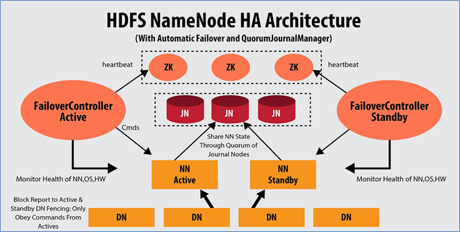
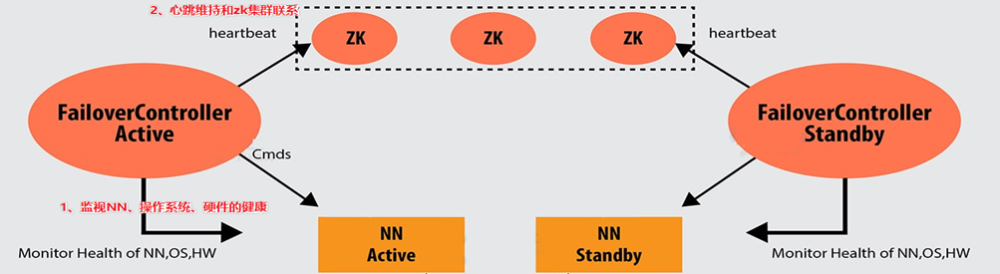
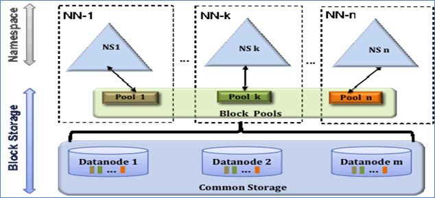

## 1. DistCp

> HDFS分布式拷贝工具

1. 用于数据迁移，定期在集群间或集群内部进行数据备份

2. 底层使用MapReduce在集群之间或并行地在同一集群内复制文件。执行复制的MapReduce只有mapper阶段。

   ```shell
   $ hadoop distcp usage: distcp OPTIONS [source_path...] <target_path>             
   	-append                //拷贝文件时支持对现有文件进行追加写操作
   	-async                  //异步执行distcp拷贝任务
   	-bandwidth <arg>        //对每个Map任务的带宽限速
   	-delete                 //删除相对于源端,目标端多出来的文件
   	-diff <arg>             //通过快照diff信息进行数据的同步                  
   	-overwrite              //以覆盖的方式进行拷贝,如果目标端文件已经存在,则直接覆盖
   	-p <arg>                //拷贝数据时,扩展属性信息的保留,包括权限信息,块大小信息等等
   	-skipcrccheck          //拷贝数据时是否跳过cheacksum的校验
   	-update                 //拷贝数据时,只拷贝相对于源端 ,目标端不存在的文件数据
   ```

## 2. 安全模式

> 安全模式下系统可读不可写

1. Hadoop中的安全模式safe mode是NameNode的维护状态，在此状态下NameNode不允许对文件系统进行任何更改，可以接受读数据请求。

2. 在NameNode启动过程中，首先会从fsimage和edits日志文件加载文件系统状态。然后，等待DataNodes汇报可用的block信息。在此期间，NameNode保持在安全模式。随着DataNode的block汇报持续进行，当整个系统达到安全标准时，HDFS自动离开安全模式。在NameNode Web主页上会显示安全模式是打开还是关闭。

3. 如果HDFS处于安全模式下，不允许HDFS客户端进行任何修改文件的操作,包括上传文件，删除文件，重命名，创建文件夹,修改副本数等操作。

**自动操作**：

```shell
# hdfs-site.xml、hdfs-default.xml
dfs.replication      #hdfs block的副本数据，默认3
dfs.replication.max   #最大块副本数，默认512
dfs.namenode.replication.min   #最小块副本数，默认1
dfs.namenode.safemode.threshold-pct  #已汇报可用数据块数量占整体块数量的百分比阈值。默认0.999f。
									#小于或等于0，则表示退出安全模式之前，不要等待特定百分比的块。
									# 大于1的值将使安全模式永久生效  
dfs.namenode.safemode.min.datanodes  #指在退出安全模式之前必须存活的DataNode数量，默认0
dfs.namenode.safemode.extension  #达到阈值条件后持续扩展的时间。倒计时结束如果依然满足阈值条件                               			# 自动离开安全模式。默认30000毫秒
```

**手动操作**：

```shell
hdfs dfsadmin -safemode get 	# 手动获取安全模式状态信息
hdfs dfsadmin -safemode enter 	# 手动进入安全模式
hdfs dfsadmin -safemode leave	# 手动离开安全模式
```

## 3. HDFS高阶优化方案 

### 3.1. 短路本地读取

> 当DFSClient与数据在同一个机器上时，让DFSClient绕开Datanode自己去读取数据

**实现思想：**

* 在Linux中，有个技术叫做**Unix Domain Socket**。Unix Domain Socket是一种进程间的通讯方式，它使得同一个机器上的两个进程能以Socket的方式通讯。

* 它带来的另一大好处是，利用它两个进程除了可以传递普通数据外，还可以在进程间传递文件描述符。
* 借助Unix Domain Socket，可以让A打开文件得到一个文件描述符，然后把文件描述符传递给B，B就能读取文件里面的内容了即使它没有相应的权限。
* 在HDFS的场景里面，A就是Datanode，B就是DFSClient，需要读取的文件就是Datanode数据目录中的某个文件


**实现步骤：**

1. 因为Java不能直接操作Unix Domain Socket，所以需要安装Hadoop的native包libhadoop.so。在编译Hadoop源码的时候可以通过编译native模块获取。可以用`hadoop checknative`来检查native包是否安装好。

2. `dfs.client.read.shortcircuit` 是打开短路本地读取功能的开关

   `dfs.domain.socket.path` 是Datanode和DFSClient之间沟通的Socket的本地路径。

   ```properties
   # hdfs-site.xml
   <property>
   	<name>dfs.client.read.shortcircuit</name>
       <value>true</value>
   </property>
   <property>
   	<name>dfs.domain.socket.path</name>
       <value>/var/lib/hadoop-hdfs/dn_socket</value>
   </property>
   ```

   创建本地路径：`mkdir -p /var/lib/hadoop-hdfs`（注意不包含dn_socket）

   通过datanode的日志查看是否配置完成`/logs/...`，搜索关键词`UNIX domain socket`

### 3.2. HDFS Block负载平衡器：Balancer

> 所谓的平衡指的是每个DataNode的利用率（本机已用空间与本机总容量之比）与集群的利用率（HDFS整体已用空间与HDFS集群总容量的比）之间相差不超过给定阈值百分比

**注意：负载平衡器无法在单个DataNode上的各个卷（磁盘）之间进行平衡，将通过磁盘均衡器来实现**

**实现步骤：**

1. 设置平衡数据传输带宽

   `hdfs dfsadmin -setBalancerBandwidth newbandwidth`

   其中newbandwidth是每个DataNode在平衡操作期间可以使用的最大网络带宽量，以每秒字节数为单位。

   例如：`hdfs dfsadmin -setBalancerBandwidth 104857600（100M）`

2. 运行balancer

   默认参数运行：`hdfs balancer`

   指定参数运行：`hdfs balancer -thresholod 5` 将以阈值5%运行，默认为10%

   这意味着程序将确保每个DataNode上的磁盘使用量与群集中的总体使用量相差不超过5％

### 3.3. 磁盘均衡器：HDFS Disk Balancer（3.0）

> **HDFS disk balancer**是Hadoop 3中引入的命令行工具，用于平衡DataNode中的数据在磁盘之间分布不均匀问题

**实现思想：**

* 卷（磁盘）数据密度：比较同台机器上不同卷之间的数据分布情况。

  计算方法：

  Total Used / Total Capacity - Disk Used / Disk Capacity

* 节点数据密度：比较的是不同机器之间的。

  该节点上所有volume data density卷（磁盘）数据密度绝对值的总和

较低的node Data Density值表示该机器节点具有较好的扩展性，而较高的值表示节点具有更倾斜的数据分布。一旦有了volume Data Density和node Data Density，就可以找到集群中数据分布倾斜的节点和机器上数据分步倾斜的磁盘。**（先通过node Data Density确定哪个节点不平衡，再通过volume Data Density对具体的卷实施操作）**

**实现步骤（百度）：**

> 默认情况下，Hadoop群集上已经启用了Disk Balancer功能。通过在`hdfs-site.xml`中调整`dfs.disk.balancer.enabled`参数值，选择在Hadoop中是否启用磁盘平衡器。

### 3.4. 纠删码技术（Erasure Coding)（3.0）

> 纠删码技术（Erasure coding）简称EC，是一种编码容错技术。最早用于通信行业，数据传输中的数据恢复。它通过对数据进行分块，然后计算出校验数据，使得各个部分的数据产生关联性。当一部分数据块丢失时，可以通过剩余的数据块和校验块计算出丢失的数据块。

> 出现背景：3副本存储的弊端

**里德所罗门（Reed-Solomon）码数学原理：**

* k个数据块组成一个向量被乘上一个生成矩阵（Generator Matrix）GT从而得到一个码字（codeword）向量，该向量由k个数据块（d0,d1..d3）和m个校验块（c0,c1）构成。

* 如果数据块丢失，可以用GT逆矩阵乘以码字向量来恢复出丢失的数据块。


比如有 7、8、9 三个原始数据，通过矩阵乘法，计算出来两个校验数据 50、122

一共五个数据：7、8、9、50、122，可以任意丢两个，然后通过算法进行恢复


**Hadoop EC架构**（为了支持纠删码，HDFS体系结构进行的调整）

* Namenode扩展

  条带化的HDFS文件在逻辑上由`block group`（块组）组成，每个块组包含一定数量的内部块。这允许在块组级别而不是块级别进行文件管理。

* 客户端扩展

  客户端的读写路径得到了增强，可以并行处理块组中的多个内部块

* Datanode扩展

  DataNode运行一个附加的ErasureCodingWorker（ECWorker）任务，以对失败的纠删编码块进行后台恢复。 NameNode检测到失败的EC块，然后NameNode选择一个DataNode进行恢复工作。

* 纠删编码策略

  为了适应异构的工作负载，允许HDFS群集中的文件和目录具有不同的复制和纠删码策略。纠删码策略封装了如何对文件进行编码/解码。默认情况下启用`RS-6-3-1024k`策略， RS表示编码器算法Reed-Solomon，6 、3中表示数据块和奇偶校验块的数量，1024k表示条带化单元的大小。

   目录上还支持默认的REPLICATION方案。它只能在目录上设置，以强制目录采用3倍复制方案，而不继承其祖先的纠删码策略。此策略可以使3x复制方案目录与纠删码目录交错。REPLICATION始终处于启用状态。

   此外也支持用户通过XML文件定义自己的EC策略，Hadoop conf目录中有一个名为`user_ec_policies.xml.template`的示例EC策略XML文件，用户可以参考该文件。

* Intel ISA-L

  英特尔ISA-L代表英特尔智能存储加速库。 加速纠删码的编码和解码。

**EC编码部署方式**

* 集群和硬件配置

  编码和解码工作会消耗HDFS客户端和DataNode上的额外**CPU**。

  纠删码文件也分布在整个机架上，以实现机架容错。这意味着在读写条带化文件时，大多数操作都是在机架上进行的。因此，**网络带宽**也非常重要。

  对于机架容错，拥有**足够数量的机架**也很重要，每个机架所容纳的块数不超过EC奇偶校验块的数。机架数量=（数据块+奇偶校验块）/奇偶校验块后取整。

  比如对于EC策略RS（6,3），这意味着最少3个机架（由（6 + 3）/ 3 = 3计算），理想情况下为9个或更多，以处理计划内和计划外的停机。对于机架数少于奇偶校验单元数的群集，HDFS无法维持机架容错能力，但仍将尝试在多个节点之间分布条带化文件以保留节点级容错能力。因此，建议设置具有类似数量的DataNode的机架。

* 纠删码策略设置

  纠删码策略由参数`dfs.namenode.ec.system.default.policy`指定，**默认是** `RS-6-3-1024k`，其他策略默认是禁用的。

  可以通过`hdfs ec [-enablePolicy -policy <policyName>]`命令启用策略集。

* 启用ISA-L（见下方）

* EC命令

  `hdfs ec`

  ```shell
  [-setPolicy -path <path> [-policy <policy>] [-replicate]]	
  #在指定路径的目录上设置擦除编码策略。	
  #path：HDFS中的目录。这是必填参数。设置策略仅影响新创建的文件，而不影响现有文件。	
  #policy：用于此目录下文件的擦除编码策略。默认RS-6-3-1024k策略。	
  #-replicate在目录上应用默认的REPLICATION方案，强制目录采用3x复制方案。replicate和-policy <policy>是可	选参数。不能同时指定它们。
  [-getPolicy -path < path >] 	
  #获取指定路径下文件或目录的擦除编码策略的详细信息。
  [-unsetPolicy -path < path >] 	
  #取消设置先前对目录上的setPolicy的调用所设置的擦除编码策略。如果该目录从祖先目录继承了擦除编码策略，则unsetPolicy是no-op。在没有显式策略集的目录上取消策略将不会返回错误。
  [-listPolicies]	
  #列出在HDFS中注册的所有（启用，禁用和删除）擦除编码策略。只有启用的策略才适合与setPolicy命令一起使用。
  [-addPolicies -policyFile <文件>]	
  #添加用户定义的擦除编码策略列表。[-listCodecs]	
  #获取系统中支持的擦除编码编解码器和编码器的列表。
  [-removePolicy -policy <policyName>]	
  #删除用户定义的擦除编码策略。
  [-enablePolicy -policy <policyName>]	
  #启用擦除编码策略。[-disablePolicy -policy <policyName>]	
  #禁用擦除编码策略。
  ```

#### Hadoop纠删码算法启用ISA-L加速库

**版本**

| 软件                                                        | 版本    |
| ----------------------------------------------------------- | ------- |
| Hadoop                                                      | 3.1.4   |
| [isa-l](https://github.com/intel/isa-l/releases)            | 2.28.0  |
| [nasm](https://www.nasm.us/pub/nasm/releasebuilds/2.14.02/) | 2.14.02 |
| yasm                                                        | 1.2.0   |

**1、安装yasm和nasm**

```shell
#在Hadoop集群所有节点上安装yasm和nasm。
yum install -y yasm
yum install -y nasm


#注意：isa-l-2.28.0对nasm和yasm有版本要求，低版本在安装时会报错。
```

**2、编译安装isa-l-2.28.0**

```shell
#在Hadoop集群所有节点上编译安装isa-l-2.28.0。
tar -zxvf isa-l-2.28.0.tar.gz
cd isa-l-2.28.0
./autogen.sh
./configure --prefix=/usr --libdir=/usr/lib64
make
make install
 
make -f Makefile.unx


#检查libisal.so*是否成功
ll /lib64/libisal.so*
 
############如果有，则跳过##############
############如果没有有，则复制##############
cp bin/libisal.so bin/libisal.so.2 /lib64
```

**3、Hadoop上检查是否启用isa-l**

```shell
Native library checking:
hadoop:  true /usr/hdp/3.0.0.0-1634/hadoop/lib/native/libhadoop.so.1.0.0
zlib:    true /lib64/libz.so.1
zstd  :  false
snappy:  true /usr/hdp/3.0.0.0-1634/hadoop/lib/native/libsnappy.so.1
lz4:     true revision:10301
bzip2:   true /lib64/libbz2.so.1
openssl: true /lib64/libcrypto.so
ISA-L:   true /lib64/libisal.so.2     ------------->  Shows that ISA-L is loaded.
```

## 4. HDFS动态节点管理

### 4.1. 节点扩容

> 已有HDFS集群容量已不能满足存储数据的需求，需要在原有集群基础上动态添加新的DataNode节点。

1. 新机器基础环境准备

   1. 主机名、IP

      `vim /etc/sysconfig/network-scripts/ifcfg-ens33`

      设置`IPADDR`

      `vim /etc/hostname`

      设置`node4`

   2. Hosts映射

      `vim /etc/hosts`

      设置IPADDR与Hostname之间的映射

   3. 防火墙、时间同步

      `systemctl stop firewalld.service`：关闭当下

      `systemctl disable firewalld.service`：永久关闭

      `ntpdate ntp4.aliyun.com`：时间同步

   4. SSH免密登录

      `[root@node1 ~]# ssh -copy-id node4`：复制公钥到新机器

   5. JDK环境

2. Hadoop配置

   1. 修改workers配置文件，方便一键启停

      `vim /export/server/hadoop-3.1.4/etc/hadoop/workers`

   2. 从namenode节点复制hadoop安装包到新节点，注意不包括hadoop.tmp.dir指定的数据存储目录

      `[root@node1 server]# scp -r hadoop-3.1.4 node4:$PWD`

   3. 新机器上配置hadoop环境变量

      `vim /etc/profile`，可以将Namenode 的profile文件拷贝到node4

      **注意需要创建短路本地读取的文件夹，否则会报错，具体报错可以去logs里面查看**

3. 手动启动DataNode进程

   `hdfs --daemon start datanode`

   具体是否启动可以去Web页面查看，或者jps命令获取相关进程

4. DataNode负载均衡服务

   `hdfs dfsadmin -setBalancerBandwidth 104857600`：设置负载均衡的带宽

   `hdfs balancer -threshold 5`：设置偏差为5%

### 4.2. 动态缩容

> 服务器需要进行退役更换，需要在当下的集群中停止某些机器上datanode的服务

1. 添加退役节点（该操作node2，node3不需要参与，即不需要拷贝该文件）

   在**namenode机器**的`hdfs-site.xml`中配置`dfs.hosts.exclude`属性（**黑名单**）

   ```properties
   <property>
   	<name>dfs.hosts.exclude</name>
       <value>/export/server/hadoop-3.1.4/etc/hadoop/excludes</value>
   </property>
   ```

   excludes文件中的节点就是被禁止的节点

   该属性（`dfs.hosts.exclude`）需要在namenode启动前配置，否则只能重启机器

   **当副本为3，服役的节点也是3，则不能退役成功**

   ```
   // excludes
   node4
   ```

2. 刷新集群

   `[root@node1 ~]# hdfs dfsadmin -refreshNodes`等待节点迁移数据后退役

3. 手动关闭DataNode进程

   `[root@node4 ~]# hdfs --daemon stop datanode`

4. DataNode负载均衡服务

   `hdfs balancer -threshold 5`

### 4.3. 黑白名单机制

**白名单**

* 允许哪些机器加入到当前的HDFS集群中，是一种准入机制
* 由`dfs.hosts`参数指定，该参数位于`hdfs-site.xml`。默认值为空
* `dfs.hosts`指向文件，该文件包含允许连接到namenode的主机列表。必须指定文件的完整路径名。如果该值为空，则允许所有主机准入。

**黑名单**

* 禁止哪些机器加入到当前的HDFS集群中，是一种禁入机制。
* 由`dfs.hosts.exclude`参数指定，该参数位于`hdfs-site.xml`。默认值为空。
* `dfs.hosts.exclude`指向文件，该文件包含不允许连接到名称节点的主机列表。必须指定文件的完整路径名。如果该值为空，则不禁止任何主机加入。

## 5. HDFS HA高可用

### 5.1 背景知识

**单点故障**（single point of failure SPOF），系统中某个点故障，导致整个系统不可用

**解决单点故障** 

> 目的是为了让故障对业务的影响最小，而不是让故障用不发生

给单点故障设置备份，形成主备架构

**集群可用性评判标准**（x个9）

X个9表示在系统1年时间的使用过程中，系统可以正常使用时间与总时间（1年）之比

比如4个9：(1-99.99%)*365*24=0.876小时=52.6分钟，表示该系统在连续运行1年时间里最多可能的业务中断时间是52.6分钟

9越多，系统的可靠性越强，能够容忍的业务中断时间越少，但是要付出的成本更高

**HA系统设计核心问题**

> 对于HA的解决方案，都要考虑到这两点

* 脑裂问题

  集群无主：都认为对方状态是好的，自己是备份角色，后果是无服务

  集群多主：都是为对方是故障的， 自己是主角色，导致系统混乱，数据损坏。

  **为此，保持任意时刻系统有且只有一个主角色提供服务**

* 数据状态同步问题

  主备节点之间，数据状态不同步

  为此，可以采用**日志重演操作记录**，让从角色通过主角色的修改日志记录重演修改操作

### 5.2 NameNode单点故障问题

> HDFS的单点故障问题指的是NameNode单点故障。对于DataNode出现了故障，因为有冗余副本存储或者EC编码技术，当某个DataNode出现问题时，并不影响整体系统的运行。若NameNode出现了故障，则整个集群不可用，就像删除了索引，虽然有文件，但是找不到问题的具体存放位置。

解决方法：在同一群集中运行两个（从3.0.0起，支持超过两个）冗余NameNode。形成主备架构。

### 5.3 HDFS HA解决方案--QJM

> QJM全称Quorum Journal Manager（仲裁日志管理器），是Hadoop官方推荐的HDFS HA解决方案之一

* 使用zookeeper中ZKFC来实现主备切换；（解决脑裂问题）
* 使用Journal Node（JN）集群实现edits log的共享以达到数据同步的目的。（解决数据同步问题）



#### ZK Failover Controller（ZKFC）

> 监视和管理NameNode健康状态

维持和ZK群联系：

如果本地NameNode运行状况良好，并且ZKFC看到当前没有其他节点持有锁znode，它将自己尝试获取该锁。如果成功，则表明它“赢得了**选举**”，并负责运行故障转移以使其本地NameNode处于Active状态。如果已经有其他节点持有锁，zkfc选举失败，则会对该节点注册监听，等待下次继续选举。



**脑裂问题的解决**

> 通过Fencing机制来避免，将先前的Active节点隔离，然后将Standby转换为Active状态

Hadoop对于Fencing提供了两种实现

* sshfench

  通过ssh登录目标节点，使用命令fuser将进程杀死（通过tcp端口号定位进程pid，该方法比jps更准确）

* shellfench

#### Journal Node（JN）

> Journal Node（**JN**）集群是轻量级分布式系统，主要用于高速读写数据、存储数据

* 使用**2N+1**台JournalNode存储共享**Edits Log**（编辑日志）
* 任何修改操作在Active Node上进行，JN进程也会同时记录edits log到至少半数的JN中
* Standby Node检测到JN 里面的同步log发生变化了会读取JN里面的edits log，然后重演操作记录同步到自己的目录镜像树里面。

## 6. HDFS Federation联邦机制

### 6.1 当前HDFS体系架构

* 命名空间：由文件，块和目录组成的统一抽象的目录树结构。
* 块存储层
  * **块管理：**NameNode执行块管理。块管理通过处理注册和定期心跳来提供DataNode群集成员身份。它处理块报告并支持与块相关的操作，如创建，删除，修改或获取块位置。它还维护块的位置，副本位置。为未复制的块管理块复制，并在已复制的块中删除。
  * **块存储：**DataNode通过在本地文件系统上存储块并提供读/写访问权限来管理存储空间。

**当前体系结构的弊端：**

* 扩展困难
* 单个NameNode的吞吐量决定了集群的性能
* 集群占有组织之间没有隔离

### 6.2 联邦Federation架构

> Federation中文意思为联邦,联盟，是**NameNode**之间的**Federation,**也就是集群中会有多个**NameNode**。多个NameNode的情况意味着有多个namespace。注意，这区别于HA模式下的多NameNode，HA中它们是拥有着同一个namespace。
>
> Federation体系中多个namenode之间相互独立且不需要互相协调，各自分工，管理自己的区域。每个DataNode要向集群中所有的namenode注册，且周期性地向所有namenode发送心跳和块报告，并执行来自所有namenode的命令。



**优点**

* 命名空间可伸缩性
* 提高集群性能
* 不同占有者组织之间对于NameNode是隔离的

## 7. HDFS集群滚动升级

> 升级的时候依然向外提供服务。注意必须是HA集群，否则无法实现

## 8. HDFS集群滚动降级

### 8.1. 降级和回滚的区别

共同点

* 退回之前版本
* 在升级的finalize执行后，不允许再执行降级和回滚

不同点

* 降级可以滚动降级，不需要停机，回滚需要停机
* 降级会保留现有的数据状态，回滚不会
