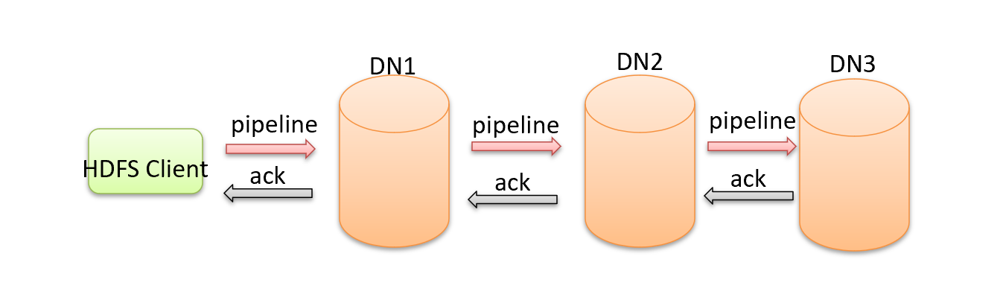

## 1. HDFS架构剖析

略

## 2. HDFS Web Interfaces

略

## 3. HDFS读写流程

### 3.1 HDFS写数据流程

#### Pipeline管道

> 客户端将数据块写入第一个数据节点，第一个数据节点保存数据之后再将块复制到第二个数据节点，后者保存后将其复制到第三个数据节点

**为什么datanode之间采用pipeline线性传输，而不是一次给三个datanode拓扑式传输呢？**

因为数据以管道的方式，顺序的沿着一个方向传输，这样能够充分利用每个机器的带宽，避免网络瓶颈和高延迟时的连接，最小化推送所有数据的延时。在线性推送模式下，每台机器所有的出口宽带都用于以最快的速度传输数据，而不是在多个接受者之间分配宽带。

#### ACK应答响应

> ACK (Acknowledge character）即是确认字符，在数据通信中，接收方发给发送方的一种传输类控制字符。表示发来的数据已确认接收无误。

#### 默认三副本存储策略

> 默认副本存储策略是由BlockPlacementPolicyDefault指定

* 第一块副本：客户端就是一个datanode的话优先客户端本地，否则随机

* 第二块副本：不同于第一块副本的不同机架。

* 第三块副本：第二块副本相同机架不同机器。

#### 写流程

1. HDFS客户端创建FileSystem对象实例**DistributedFileSystem**， FileSystem封装了与文件系统操作的相关方法。
2. 调用DistributedFileSystem对象的create()方法，通过**RPC请求**NameNode创建文件。NameNode执行各种检查判断：目标文件是否存在、父目录是否存在、客户端是否具有创建该文件的权限。检查通过NameNode就会为本次请求记下一条记录，返回FSDataOutputStream输出流对象给客户端用于写数据。
3. 客户端通过FSDataOutputStream开始写入数据。**FSDataOutputStream是DFSOutputStream包装类**。
4. 客户端写入数据时，DFSOutputStream将数据分成一个个数据包（**packet** **默认64k**）,并写入一个内部数据队列（**data queue**）。**（DFSOutputStream有一个内部类做DataStreamer，用于请求NameNode挑选出适合存储数据副本的一组DataNode，默认是3副本存储。DataStreamer将数据包流式传输到pipeline的第一个DataNode,该DataNode存储数据包并将它发送到pipeline的第二个DataNode。同样，第二个DataNode存储数据包并且发送给第三个（也是最后一个）DataNode。）**
5. DFSOutputStream也维护着一个内部数据包队列来等待DataNode的收到确认回执，称之为确认队列（**ack** **queue**）,收到pipeline中所有DataNode确认信息后，该数据包才会从确认队列删除。
6. 客户端完成数据写入后，在FSDataOutputStream输出流上调用close()方法关闭。
7. DistributedFileSystem联系NameNode告知其文件写入完成，等待NameNode确认。因为namenode已经知道文件由哪些块组成（DataStream请求分配数据块），因此仅需等待最小复制块即可成功返回。**（最小复制是由参数dfs.namenode.replication.min指定，默认是1）**

### 3.2 HDFS读数据流程

1. HDFS客户端创建FileSystem对象实例DistributedFileSystem， FileSystem封装了与文件系统操作的相关方法。调用DistributedFileSystem对象的open()方法来打开希望读取的文件。

2. DistributedFileSystem使用RPC调用namenode来确定**文件中前几个块的块位置（分批次读取）信息**。

   对于每个块，namenode返回具有该块所有副本的datanode位置地址列表，并且该地址列表是排序好的，与客户端的网络拓扑距离近的排序靠前。

3. DistributedFileSystem将FSDataInputStream输入流返回到客户端以供其读取数据。FSDataInputStream类是DFSInputStream类的包装。

4. 客户端在FSDataInputStream输入流上调用read()方法。然后，已存储DataNode地址的DFSInputStream连接到文件中第一个块的最近的DataNode。数据从DataNode流回客户端，结果客户端可以在流上重复调用read（）。

5. 当该块结束时，DFSInputStream将关闭与DataNode的连接，然后寻找下一个块的最佳datanode。这些操作对用户来说是透明的。所以用户感觉起来它一直在读取一个连续的流。客户端从流中读取数据时，也会根据需要询问NameNode来**检索下一批数据块的DataNode位置信息。**

6. 一旦客户端完成读取，就对FSDataInputStream调用close()方法。

### 3.3 HDFS集群角色职责

**NameNode职责**

* NameNode是HDFS的核心，集群的主角色，被称为Master。

* NameNode仅存储管理HDFS的元数据：文件系统namespace操作维护目录树，文件和块的位置信息。

* NameNode不存储实际数据或数据集。数据本身实际存储在DataNodes中。

* NameNode知道HDFS中任何给定文件的块列表及其位置。使用此信息NameNode知道如何从块中构建文件。

* NameNode并不持久化存储每个文件中各个块所在的DataNode的位置信息，这些信息会在系统启动时从DataNode汇报中重建。

* NameNode对于HDFS至关重要，当NameNode关闭时，HDFS / Hadoop集群无法访问。

* NameNode是Hadoop集群中的单点故障。

* NameNode所在机器通常会配置有大量内存（RAM）。

**DataNode职责**

* DataNode负责将实际数据存储在HDFS中。是集群的从角色，被称为Slave。

* DataNode启动时，它将自己发布到NameNode并汇报自己负责持有的块列表。

* 根据NameNode的指令，执行块的创建、复制、删除操作。

* DataNode会定期（dfs.heartbeat.interval配置项配置，默认是3秒）向NameNode发送心跳，如果NameNode长时间没有接受到DataNode发送的心跳， NameNode就会认为该DataNode失效。

* DataNode会定期向NameNode进行自己持有的数据块信息汇报，汇报时间间隔取参数dfs.blockreport.intervalMsec,参数未配置的话默认为6小时.

* DataNode所在机器通常配置有大量的硬盘空间。因为实际数据存储在DataNode中。

## 4. NameNode元数据管理

### 4.1 元数据管理综述

**元数据类型**

* **文件自身属性信息**：文件名称、权限，修改时间，文件大小，复制因子，数据块大小。
* **文件块位置映射信息**：记录文件块和DataNode之间的映射信息，即哪个块位于哪个节点上。

**元数据按存储形式分类**

* 内存元数据
* 元数据文件
  * fsimage内存镜像文件
  * Edits log编辑日志

## 5. HDFS小文件解决方案

通过下述实现：	

* Hadoop Archive文件归档
* Sequence File序列化文件
