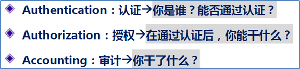
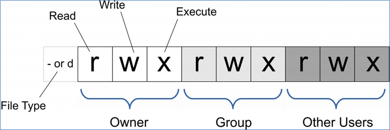
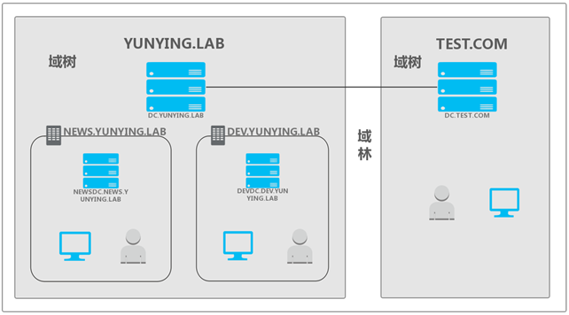
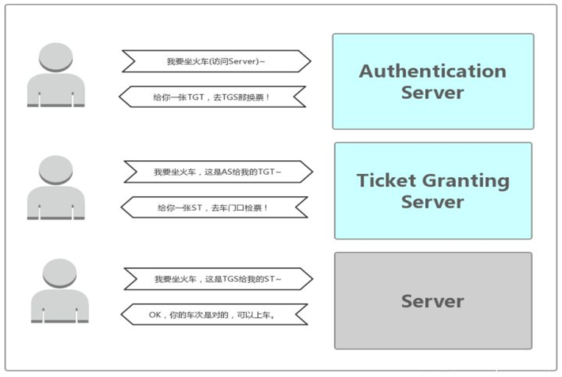
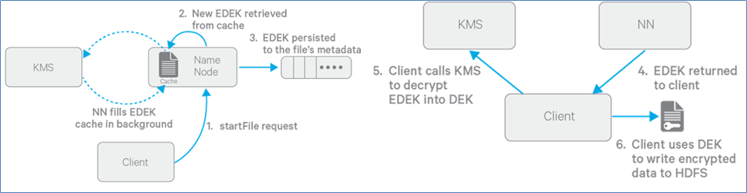

# 1. HDFS Trash垃圾桶

> 该概念就和Windows的垃圾桶一样，默认不开启

## 1.1 功能描述

* 启用Trash功能后，从HDFS中删除某些内容时，文件或目录不会立即被清除，它们将被移动到回收站Current目录中**(/user/${username}/.Trash/current)**。
* 最近删除的文件被移动到回收站Current目录，并且在可配置的时间间隔内，HDFS会为在Current回收站目录下的文件创建检查点/user/${username}/.Trash/<日期>，并在过期时删除旧的检查点。

## 1.2 功能开启

1. 关闭hdfs集群：`stop-dfs.sh`

2. 修改core-site.xml

   ```xml
   <property>
       <!-- 回收站中的文件多少分钟后会被系统永久删除。如果为零，Trash功能将被禁用。-->
       <name>fs.trash.interval</name>
       <value>1440</value>
   </property>
   <property>
       <!-- 前后两次检查点的创建时间间隔（单位也是分钟）
    		 新的检查点被创建后，随之旧的检查点就会被系统永久删除。
   		 如果为零，则将该值设置为fs.trash.interval的值。
    	-->
       <name>fs.trash.checkpoint.interval</name>
       <value>0</value>
   </property>
   ```

3. 同步集群（此时在/export/server/hadoop-3.1.4/etc/hadoop目录下）

   ```shell
   [root@node1 hadoop]# scp -r core-site.xml node2:$PWD
   [root@node1 hadoop]# scp -r core-site.xml node2:$PWD
   ```

4. 重启集群：`start-dfs.sh`

操作时和正常删除操作一样，通过-skipTrash来跳过垃圾桶直接永久删除

`hadoop fs -rm [-skipTrash] /tmp/1.txt`

HDFS提供了一个命令行工具来完成这个工作：`hadoop fs -expunge`。该命令立即从文件系统中删除过期的检查点。

# 2. HDFS Snapshot快照

> 快照（Snapshot）是**数据存储的某一时刻的状态记录**。HDFS Snapshot快照是整个文件系统或某个目录在某个时刻的镜像。

## 2.1 快照的作用

* 数据恢复：对重要目录进行创建snapshot的操作，当用户误操作时，可以通过snapshot来进行相关的恢复操作。
* 数据备份：使用snapshot来进行整个集群，或者某些目录、文件的备份。管理员以某个时刻的snapshot作为备份的起始结点，然后通过比较不同备份之间差异性，来进行增量备份。
* 数据测试：在某些重要数据上进行测试或者实验，可能会直接将原始的数据破坏掉。可以临时的为用户针对要操作的数据来创建一个snapshot，然后让用户在对应的snapshot上进行相关的实验和测试，从而避免对原始数据的破坏。

## 2.2 快照功能的理论实现

* HDFS快照不是数据的简单拷贝，只**做差异的记录**。
* 对于大多不变的数据，你所看到的数据其实是当前物理路径所指的内容，而发生变更的inode数据才会被快照额外拷贝，也就是所说的差异拷贝。
* linode指**索引**节点，用来存放文件及目录的基本信息，包含时间、名称、拥有者、所在组等。
* 并且快照只是记录一些元数据信息。

## 2.3 快照功能的命令实现

* 目录开启快照功能（`hdfs dfsadmin -allowSnapshot /vingkin`）

  没有启动快照功能的目录创建快照会报错

* 目录禁用快照功能（`hdfs dfsadmin -disallowSnapshot /vingkin`）

  禁用的前提是该目录的所有快照已经被删除

* 创建快照（`hdfs dfs -createSnapshot /vingkin [mysnap1]`）

  可以指定具体的快照名，如果不指定则默认以时间等相关数据命名

* 查看创建的快照（`hdfs lsSnapshottableDir`）

  还可以通过Web UI页面直接查看快照信息，并可以在Web UI的目录页面手动输入/vingkin/.snapshot来查看隐藏文件

* 比较不同快照的差异（`hdfs snapshotDiff /vingkin mysnap1 mysnap2`）

  +表示增加了文件，M表示文件做了修改...

* 删除快照（`hdfs dfs -deleteSnapshot /vingkin mysnap1`）

* 快照重命名（`hdfs dfs -renameSnapshot /vingkin mysnap1 mysnap2`）

  将mysnap1重命名为mysnap2

**注意：拥有快照的目录不允许被删除**

# 3. HDFS权限管理

## 3.1 AAA

> **认证（Authentication）**、**授权（Authorization）**和**审计（Accounting）**指计算机安全领域的一个架构模式。通常缩写为 AAA。

在该模式中，使用服务的用户先要**证明自己的身份**；然后根据规则被**授予权限**，同时其**操作被记录**下来留待审计。



作为分布式文件系统，HDFS也集成了一套权限管理系统。客户端在进行每次文件操时，系统会从**用户身份认证**和**数据访问授权**两个环节进行验证。

## 3.2 UGO权限管理

> HDFS文件权限与Linux/Unix系统的UGO模型类似，简单描述为：每个文件和目录都与一个拥有者和一个组相关联。

* USER（文件的所有者）：一般是创建该文件的用户，对该文件具有完全的权限。

* GROUP（拥有者所在的组）：和文件所有者属于同一组的用户。

* OTHER（其他用户组）：其他用户组的用户。

### 3.2.1 读、写、执行权限

* HDFS文件权限也细分为：读权限（r）、写权限（w）、执行权限（x）。

* 在HDFS中，对于**文件**，需要r权限才能读取文件，而w权限才能写入或追加到文件。没有x可执行文件的概念。

* 在HDFS中，对于**目录**，需要r权限才能列出目录的内容，需要w权限才能创建或删除文件或目录，并且需要x权限才能访问目录的子级。



### 3.2.2 umask权限掩码

> HDFS也提供了umask掩码，用于设置在HDFS中**新建的文件和目录的默认权限**。

默认umask值有属性fs.permissions.umask-mode指定，默认值022。

创建文件和目录时使用的umask，默认的权限就是

* 目录：777-022=755，也就是drwxr-xr-x

* 文件：777-022=755，因为HDFS中文件没有x执行权限的概念，所以是：-rw-r--r--

```xml
<property>
	<name>fs.permissions.umask-mode</name>
	<value>022</value>
	<final>false</final>
	<source>core-default.xml</source>
</property>
```

### 3.2.3 UGO相关命令

```shell
#变更目录或文件的权限 可以使用数字 也可以使用字母 u g o a + - r w x
hadoop fs -chmod [-R] 777 /user/itcast/foo
hadoop fs -chmod [-R] u+x,o-x /user/itcast/foo
#变更目录或文件的属主或用户组
hadoop fs -chown [-R] itcast /user/itcast/foo
hadoop fs -chown [-R] itcast:ogroup /user/itcast/foo
#变更用户组
hadoop fs -chgrp [-R] group1 /user/itcast/foo
```

**粘滞[nián zhì]位（Sticky bit）**用在目录上设置，如此以来，只有目录内文件的所有者或者root才可以删除或移动该文件。

如果不为目录设置粘滞位，任何具有该目录写和执行权限的用户都可以删除和移动其中的文件

## 3.3 HDFS用户身份认证

> HDFS项目本身并没有用户身份认证，通过相关接口从主机获取相关用户身份，然后用于后续的权限管理。

* Simple（默认）
* Kerberos

### 3.3.1 Simple认证

> 客户端与NN进行交互时，会用基于HDFS客户端所在的Linux/Unix系统的登录用户名来进行认证。只要用户能正常登录就认证成功。

**存在的问题**：

* 多用户使用一个客户端会导致权限混淆
* 恶意用户可以进行身份伪造从而非法获取相应的权限

**防止好人误做坏事，不防止坏人做坏事**

### 3.3.2 Kerberos认证

> Kerberos是麻省理工学院（MIT）开发的一种网络身份**认证协议**。它旨在通过使用密钥加密技术为客户端/服务器应用程序提供强**身份验证**。也就是AAA的第一个A。

**Kerberos所具有的角色**：

* 访问服务的**Client**
* 提供服务的**Server**
* **KDC**（Key Distribution Center）密钥分发中心

**域的概念**：

> 域的产生是为了解决企业内部的资源管理问题，比如一个公司就可以在网络中建立一个域环境，更方便内部的资源管理。在一个域中有域控、域管理员、普通用户、主机等等各种资源。

* YUNYING.LAB为其他两个域的**根域**，NEWS.YUNYING.LAB和DEV.YUNYING.LAB均为YUNYING.LAB的**子域**，这三个域组成了一个**域树**。
* 子域的概念可以理解为一个集团在不同业务上分公司，他们有业务重合的点并且都属于YUNYING.LAB这个根域，但又独立运作。同样TEST.COM也是一个单独的域树，两个域树YUNYING.LAB和TEST.COM组合起来被称为一个**域林**。



**KDC服务默认会安装在一个域的域控中**

**具体认证过程**：

* Authentication Server： AS的作用就是验证Client端的身份（确定你是身份证上的本人），验证通过就会给一张TGT（Ticket Granting Ticket）票给Client。
* Ticket Granting Server： TGS的作用是通过AS发送给Client的票（TGT）换取访问Server端的票（上车的票ST）。ST（Service Ticket）也有资料称为TGS Ticket，为了和TGS区分，在这里就用ST来说明。




## 3.4 HDFS Group Mapping组映射

> HDFS在获取用户名后还需要获取该用户所在的组。一般来说，**HDFS**中用户所属组的确认工作需要通过外部的用户组映射（Group Mapping）服务来获取。

Linux/Unix系统上的用户和用户组信息存储在`/etc/passwd`和`/etc/group`文件中。

默认情况下，HDFS会通过调用外部的 Shell 命令来获取用户的所有用户组列表。 

* /etc/passwd：（用户名:口令:用户标识号:组标识号:注释性描述:主目录:登录Shell）
* /etc/group：（组名：密码：GID：该用户组中的用户列表）

此方案的优点在于组映射服务十分稳定，不易受外部服务的影响。

但是用户和用户组管理涉及到root权限等，同时会在服务器上生成大量的用户组，后续管理，特别是自动化运维方面会有较大影响。

## 3.5 ACL权限管理

> 对于一个文件或文件夹而言，通过UGO来给予不同的角色不同的权限。比如属主root具有权限rwx，属组具有权限rwx，其他用户无任何权限。对于一个新来的用户，如果想要授予r-x权限将无法满足。可以通过ACL（Access Control List）访问控制列表，为**特定的用户或组设置不同的权限**。

### 3.5.1 相关命令

使用命令前需要设置相关参数并重启hdfs服务

```xml
<property>
	<name>dfs.namenode.acls.enabled</name>
	<value>true</value>
	<final>false</final>
	<source>hdfs-site.xml</source>
</property>
```

```shell
# 为node1用户对于vingkin添加rwx权限
hadoop fs -setfacl -m user:node1:rwx /vingkin
# 查看ACL权限
hadoop fs -getfacl /vingkin
# 删除指定的ACL条目
hadoop fs -setfacl -x user:node1 /vingkin
# 删除基本ACL条目以外的所有条目。保留用户，组和其他条目以与权限位兼容。（相当于回到没有设置ACL之前的样子）
hadoop fs -setfacl -b /vingkin
# 设置默认的ACl权限，以后在该目录中新建文件或者子目录时，新建的文件/目录的ACL权限都是之前设置的default ACLs
hadoop fs -setfacl -m default:user:node1:rwx /vingkin
# 删除默认ACL权限
hadoop fs -setfacl -k /vingkin 
```

# 4. HDFS Proxy user代理用户

> 一个用户（比如超级用户）代表另一个用户提交作业或访问HDFS，比如：用户名为“root”的超级用户代表用户vingkin提交作业并访问HDFS。

例如：名为root的超级用户只能从host1和host2连接来模拟属于group1和group2的用户。

```xml
<!-- core-site.xml -->
<property>
   <name>hadoop.proxyuser.root.hosts</name>
   <value>host1,host2</value>
 </property>
 <property>
   <name>hadoop.proxyuser.root.groups</name>
   <value>group1,group2</value>
 </property>
```

**通配符*可用于允许来自任何主机或任何用户的模拟**

从任何主机访问的名为root的用户都可以假冒属于任何组的任何用户。

```xml
<property>
   <name>hadoop.proxyuser.root.hosts</name>
   <value>*</value>
 </property>
 <property>
   <name>hadoop.proxyuser.root.groups</name>
   <value>*</value>
 </property>
```

# 5. HDFS透明加密

> 对HDFS的指定目录进行透明加密，通过Web UI界面访问或者hadoop fs -cat访问仿佛就是未加密的文件，以为上面两种方法访问时实现了自动解密。通过直接产看块信息时是加密的。

## 5.1 相关概念

### 加密区域

> 所谓加密区域其实就是一个目录

### 密钥

* 当加密区域被创建时，都会有一个**加密区域秘钥**（EZ密钥，encryption zone key）与之对应，EZ密钥存储在HDFS外部的密钥库中。

* 加密区域里的每个文件都有其自己加密密钥，叫做**数据加密秘钥**（DEK，data encryption key）。

* DEK会使用其各自的加密区域的EZ密钥进行加密，以形成**加密数据加密密钥**（EDEK）。

### 密钥库

存储密钥（key）的叫做密钥库（keystore）,将HDFS与外部企业级密钥库（keystore）集成是部署透明加密的第一步。

 与HDFS本身是分离的

### 密钥管理服务（KMS）

> Hadoop**密钥管理服务**（Key Management Server，简写KMS），用作HDFS客户端与密钥库之间的代理。

主要职责：

1. 访问加密区域秘钥（EZ key）

2. 生成EDEK，EDEK存储在NameNode上

3. 为HDFS客户端解密EDEK

### 写入加密文件的过程

提前动作：创建加密区，设置加密区密钥(EZ key)

1. Client向NN请求在HDFS某个加密区新建文件
2. NN从缓存中取出一个新的EDEK（后台不断从KMS拉取新的EDEK到缓存中）
3. 获取到EDEK会被NN保存到文件的元数据中
4. 然后NN将EDEK发送给Client
5. Client发送EDEK给KMS，KMS用对应的EZ key将EDEK解密出DEK发送给Client(EDEK+EZ key -> DEK)
6. Client用DEK加密文件内容发送给datanode进行存储(DEK + File -> Encrypted File)
7. 

* DEK是加解密一个文件的密匙，而KMS里存储的EZ key是用来加解密所有文件的密匙（DEK）的密匙。

* 所以，EZ Key是更为重要的数据，只在KMS内部使用（DEK的加解密只在KMS内存进行），不会被传递到外面使用；

* 而HDFS服务端只能接触到EDEK。

### 读取解密文件的过程

* 读流程与写流程类型，区别就是NN直接读取加密文件元数据里的EDEK返回给客户端，客户端一样把EDEK发送给KMS获取DEK。再对加密内容解密读取。

* EDEK的加密和解密完全在KMS上进行。更重要的是，请求创建或解密EDEK的客户端永远不会处理EZ密钥。仅KMS可以根据要求使用EZ密钥创建和解密EDEK。

## 5.2 KMS配置

1. 关闭HDFS集群

2. 创建keystore：`keytool -genkey -alias 'vinkgin_keystore'`

3. 配置kms.site.xml

   ```xml
   <configuration>
   	<property>
   		<name>hadoop.kms.key.provider.uri</name>
   		<value>jceks://file@/${user.home}/kms.jks</value>
   	</property>
   	<property>
   		<name>hadoop.security.keystore.java-keystore-provider.password-file</name>
   		<value>kms.keystore.password</value>
           <!-- kms.keystore.password需在当前目录自己创建，内容就是keystore设置的密码 -->
   	</property>
   	<property>
   		 <name>dfs.encryption.key.provider.uri</name>
   		 <value>kms://http@node1:16000/kms</value>
   	</property>
   	<property>
   		<name>hadoop.kms.authentication.type</name>
   		<value>simple</value>
   	</property>
   </configuration>
   ```

4. kms-env.sh

   ```sh
   export KMS_HOME=/export/server/hadoop-3.1.4
   export KMS_LOG=${KMS_HOME}/logs/kms
   export KMS_HTTP_PORT=16000
   export KMS_ADMIN_PORT=16001
   ```

5. core-site.xml

   ```xml
   <property>
       <name>hadoop.security.key.provider.path</name>
       <value>kms://http@node1:16000/kms</value>
   </property>
   ```

6. hdfs-site.xml

   ```xml
   <property>
       <name>dfs.encryption.key.provider.uri</name>
       <value>kms://http@node1:16000/kms</value>
   </property>
   ```

7. 同步配置文件

   ```shell
   cd /export/server/hadoop-3.1.4/etc/hadoop、
   scp core-site.xml hdfs-site.xml kms-site.xml kms-env.sh  node2:/export/server/hadoop-3.1.4/etc/hadoop/
   scp core-site.xml hdfs-site.xml kms-site.xml kms-env.sh  node3:/export/server/hadoop-3.1.4/etc/hadoop/
   ```

8. 启动KMS：`hadoop --daemon start kms`

9. 创建EZ key：`hadoop key create ezk`

10. 创建一个目录，并设置为加密区

    ```shell
    hadoop fs -mkdir /zone 
    hdfs crypto -createZone -keyName ezk -path /zone
    ```

