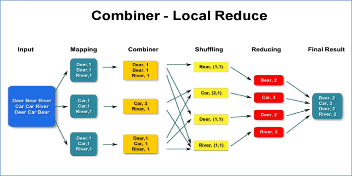
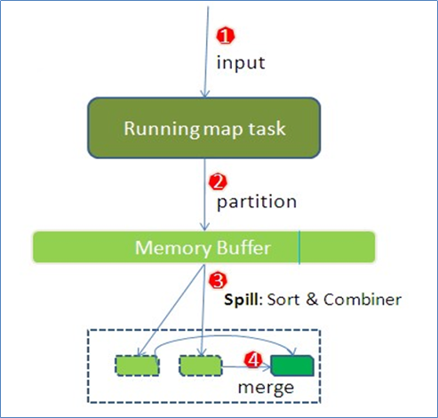
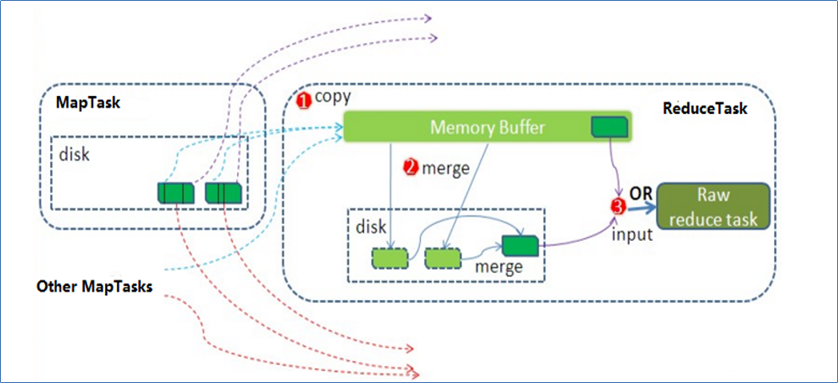

# 1. MapReduce Partition分区

> 注意分区与分组的区别，分区的目的是通过设置ReduceTask的数量将数据输出到不同的文件中。而每一个分组调用一次reduce程序。

输出文件的个数与ReduceTask个数是一种对等关系，有几个ReduceTask，最终程序就输出几个文件。

对于MapTask究竟给哪个ReduceTask处理，这就是**数据分区**问题。

可以自己制定ReduceTask的个数：

* `job.setNumReduceTasks(3);`

MapReduce的默认分区规则是HashPartitioner，也就是用key的哈希值对ReduceTask个数进行取模，与int最大值是为了避免哈希值为负的情况。

```java
@InterfaceAudience.Public
@InterfaceStability.Stable
public class HashPartitioner<K2, V2> implements Partitioner<K2, V2> {

  public void configure(JobConf job) {}

  /** Use {@link Object#hashCode()} to partition. */
  public int getPartition(K2 key, V2 value,
                          int numReduceTasks) {
    return (key.hashCode() & Integer.MAX_VALUE) % numReduceTasks;
  }

}
```

注意事项：

* **ReduceTask个数的改变导致了数据分区的产生，而不是有数据分区导致了reducetask个数改变。**
* 数据分区的核心是分区规则。即如何分配数据给各个ReduceTask。
* 默认的规则可以保证只要map阶段输出的key一样，数据就一定可以分区到同一个ReduceTask，但是不能保证数据平均分区。
* ReduceTask个数的改变还会导致输出结果文件不再是一个整体，而是输出到多个文件中。

# 2. MapReduce Combiner规约

> 数据归约是指在尽可能保持数据原貌的前提下，最大限度地精简数据量。

产生的原因：跨网络传递的资源消耗

**Combiner的作用就是对map端的输出先做一次局部合并，以减少在map和reduce节点之间的数据传输量。**



## 2.1 Combiner组件的使用

Combiner默认不开启，其本质就是Reducer

具体实现步骤：

* 自定义一个CustomCombiner类，继承Reducer，重写reduce方法
* job.setCombinerClass(CustomCombiner.class)

注意事项：

* Combiner能够应用的前提是不能影响最终的业务逻辑，而且，Combiner的输出kv应该跟reducer的输入kv类型要对应起来。

* 下述场景禁止使用Combiner，因为这样不仅优化了网络传输数据量，还改变了最终的执行结果

  * 业务和数据个数相关的。

  * 业务和整体排序相关的。

* Combiner组件不是禁用，而是**慎用**。用的好提高程序性能，用不好，改变程序结果且不易发现。

# 3. COVID-19病例统计

## 3.1 各州累计病例数量统计

> 统计美国2021-01-28，每个州state累计确诊案例数、累计死亡案例数。
>
> **自定义JavaBean实现Writable接口来实现Hadoop的序列化机制**

需求分析：

* 自定义对象CovidCountBean，用于封装每个县的确诊病例数和死亡病例数。

* 注意自定义对象需要实现Hadoop的序列化机制。

* 以州作为map阶段输出的key,以CovidCountBean作为value，这样属于同一个州的数据就会变成一组进行reduce处理，进行累加即可得出每个州累计确诊病例。

CovidCountBean.java

```java
/**
 * @Author: Vingkin
 * @Date: Create in 16:58 2021/8/3
 * @Description: 自定义对象作为数据类型在MapReduce中传递，注意实现Hadoop的序列化机制
 */
public class CovidCountBean implements Writable {

    private long cases; // 确诊病例数
    private long deaths; // 死亡病例数
    
    // 构造函数 set get 。。。

    /**
     * 自己封装的set方法，用于对象的属性赋值
     * @param cases
     * @param deaths
     */
    public void set(long cases, long deaths) {
        this.cases = cases;
        this.deaths = deaths;
    }

    @Override
    public String toString() {
        return cases + "\t" + deaths;
    }

    /**
     * 序列化方法，控制那些字段序列化出去
     * @param out
     * @throws IOException
     */
    @Override
    public void write(DataOutput out) throws IOException {
        out.writeLong(cases);
        out.writeLong(deaths);
    }

    /**
     * 反序列化方法，todo 反序列化的顺序与序列化一致 也就是必须先写cases后写deaths
     * @param in
     * @throws IOException
     */
    @Override
    public void readFields(DataInput in) throws IOException {
        this.cases = in.readLong();
        this.deaths = in.readLong();
    }
}
```

CovidSumMapper.java

```java
public class CovidSumMapper extends Mapper<LongWritable, Text, Text, CovidCountBean> {

    Text outKey = new Text();
    CovidCountBean outValue = new CovidCountBean();

    @Override
    protected void map(LongWritable key, Text value, Mapper<LongWritable, Text, Text, CovidCountBean>.Context context) throws IOException, InterruptedException {
        // 1. 读取一行数据进行切割
        String[] fields = value.toString().split(",");
        // 2. 提取数据 州 确诊数 死亡数
        outKey.set(fields[2]);
        outValue.set(Long.parseLong(fields[fields.length-2]), Long.parseLong(fields[fields.length-1]));
        context.write(outKey, outValue);
    }
}
```

CovidSumReducer.java

```java
public class CovidSumReducer extends Reducer<Text, CovidCountBean, Text, CovidCountBean> {

    private CovidCountBean outValue = new CovidCountBean();

    @Override
    protected void reduce(Text key, Iterable<CovidCountBean> values, Reducer<Text, CovidCountBean, Text, CovidCountBean>.Context context) throws IOException, InterruptedException {
        long countCases = 0;
        long countDeaths = 0;
        for (CovidCountBean value : values) {
            countCases += value.getCases();
            countDeaths += value.getDeath();
        }
        outValue.set(countCases, countDeaths);
        context.write(key, outValue);
    }
}
```

CovidSumDriver.java

```java
public class CovidSumDriver {
    public static void main(String[] args) throws Exception {
        //配置文件对象
        Configuration conf = new Configuration();
        // 创建作业实例
        Job job = Job.getInstance(conf, CovidSumDriver.class.getSimpleName());
        // 设置作业驱动类
        job.setJarByClass(CovidSumDriver.class);

        // 设置作业mapper reducer类
        job.setMapperClass(CovidSumMapper.class);
        job.setReducerClass(CovidSumReducer.class);

        // 设置作业mapper阶段输出key value数据类型
        job.setMapOutputKeyClass(Text.class);
        job.setMapOutputValueClass(CovidCountBean.class);
        //设置作业reducer阶段输出key value数据类型 也就是程序最终输出数据类型
        job.setOutputKeyClass(Text.class);
        job.setOutputValueClass(CovidCountBean.class);

        // 配置作业的输入数据路径
        FileInputFormat.addInputPath(job, new Path(args[0]));
        // 配置作业的输出数据路径
        FileOutputFormat.setOutputPath(job, new Path(args[1]));
        //判断输出路径是否存在 如果存在删除
        FileSystem fs = FileSystem.get(conf);
        if (fs.exists(new Path(args[1]))) {
            fs.delete(new Path(args[1]), true);
        }
        // 提交作业并等待执行完成
        boolean resultFlag = job.waitForCompletion(true);
        //程序退出
        System.exit(resultFlag ? 0 : 1);
    }
}
```

## 3.2 各州累计病例分区统计

> 将美国疫情数据不同州的输出到不同文件中，属于同一个州的各个县输出到同一个结果文件中
>
> **这个主要考察的就是自定义分区的实现，而且分区数=ReduceTask数**

需求分析：

* 输出到不同文件中-->reducetask有多个（>2）-->默认只有1个，如何有多个？--->可以设置，job.setNumReduceTasks(N)--->当有多个reducetask 意味着数据分区---->默认分区规则是什么？ hashPartitioner--->默认分区规则符合你的业务需求么？---->符合，直接使用--->不符合，自定义分区。

StatePartitioner.java

```java
/**
 * @Author: Vingkin
 * @Date: Create in 19:58 2021/8/3
 * @Description: 自定义分区规则
 */
public class StatePartitioner extends Partitioner<Text, Text> {

    // 模拟美国各州的数据字典 实际中可以通过redis来实现 如果数据量不大 也可以创建数据集合保存
    public static HashMap<String, Integer> stateMap = new HashMap<String, Integer>();
    static {
        stateMap.put("Alabama", 0);
        stateMap.put("Alaska", 1);
        stateMap.put("Arkansas", 2);
        stateMap.put("California", 3);
        stateMap.put("Colorado", 4);
    }

    /**
     * 自定义分区器中分区规则的实现方法 只要getPartition返回的int一样 数据就会被分到同一个分区
     * 所谓的同一个分区指的是数据由同一个ReduceTask来处理
     * @param key state
     * @param value 文本数据
     * @param numPartitions
     * @return
     */
    @Override
    public int getPartition(Text key, Text value, int numPartitions) {
        Integer code = stateMap.get(key.toString());
        if (code != null) {
            return code;
        }
        return 5;
    }
}
```

CovidPartitionMapper.java

```java
public class CovidPartitionMapper extends Mapper<LongWritable, Text, Text, Text> {

    private Text outKey = new Text();

    @Override
    protected void map(LongWritable key, Text value, Mapper<LongWritable, Text, Text, Text>.Context context) throws IOException, InterruptedException {
        String[] split = value.toString().split(",");
        outKey.set(split[2]);
        context.write(outKey, value);
    }
}
```

CovidPartitionReducer.java

```java
public class CovidPartitionReducer extends Reducer<Text, Text, Text, NullWritable> {
    @Override
    protected void reduce(Text key, Iterable<Text> values, Reducer<Text, Text, Text, NullWritable>.Context context) throws IOException, InterruptedException {
        for (Text value : values) {
            context.write(value, NullWritable.get());
        }
    }
}
```

CovidPartitionDriver.java

```java
public class CovidPartitionDriver {
    public static void main(String[] args) throws Exception {
        //配置文件对象
        Configuration conf = new Configuration();
        // 创建作业实例
        Job job = Job.getInstance(conf, CovidPartitionDriver.class.getSimpleName());
        // 设置作业驱动类
        job.setJarByClass(CovidPartitionDriver.class);

        // 设置作业mapper reducer类
        job.setMapperClass(CovidPartitionMapper.class);
        job.setReducerClass(CovidPartitionReducer.class);

        // 设置作业mapper阶段输出key value数据类型
        job.setMapOutputKeyClass(Text.class);
        job.setMapOutputValueClass(Text.class);
        //设置作业reducer阶段输出key value数据类型 也就是程序最终输出数据类型
        job.setOutputKeyClass(Text.class);
        job.setOutputValueClass(NullWritable.class);

        job.setNumReduceTasks(6);

        // 配置作业的输入数据路径
        FileInputFormat.addInputPath(job, new Path(args[0]));
        // 配置作业的输出数据路径
        FileOutputFormat.setOutputPath(job, new Path(args[1]));
        //判断输出路径是否存在 如果存在删除
        FileSystem fs = FileSystem.get(conf);
        if (fs.exists(new Path(args[1]))) {
            fs.delete(new Path(args[1]), true);
        }
        // 提交作业并等待执行完成
        boolean resultFlag = job.waitForCompletion(true);
        //程序退出
        System.exit(resultFlag ? 0 : 1);
    }
}
```

## 3.3 各州累计病例数最多top1县

> 统计美国2021-01-28，每个州state的确诊案例数最多的县是哪一个
>
> **主要考察的就是自定义分组的实现，每个州按cases倒序分成一组，当reduce进行处理的时候，迭代器的第一个数据就是cases最多的县，迭代器中的值与key是一一对应的。**

需求分析：

* 在map阶段将“州state、县county、县确诊病例cases”通过自定义对象封装，作为key输出；
* 重写对象的排序规则，首先根据州的正序排序，如果州相等，按照确诊病例数cases倒序排序，发送到reduce。
* 在reduce端利用自定义分组规则，将州state相同的分为一组，然后取第一个即是最大值。

CovidTop1GroupingComparator.java

```java
/**
 * @Author: Vingkin
 * @Date: Create in 11:07 2021/8/4
 * @Description: 自定义分组规则，州相同的为一组
 */
public class CovidTop1GroupingComparator extends WritableComparator {

    protected CovidTop1GroupingComparator() {
        super(CovidTop1Bean.class, true); // 允许创建对象实例
    }
	
    @Override
    public int compare(WritableComparable a, WritableComparable b) {
        CovidTop1Bean aBean = (CovidTop1Bean) a;
        CovidTop1Bean bBean = (CovidTop1Bean) b;
        return aBean.getState().compareTo(bBean.getState());
    }
}
```

CovidTop1Bean.java

```java
public class CovidTop1Bean implements WritableComparable<CovidTop1Bean> {

    private String state; // 州
    private String county; // 县
    private long cases; // 确诊病例

    public void set(String state, String county, long cases) {
        this.state = state;
        this.county = county;
        this.cases = cases;
    }

    @Override
    public int compareTo(CovidTop1Bean o) {
        int result;
        int i = this.state.compareTo(o.getState());
        if (i > 0) {
            return 1;
        } else if (i < 0) {
            return -1;
        } else {
            // 州相等的情况，根据cases进行倒序排序
            result = Long.compare(o.getCases(), this.cases);
        }
        return result;
    }

    @Override
    public void write(DataOutput out) throws IOException {
        out.writeUTF(state);
        out.writeUTF(county);
        out.writeLong(cases);
    }

    @Override
    public void readFields(DataInput in) throws IOException {
        this.state = in.readUTF();
        this.county = in.readUTF();
        this.cases = in.readLong();
    }

    @Override
    public String toString() {
        return state + "\t" + county + "\t" + cases;
    }
}
```

CovidTop1Mapper.java

```java
public class CovidTop1Mapper extends Mapper<LongWritable, Text, CovidTop1Bean, NullWritable> {

    CovidTop1Bean outKey = new CovidTop1Bean();
    NullWritable outValue = NullWritable.get();

    @Override
    protected void map(LongWritable key, Text value, Mapper<LongWritable, Text, CovidTop1Bean, NullWritable>.Context context) throws IOException, InterruptedException {
        String[] fields = value.toString().split(",");
        outKey.set(fields[2], fields[1], Long.parseLong(fields[fields.length-2]));
        context.write(outKey, outValue);
    }
}
```

CovidTop1Reducer.java

```java
package com.vingkin.mapreduce.covid.top1;
public class CovidTop1Reducer extends Reducer<CovidTop1Bean, NullWritable, CovidTop1Bean, NullWritable> {

    @Override
    protected void reduce(CovidTop1Bean key, Iterable<NullWritable> values, Reducer<CovidTop1Bean, NullWritable, CovidTop1Bean, NullWritable>.Context context) throws IOException, InterruptedException {
        for (NullWritable value : values) {
            System.out.println(key);
        }
        context.write(key, NullWritable.get());
    }
}

```

CovidTop1Driver.java

```java
public class CovidTop1Driver {
    public static void main(String[] args) throws Exception {
        //配置文件对象
        Configuration conf = new Configuration();
        // 创建作业实例
        Job job = Job.getInstance(conf, CovidTop1Driver.class.getSimpleName());
        // 设置作业驱动类
        job.setJarByClass(CovidTop1Driver.class);

        // 设置作业mapper reducer类
        job.setMapperClass(CovidTop1Mapper.class);
        job.setReducerClass(CovidTop1Reducer.class);

        // 设置作业mapper阶段输出key value数据类型
        job.setMapOutputKeyClass(CovidTop1Bean.class);
        job.setMapOutputValueClass(NullWritable.class);
        //设置作业reducer阶段输出key value数据类型 也就是程序最终输出数据类型
        job.setOutputKeyClass(CovidTop1Bean.class);
        job.setOutputValueClass(NullWritable.class);

        // 设置分组规则
        job.setGroupingComparatorClass(CovidTop1GroupingComparator.class);

        // 配置作业的输入数据路径
        FileInputFormat.addInputPath(job, new Path(args[0]));
        // 配置作业的输出数据路径
        FileOutputFormat.setOutputPath(job, new Path(args[1]));
        //判断输出路径是否存在 如果存在删除
        FileSystem fs = FileSystem.get(conf);
        if (fs.exists(new Path(args[1]))) {
            fs.delete(new Path(args[1]), true);
        }
        // 提交作业并等待执行完成
        boolean resultFlag = job.waitForCompletion(true);
        //程序退出
        System.exit(resultFlag ? 0 : 1);
    }
}
```

# 4. MapReduce并行度机制

## 4.1 MapTask并行度机制

> MapTask的个数是与逻辑切片的个数相等的，而逻辑切片的大小默认与block size相等，也就是默认为128M

**逻辑规划**：

* MapTask并行度的决定机制叫做逻辑规划。
* 客户端提交job之前会对待处理数据进行逻辑切片，形成逻辑规划文件。
* 逻辑规划机制由FileInputFormat类的**getSplits**方法完成。
* 逻辑规划结果写入规划文件（job.split），在客户端提交Job之前，把规划文件提交到任务准备区，供后续使用。
* 每个逻辑切片最终对应启动一个maptask。

**在默认情况下，split size = block size一个数据块对应一个切片文件 对应一个maptask处理。如果split size = 100M，那么可能会出现需要读多个块的情况，这时候会增加网络传输消耗。所以永远让split size == block size**

注意：bytesRemaining/splitSize > 1.1不满足的话，那么最后所有剩余的会作为一个切片。（所以理论上最后一个块的split size = 128 + 128x0.1）。意思是前面都按128M来逻辑划分，当划到最后一部分的时候进行计算。

## 4.2 ReduceTask并行度机制

> 根据业务需求进行手动设置。job.setNumReduceTask(N);

# 5. MapReduce工作流程详解

## 5.1 MapTask工作机制详解



**详细步骤**

* Step1：读取数据组件InputFormat（默认TextInputFormat）会通过getSplits方法对输入目录中文件进行逻辑规划得到splits，有多少个split就对应启动多少个MapTask。split与block的对应关系默认是一对一。 
* Step1：逻辑规划后，由RecordReader对象（默认LineRecordReader）进行读取，以回车换行作为分隔符，读取一行数据，返回<key，value>。（Key表示每行首字符偏移值，value表示这一行文本内容。）
* Step1：读取split返回<key,value>，进入用户自己继承的Mapper类中，执行用户重写的map函数。
  RecordReader读取一行数据，这里调用一次map方法进程处理。
* Step2： map处理完之后，将map的每条结果通过context.write进行collect数据收集。在collect中，会先对其进行分区处理，默认使用HashPartitioner。(MapReduce提供Partitioner接口，它的作用就是决定当前的这对输出数据最终应该交由哪个reduce task处理。默认对key hash后再以reduce task数量取模。如果用户自己对Partitioner有需求，可以订制并设置到job上。 )
* Step2： 分区计算之后，会将数据写入内存，内存中这片区域叫做**环形缓冲区（意思就是内存可复用）**，缓冲区的作用是批量收集map结果，减少磁盘IO的影响。
* Step3：当溢写线程启动后，需要对这80MB空间内的key做排序(Sort)。排序是MapReduce模型默认的行为，这里的排序也是对序列化的字节做的排序。(如果job设置过Combiner，那么现在就是使用Combiner的时候了。将有相同key的key/value对的value加起来，减少溢写到磁盘的数据量。Combiner会优化MapReduce的中间结果，所以它在整个模型中会多次使用。)
* Step4：每次溢写会在磁盘上生成一个临时文件，如果map的输出结果真的很大，有多次这样的溢写发生，磁盘上相应的就会有多个临时文件存在。(当整个数据处理结束之后开始对磁盘中的临时文件进行merge合并，因为最终的文件只有一个，写入磁盘，并且为这个文件提供了一个索引文件，以记录每个reduce对应数据的偏移量。 )

**环形缓冲区**

* 环形缓冲区就是内存中的一块区域，底层是字节数组。缓冲区是有大小限制，默认是100MB。
* 当map task的输出结果很多时，就可能会撑爆内存，所以需要在一定条件下将缓冲区中的数据临时写入磁盘，然后重新利用这块缓冲区。这个从内存往磁盘写数据的过程被称为Spill，中文可译为溢写。
* 这个溢写是由单独线程来完成，不影响往缓冲区写map结果的线程。溢写线程启动时不应该阻止map的结果输出，所以整个缓冲区有个溢写的比例spill.percent。这个比例默认是0.8（设置这个的原因就是在溢写的时候依然能往内存中输出数据），也就是当缓冲区的数据已经达到阈值（buffer size * spill percent = 100MB * 0.8 = 80MB），溢写线程启动，锁定这80MB的内存，执行溢写过程。Map task的输出结果还可以往剩下的20MB内存中写，互不影响。 

## 5.2 ReduceTask工作机制详解



**详细步骤：**

* Step1：Copy阶段，简单地拉取数据。Reduce进程启动一些数据copy线程(Fetcher)，通过HTTP方式请求maptask获取属于自己的文件。
* Step2： Merge阶段。Copy过来的数据会先放入内存缓冲区中，这里的缓冲区大小要比map端的更为灵活。merge有三种形式：内存到内存；内存到磁盘；磁盘到磁盘。默认情况下第一种形式不启用。当内存中的数据量到达一定阈值，就启动内存到磁盘的merge。第二种merge方式一直在运行，直到没有map端的数据时才结束，然后启动第三种磁盘到磁盘的merge方式生成最终的文件。（把分散的数据合并成一个大的数据后，还会再对合并后的数据排序。默认key的字典序排序。）
* Step3:对排序后的键值对调用reduce方法，键相等的键值对组成一组，调用一次reduce方法。
  所谓分组就是纯粹的前后两个key比较，如果相等就继续判断下一个是否和当前相等。
* reduce处理的结果会调用默认输出组件TextOutputFormat写入到指定的目录文件中。
  TextOutputFormat默认是一次输出写一行，key value之间以制表符\t分割。

