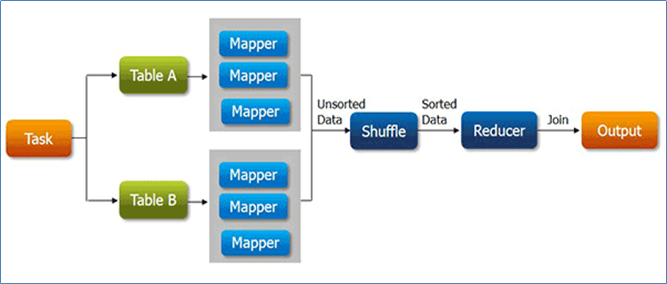
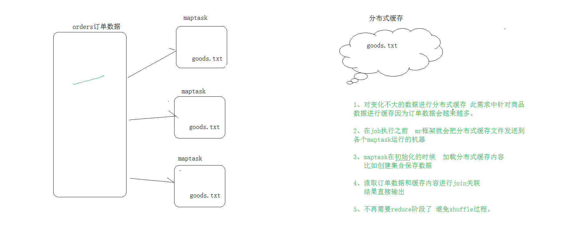

# 1. MapReduce Counter计数器

## 1.1 自定义Counter计数器

> 需求：在WordCount程序中对apple单词的数量利用计数器进行统计

在map阶段自定义一个counter，并且在遍历的时候进行统计
```java
protected void map(LongWritable key, Text value, Mapper<LongWritable, Text, Text, LongWritable>.Context context) throws IOException, InterruptedException {

    // todo 从程序的上下文环境中获取全局计数器 指定计数器所属组的名字 计数器的名字
    Counter counter = context.getCounter("vingkin counters", "apple counter");

    // 拿取一行数据转换为String
    String line = value.toString();
    // 根据分隔符进行切割
    String[] words = line.split("\\s+");
    // 遍历数组
    for (String word : words) {

        // 计数器使用
        if ("apple".equals(word)) {
            counter.increment(1);
        }

        outkey.set(word);
        // 输出数据 吧每个单词都标记1 输出的结果<单词,1>
        context.write(outkey, outvalue);
    }
}
```
结果：
```shell
vingkin counters
	apple counter=3
```

# 2. MapReduce读取数据库操作

* 对于MapReduce框架来说，使用inputformat进行数据读取操作，读取的数据首先由mapper处理，然后交给reducer处理，最终使用outputformat进行数据的输出操作。默认情况下，输入输出的组件实现都是针对文本数据处理的，分别是TextInputFormat、TextOutputFormat。
* 为了方便 MapReduce 直接访问关系型数据库（Mysql，Oracle），Hadoop提供了DBInputFormat和DBOutputFormat两个类。其中**DBInputFormat**负责从数据库中读取数据，而**DBOutputFormat**负责把数据最终写入数据库中。

## 2.1 MapReduce读取Mysql操作

DBInputFormat类用于从SQL表读取数据。底层一行一行读取表中的数据，返回<k,v>键值对。
* 其中k是LongWritalbe类型的，表示数据的记录行号，从0开始
* 其中v是DBWritable类型的，表示改行数据对应的对象类型

相关依赖：
```xml
<dependency>
    <groupId>org.apache.hadoop</groupId>
    <artifactId>hadoop-mapreduce-client-core</artifactId>
    <version>3.1.4</version>
</dependency>
<dependency>
    <groupId>mysql</groupId>
    <artifactId>mysql-connector-java</artifactId>
    <version>5.1.32</version>
</dependency>
```

GoodsBean.java，用于封装查询结果，需要实现序列化接口Writable和数据库操作接口DBWritable

```java
public class GoodsBean implements Writable, DBWritable {
    private long goodsId;   // 商品ID
    private String goodsSn; // 商品编号
    private String goodsName; // 商品名称
    private double marketPrice; // 市场价
    private double shopPrice; // 门店价
    private long saleNum; // 总销售量

	// set get 构造函数省略

    public void set(long goodsId, String goodsSn, String goodsName, double marketPrice, double shopPrice, long saleNum) {
        this.goodsId = goodsId;
        this.goodsSn = goodsSn;
        this.goodsName = goodsName;
        this.marketPrice = marketPrice;
        this.shopPrice = shopPrice;
        this.saleNum = saleNum;
    }

    @Override
    public String toString() {
        return goodsId + "\t" + goodsSn + "\t" + goodsName + "\t" + marketPrice + "\t" + shopPrice + "\t" + saleNum;
    }

    // 序列化方法
    @Override
    public void write(DataOutput out) throws IOException {
        out.writeLong(goodsId);
        out.writeUTF(goodsSn);
        out.writeUTF(goodsName);
        out.writeDouble(marketPrice);
        out.writeDouble(shopPrice);
        out.writeLong(saleNum);
    }

    @Override
    public void readFields(DataInput in) throws IOException {
        this.goodsId = in.readLong();
        this.goodsSn = in.readUTF();
        this.goodsName = in.readUTF();
        this.marketPrice = in.readDouble();
        this.shopPrice = in.readDouble();
        this.saleNum = in.readLong();
    }

    // 在PreparedStatement中设置对象的字段 写数据操作
    @Override
    public void write(PreparedStatement ps) throws SQLException {
        ps.setLong(1, goodsId);
        ps.setString(2, goodsSn);
        ps.setString(3, goodsName);
        ps.setDouble(4, marketPrice);
        ps.setDouble(5, shopPrice);
        ps.setLong(6, saleNum);
    }

    // 从ResultSet读取查询结果 赋值给对象属性
    @Override
    public void readFields(ResultSet rs) throws SQLException {
        this.goodsId = rs.getLong(1);
        this.goodsSn = rs.getString(2);
        this.goodsName = rs.getString(3);
        this.marketPrice = rs.getDouble(4);
        this.shopPrice = rs.getDouble(5);
        this.saleNum = rs.getLong(6);
    }
}
```

ReadDBMapper.java

```java
public class ReadDBMapper extends Mapper<LongWritable, GoodsBean, LongWritable, Text> {

    private Text outValue = new Text();

    @Override
    protected void map(LongWritable key, GoodsBean value, Mapper<LongWritable, GoodsBean, LongWritable, Text>.Context context) throws IOException, InterruptedException {
        outValue.set(value.toString());
        context.write(key, outValue);
    }
}
```

ReadDBDriver.java

```java
public class ReadDBDriver {
    public static void main(String[] args) throws Exception {
        // 配置文件对象
        Configuration conf = new Configuration();
        // todo 配置当前作业的jdbc信息
        DBConfiguration.configureDB(
                conf,
                "com.mysql.jdbc.Driver",
                "jdbc:mysql://localhost:3306/study",
                "root",
                "123456");
        // 配置创建作业的job类
        Job job = Job.getInstance(conf, ReadDBDriver.class.getSimpleName());
        // 设置本次MR程序的驱动类
        job.setJarByClass(ReadDBDriver.class);
        // 设置mapper class
        job.setMapperClass(ReadDBMapper.class);
        // 设置程序最终输出的key value类型
        job.setOutputKeyClass(LongWritable.class);
        job.setOutputValueClass(Text.class);

        FileOutputFormat.setOutputPath(job, new Path(args[0]));

        // todo 把reducetask的个数设置为0
        job.setNumReduceTasks(0);
        // 设置输入组件
        job.setInputFormatClass(DBInputFormat.class);
        // 添加读取数据库相关参数
        DBInputFormat.setInput(
                job,
                GoodsBean.class,
                "select goodsId, goodsSn, goodsName, marketPrice, shopPrice, saleNum from itheima_goods",
                "select count(goodsId) from vingkin_goods"
        );
        boolean b = job.waitForCompletion(true);
        System.exit(b ? 0 : 1);
    }
}
```

## 2.2 MapReducer写入Mysql操作

DBOutputFormat ，它将reduce输出发送到SQL表。

DBOutputFormat接受<key，value>键值对，其中key必须具有扩展DBWritable的类型，**在该案例中key必须为GoodsBean，因为只会将key对应的内容写入数据库。**

WriteDBMapper.java

```java
public class WriteDBMapper extends Mapper<LongWritable, Text, NullWritable, GoodsBean> {

    private GoodsBean outValue = new GoodsBean();

    @Override
    protected void map(LongWritable key, Text value, Mapper<LongWritable, Text, NullWritable, GoodsBean>.Context context) throws IOException, InterruptedException {
        // 获取两个计数器 用于统计合法数据 非法数据
        Counter sc = context.getCounter("mr_to_mysql", "SUCCESS");
        Counter fc = context.getCounter("mr_to_mysql", "FAILED");
        String[] fields = value.toString().split("\t");
        // 判断输入的字段是否有缺失 如果不满足需求 就是非法数据
        if (fields.length > 6) {
            // 合法数据
            outValue.set(
                    Long.parseLong(fields[1]),
                    fields[2],
                    fields[3],
                    Double.parseDouble(fields[4]),
                    Double.parseDouble(fields[5]),
                    Long.parseLong(fields[6])
            );
            sc.increment(1);
            context.write(NullWritable.get(), outValue);
        } else {
            // 非法数据
            fc.increment(1);
        }


    }
}
```

WriteDBReducer.java

```java
// 在使用DBOutputFormat时，要求我们输出的key必须是DBWritable的实现，因为只会把key写入数据库
public class WriteDBReducer extends Reducer<NullWritable, GoodsBean, GoodsBean, NullWritable> {
    @Override
    protected void reduce(NullWritable key, Iterable<GoodsBean> values, Reducer<NullWritable, GoodsBean, GoodsBean, NullWritable>.Context context) throws IOException, InterruptedException {
        for (GoodsBean value : values) {
            context.write(value, NullWritable.get());
        }
    }
}

```

WriteDBDriver.java

```java
public class WriteDBDriver {
    public static void main(String[] args) throws Exception {
        // 配置文件对象
        Configuration conf = new Configuration();
        // todo 配置当前作业的jdbc信息
        DBConfiguration.configureDB(
                conf,
                "com.mysql.jdbc.Driver",
                "jdbc:mysql://localhost:3306/study?useUnicode=true&characterEncoding=utf8",
                "root",
                "123456");
        // 配置创建作业的job类
        Job job = Job.getInstance(conf, WriteDBDriver.class.getSimpleName());
        // 设置本次MR程序的驱动类
        job.setJarByClass(WriteDBDriver.class);
        // 设置mapper class
        job.setMapperClass(WriteDBMapper.class);
        // 设置map输出的key value类型
        job.setMapOutputKeyClass(NullWritable.class);
        job.setMapOutputValueClass(GoodsBean.class);
        // 设置reducer class
        job.setReducerClass(WriteDBReducer.class);
        // 设置程序最终输出的key value类型
        job.setOutputKeyClass(GoodsBean.class);
        job.setOutputValueClass(NullWritable.class);

        // 设置当前作业的输入文件路径
        FileInputFormat.setInputPaths(job, new Path(args[0]));

        // todo 把reducetask的个数设置为0
        // job.setNumReduceTasks(0);

        // todo 输出组件
        job.setOutputFormatClass(DBOutputFormat.class);
        // todo 配置当前作业写入数据库的表，字段
        DBOutputFormat.setOutput(
                job,
                "vingkin_goods_mr_write",
                "goodsId", "goodsSn", "goodsName", "marketPrice", "shopPrice", "saleNum"
        );
        boolean b = job.waitForCompletion(true);
        System.exit(b ? 0 : 1);
    }
}
```

# 3. MapReduce Join操作

## 3.1 Reduce Side Join

> 在reduce阶段执行join关联操作



**实现步骤：**

* mapper分别读取不同的数据集；
* mapper的输出中，通常以join的字段作为输出的key；
* 不同数据集的数据经过shuffle，key一样的会被分到同一分组处理；
* 在reduce中根据业务需求把数据进行关联整合汇总，最终输出。

**弊端：**

* reduce端join最大的问题是整个join的工作是在reduce阶段完成的，但是通常情况下MapReduce中reduce的并行度是极小的（默认是1个），这就使得所有的数据都挤压到reduce阶段处理，压力颇大。虽然可以设置reduce的并行度，但是又会导致最终结果被分散到多个不同文件中。
* 并且在数据从mapper到reducer的过程中，shuffle阶段十分繁琐，数据集大时成本极高。

案例：对商品信息文件和订单信息文件进行Join处理

**思路分析：**

* 使用mapper处理订单数据和商品数据，输出的时候以goodsId号作为key。相同goodsId的商品和订单会到同一个reduce的同一个分组，在分组中进行订单和商品信息的关联合并。
* 在MapReduce程序中可以通过context获取到当前处理的切片所属的文件名称。根据文件名来判断当前处理的是订单数据还是商品数据，以此来进行不同逻辑的输出。
* join处理完之后，最后可以再通过MapReduce程序排序功能，将属于同一笔订单的所有商品信息汇聚在一起。

ReduceJoinMapper.java

```java
public class ReduceJoinMapper extends Mapper<LongWritable, Text, Text, Text> {

    private Text outKey = new Text();
    private Text outValue = new Text();
    StringBuilder sb = new StringBuilder();
    String fileName = null;

    // maptask的初始化方法，获取当前处理的切面所属的文件名称
    @Override
    protected void setup(Mapper<LongWritable, Text, Text, Text>.Context context) throws IOException, InterruptedException {
        FileSplit split = (FileSplit) context.getInputSplit();
        // 获取切面所属文件名称，也就是当前Task处理的数据是哪一个文件的
        fileName = split.getPath().getName();
        System.out.println("当前处理的文件是：" + fileName);
    }

    @Override
    protected void map(LongWritable key, Text value, Mapper<LongWritable, Text, Text, Text>.Context context) throws IOException, InterruptedException {
        // 清空sb
        sb.setLength(0);
        // 切割读取的一行数据
        String[] fields = value.toString().split("\\|");
        // 根据文件名进行判断
        if (fileName.contains("itheima_goods.txt")) {
            // 处理商品数据（商品id 商品编号 商品名称）
            outKey.set(fields[0]);
            sb.append(fields[1]).append("\t").append(fields[2]);
            outValue.set(sb.insert(0, "goods#").toString());
        } else {
            // 处理订单数据（订单编号 商品id 实际支付价格）
            outKey.set(fields[1]);
            sb.append(fields[0]).append("\t").append(fields[2]);
            outValue.set(sb.insert(0, "orders#").toString());
        }
        context.write(outKey, outValue);
    }
}
```

ReduceJoinReducer.java

```java
public class ReduceJoinReducer extends Reducer<Text, Text, Text, Text> {

    // 创建集合 用于保存订单数据和商品数据 便于后续join关联拼接数据
    // goods 商品编号 商品名称
    private List<String> goodsList = new ArrayList<String>();
    // orders 订单编号 实际支付价格
    private List<String> ordersList = new ArrayList<String>();

    private Text outValue = new Text();

    @Override
    protected void reduce(Text key, Iterable<Text> values, Reducer<Text, Text, Text, Text>.Context context) throws IOException, InterruptedException {
        // 遍历values
        for (Text value : values) {
            if (value.toString().startsWith("goods#")) {
                String s = value.toString().split("#")[1];
                // 添加到商品集合中
                goodsList.add(s);
            }
            if (value.toString().startsWith("orders#")) {
                String s = value.toString().split("#")[1];
                // 添加到商品集合中
                ordersList.add(s);
            }
        }

        // 获取两个集合的长度
        int goodsSize = goodsList.size();
        int ordersSize = ordersList.size();

        for (int i = 0; i < ordersSize; i++) {
            for (int j = 0; j < goodsSize; j++) {
                outValue.set(ordersList.get(i) + "\t" + goodsList.get(j));
                // 最终输出 商品id，订单编号，实际支付价格，商品编号，商品名称
                context.write(key, outValue);
            }
        }
        // 清空集合
        ordersList.clear();
        goodsList.clear();
    }
}
```

ReduceJoinDriver.java

略

ReduceJoinSort.java

```java
public class ReduceJoinSort extends Configured implements Tool {

    /**
     * 调整一行数据中的字段顺序，让订单号放在首位
     * 把属于同一笔订单的不同商品聚集在一起
     * 以订单编号作为key
     */
    public static class ReduceJoinSortMapper extends Mapper<LongWritable, Text, Text, Text> {

        Text outKey = new Text();
        Text outValue = new Text();

        @Override
        protected void map(LongWritable key, Text value, Mapper<LongWritable, Text, Text, Text>.Context context) throws IOException, InterruptedException {
            String[] fields = value.toString().split("\t");
            // 订单编号作为key
            outKey.set(fields[1]);
            // 输出结果：订单编号 商品id 商品编码 商品名称 实际成交金额
            outValue.set(fields[1] + '\t' + fields[0] + '\t' + fields[3] + '\t' + fields[4] + '\t' + fields[2]);
            context.write(outKey, outValue);
        }
    }

    public static class ReduceJoinSortReducer extends Reducer<Text, Text, Text, NullWritable>{

        @Override
        protected void reduce(Text key, Iterable<Text> values, Reducer<Text, Text, Text, NullWritable>.Context context) throws IOException, InterruptedException {
            for (Text value : values) {
                context.write(value, NullWritable.get());
            }
        }
    }

    public static void main(String[] args) throws Exception {
        // 创建配置对象
        Configuration conf = new Configuration();
        //判断输出路径是否存在 如果存在删除
        FileSystem fs = FileSystem.get(conf);
        if (fs.exists(new Path(args[1]))) {
            fs.delete(new Path(args[1]), true);
        }
        // todo 使用工具类ToolRunner提交程序
        int status = ToolRunner.run(conf, new ReduceJoinSort(), args);
        // 退出客户端
        System.exit(status);
    }

    @Override
    public int run(String[] args) throws Exception {
        Job job = Job.getInstance(getConf(), ReduceJoinSort.class.getSimpleName());
        // 设置MR程序运行的主类
        job.setJarByClass(ReduceJoinSort.class);
        // 设置MR程序的mapper类 reducer类
        job.setMapperClass(ReduceJoinSortMapper.class);
        job.setReducerClass(ReduceJoinSortReducer.class);
        // 指定mapper阶段输出的key value类型
        job.setMapOutputKeyClass(Text.class);
        job.setMapOutputValueClass(Text.class);
        // 指定reducer阶段输出的key value类型
        job.setOutputKeyClass(Text.class);
        job.setOutputValueClass(NullWritable.class);

        // 修改reducetask个数
        // job.setNumReduceTasks(3);

        // 配置本次作业的输入数据路径 输出数据路径
        // todo 默认组件 TextInputFormat TextOutputFormat
        FileInputFormat.setInputPaths(job, new Path(args[0]));
        FileOutputFormat.setOutputPath(job, new Path(args[1]));
        return job.waitForCompletion(true) ? 0 : 1;
    }

}
```

## 3.2 MapReduce分布式缓存

**相关介绍：**

* DistributedCache是MapReduce框架提供的一种机制,可以将job指定的文件,在job执行前,先行分发到各个task执行的机器上,并有相关机制对cache文件进行管理（比如读取缓存）。

* DistributedCache能够缓存应用程序所需的各种文件，包括text文本，Archive档案文件，jar包等。

* MapReduce框架在作业所有task执行之前会把指定的分布式缓存文件拷贝到各个Task运行的节点上。

**使用方法：**

1. 添加缓存文件
   ```java
   //添加归档文件到分布式缓存中
   job.addCacheArchive(URI uri);
   //添加普通文件到分布式缓存中
   job.addCacheFile(URI uri);
   // todo 添加分布式缓存文件，对应目录是hdfs上的目录，因为分布式缓存只支持在yarn模式下运行
   job.addCacheFile(new URI("/vingkin/input/itheima_goods.txt"));
   ```

2. MapReduce程序中读取缓存文件
   在Mapper类或者Reducer类的setup方法中，用BufferedReader获取分布式缓存中的文件内容。BufferedReader是带缓冲区的字符流，能够减少访问磁盘的次数，提高文件读取性能；并且可以一次性读取一行字符。

## 3.3 Map Side Join

> 利用分布式缓存，实现在map阶段的join操作，因此程序没有了shuffle阶段和reduce阶段，避免了shuffle阶段的繁琐



**实现思路：**

* 首先分析处理的数据集，使用分布式缓存技术**将小的数据集进行分布式缓存**。
* MapReduce框架在执行的时候会自动将缓存的数据分发到各个maptask运行的机器上。
* 在mapper初始化的时候从分布式缓存中读取小数据集数据，然后和自己读取的大数据集进行join关联，输出最终的结果。

**案例：和Reduce Side Join一样**

**思路分析：**

* Map-side Join是指在Mapper任务中加载特定数据集，此案例中把商品数据进行分布式缓存，使用Mapper读取订单数据和缓存的商品数据进行连接。
* 通常为了方便使用，会在mapper的初始化方法setup中读取分布式缓存文件加载的程序的内存中，便于后续mapper处理数据。
* 因为在mapper阶段已经完成了数据的关联操作，因此程序不需要进行reduce。需要在job中将reducetask的个数设置为0,也就是mapper的输出就是程序最终的输出。

MapJoinMapper.java

```java
public class MapJoinMapper extends Mapper<LongWritable, Text, Text, NullWritable> {

    // 创建一个集合用于缓存我们的商品数据
    Map<String, String> goodsMap = new HashMap<>();

    private final Text outKey = new Text();

    /**
     * 在程序初始化的方法中，从分布式缓存文件中加载我们的内容：itheima_goods.txt到本程序自己创建的集合中
     * 便于map方法中的join操作
     */
    @Override
    protected void setup(Mapper<LongWritable, Text, Text, NullWritable>.Context context) throws IOException, InterruptedException {
        // 读取分布式缓存文件 注意：关于缓存文件的路径直接指定文件名称即可 不需要添加路径
        BufferedReader br = new BufferedReader(new InputStreamReader(new FileInputStream("itheima_goods.txt")));
        String line = null;
        while ((line = br.readLine()) != null) {
            // 商品id 商品编号 商品名称
            String[] fields = line.split("\\|");
            // 把读取的分布式缓存内容添加到集合中
            // key：商品id value：商品编码 商品名称
            goodsMap.put(fields[0], fields[1] + '\t' + fields[2]);
        }
    }

    @Override
    protected void map(LongWritable key, Text value, Mapper<LongWritable, Text, Text, NullWritable>.Context context) throws IOException, InterruptedException {
        // 订单编号 商品id 成交价格
        String[] fields = value.toString().split("\\|");
        // todo 根据订单数据中的商品id在我们的缓存集合中找出对应的商品名称及相关信息，完成拼接，也就是所谓的join关联
        String goodsInfo = goodsMap.get(fields[1]);
        outKey.set(value.toString() + '\t' +goodsInfo);
        context.write(outKey, NullWritable.get());
    }
}
```

MapJoinDriver.java

具体步骤就是模板代码，只是下面两点需要注意

```java
// todo 修改reducetask个数
job.setNumReduceTasks(0);

// todo 添加分布式缓存文件
job.addCacheFile(new URI("/vingkin/input/itheima_goods.txt"));
```

**注意**：最后通过maven将程序打包放到yarn集群上运行即可，不支持本地运行

# 4. MapReduce工作流

> map -> reduce -> map -> reduce ....
>
> 也就是前一个reduce的输出结果，是后一个阶段map的输入，类似于拓扑或者DAG

* **JobControl**类：工作流job控制器，一次可以提交、管理多个job。
  JobControl类实现了线程Runnable接口。需要实例化一个线程来让它启动。
* **ControlledJob**类：可以将普通作业包装成受控作业。并且支持设置依赖关系。
  Hadoop会根据依赖的关系，先后执行job任务，每个任务的运行都是独立的。

**需求：**

> 针对Reduce Side Join的两个程序（1.将数据集join，2.将join好的数据集排序），进行工作流处理，一起执行提交。

MRJobFlow.java

```java
public class MRJobFlow {
    public static void main(String[] args) throws IOException {
        Configuration conf = new Configuration();
        // 第一个做的job
        Job job1 = Job.getInstance(conf, ReduceJoinDriver.class.getSimpleName());
        // 设置MR程序运行的主类
        job1.setJarByClass(ReduceJoinDriver.class);
        // 设置MR程序的mapper类 reducer类
        job1.setMapperClass(ReduceJoinMapper.class);
        job1.setReducerClass(ReduceJoinReducer.class);
        // 指定mapper阶段输出的key value类型
        job1.setMapOutputKeyClass(Text.class);
        job1.setMapOutputValueClass(Text.class);
        // 指定reducer阶段输出的key value类型
        job1.setOutputKeyClass(Text.class);
        job1.setOutputValueClass(Text.class);

        // 修改reducetask个数
        // job.setNumReduceTasks(3);

        // 配置本次作业的输入数据路径 输出数据路径
        // 默认组件 TextInputFormat TextOutputFormat
        FileInputFormat.setInputPaths(job1, new Path("D:\\OneDrive\\code\\bigdata\\code\\MapReduce\\WordCount\\src\\main\\java\\com\\vingkin\\mapreduce\\file\\join\\input"));
        FileOutputFormat.setOutputPath(job1, new Path("D:\\OneDrive\\code\\bigdata\\code\\MapReduce\\WordCount\\src\\main\\java\\com\\vingkin\\mapreduce\\file\\join\\rjout"));

        // todo 将我们普通的作业包装成受控作业
        ControlledJob cj1 = new ControlledJob(conf);
        cj1.setJob(job1);

        // 第二个作业job
        Job job2 = Job.getInstance(conf, ReduceJoinSort.class.getSimpleName());
        // 设置MR程序运行的主类
        job2.setJarByClass(ReduceJoinSort.class);
        // 设置MR程序的mapper类 reducer类
        job2.setMapperClass(ReduceJoinSort.ReduceJoinSortMapper.class);
        job2.setReducerClass(ReduceJoinSort.ReduceJoinSortReducer.class);
        // 指定mapper阶段输出的key value类型
        job2.setMapOutputKeyClass(Text.class);
        job2.setMapOutputValueClass(Text.class);
        // 指定reducer阶段输出的key value类型
        job2.setOutputKeyClass(Text.class);
        job2.setOutputValueClass(NullWritable.class);

        // 配置本次作业的输入数据路径 输出数据路径
        // 默认组件 TextInputFormat TextOutputFormat
        FileInputFormat.setInputPaths(job2, new Path("D:\\OneDrive\\code\\bigdata\\code\\MapReduce\\WordCount\\src\\main\\java\\com\\vingkin\\mapreduce\\file\\join\\rjout"));
        FileOutputFormat.setOutputPath(job2, new Path("D:\\OneDrive\\code\\bigdata\\code\\MapReduce\\WordCount\\src\\main\\java\\com\\vingkin\\mapreduce\\file\\join\\finalout"));

        // todo 将我们普通的作业包装成受控作业
        ControlledJob cj2 = new ControlledJob(conf);
        cj2.setJob(job2);

        // todo 设置作业之间的依赖关系
        cj2.addDependingJob(cj1);

        // todo 创建主控制器控制上面两个作业一起提交
        JobControl jc = new JobControl("myctrl");
        jc.addJob(cj1);
        jc.addJob(cj2);

        // 使用线程启动jc
        Thread t = new Thread(jc);
        t.start();

        while (true) {
            if (jc.allFinished()) {
                System.out.println(jc.getSuccessfulJobList());
                jc.stop();
                break;
            }
        }
    }
}
```

