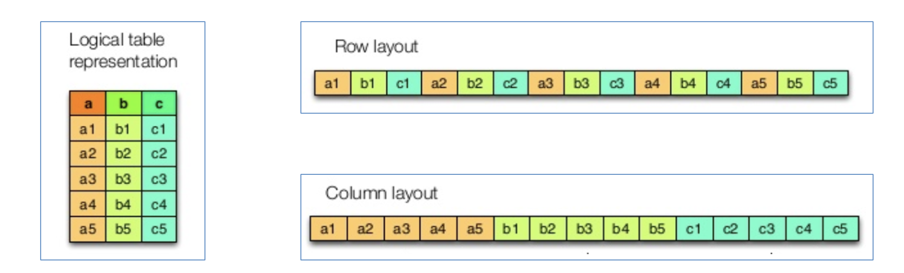

# 1. IO性能优化：文件类型

## 1.1 行式存储、列式存储

**优缺点：**

* 行存储的写入是一次性完成，消耗的时间比列存储少，并且能够保证数据的完整性，缺点是数据读取过程中会产生冗余数据，如果只有少量数据，此影响可以忽略;数量大可能会影响到数据的处理效率。**行适合插入、不适合查询。**
* 列存储在写入效率、保证数据完整性上都不如行存储，它的优势是在读取过程，不会产生冗余数据，这对数据完整性要求不高的大数据处理领域，比如互联网，犹为重要。**列适合查询，不适合插入。**

