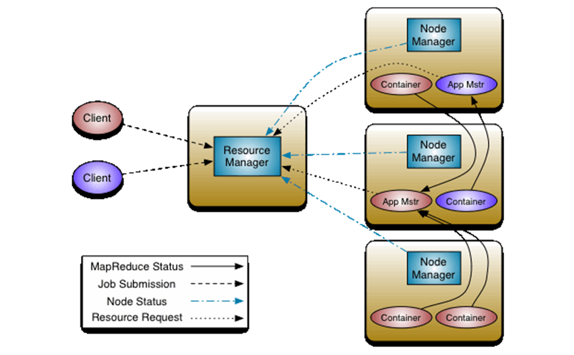
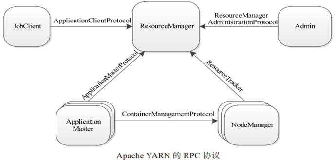
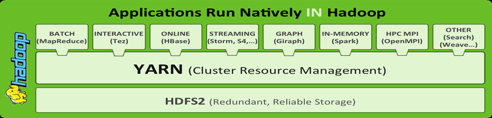
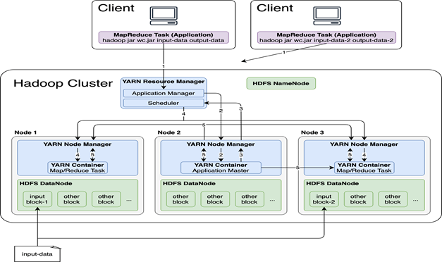

# 1. YARN架构体系

## 1.1 官方架构图

## 1.2 核心交互流程

* MR作业状态汇报  Container（Map|Reduce Task）-->Container（MrAppMaster）
* MR作业提交  Client-->RM
* 节点的状态汇报  NM-->RM
* 资源的申请  MrAppMaster-->RM

# 2. YARN组件及功能

## 2.1 三大组件

| 组件名                | 功能                                                         |
| --------------------- | ------------------------------------------------------------ |
| ResourceManager(RM)   | YARN集群中的主角色，决定系统中所有应用程序之间资源分配的最终权限，即最终仲裁者。接收用户的作业提交，并通过NM分配、管理各个机器上的计算资源。 |
| NodeManager(NM)       | YARN中的从角色，一台机器上一个，负责管理本机器上的计算资源。根据RM命令，启动Container容器、监视容器的资源使用情况。并且向RM主角色汇报资源使用情况。 |
| ApplicationMaster(AM) | 用户提交的每个应用程序均包含一个AM。应用程序内的“老大”，负责程序内部各阶段的资源申请，监督程序的执行情况。 |

### ResourceManager

> ResourceManager主要由两个组件构成：调度器（Scheduler）和应用程序管理器（Applications Manager， ASM）

* 调度器（Scheduler）
  根据容量、队列等限制条件（如每个队列分配一定的资源，最多执行一定数量的作业等），将系统中的资源分配给各个正在运行的应用程序。
  
* 应用程序管理器（Applications Manager）
  负责管理整个系统中所有应用程序，包括应用程序提交、与调度器协商资源以启动 ApplicationMaster、监控 ApplicationMaster 运行状态并在失败时重新启动它等。

### NodeManager

> NodeManager是每个节点上的资源和任务管理器。

* 一方面，它会定时地向 RM 汇报本节点上的资源使用情况和各个 Container 的运行状态
* 另一方面，它接收并处理来自 AM 的 Container启动 / 停止等各种请求

### ApplicationMaster

* 职责
  * 与 RM 调度器协商以获取资源（用 Container 表示）；
  * 将得到的任务进一步分配给内部的任务；
  * 与 NM 通信以启动 / 停止任务；
  * 监控所有任务运行状态，并在任务运行失败时重新为任务申请资源以重启任务。

## 2.2 Container容器
* Container 是YARN 中的资源抽象，它封装了某个节点上的多维度资源，如内存、CPU、磁盘、网络等，当 AM 向 RM 申请资源时， RM 为 AM 返回的资源便是用 Container表示的。YARN 会为每个任务分配一个 Container，且该任务只能使用该 Container 中描述的资源。需要注意的是， Container 不同于 MRv1 中的 slot（槽位），它是一个动态资源划分单位，是根据应用程序的需求动态生成的。
* 当下YARN仅支持CPU和内存两种资源，底层使用了轻量级资源隔离机制Cgroups进行资源隔离 

# 3. YARN通信协议

> 分布式环境下，需要涉及跨机器跨网络通信，YARN底层使用RPC协议实现通信。

RPC是远程过程调用（Remote Procedure Call）的缩写形式。基于RPC进行远程调用就像本地调用一样

在RPC协议中，通信双方有一端是Client，另一端为Server，且Client总是主动连接 Server 的。因此，YARN实际上采用的是拉式（pull-based）通信模型

* JobClient（作业提交客户端 ）与 RM 之间的协议--**ApplicationClientProtocol**。客户端通过该 RPC 协议提交应用程序、查询应用程序状态等。
* Admin（管理员）与 RM 之间的通信协议--**ResourceManagerAdministrationProtocol**。Admin通过该 RPC 协议更新YARN集群系统配置文件，比如节点黑白名单、用户队列权限等。
* AM 与 RM 之间的协议--**ApplicationMasterProtocol**。AM 通过该 RPC 协议向RM注册和撤销自己，并为各个任务申请资源。
* AM 与 NM 之间的协议--**ContainerManagementProtocol**。AM 通过该 RPC 要求NM启动或者停止 Container，获取各个 Container 的使用状态等信息。
* NM 与 RM 之间的协议--**ResourceTracker**。NM 通过该 RPC 协议向 RM 注册，并定时发送心跳信息汇报当前节点的资源使用情况和 Container 运行情况。

# 4. YARN交互流程

## 4.1 YARN上的应用类型

* **短应用程序**：指一定时间内（可能是秒级、分钟级或小时级，尽管天级别或者更长时间的也存在，但非常少）可运行完成并正常退出的应用程序，比如 MapReduce 作业、 Spark 作业等；
* **长应用程序**：指不出意外，永不终止运行的应用程序，通常是一些服务，比如 Storm Service（主要包括 Nimbus 和 Supervisor 两类服务）， Flink（包括 JobManager和 TaskManager两类服务） 等，而它们本身作为一个框架提供了编程接口供用户使用。

> 尽管这两类应用程序作用不同，一类直接运行数据处理程序，一类用于部署服务（服务之上再运行数据处理程序），但运行在 YARN 上的流程是相同的。

## 4.2 整体概述

当用户向 YARN 中提交一个应用程序后， YARN 将分两个阶段运行该应用程序 。

* 第一个阶段是启动 ApplicationMaster；
* 第二个阶段是由 ApplicationMaster 创建应用程序，为它申请资源，并监控它的整个运行过程，直到运行完成。 

## 4.3 MR提交YARN交互流程

* **第1步**：用户向YARN中提交应用程序，其中包括ApplicationMaster程序、启动ApplicationMaster 的命令、用户程序等
* **第2步**：ResourceManager 为该应用程序分配第一个Container，并与对应的 NodeManager通信，要求它在这个 Container中启动应用程序的 ApplicationMaster
* **第3步**：ApplicationMaster 首先向 ResourceManager 注册，这样用户可以直接通过ResourceManage 查看应用程序的运行状态，然后它将为各个任务申请资源，并监控它的运行状态，直到运行结束，即重复步骤 4~7。
* **第4步**：ApplicationMaster 通过 RPC 协议向 ResourceManager 申请和领取资源
* **第5步**：一旦 ApplicationMaster 申请到资源后，便与对应的 NodeManager 通信，要求它启动任务
* **第6步**：NodeManager 为任务设置好运行环境（包括环境变量、 JAR 包、二进制程序等）后，将任务启动命令写到一个脚本中，并通过运行该脚本启动任务
* **第7步**：各个任务通过某个 RPC 协议向 ApplicationMaster 汇报自己的状态和进度，以让 ApplicationMaster 随时掌握各个任务的运行状态，从而可以在任务失败时重新启动任务。在应用程序运行过程中，用户可随时通过 RPC 向 ApplicationMaster 查询应用程序的当前运行状态
* **第8步**：应用程序运行完成后，ApplicationMaster 向 ResourceManager 注销并关闭自己

