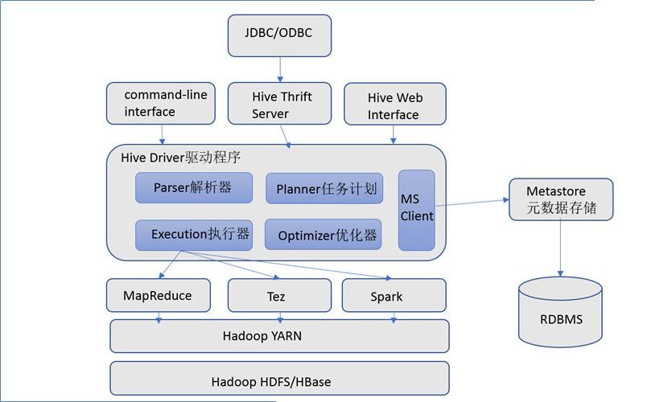
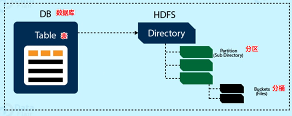

# 1. 数据仓库

> **数据仓库**（英语：Data Warehouse，简称**数仓**、**DW**）,是一个用于存储、分析、报告的数据系统。
> 数据仓库的目的是构建**面向分析**的集成化数据环境，分析结果为企业提供决策支持（Decision Support）。

## 1.1 数据仓库、数据库、数据集市

### 1.1.1 OLTP、OLAP

> 联机**事务**处理 OLTP（On-Line **Transaction** Processing）
> 联机**分析**处理 OLAP（On-Line **Analytical** Processing）

这两个主要记住

* OLTP目标是做**数据处理**，比如常见的关系型数据库系统（RDBMS）
* OLAP目标是做**数据分析**，比如数据仓库

### 1.1.2 数据仓库、数据库

> 数据库与数据仓库的区别实际讲的是OLTP与OLAP的区别

**区别：**

* 数据仓库不是大型的数据库，虽然数据仓库存储数据规模大。
* 数据仓库的出现，并不是要取代数据库。
* 数据库是**面向事务**的设计，数据仓库是**面向主题**设计的。
* 数据库一般存储**业务数据**，数据仓库存储的一般是**历史数据**。
* 数据库是为**捕获数据**而设计，数据仓库是为**分析数据**而设计。

### 1.1.3 数据仓库、数据集市

> 数据仓库（Data Warehouse）是面向整个集团组织的数据，数据集市( Data Mart ) 是面向单个部门使用的

可以认为数据集市是数据仓库的子集，也有人把数据集市叫做小型数据仓库。数据集市通常只涉及一个主题领域，例如市场营销或销售。因为它们较小且更具体，所以它们通常更易于管理和维护，并具有更灵活的结构。

## 1.2 数据仓库分层架构

> 每个企业根据自己的业务需求可以分成不同的层次。但是最基础的分层思想，理论上分为三个层：操作型数据层（**ODS**）、数据仓库层(**DW**)和数据应用层(**DA**)。


### 1.2.1 ODS层（Operation Data Store）

* **操作型数据层**，也称之为源数据层、数据引入层、数据暂存层、临时缓存层。
* 此层存放未经过处理的原始数据至数据仓库系统，结构上与源系统保持一致，是数据仓库的数据准备区。
* 主要完成基础数据引入到数仓的职责，和数据源系统进行解耦合，同时记录基础数据的历史变化。

### 1.2.2 DW层（Data Warehouse）

* **数据仓库层**，由ODS层数据加工而成。主要完成数据加工与整合，建立一致性的维度，构建可复用的面向分析和统计的明细事实表，以及汇总公共粒度的指标。内部具体划分如下：
* 公共维度层（DIM）：基于维度建模理念思想，建立整个企业一致性维度。
* 公共汇总粒度事实层（DWS、DWB）：以分析的主题对象作为建模驱动，基于上层的应用和产品的指标需求，构建公共粒度的汇总指标事实表，以宽表化手段物理化模型
* 明细粒度事实层（DWD）: 将明细事实表的某些重要维度属性字段做适当冗余，即宽表化处理。

### 1.2.3 DA层（或ADS层）

* **数据应用层**，面向最终用户，面向业务定制提供给产品和数据分析使用的数据。
* 包括前端报表、分析图表、KPI、仪表盘、OLAP专题、数据挖掘等分析。

### 1.2.4 ETL、ELT

> 数据仓库从各数据源获取数据及在数据仓库内的数据转换和流动都可以认为是ETL（抽取Extra, 转化Transfer, 装载Load）的过程。
>
> 这两个只是理论上的三个步骤，具体如何排列组合还是得看具体的项目，了解即可。

**ETL：**

* 首先从数据源池中提取数据，这些数据源通常是事务性数据库。数据保存在临时暂存数据库中（ODS）。然后执行转换操作，将数据结构化并转换为适合目标数据仓库系统的形式。然后将结构化数据加载到仓库中，以备分析。

**ELT：**

* 使用ELT，数据在从源数据池中提取后立即加载。没有专门的临时数据库（ODS），这意味着数据会立即加载到单一的集中存储库中。数据在数据仓库系统中进行转换，以便与商业智能工具（BI工具）一起使用。**大数据时代的数仓这个特点很明显。**

# 2. Apache Hive 入门

> Apache Hive是一款建立在Hadoop之上的开源**数据仓库**系统，可以将存储在Hadoop文件中的结构化、半结构化数据文件映射为一张数据库表，基于表提供了一种类似SQL的查询模型，称为Hive查询语言（HQL），用于访问和分析存储在Hadoop文件中的大型数据集。
>
> Hive核心是将**HQL**转换为**MapReduce**程序，然后将程序提交到Hadoop群集执行。
>
> Hive由Facebook实现并开源。

## 2.1 Apache Hive 架构、组件

### 2.1.1 架构图



### 2.1.2 组件

* **用户接口**
  包括 CLI、JDBC/ODBC、WebGUI。其中，CLI(command line interface)为shell命令行；Hive中的Thrift服务器允许外部客户端通过网络与Hive进行交互，类似于JDBC或ODBC协议。WebGUI是通过浏览器访问Hive。
* **元数据存储**
  通常是存储在关系数据库如 mysql/derby中。Hive 中的元数据包括表的名字，表的列和分区及其属性，表的属性（是否为外部表等），表的数据所在目录等。
* **Driver驱动程序，包括语法解析器、计划编译器、优化器、执行器**
  完成 HQL 查询语句从词法分析、语法分析、编译、优化以及查询计划的生成。生成的查询计划存储在 HDFS 中，并在随后有执行引擎调用执行。
* **执行引擎**
  Hive本身并不直接处理数据文件。而是通过执行引擎处理。当下Hive支持MapReduce、Tez、Spark3种执行引擎。

## 2.2 Apache Hive 数据模型

> 用来描述数据、组织数据和对数据进行操作，是对现实世界数据特征的描述

**Hive中的数据可以在粒度级别上分为三类：**

* Table表
* Partition分区
* Bucket分桶



### 2.2.1 Databases 数据库

> Hive作为一个数据仓库，在结构上积极向传统数据库看齐，也分数据库（Schema），每个数据库下面有各自的表组成。默认数据库default

Hive的数据都是存储在**HDFS**上的，默认有一个根目录，在hive-site.xml中，由参数`hive.metastore.warehouse.dir`指定。默认值为`/user/hive/warehouse`

比如名为vingkin的数据库的存储路径为：`/user/hive/warehouse/vingkin.db`

### 2.2.2 Tables 表

> Hive表与关系数据库中的表相同。Hive中的表所对应的数据通常是存储在HDFS中，而表相关的元数据是存储在RDBMS中

Hive中的表的数据在HDFS上的存储路径为：`${hive.metastore.warehouse.dir}/databasename.db/tablename`

比如vingkin数据库下的t_user表的路径为：`/user/hive/warehouse/vingkin.db/t_user`

### 2.2.3 Partitions 分区

> Partition分区是hive的一种优化手段表。分区是指**根据分区列（例如“日期day”）的值将表划分为不同分区**。这样可以更快地对指定分区数据进行查询

* 分区在存储层面上的表现是:table表目录下以子文件夹形式存在。
* 一个文件夹表示一个分区。子文件命名标准：分区列=分区值

```shell
/user/hive/warehouse/vingkin.db/t_user
									  /day=20200825/
									  /day=20200826/
									  /day=20200827/
```

### 2.2.4 Buckets 分桶

> Bucket分桶表是hive的一种优化手段表。分桶是指**根据表中字段（例如“编号ID”）的值,经过hash计算规则将数据文件划分成指定的若干个小文件**
>
> 分桶规则：hashfunc(字段) % 桶个数，余数相同的分到同一个文件

* 分桶的好处是可以优化join查询和方便抽样查询。
* Bucket分桶表在HDFS中表现为同一个表目录下数据根据hash散列之后变成多个文件。

```shell
# 未分桶表
/user/hive/warehouse/vingkin.db/t_user/user.txt

# 分桶表（%3）
/user/hive/warehouse/vingkin.db/t_user
                                      /0.txt
                                      /1.txt
                                      /2.txt
```

## 2.3 Apache Hive 元数据

> 元数据（Metadata），又称中介数据、中继数据，为**描述数据的数据**（data about data），主要是描述数据属性（property）的信息，用来支持如指示存储位置、历史数据、资源查找、文件记录等功能

### 2.3.1 Hive Metadata

* **Hive Metadata**即Hive的元数据
* 包含用Hive创建的database、table、表的位置、类型、属性，字段顺序类型等元信息
* 元数据存储在关系型数据库中。如hive内置的Derby、或者第三方如MySQL等

### 2.3.2 Hive Metastore

* Metastore即**元数据服务**。Metastore服务的作用是管理metadata元数据，对外暴露服务地址，让各种客户端通过连接metastore服务，由metastore再去连接MySQL数据库来存取元数据。
* 有了metastore服务，就可以有多个客户端同时连接，而且这些客户端不需要知道MySQL数据库的用户名和密码，只需要连接metastore 服务即可。某种程度上也保证了hive元数据的安全。


## 2.4 Metastore 三种配置方式

> Metastore服务配置有3种模式：**内嵌模式**、**本地模式**、**远程模式**

**区分3种配置方式的关键是弄清楚两个问题：**

* Metastore服务是否需要单独配置、单独启动
* Metadata是存储在内置的derby中，还是第三方RDBMS,比如MySQL

|                         | 内嵌模式 | 本地模式 | 远程模式 |
| :---------------------: | :------: | :------: | :------: |
| Metastore单独配置、启动 |    否    |    否    |    是    |
|    Metadata存储介质     |  Derby   |  Mysql   |  Mysql   |

### 2.4.1 内嵌模式

> **内嵌模式**（Embedded Metastore）是metastore默认部署模式

* 此种模式下，元数据存储在内置的Derby数据库，并且Derby数据库和metastore服务都嵌入在主HiveServer进程中，当启动HiveServer进程时，Derby和metastore都会启动。不需要额外起Metastore服务。
* 但是一次只能支持一个活动用户，适用于测试体验，不适用于生产环境。


### 2.4.2 本地模式

> **本地模式**（Local Metastore）下，Metastore服务与主HiveServer进程在同一进程中运行，但是存储元数据的数据库在单独的进程中运行，并且可以在单独的主机上。Metastore服务将通过JDBC与Metastore数据库进行通信

* 本地模式采用外部数据库来存储元数据，推荐使用MySQL。
* hive根据`hive.metastore.uris` 参数值来判断，如果为空，则为本地模式。
* 缺点是：每启动一次hive服务，都内置启动了一个Metastore


### 2.4.3 远程模式

> **远程模式**（Remote Metastore）下，Metastore服务在其自己的单独JVM上运行，而不在HiveServer的JVM中运行。如果其他进程希望与Metastore服务器通信，则可以使用Thrift Network API进行通信

* 远程模式下，需要配置`hive.metastore.uris` 参数来指定Metastore服务运行的机器ip和端口，并且需要单独手动启动Metastore服务。元数据也采用外部数据库来存储元数据，推荐使用MySQL
* 在生产环境中，建议用远程模式来配置Hive Metastore。在这种情况下，其他依赖hive的软件都可以通过Metastore访问hive。由于还可以完全屏蔽数据库层，因此这也带来了更好的可管理性/安全性


**启动方式：**

1. `nohup /export/server/hive/bin/hive --service metastore &`，后台启动Metastore
2. `/export/server/hive/bin/beeline`，使用第二代命令行工具执行

