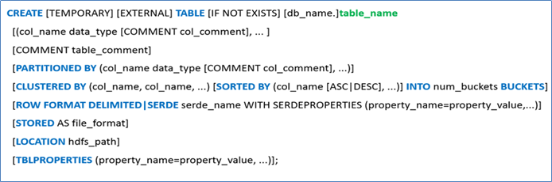
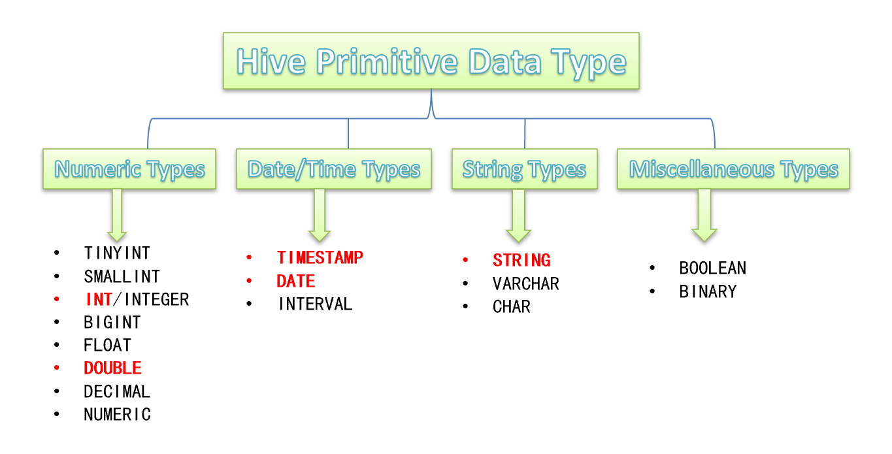
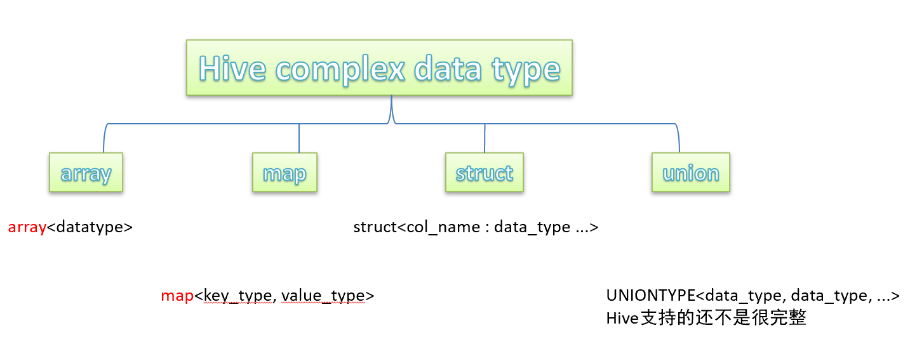
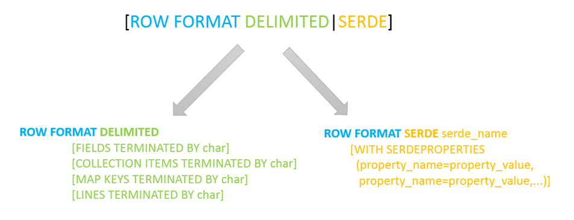
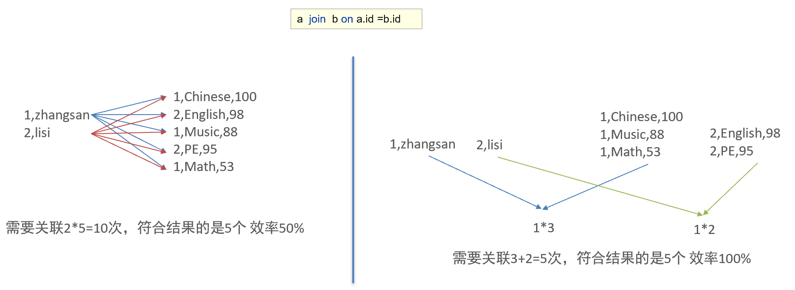

# 1 Hive SQL DDL建表基础语法

## 1.1 Hive建表完整语法树

* **蓝色字体**是建表语法的关键字，用于指定某些功能。
* **[ ]**中括号的语法表示可选。
* **|**表示使用的时候，左右语法二选一。
* **建表语句中的语法顺序要和语法树中顺序保持一致。**



## 1.2 Hive数据类型详解

> 指的是表中列的字段类型

* **原生数据类型(primitive data type)**：数值类型、时间日期类型、字符串类型、杂项数据类型
* **复杂数据类型(complex data type)**：array数组、map映射、struct结构、union联合体





**注意事项：**

* Hive SQL中，数据类型**英文字母大小写不敏感**；
* 除SQL数据类型外，还**支持Java数据类型**，比如字符串string；
* 复杂数据类型的使用通常需要**和分隔符指定语法配合使用**；
* 如果定义的数据类型和文件不一致，**Hive会尝试隐式转换，但是不保证成功**。

**隐式转换：**

> 原生类型从窄类型到宽类型的转换称为隐式转换，反之，则不允许。 （也就是小数据变成大数据可以隐式转换）

|                 | void  | boolean | tinyint | smallint |  int  | bigint | float | double |
| :-------------: | :---: | :-----: | :-----: | :------: | :---: | :----: | :---: | :----: |
|   **void to**   | true  |  true   |  true   |   true   | true  |  true  | true  |  true  |
| **boolean to**  | false |  true   |  true   |   true   | true  |  true  | true  |  true  |
| **tinyint to**  | false |  false  |  true   |   true   | true  |  true  | true  |  true  |
| **smallint to** | false |  false  |  false  |   true   | true  |  true  | true  |  true  |
|   **int to**    | false |  false  |  false  |  false   | true  |  true  | true  |  true  |
|  **bigint to**  | false |  false  |  false  |  false   | false |  true  | true  |  true  |
|  **float to**   | false |  false  |  false  |  false   | false | false  | true  |  true  |
|  **double to**  | false |  false  |  false  |  false   | false | false  | false |  true  |

**显示转换：**

> 显式类型转换使用`CAST`函数

例如，`CAST('100' as INT)`会将100字符串转换为100整数值。 如果强制转换失败，例如`CAST('Allen' as INT)`，该函数返回NULL。

## 1.3 Hive读写文件机制

> SerDe是Serializer、Deserializer的简称，目的是用于序列化和反序列化

* 序列化是对象转化为字节码的过程
* 反序列化是字节码转换为对象的过程

### 1.3.1 Hive读写文件流程

* Hive读取文件机制：首先调用InputFormat（默认TextInputFormat），返回一条一条kv键值对记录（默认是一行对应一条键值对）。然后调用SerDe（默认LazySimpleSerDe）的Deserializer，将一条记录中的value根据分隔符切分为各个字段。(**HDFS files - TextInputFormat - <key, value> - Deserializer - Row object** )
* Hive写文件机制：将Row写入文件时，首先调用SerDe（默认LazySimpleSerDe）的Serializer将对象转换成字节序列，然后调用OutputFormat（默认HiveIgnoreKeyTextOutputFormat）将数据写入HDFS文件中。(**Row object - Serializer - <key, value> - HiveIgnoreKeyTextOutputFormat - HDFS files**)

### 1.3.2 SerDe相关语法

> `  [ROW FORMAT DELIMITED|SERDE serde_name WITH SERDEPROPERTIES (property_name=property_value,...)]`

表创建语句中的ROW FORMAT这一行所代表的是跟读写文件、序列化SerDe相关的语法：

* 使用哪个SerDe类进行序列化（默认**LazySimpleSerDe**）
* 如何指定分隔符



* 如果**使用delimited表示使用默认的LazySimpleSerDe类来处理数据**
* 如果数据文件格式比较特殊可以使用`ROW FORMAT SERDE serde_name`指定其他的SerDe类来处理数据,甚至支持用户自定义SerDe类。

### 1.3.3 LazySimpleSerDe分隔符指定

> LazySimpleSerDe是Hive默认的序列化类，包含4种子语法，分别用于指定字段之间、集合元素之间、map映射 kv之间、换行的分隔符号

```sql
ROW FORMAT DELIMITED
	[FIELDS TERMINATED BY char] -- 字段之间分隔符
	[COLLECTION ITEMS TERMINATED BY char] -- 集合元素之间分隔符
	[MAP KEY TERMINATED BY char] -- Map映射KV之间的分隔符
	[LINES TERMINATED BY char] -- 行数据之间的分隔符
```

**Hive默认分隔符：**'\001'

## 1.4 Hive数据存储路径

### 1.4.1 默认存储路径

Hive表默认存储路径是由`${HIVE_HOME}/conf/hive-site.xml`配置文件的`hive.metastore.warehouse.dir`属性指定，**默认值**是：`/user/hive/warehouse`。

### 1.4.2 指定存储路径

在Hive建表的时候，可以通过**location语法来更改数据在HDFS上的存储路径**

语法：`LOCATION '<hdfs_location>'`

## 1.5 基础建表语法联系

**数据文件：**

字段：id、name（英雄名称）、win_rate（胜率）、skin_price（皮肤及价格）

```reStructuredText
1,孙悟空,53,西部大镖客:288-大圣娶亲:888-全息碎片:0-至尊宝:888-地狱火:1688
2,鲁班七号,54,木偶奇遇记:288-福禄兄弟:288-黑桃队长:60-电玩小子:2288-星空梦想:0
3,后裔,53,精灵王:288-阿尔法小队:588-辉光之辰:888-黄金射手座:1688-如梦令:1314
4,铠,52,龙域领主:288-曙光守护者:1776
5,韩信,52,飞衡:1788-逐梦之影:888-白龙吟:1188-教廷特使:0-街头霸王:888
```

**建表语句：**

```sql
create table if not exists t_hot_hero_skin_price
(
    id         int,
    name       string comment "英雄名称",
    win_rate   double comment "胜率",
    skin_price map<string, int> comment "皮肤价格"
) comment "热门英雄胜率及皮肤价格"
    row format delimited
        fields terminated by "," -- 指定字段之间的分隔符
        collection items terminated by "-" -- 指定集合元素之间的分隔符
        map keys terminated by ":"; -- 指定map元素kv之间的分隔符
```

# 2 Hive SQL DDL 建表高阶语法

## 2.1 Hive 内部表、外部表

> 在创建表的时候通过`EXTERNAL`关键字指定，不指定表示内部表
>
> `create [external] table xxx ();`

**内部表和外部表的主要区别是外部表再删除时会删除HDFS上的源数据。而外部表不会，外部表只会删除表的元数据，对于其元数据并不会删除。**

|                  |                   内部表 / 托管表                    |       外部表       |
| :--------------: | :--------------------------------------------------: | :----------------: |
|   **创建方式**   |                         默认                         | 使用EXTERNAL关键字 |
| **Hive管理范围** |                    元数据、表数据                    |       元数据       |
|  **删除表结果**  |            删除元数据、删除HDFS上的表数据            |   只会删除元数据   |
|     **操作**     | 支持ARCHIVE，UNARCHIVE，TRUNCATE，MERGE，CONCATENATE |       不支持       |
|     **事务**     |                  支持ACID / 事务性                   |       不支持       |
|     **缓存**     |                     支持结果缓存                     |       不支持       |

## 2.2 Hive Partitioned Tables 分区表

> 当Hive表对应的数据量大、文件个数多时，**为了避免查询时全表扫描数据**，Hive支持根据指定的字段对表进行分区，分区的字段可以是日期、地域、种类等具有标识意义的字段。

**本质：**

* 分区的概念提供了一种将Hive表数据分离为多个文件/目录的方法。
* **不同分区对应着不同的文件夹，同一分区的数据存储在同一个文件夹下**。
* 查询过滤的时候只需要根据分区值找到对应的文件夹，扫描本文件夹下本分区下的文件即可，避免全表数据扫描。
* 这种指定分区查询的方式叫做**分区裁剪**。

**注意事项：**

1. 分区表不是建表的必要语法规则，是一种**优化手段表**，可选；
2. **分区字段不能是表中已有的字段**，不能重复；
3. 分区字段是**虚拟字段**，其数据并不存储在底层的文件中；
4. 分区字段值的确定来自于用户价值数据手动指定（**静态分区**）或者根据查询结果位置自动推断（**动态分区**）
5. Hive**支持多重分区**，也就是说在分区的基础上继续分区，划分更加细粒度

### 2.2.1 创建分区表

针对《王者荣耀》英雄数据，重新创建一张分区表**t_all_hero_part**，以role角色作为分区字段

```sql
create table if not exists t_all_hero_part
(
    id           int,
    name         string,
    hp_max       int,
    mp_max       int,
    attack_max   int,
    defense_max  int,
    attack_range string,
    role_main    string,
    role_assist  string
)
    partitioned by (role string) -- 分区字段不能和表字段重复
    row format delimited
        fields terminated by "\t";
```

**创建完成后当使用`select * from t_all_hero_part`时会发现有多了个role字段，该字段是虚拟字段，查询的时候尽量先使用where进行分区过滤，查询指定分区的数据，避免全表扫描，比如下述代码：**

```sql
-- 先基于分区过滤 再查询
select * from t_all_hero_part where role="sheshou" and hp_max >6000;
```

### 2.2.2 分区表数据加载

> 分区表数据加载主要分为静态加载和动态加载两种。其实还可以通过MSCK实现分区表数据的加载，后面进行具体阐述。

**静态分区加载：** 

`load data [local] inpath 'filepath ' into table tablename partition(分区字段='分区值'...)`，其中local为可选字段，写了表示客户端路径，没写表示HDFS路径。通过下面代码可以发现**静态分区的属性值由用户加载数据时手动指定。

```sql
-- 静态分区
load data local inpath '/root/hivedata/archer.txt' into table t_all_hero partition (role = 'sheshou');
load data local inpath '/root/hivedata/assassin.txt' into table t_all_hero partition (role = 'cike');
load data local inpath '/root/hivedata/mage.txt' into table t_all_hero partition (role = 'fashi');
load data local inpath '/root/hivedata/support.txt' into table t_all_hero partition (role = 'fuzhu');
load data local inpath '/root/hivedata/tank.txt' into table t_all_hero partition (role = 'tanke');
load data local inpath '/root/hivedata/warrior.txt' into table t_all_hero partition (role = 'zhanshi');
```

**动态分区加载：**

> 分区的字段值是基于查询结果（参数位置）自动推断出来的。核心语法就是**insert+select**

使用动态分区要设置两个参数：

```sql
# 是否开启动态分区功能
set hive.exec.dynamic.partition=true;
# 指定动态分区模式，分为nonstick非严格模式和strict严格模式。
# strict严格模式要求至少有一个分区为静态分区。
set hive.exec.dynamic.partition.mode=nonstrict;
```

```sql
-- --创建一张新的分区表 t_all_hero_part_dynamic
create table if not exists t_all_hero_dynamic
(
    id           int,
    name         string,
    hp_max       int,
    mp_max       int,
    attack_max   int,
    defense_max  int,
    attack_range string,
    role_main    string,
    role_assist  string
)
    partitioned by (role string) -- 分区字段不能和表字段重复
    row format delimited
        fields terminated by "\t";
```

```sql
-- 执行动态分区插值
insert into table t_all_hero_dynamic partition (role) -- 注意这里 分区值没有手动写死
select tmp.*, tmp.role_main
from t_all_hero tmp; -- 其中有两个参数tmp.* tmp.role_main。表示tmp.role_main分区插入tmp.*值
```

### 2.2.3 多重分区

> 多重 分区就是**对分区进行继续分区**，比如说先按省分区，省里面再按市分区。从HDFS的角度来看就是**文件夹下继续划分文件夹**。

```sql
-- 多分区表，按省份和市划分
create table t_user_province_city
(
    id   int,
    name string,
    age  int
)
    partitioned by (province string, city string)
    row format delimited
        fields terminated by ",";
```

```sql
-- 双分区表的数据加载 静态加载方式
load data local inpath '/root/hivedata/user.txt' into table t_user_province_city
    partition (province = 'zhejiang', city = 'hangzhou');
load data local inpath '/root/hivedata/user.txt' into table t_user_province_city
    partition (province = 'zhejiang', city = 'ningbi');
load data local inpath '/root/hivedata/user.txt' into table t_user_province_city
    partition (province = 'shanghai', city = 'pudong');
```

## 2.3 Hive Bucketed Tables 分桶表

> 根据表的某个字段进行hash求值，对桶的个数进行取模，从而将单个文件分成多个文件。其原理类似于MapReduce中的分区。

**好处：**

1. 基于分桶字段查询可以减少全表扫描。因为可以先计算出在哪一个桶文件中，然后在该文件中进行查找。
2. JOIN时可以提高MR程序效率，减少笛卡尔积数量（前提是对JOIN的字段进行分桶）
   
3. 分桶表数据进行**高效抽样**。当数据量特别大时，对全体数据进行处理存在困难时，抽样就显得尤其重要了。抽样可以从被抽取的数据中估计和推断出整体的特性，是科学实验、质量检验、社会调查普遍采用的一种经济有效的工作和研究方法。

### 2.3.1 基本语法

`[CLUSTERED BY (col_name, col_name, ...) [SORTED BY (col_name [ASC|DESC], ...)] INTO num_buckets BUCKETS]`

* `CLUSTERED BY (col_name)`表示根据哪个字段进行分；
* `SORTED BY (col_name [ASC|DESC], ...)`表示根据那个字段进行升序/降序排序，可选
* `INTO N BUCKETS`表示分为几桶（也就是几个部分）
* 需要注意的是，**分桶的字段必须是表中已经存在的字段**

### 2.3.2 创建分桶表

>  **案例：**对美国新冠疫情的一份数据进行按state进行分成5桶，并且按累计确诊病例进行倒序排序

**数据字段含义：**count_date（统计日期）,county（县）,state（州）,fips（县编码code）,cases（累计确诊病例）,deaths（累计死亡病例）

**部分数据展示：**

```txt
2021-01-28,Autauga,Alabama,01001,5554,69
2021-01-28,Baldwin,Alabama,01003,17779,225
2021-01-28,Barbour,Alabama,01005,1920,40
2021-01-28,Bibb,Alabama,01007,2271,51
2021-01-28,Blount,Alabama,01009,5612,98
```

**分桶表创建语句：**

```sql
create table t_usa_covid19_bucket_sort
(
    count_data string comment "统计日期",
    county     string comment "县",
    state      string comment "州",
    fips       int comment "县编码",
    cases      int comment "累计确诊病例",
    deaths     int comment "累计死亡病例"
) clustered by (state) sorted by (cases desc) into 5 buckets;
```

### 2.3.3 分桶表数据加载

> 分桶表数据加载是通过对普通表select，然后insert到分桶表实现的

**step1：开启分桶功能（hive2.0开始已经不需要）**

```sql
set hive.enforce.bucketing=true;
```

**step2：创建普通数据表并载入数据**

```sql
create table t_usa_covid19
(
    count_data string comment "统计日期",
    county     string comment "县",
    state      string comment "州",
    fips       int comment "县编码",
    cases      int comment "累计确诊病例",
    deaths     int comment "累计死亡病例"
)
    row format delimited
        fields terminated by ",";
```

**step3：使用insert+select语法将数据加载到分桶表中**

```sql
insert into t_usa_covid19_bucket_sort
select * from t_usa_covid19;
```

在HDFS中，`/user/hive/warehouse/vingkin.db/t_usa_covid19_bucket_sort`目录下就有有5个对应的分桶文件。

## 2.4 Hive Transactional Tables 事务表

**事务表使用时的相关局限性：**

1. 尚不支持BEGIN，COMMIT和ROLLBACK。所有语言操作都是自动提交的。
2. 仅支持**ORC文件格式**（STORED AS ORC）。
3. 默认情况下事务配置为关闭。需要**配置参数开启**使用。
4. 表必须是**分桶表（Bucketed）**才可以使用事务功能。
5. 表参数**transactional必须为true**；
6. 外部表不能成为ACID表，不允许从非ACID会话读取/写入ACID表。

### 2.4.1 创建事务表

**step1：开启事务配置（可以使用set设置当前session生效，也可以配置在hive-site.xml中）**

```sql
set hive.support.concurrency = true; -- Hive是否支持高并发
set hive.enforce.bucketing = true; -- 从Hive2.0开始不再需要 是否开启分桶功能
set hive.exec.dynamic.partition.mode = nonstrict; -- 动态分区模式 非严格
set hive.txn.manager = org.apache.hadoop.hive.ql.lockmgr.DbTxnManager;
set hive.compactor.initiator.on = true; -- 是否在Metastore实例上运行启动线程和清理线程
set hive.compactor.worker.threads = 1; -- 在此Metastore实例上运行多少个压缩程序工作线程
```

**step2：创建Hive事务表**

```sql
-- 注意 事务表创建要素：开启参数、分桶表、orc、表属性
create table trans_student
(
    id   int,
    name string,
    age  int
    -- 存储为orc 并且表的属性设置transactional=true
) clustered by (id) into 2 buckets stored as orc TBLPROPERTIES ('transactional' = 'true');
```

**step3：针对事务表进行insert update delete操作**

```sql
insert into trans_student values (1, 'vingkin', 18);
```

## 2.5 Hive View 视图

### 2.5.1 视图的相关概念

* Hive中的**视图（view）是一种虚拟表，只保存定义，不实际存储数据**。
* 通常从真实的物理表查询中创建生成视图，也可以从已经存在的视图上创建新视图。
* 创建视图时，将冻结视图的架构，如果**删除或更改基础表，则视图将失败**。
* 视图是用来简化操作的，不缓冲记录，也没有提高查询性能。
* 视图**不能进行修改**操作（insert update delete）

### 2.5.2 视图的相关语法

1. 创建视图
   ```sql
   create view v_usa_covid19 as select count_date, county,state,deaths from t_usa_covid19 limit 5;
   
   -- 从已有视图创建新视图
   create view v_usa_covid19_from_view as select * from v_usa_covid19 limit 2;
   ```
2. 显示当前已有视图
   ```sql
   show tables;
   show views;--hive v2.2.0之后支持
   ```
3. 查询视图
   ```sql
   select * from v_usa_covid19;
   ```
4. 视图插入演示
   ```sql
   -- 报错  SemanticException:A view cannot be used as target table for LOAD or INSERT
   insert into v_usa_covid19 select count_date,county,state,deaths from t_usa_covid19;
   ```
5. 查看视图定义
   ```sql
   show create table v_usa_covid19; -- 注意是table
   ```
6. 删除视图
   ```sql
   drop view v_usa_covid19_from_view;
   ```
7. 更改视图属性
   ```sql
   alter view v_usa_covid19 set TBLPROPERTIES ('comment' = 'This is a view');
   ```
8. 更改视图定义
   ```sql
   alter view v_usa_covid19 as  select county,deaths from t_usa_covid19 limit 2;
   ```

### 2.5.3 使用视图的好处

1. 将真实表中特定的列数据提供给用户，**保护数据隐私**

   ```sql
   --通过视图来限制数据访问可以用来保护信息不被随意查询:
   create table userinfo(firstname string, lastname string, ssn string, password string);
   
   create view safer_user_info as select firstname, lastname from userinfo;
   
   --可以通过where子句限制数据访问，比如，提供一个员工表视图，只暴露来自特定部门的员工信息:
   create table employee(firstname string, lastname string, ssn string, password string, department string);
   
   create view techops_employee as select firstname, lastname, ssn from userinfo where department = 'java';
   
   ```

2. 使用视图优化嵌套查询

## 2.6 Materialized Views物化视图

### 2.6.1 物化视图相关概念

* Hive3.0开始尝试引入物化视图，并提供对于**物化视图的查询自动重写机制**。（基于Apache Calcite实现）。
* Hive的物化视图还提供了物化视图存储选择机制，可以本地存储在Hive，也可以通过用户自定义storage handlers存储在其他系统（如Druid）。
* Hive引入物化视图的目的就是为了**优化数据查询访问的效率,相当于从数据预处理的角度优化数据访问**。
* Hive从3.0丢弃了index索引的语法支持，推荐使用物化视图和列式存储文件格式来加快查询的速度。

### 2.6.2 物化视图和视图的区别

* **视图是虚拟的**，逻辑存在的，只有定义没有存储数据。
* **物化视图是真实的**，物理存在的，里面存储着预计算的数据。
* 物化视图能够缓存数据，在创建物化视图的时候就把数据缓存起来了，Hive把物化视图当成一张“表”，将数据缓存。而视图只是创建一个虚表，只有表结构，没有数据，实际查询的时候再去改写SQL去访问实际的数据表。
* 视图的目的是简化降低查询语句的复杂度，而物化视图的目的是提高查询性能。

### 2.6.3 物化视图相关语法

> 查询自动重写的意思是：对一个表进行查询，如果查询的字段在该表的物化视图中都有，那么系统会自动重写查询语句，对物化视图进行查询并返回结果
>
> 是否重写查询使用物化视图可以通过全局参数控制，默认为true： hive.materializedview.rewriting=true;
>
> 用户可选择性的控制指定的物化视图查询重写机制，语法如下：
>
> `ALTER MATERIALIZED VIEW [db_name.]materialized_view_name ENABLE|DISABLE REWRITE;`

**目前仅支持对物化视图的drop和show操作**

```sql
-- Drops a materialized view
DROP MATERIALIZED VIEW [db_name.]materialized_view_name;
-- Shows materialized views (with optional filters)
SHOW MATERIALIZED VIEWS [IN database_name];
-- Shows information about a specific materialized view
DESCRIBE [EXTENDED | FORMATTED] [db_name.]materialized_view_name;
```

**新建一张事务表 student_trans**

```sql
set hive.support.concurrency = true; -- Hive是否支持并发
set hive.enforce.bucketing = true; -- 从Hive2.0开始不再需要  是否开启分桶功能
set hive.exec.dynamic.partition.mode = nonstrict; -- 动态分区模式  非严格
set hive.txn.manager = org.apache.hadoop.hive.ql.lockmgr.DbTxnManager; 
set hive.compactor.initiator.on = true; -- 是否在Metastore实例上运行启动线程和清理线程
set hive.compactor.worker.threads = 1; -- 在此metastore实例上运行多少个压缩程序工作线程。

drop table if exists  student_trans;

CREATE TABLE student_trans (
      sno int,
      sname string,
      sdept string)
clustered by (sno) into 2 buckets stored as orc TBLPROPERTIES('transactional'='true');
```

**导入数据到student_trans中**

```sql
insert overwrite table student_trans
select num,name,dept from student;
```

**对student_trans建立物化视图**

```sql
-- 注意 这里当执行CREATE MATERIALIZED VIEW，会启动一个MR对物化视图进行构建
CREATE MATERIALIZED VIEW student_trans_agg
AS SELECT sdept, count(*) as sdept_cnt from student_trans group by sdept;
```

**显示已有的物化视图**

```sql
show tables;
show materialized views;
```

**对原始表student_trans查询**

```sql
-- 由于会命中物化视图，重写query查询物化视图，查询速度会加快（没有启动MR，只是普通的table scan）
SELECT sdept, count(*) as sdept_cnt from student_trans group by sdept;
```

**查询执行计划可以发现 查询被自动重写为TableScan alias: itcast.student_trans_agg**

```sql
-- 转换成了对物化视图的查询  提高了查询效率
explain SELECT sdept, count(*) as sdept_cnt from student_trans group by sdept;
```

**禁用自动重写**

```sql
-- 禁用物化视图自动重写，禁用后对原表的查询通过MR实现
ALTER MATERIALIZED VIEW student_trans_agg DISABLE REWRITE;
```

**当原表发生改变时，使用REBUILD进行重构**

```sql
ALTER MATERIALIZED VIEW [db_name.]materialized_view_name REBUILD;
```

**删除物化视图**

```sql
drop materialized view student_trans_agg;
```

# 3 Hive SQL DDL 其他语法

## 3.1 Database|Schema（数据库）DDL 操作

```sql
-- 创建数据库
create database if not exists itcast
comment "this is my first db"
with dbproperties ('createdBy'='Allen');

-- 描述数据库信息
describe database itcast;
describe database extended itcast;
desc database extended itcast;

-- 切换数据库
use default;
use itcast;
create table t_1(id int);

-- 删除数据库
-- 注意 CASCADE关键字慎重使用
DROP (DATABASE|SCHEMA) [IF EXISTS] database_name [RESTRICT|CASCADE];
drop database itcast cascade ;


-- 更改数据库属性
ALTER (DATABASE|SCHEMA) database_name SET DBPROPERTIES (property_name=property_value, ...);
-- 更改数据库所有者
ALTER (DATABASE|SCHEMA) database_name SET OWNER [USER|ROLE] user_or_role;
-- 更改数据库位置
ALTER (DATABASE|SCHEMA) database_name SET LOCATION hdfs_path;
```

## 3.2 Table（表）DDL操作

```sql
-- 查询指定表的元数据信息
describe formatted vingkin.student_partition;

-- 1、更改表名
ALTER TABLE table_name RENAME TO new_table_name;

-- 2、更改表属性
ALTER TABLE table_name SET TBLPROPERTIES (property_name = property_value, ... );
--更改表注释
ALTER TABLE student SET TBLPROPERTIES ('comment' = "new comment for student table");

-- 3、更改SerDe属性
ALTER TABLE table_name SET SERDE serde_class_name [WITH SERDEPROPERTIES (property_name = property_value, ... )];
ALTER TABLE table_name [PARTITION partition_spec] SET SERDEPROPERTIES serde_properties;
ALTER TABLE table_name SET SERDEPROPERTIES ('field.delim' = ',');
--移除SerDe属性
ALTER TABLE table_name [PARTITION partition_spec] UNSET SERDEPROPERTIES (property_name, ... );

-- 4、更改表的文件存储格式 该操作仅更改表元数据。现有数据的任何转换都必须在Hive之外进行。
ALTER TABLE table_name  SET FILEFORMAT file_format;

-- 5、更改表的存储位置路径
ALTER TABLE table_name SET LOCATION "new location";

-- 6、更改列名称/类型/位置/注释
CREATE TABLE test_change (a int, b int, c int);
-- First change column a's name to a1.
ALTER TABLE test_change CHANGE a a1 INT;
-- Next change column a1's name to a2, its data type to string, and put it after column b.
ALTER TABLE test_change CHANGE a1 a2 STRING AFTER b;
-- The new table's structure is:  b int, a2 string, c int.
-- Then change column c's name to c1, and put it as the first column.
ALTER TABLE test_change CHANGE c c1 INT FIRST;
-- The new table's structure is:  c1 int, b int, a2 string.
-- Add a comment to column a1
ALTER TABLE test_change CHANGE a1 a1 INT COMMENT 'this is column a1';

-- 7、添加/替换列
--使用ADD COLUMNS，您可以将新列添加到现有列的末尾但在分区列之前。
-- REPLACE COLUMNS 将删除所有现有列，并添加新的列集。
ALTER TABLE table_name ADD|REPLACE COLUMNS (col_name data_type,...);
```

## 3.3 Partition（分区）DDL操作

```sql
-- 1、增加分区
-- step1: 创建表 手动加载分区数据
drop table if exists t_user_province;
create table t_user_province (
    num int,
    name string,
    sex string,
    age int,
    dept string) partitioned by (province string);

load data local inpath '/root/hivedata/students.txt' into table t_user_province partition(province ="SH");

-- step2：添加一个分区
ALTER TABLE t_user_province ADD PARTITION (province='BJ') location
    '/user/hive/warehouse/vingkin.db/t_user_province/province=BJ';

-- step3:必须自己把数据加载到增加的分区中 hive不会帮你添加

-- 此外还支持一次添加多个分区
ALTER TABLE table_name ADD PARTITION (dt='2008-08-08', country='us') location '/path/to/us/part080808'
    PARTITION (dt='2008-08-09', country='us') location '/path/to/us/part080809';

-- 2、重命名分区
ALTER TABLE t_user_province PARTITION (province ="SH") RENAME TO PARTITION (province ="Shanghai");

-- 3、删除分区
ALTER TABLE table_name DROP [IF EXISTS] PARTITION (dt='2008-08-08', country='us');
ALTER TABLE table_name DROP [IF EXISTS] PARTITION (dt='2008-08-08', country='us') PURGE; --直接删除数据 不进垃圾桶

-- 4、修复分区
MSCK [REPAIR] TABLE table_name [ADD/DROP/SYNC PARTITIONS];

-- 5、修改分区
-- 更改分区文件存储格式
ALTER TABLE table_name PARTITION (dt='2008-08-09') SET FILEFORMAT file_format;
-- 更改分区位置
ALTER TABLE table_name PARTITION (dt='2008-08-09') SET LOCATION "new location";
```

### 3.3.1 MSCK 修复分区

> Hive将每个表的分区列表信息存储在其metastore中。但是，如果将新分区直接添加到HDFS（例如通过使用hadoop fs -put命令）或从HDFS中直接删除分区文件夹，则除非用户ALTER TABLE table_name ADD/DROP PARTITION在每个新添加的分区上运行命令，否则metastore（也就是Hive）将不会意识到分区信息的这些更改。
>
> MSCK是metastore check的缩写，表示元数据检查操作，可用于元数据的修复。

**step1：创建分区表**

```sql
create table t_all_hero_part_msck(
                                     id int,
                                     name string,
                                     hp_max int,
                                     mp_max int,
                                     attack_max int,
                                     defense_max int,
                                     attack_range string,
                                     role_main string,
                                     role_assist string
) partitioned by (role string)
    row format delimited
        fields terminated by "\t";
```

**step2：使用HDFS命令创建分区文件夹**

```shell
hadoop fs -mkdir -p /user/hive/warehouse/vingkin.db/t_all_hero_part_msck/role=sheshou
hadoop fs -mkdir -p /user/hive/warehouse/vingkin.db/t_all_hero_part_msck/role=tanke
```

**step3：把数据文件上传到对应的分区文件夹**

```shell
hadoop fs -put archer.txt /user/hive/warehouse/vingkin.db/t_all_hero_part_msck/role=sheshou
hadoop fs -put tank.txt /user/hive/warehouse/vinngkin.db/t_all_hero_part_msck/role=tanke
```

**step4：使用MSCK命令进行修复**

```sql
-- add partitions可以不写 因为默认就是增加分区
MSCK repair table t_all_hero_part_msck add partitions;
```

**删除分区操作差不多**

```sql
-- Step1：直接使用HDFS命令删除分区表的某一个分区文件夹
hadoop fs -rm -r /user/hive/warehouse/itheima.db/t_all_hero_part_msck/role=sheshou

-- Step2：查询发现还有分区信息
-- 因为元数据信息没有删除
show partitions t_all_hero_part_msck;

-- Step3：使用MSCK命令进行修复
MSCK repair table t_all_hero_part_msck drop partitions;
```

