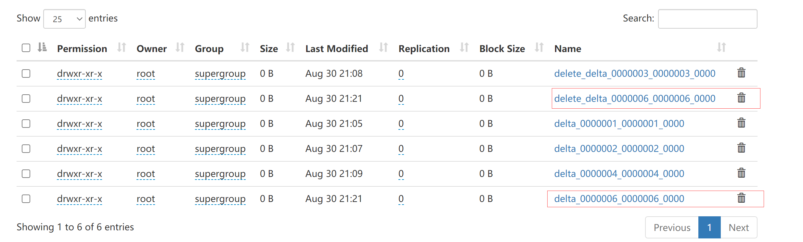
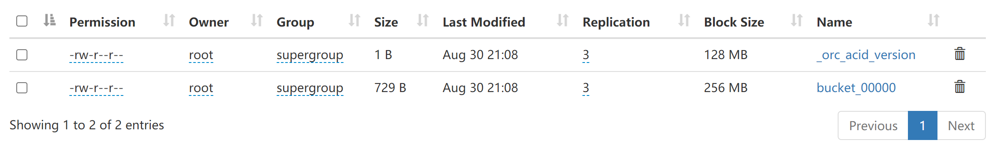
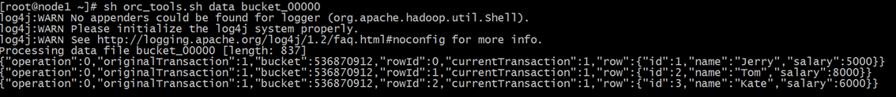
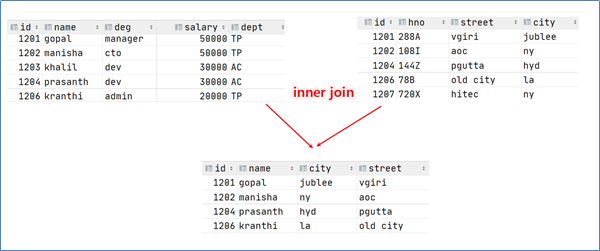
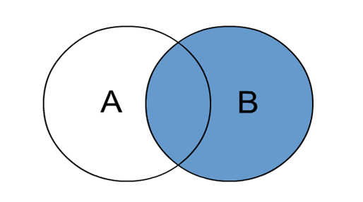
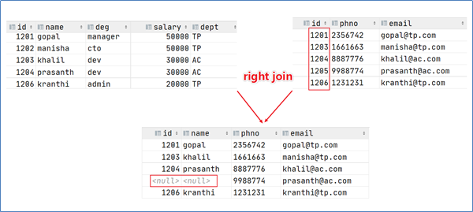
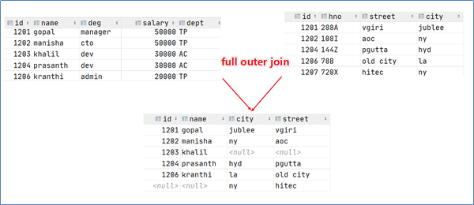
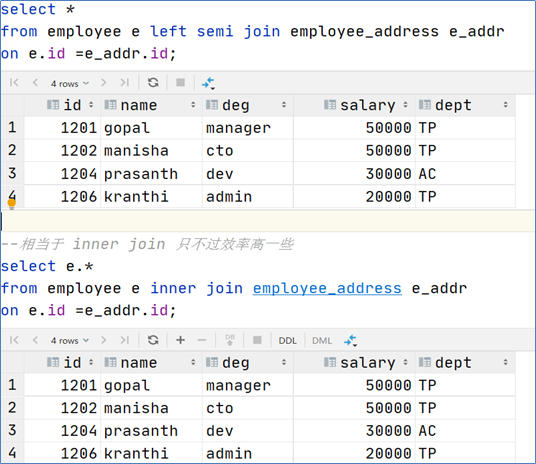

# 1. Hive SQL-DML-Load加载数据

> 所谓加载是指：将数据文件移动到与Hive表对应的位置，移动时是纯复制、移动操作。
>
> 对于local（Hiveserver2所在机器）是复制操作，HDFS中的文件时移动操作。

```sql
------ load语法规则 ----
LOAD DATA [LOCAL] INPATH 'filepath' [OVERWRITE] INTO TABLE tablename [PARTITION (partcol1=val1, partcol2=val2 ...)]

LOAD DATA [LOCAL] INPATH 'filepath' [OVERWRITE] INTO TABLE tablename [PARTITION (partcol1=val1, partcol2=val2 ...)] [INPUTFORMAT 'inputformat' SERDE 'serde'] (3.0 or later)
```

## 1.1 基本操作

>  **对于加载数据的一些基本操作看之前的文章即可。**

其中包含：

* 静态数据加载
* 动态数据加载
* 分区数据加载

!!!
<a style="color: red" href="https://vingkin.nytdoj.com/index.php/archives/370/#menu_index_16" 
target="_blank">Load加载数据基本操作</a>
<br/>
!!!

## 1.2 Hive3.0 新特性

> 这个新特性就是：假设一个一级分区表有两个字段，对于载入的数据又三个字段，那么数据的前两个字段作为表的字段载入表中，数据的最后一个字段作为分区字段进行分区。具体看下面的例子：

**创建一个含有两个字段的表tab1**

```sql
CREATE TABLE if not exists tab1 (col1 int, col2 int)
PARTITIONED BY (col3 int)
row format delimited fields terminated by ',';
```

**有一个数据文件tab1.txt具体内容如下所示：**

```txt
11,22,1
33,44,2
55,66,1
```

**通过load命令向分区表载入数据：**

```sql
LOAD DATA LOCAL INPATH '/root/hivedata/tab1.txt' INTO TABLE tab1;
```

**载入数据后，Hive会根据最后一个字段进行自动分区，在HDFS中的表现形式为：**

```shell
/user/hive/warehouse/vinkgin.db/tab1
									/col3=1/000000_0
									/col3=2/000000_0
```

对于多级分区表来说也是一样的，就以二级分区表为例，应设计好数据文件中的字段，其**字段数为表字段数+2**，数据文件的倒数第二个字段为一级分区，最后一个字段为二级分区。

# 2. Hive SQL-DML-insert插入数据

> Hive执行insert本质上是通过MR程序来实现的，所以如果通过insert来逐条插入(`insert into table1 valules(xx, xx, ...)`)那么在大数据的环境中耗时是十分恐怖的，并不推荐使用。但这并不是说明insert没有用武之地，比如分桶表就需要通过insert+select语句加载数据，通过一个MR程序，一次性加载整个表的所有数据。

```sql
-- 语法规则
INSERT OVERWRITE TABLE tablename1 [PARTITION (partcol1=val1, partcol2=val2 ...) 
[IF NOT EXISTS]] select_statement1 FROM from_statement;

INSERT INTO TABLE tablename1 [PARTITION (partcol1=val1, partcol2=val2 ...)] 
select_statement1 FROM from_statement;
```

## 2.1 基本操作

在下面的案例中，`student_from_insert`表的数据就是通过`student`表中的数据先导出再导入实现的(insert+select)。

**创建一张源表student**

```sql
create table student(num int,name string,sex string,age int,dept string)
row format delimited
fields terminated by ',';
```

**加载student表数据**

```sql
load data local inpath '/root/hivedata/students.txt' into table student;
```

**创建一张目标表student_from_insert**

```sql
create table student_from_insert(sno int,sname string);
```

**从student表中select数据insert到student_from_insert中**

```sql
insert into table student_from_insert
select num,name from student;
```

## 2.2 FROM 多重插入

> 一次扫描，多次插入。目的是减少扫描的次数，在一次扫描中，完成多次insert操作。

案例：通过select上面的student表，通过多重插入进行一次扫描，插入两个表

我通过yarn发现下面的案例依然是执行了两次MR程序

```sql
-- 创建两张新表
create table student_insert1(sno int);
create table student_insert2(sname string);

-- 多重插入  一次扫描 多次插入
from student
insert overwrite table student_insert1
select num
insert overwrite table student_insert2
select name;
```

## 2.3 Dynamic Partition Inserts 动态分区插入

还有一个案例如下：

!!!
<a style="color: red" href="https://vingkin.nytdoj.com/index.php/archives/370/#menu_index_16" 
target="_blank">Load加载数据基本操作</a>
<br/>
!!!

```sql
-----------案例：动态分区插入-----------
-- 1、首先设置动态分区模式为非严格模式 默认已经开启了动态分区功能
set hive.exec.dynamic.partition = true;
set hive.exec.dynamic.partition.mode = nonstrict;

-- 2、当前库下已有一张表student
select * from student;

-- 3、创建分区表 以sdept作为分区字段
create table student_partition(Sno int,Sname string,Sex string,Sage int) partitioned by(Sdept string);

-- 4、执行动态分区插入操作
insert into table student_partition partition(Sdept)
select num,name,sex,age,dept from student;
-- 其中，num,name,sex,age作为表的字段内容插入表中
-- dept作为分区字段值
```

## 2.4 Insert Directory导出数据

>数据导出操作使用的是OVERWRITE操作，谨慎使用

```sql
-- 标准语法:
INSERT OVERWRITE [LOCAL] DIRECTORY directory1
    [ROW FORMAT row_format] [STORED AS file_format] (Note: Only available starting with Hive 0.11.0)
SELECT ... FROM ...

-- Hive extension (multiple inserts):
FROM from_statement
INSERT OVERWRITE [LOCAL] DIRECTORY directory1 select_statement1
[INSERT OVERWRITE [LOCAL] DIRECTORY directory2 select_statement2] ...

-- row_format
: DELIMITED [FIELDS TERMINATED BY char [ESCAPED BY char]] [COLLECTION ITEMS TERMINATED BY char]
[MAP KEYS TERMINATED BY char] [LINES TERMINATED BY char]
```

* 目录可以是完整的URI。如果未指定scheme，则Hive将使用hadoop配置变量fs.default.name来决定导出位置；

* 如果使用LOCAL关键字，则Hive会将数据写入本地文件系统上的目录；

* 写入文件系统的数据被序列化为文本，列之间用\001隔开，行之间用换行符隔开。如果列都不是原始数据类型，那么这些列将序列化为JSON格式。也可以在导出的时候指定分隔符换行符和文件格式。

```sql
-- 1、导出查询结果到HDFS指定目录下
insert overwrite directory '/tmp/hive_export/e1' select num,name,age from student limit 2;

-- 2、导出时指定分隔符和文件存储格式
insert overwrite directory '/tmp/hive_export/e2' row format delimited fields terminated by ','
stored as orc
select * from student;

-- 3、导出数据到本地文件系统指定目录下
insert overwrite local directory '/root/hive_export/e1' select * from student;
```

# 3. Hive Transaction 事务表

Hive事务表的部分知识见下面链接：

!!!
<a style="color: red" href="https://vingkin.nytdoj.com/index.php/archives/370/#menu_index_22" 
target="_blank">事务表基本操作</a>
<br/>
!!!

## 3.1 实现原理

> Hive的文件是存储在HDFS上的，而HDFS上又不支持对文件的任意修改，只能是采取另外的手段来完成

1. 用**HDFS文件作为原始数据**（基础数据），用**delta保存事务操作的记录增量数据**
2. 正在执行中的事务，是以一个staging开头的文件夹维护的，执行结束就是delta文件夹。每次执行一次事务操作都会有这样的一个delta增量文件夹
3. 当访问Hive数据时，根据**HDFS原始文件和delta增量文件做合并**，查询最新的数据

其中：

* INSERT语句会直接创建delta目录
* DELETE目录的前缀是delete_delta
* UPDATE语句采用了split-update特性，即先删除、后插入；

下图中，红框标出的就是一次update操作



### 3.1.1 delta文件详解

* **delta_minWID_maxWID_stmtID**，即delta前缀、写事务的ID范围、以及语句ID；删除时前缀是delete_delta，里面包含了要删除的文件
* Hive会为写事务（INSERT、DELETE等）创建一个写事务ID（Write ID），该ID在表范围内唯一
* 语句ID（Statement ID）则是当一个事务中有多条写入语句时使用的，用作唯一标识。

**每个事务的delta文件夹下，都有两个文件：**

* **_orc_acid_version**的内容是2,即当前ACID版本号是2。和版本1的主要区别是UPDATE语句采用了split-update特性，即先删除、后插入。这个文件不是ORC文件，可以下载下来直接查看。
* **bucket_00000**文件则是写入的数据内容。如果事务表没有分区和分桶，就只有一个这样的文件。文件都以ORC格式存储，底层二级制，需要使用ORC TOOLS查看，详见附件资料。



对于**bucket_00000**文件：

* operation：0 表示插入，1 表示更新，2 表示删除。由于使用了split-update，1是不会出现的，所以delta文件中的operation是0 ， delete_delta 文件中的operation是2
* originalTransaction、currentTransaction：该条记录的原始写事务ID，当前的写事务ID。
* rowId：一个自增的唯一ID，在写事务和分桶的组合中唯一。
* row：具体数据。对于DELETE语句，则为null，对于INSERT就是插入的数据，对于UPDATE就是更新后的数据。



### 3.1.2 合并器

> 合并器Compactor是一套在Hive Metastore内运行，支持ACID系统的后台进程。所有合并都是在后台完成的，不会阻止数据的并发读、写。合并后，系统将等待所有旧文件的读操作完成后，删除旧文件

合并操作分为两种，minor compaction（小合并）、major compaction（大合并）：

* 小合并会将一组delta增量文件重写为单个增量文件，默认触发条件为10个delta文件
* 大合并将一个或多个增量文件和基础文件重写为新的基础文件，默认触发条件为delta文件相应于基础文件占比，10%

## 3.2 Hive 事务表使用设置与局限性

### 3.2.1 局限性

> 好像不用分桶表也可以？

1. 尚不支持BEGIN，COMMIT和ROLLBACK，所有语言操作都是自动提交的；
2. 表文件存储格式仅支持ORC（STORED AS ORC）；
3. 需要配置参数开启事务使用；
4. 外部表无法创建为事务表，因为Hive只能控制元数据，无法管理数据；
5. 表属性参数transactional必须设置为true；
6. 必须将Hive事务管理器设置为org.apache.hadoop.hive.ql.lockmgr.DbTxnManager才能使用ACID表；
7. 事务表不支持LOAD DATA ...语句。

### 3.2.2 参数设置

```sql
-- Client端
set hive.support.concurrency = true; --Hive是否支持并发
set hive.enforce.bucketing = true; --从Hive2.0开始不再需要  是否开启分桶功能
set hive.exec.dynamic.partition.mode = nonstrict; --动态分区模式  非严格
set hive.txn.manager = org.apache.hadoop.hive.ql.lockmgr.DbTxnManager;

-- Server端
set hive.compactor.initiator.on = true; --是否在Metastore实例上运行启动压缩合并
set hive.compactor.worker.threads = 1; --在此metastore实例上运行多少个压缩程序工作线程。
```

## 3.3 使用事务表

```sql
-- 1、开启参数
set hive.support.concurrency = true; --Hive是否支持并发
set hive.enforce.bucketing = true; --从Hive2.0开始不再需要  是否开启分桶功能
set hive.exec.dynamic.partition.mode = nonstrict; --动态分区模式  非严格
set hive.txn.manager = org.apache.hadoop.hive.ql.lockmgr.DbTxnManager; --
set hive.compactor.initiator.on = true; --是否在Metastore实例上运行启动压缩合并
set hive.compactor.worker.threads = 1; --在此metastore实例上运行多少个压缩程序工作线程。

-- 2、创建Hive事务表
create table trans_student(
                              id int,
                              name String,
                              age int
)stored as orc TBLPROPERTIES('transactional'='true');

-- 3、针对事务表进行insert update delete操作
insert into trans_student (id, name, age)
values (1,"vingkin",18);

update trans_student
set age = 20
where id = 1;

delete from trans_student where id =1;
```

# 4. Hive SQL-DML-Update、Delete

> 其实这边就是事务表的相关操作没什么好说的

# 5. Hive SQL-DQL-Select 查询数据

```sql
--------- select语法树 ------------
[WITH CommonTableExpression (, CommonTableExpression)*]
SELECT [ALL | DISTINCT] select_expr, select_expr, ...
  FROM table_reference
  [WHERE where_condition]
  [GROUP BY col_list]
  [ORDER BY col_list]
  [CLUSTER BY col_list
    | [DISTRIBUTE BY col_list] [SORT BY col_list]
  ]
 [LIMIT [offset,] rows];
```

## 5.1 Hive SQL select查询基础语法

### 5.1.1 select expr

```sql
-- 查询所有字段或者指定字段
select * from t_usa_covid19_p;
select county, cases, deaths from t_usa_covid19_p;

-- 查询匹配正则表达式的所有字段
SET hive.support.quoted.identifiers = none; -- 反引号不在解释为其他含义，被解释为正则表达式
select `^c.*` from t_usa_covid19_p;

-- 查询当前数据库
select current_database(); -- 省去from关键字

-- 查询使用函数
select count(county) from t_usa_covid19_p;
```

### 5.1.2 ALL 、DISTINCT

> 默认不写为ALL，DISTINCT删除重复的行，当有多个字段时，多个字段看成一个整体。

```sql
-- 返回所有匹配的行
select state from t_usa_covid19_p;
-- 相当于
select all state from t_usa_covid19_p;
-- 返回所有匹配的行 去除重复的结果
select distinct state from t_usa_covid19_p;
-- 多个字段distinct整体去重
select  county,state from t_usa_covid19_p;
select distinct county,state from t_usa_covid19_p;
select distinct sex from student;
```

### 5.1.3 WHERE

> WHERE后面是一个布尔表达式，用来过滤查询。WHERE后面可以跟着Hive支持的任何表达式和运算符，但是**不能跟着聚合函数**，比如说这个`count()`用来统计查询计数，但是此时的查询结果还不能确定，具有歧义。

### 5.1.4 分区查询

> 针对的是分区表

对分区表进行查询时，会检查WHERE子句或JOIN中的ON子句中是否有分区字段，如果有，就会**仅访问符合条件的分区，裁剪掉没有必要访问的分区**。

### 5.1.5 GROUP BY

>  GROUP BY语句用于结合聚合函数，根据一个或多个列对结果集进行分组

上面引用的意思就是**出现在GROUP BY中select expr中的字段，要么是GROUP BY分组的字段，要么是被聚合函数引用的字段。**

出现上面加粗的限制原因，主要是为了避免一个字段产生多个值的歧义

* 分组字段出现select_expr中，一定没有歧义，因为就是基于该字段分组的，同一组中必相同
* 被聚合函数应用的字段，也没歧义，因为聚合函数的本质就是多进一出，最终返回一个结果

### 5.1.5 HAVING

> 出现HAVING的原因是WHERE关键字无法与聚合函数一起使用

```sql
-- 统计死亡病例数大于10000的州
-- where语句中不能使用聚合函数 语法报错
select state,sum(deaths)
from t_usa_covid19_p where count_date = "2021-01-28" and sum(deaths) >10000 group by state;

-- 先where分组前过滤（此处是分区裁剪），再进行group by分组， 分组后每个分组结果集确定 再使用having过滤
select state,sum(deaths)
from t_usa_covid19_p
where count_date = "2021-01-28"
group by state
having sum(deaths) > 10000;

-- 这样写更好 即在group by的时候聚合函数已经作用得出结果 having直接引用结果过滤 不需要再单独计算一次了
select state,sum(deaths) as cnts
from t_usa_covid19_p
where count_date = "2021-01-28"
group by state
having cnts> 10000;
```

### 5.1.6 HAVING和WHERE的区别

* having是在分组后对数据进行过滤
* where是在分组前对数据进行过滤
* having后面可以使用聚合函数
* where后面不可以使用聚合函数

### 5.1.7 LIMIT

> 显示SELECT返回的行数

* 一个参数n：返回结果集前n条`limit 5`
* 两个参数m,n：第一个参数m表示相对第一行的偏移量，第二个参数n表示返回的行数 `limit 4, 5`

**注意：只有一个参数时相当于`limit 0, n`**

### 5.1.8 执行顺序

> 在查询过程中执行顺序：`from > where > group（含聚合）> having >order > select`

```sql
select state, sum(deaths) as cnts
from t_usa_covid19_p
where count_data = "2021-01-28"
group by state
having cnts > 10000
order by cnts desc;
```

## 5.2 Hive SQL select查询高阶语法

### 5.2.1 ORDER BY

> 和RDMBS中的ORDER BY差不多，**用于全局排序**。
>
> 默认**ASC（升序）**，可以手动指定为**DESC（降序）**

### 5.2.2 CLUSTER BY

> 根据指定字段分组，每组内再根据该字段进行正序排序**（只能正序）**。注意：**分组的个数取决于ReduceTask的个数**，可以通过`set mapreduce.job.reduces=n`来手动设定ReduceTask的个数。

* 分组规则hash散列（分桶表规则一样）：`Hash_Func(col_name) % reducetask`个数
* 分为几组取决于reducetask的个数

比如下面的案例就是先手动设定ReduceTask的个数为2，然后根据num分组，然后进行正序排序。由于只有两个组，所以根据学号，偶数分为一组，奇数分为一组。

```sql
set mapreduce.job.reduces = 2;
select * from student cluster by num;
```

**通过上面的案例可以发现CLUSTER BY的弊端就是只能通过一个字段进行分组且排序，而且只能进行正序排序。**

DISTRIBUTE BY 和 SORT BY就相当于把CLUSTER BY的功能一分为二：

* DISTRIBUTE BY：用于分组
* SORT BY：用于排序
* 分组和排序使用的字段可以不同，而且排序可以指定倒序排序

案例：根据sex进行分组，并且每个分组内再按照age进行倒序排序

```sql
select * from student distribute by sex sort by age desc;
```

### 5.2.3 CLUSTER、DISTRIBUTE、SORT、ORDER BY对比

1. order by全局排序，因此只有一个reducer，结果输出在一个文件中，当输入规模大时，需要较长的计算时间。
2. distribute by根据指定字段将数据分组，算法是hash散列。sort by是在分组之后，每个组内局部排序
3. cluster by既有分组，又有排序，但是两个字段只能是同一个字段

### 5.2.4 UNION联合查询

> 用于将多个SELECT语句的结果合并成一个结果集，**注意每个select语句返回的列的数量和名称必须相同**。
>
> 目前版本的HIVE使用UNION时，默认使用DISTINCT删除重复行，可以使用ALL来指定不删除

```sql
-- 语法规则
select_statement 
UNION [ALL | DISTINCT] 
select_statement 
UNION [ALL | DISTINCT] 
select_statement 
...;
```

如果要将ORDER BY，SORT BY，CLUSTER BY，DISTRIBUTE BY或LIMIT应用于单个SELECT，需要将子句放在括住SELECT的括号内

```sql
SELECT num,name FROM (select num,name from student_local LIMIT 2) subq1
UNION
SELECT num,name FROM (select num,name from student_hdfs LIMIT 3) subq2;
```

如果要将ORDER BY，SORT BY，CLUSTER BY，DISTRIBUTE BY或LIMIT子句应用于整个UNION结果，需要将ORDER BY，SORT BY，CLUSTER BY，DISTRIBUTE BY或LIMIT放在最后一个之后。

```sql
select num,name from student_local
UNION
select num,name from student_hdfs
order by num desc;
```

### 5.2.5 FORM 子句中的子查询

* **必须要给子查询一个名称**，因为FROM子句中的每个表都必须有一个名称。
* 子查询返回结果中的列必须具有唯一的名称。
* 子查询返回结果中的列在外部查询中可用，就像真实表的列一样。
* 子查询也可以是带有UNION的查询表达式。

**可以理解为把FROM语句中查询到的看成一张表，对这张表进行查询**

```sql
-- 子查询
SELECT num
FROM (
         select num,name from student_local
     ) tmp;

-- 包含UNION ALL的子查询的示例
SELECT t3.name
FROM (
         select num,name from student_local
         UNION distinct
         select num,name from student_hdfs
     ) t3;
```

### 5.2.6 WHERE 子句中的子查询

* **不相关子查询：**该子查询不引用父查询中的列，可以将查询结果视为IN和NOT IN语句的常量
* **相关子查询：**子查询引用父查询中的列


**不相关子查询**，相当于IN、NOT IN,子查询只能选择一个列。

* 执行子查询，其结果不被显示，而是传递给外部查询，作为外部查询的条件使用。
* 执行外部查询，并显示整个结果。

```sql
SELECT *
FROM student_hdfs
WHERE student_hdfs.num IN (select num from student_local limit 2);
```

**相关子查询**，指EXISTS和NOT EXISTS子查询

* 子查询的WHERE子句中支持对父查询的引用

```sql
SELECT A
FROM T1
WHERE EXISTS (SELECT B FROM T2 WHERE T1.X = T2.Y);
```

### 5.2.7 Common Table Expressions (CTE)

* 公用表表达式（CTE）是一个**临时结果集**：该结果集是从**WITH子句中指定的简单查询**派生而来的，紧接在SELECT或INSERT关键字之前。
* CTE仅在**单个语句的执行范围内**定义。
* CTE可以在 SELECT，INSERT， CREATE TABLE AS SELECT或CREATE VIEW AS SELECT语句中使用。

**CTE的使用**

```sql
----------------- Common Table Expressions（CTE）-----------------------------------
-- select语句中的CTE
with q1 as (select num, name, age from student where num = 95002)
select *
from q1;

-- from风格
with q1 as (select num, name, age from student where num = 95002)
from q1
select *;

-- chaining CTEs 链式
with q1 as (select * from student where num = 95002),
     q2 as (select num, name, age from q1)
select *
from (select num from q2) a;


-- union
with q1 as (select * from student where num = 95002),
     q2 as (select * from student where num = 95004)
select *
from q1
union all
select *
from q2;

-- 视图，CTAS和插入语句中的CTE
-- insert
create table s1 like student;

with q1 as (select * from student where num = 95002)
from q1
insert overwrite table s1
select *;

-- ctas
create table s2 as
with q1 as (select * from student where num = 95002)
select *
from q1;

-- view
create view v1 as
with q1 as (select * from student where num = 95002)
select *
from q1;
```

# 6. Hive SQL Join连接操作

## 6.1 inner join 内连接

> 只有进行连接的两个表中都存在与连接条件相匹配的数据才会被留下来


```sql
-- 1、inner join
select e.id,e.name,e_a.city,e_a.street
from employee e inner join employee_address e_a
on e.id =e_a.id;

-- 等价于 inner join=join
select e.id,e.name,e_a.city,e_a.street
from employee e join employee_address e_a
on e.id =e_a.id;

-- 等价于 隐式连接表示法
select e.id,e.name,e_a.city,e_a.street
from employee e , employee_address e_a
where e.id =e_a.id;
```



## 6.2 left join 左连接

> 又称为左外连接，join时以左表的全部数据为准，右边与之关联；左表数据全部返回，右表关联上的显示返回，关联不上的显示null返回


```sql
-- 2、left join
select e.id,e.name,e_conn.phno,e_conn.email
from employee e left join employee_connection e_conn
on e.id =e_conn.id;

-- 等价于 left outer join
select e.id,e.name,e_conn.phno,e_conn.email
from employee e left outer join  employee_connection e_conn
on e.id =e_conn.id;
```


## 6.3 right join 右连接

> 又称为右外连接，join时以右表的全部数据为准，左边与之关联；右表数据全部返回，左表关联上的显示返回，关联不上的显示null返回



```sql
-- 3、right join
select e.id,e.name,e_conn.phno,e_conn.email
from employee e right join employee_connection e_conn
on e.id =e_conn.id;

-- 等价于 right outer join
select e.id,e.name,e_conn.phno,e_conn.email
from employee e right outer join employee_connection e_conn
on e.id =e_conn.id;
```



## 6.4 full outer join 全外连接

> 又称为外连接，等价于对这两个数据集合分别进行左外连接和右外连接，然后再使用消去重复行的操作将上述两个结果集合并为一个结果集


```sql
-- 4、full outer join
select e.id,e.name,e_a.city,e_a.street
from employee e full outer join employee_address e_a

on e.id =e_a.id;
-- 等价于
select e.id,e.name,e_a.city,e_a.street
from employee e full join employee_address e_a
on e.id =e_a.id;
```



## 6.5 left semi join 左半开连接

> **左半开连接**（LEFT SEMI JOIN）会返回左边表的记录，前提是其记录对于右边的表满足ON语句中的判定条件。
>
> 从效果上来看有点像inner join之后只返回左表的结果。

```sql
-- 5、left semi join
select *
from employee e left semi join employee_address e_addr
on e.id =e_addr.id;

-- 相当于 inner join,但是只返回左表全部数据， 只不过效率高一些
select e.*
from employee e inner join employee_address e_addr
on e.id =e_addr.id;
```



## 6.6 cross join 交叉连接

> **交叉连接**cross join，将会返回被连接的两个表的笛卡尔积，返回结果的行数等于两个表行数的乘积。对于大表来说，cross join慎用。

对于下面的代码：一般不建议使用方法A和B，因为如果有WHERE子句的话，往往会先生成两个表行数乘积的行的数据表然后才根据WHERE条件从中选择。因此，如果两个需要求交集的表太大，将会非常非常慢，不建议使用。

```sql
-- 下列A、B、C 执行结果相同，但是效率不一样：
-- A:
select a.*,b.* from employee a,employee_address b where a.id=b.id;

-- B:
select * from employee a cross join employee_address b on a.id=b.id;
select * from employee a cross join employee_address b where a.id=b.id;

-- C:
select * from employee a inner join employee_address b on a.id=b.id;
```

### 6.7 Hive Join使用注意事项

1. 允许使用复杂的联接表达式,支持非等值连接
2. 同一查询中可以连接2个以上的表
   ```sql
   SELECT a.val, b.val, c.val FROM a JOIN b ON (a.key = b.key1) JOIN c ON (c.key = b.key2)
   ```
3. 如果每个表在联接子句中使用相同的列，则Hive将多个表上的联接转换为单个MR作业

   ```sql
   SELECT a.val, b.val, c.val FROM a JOIN b ON (a.key = b.key1) JOIN c ON (c.key = b.key1)
   -- 由于联接中仅涉及b的key1列，因此被转换为1个MR作业来执行
   SELECT a.val, b.val, c.val FROM a JOIN b ON (a.key = b.key1) JOIN c ON (c.key = b.key2)
   -- 会转换为两个MR作业，因为在第一个连接条件中使用了b中的key1列，而在第二个连接条件中使用了b中的key2列。
   -- 第一个map / reduce作业将a与b联接在一起，然后将结果与c联接到第二个map / reduce作业中。
   ```
4. join时的最后一个表会通过reducer流式传输，并在其中缓冲之前的其他表，因此，将大表放置在最后有助于减少reducer阶段缓存数据所需要的内存，当然也可以手动指定需要流式传输的表。
   ```sql
   SELECT a.val, b.val, c.val FROM a JOIN b ON (a.key = b.key1) JOIN c ON (c.key = b.key1)
   -- 由于联接中仅涉及b的key1列，因此被转换为1个MR作业来执行，并且表a和b的键的特定值的值被缓冲在reducer的内存中。然后，对于从c中检索的每一行，将使用缓冲的行来计算联接。
   SELECT a.val, b.val, c.val FROM a JOIN b ON (a.key = b.key1) JOIN c ON (c.key = b.key2)
   -- 计算涉及两个MR作业。其中的第一个将a与b连接起来，并缓冲a的值，同时在reducer中流式传输b的值。
   -- 在第二个MR作业中，将缓冲第一个连接的结果，同时将c的值通过reducer流式传输。
   ```
5. 在join的时候，可以通过语法**STREAMTABLE**提示指定要流式传输的表。如果省略STREAMTABLE提示，则Hive将流式传输最右边的表。
   ```sql
   SELECT /*+ STREAMTABLE(a) */ a.val, b.val, c.val FROM a JOIN b ON (a.key = b.key1) JOIN c ON (c.key = b.key1)
   -- a,b,c三个表都在一个MR作业中联接，并且表b和c的键的特定值的值被缓冲在reducer的内存中。
   -- 然后，对于从a中检索到的每一行，将使用缓冲的行来计算联接。如果省略STREAMTABLE提示，则Hive将流式传输最右边的表。
   ```
6. join在WHERE条件之前进行。
7. 如果除一个要连接的表之外的所有表都很小，则可以将其作为仅map作业执行（mapjoin）
   ```sql
   SELECT /*+ MAPJOIN(b) */ a.key, a.value FROM a JOIN b ON a.key = b.key
   -- 不需要reducer。对于A的每个Mapper，B都会被完全读取。限制是不能执行FULL / RIGHT OUTER JOIN b。
   ```