# 1. Hive内置运算符

> 关系运算符、算术运算符、逻辑运算符

```sql
-- 显示所有的函数和运算符
show functions;
-- 查看运算符或者函数的使用说明
describe function +;
-- 使用extended 可以查看更加详细的使用说明
describe function extended count;
```

## 1.1 测试环境准备

> 创建空表dual，用于测试运算符

```sql
-- 1、创建表dual
create table dual
(
    id string
);
-- 2、加载一个文件dual.txt到dual表中
-- dual.txt只有一行内容：内容为一个空格
load data local inpath '/root/hivedata/dual.txt' into table dual;
-- 3、在select查询语句中使用dual表完成运算符、函数功能测试
select 1 + 1 from dual;
```

## 1.2 关系运算符

> 关系运算符返回的都是boolean结果

```sql
---------------- Hive中关系运算符 -------------------------
-- is null空值判断
select 1 from dual
where 'vingkin' is null;

-- is not null 非空值判断
select 1 from dual
where 'vingkin' is not null;

-- like比较： _表示任意单个字符 %表示任意数量字符
-- 否定比较： NOT A like B
select 1 from dual
where 'vingkin' like 'it_';

select 1 from dual
where 'vingkin' like 'it%';

select 1 from dual
where 'vingkin' not like 'hadoo_';

select 1 from dual
where not 'vingkin' like 'hadoo_';

-- rlike：确定字符串是否匹配正则表达式，是REGEXP_LIKE()的同义词。
select 1 from dual
where 'vingkin' rlike '^i.*t$';

select 1 from dual
where '123456' rlike '^\\d+$'; -- 判断是否全为数字

select 1 from dual
where '123456aa' rlike '^\\d+$';

-- regexp：功能与rlike相同 用于判断字符串是否匹配正则表达式
select 1 from dual
where 'vingkin' regexp '^i.*t$';
```

## 1.3 算术运算符

> 算术运算符操作数必须是数值类型。 分为一元运算符和二元运算符：一元运算符,只有一个操作数; 二元运算符有两个操作数,运算符在两个操作数之间。

```sql
-------------------Hive中算术运算符---------------------------------
-- 取整操作: div  给出将A除以B所得的整数部分。例如17 div 3得出5。
select 17 div 3;

-- 取余操作: %  也叫做取模mod  A除以B所得的余数部分
select 17 % 3;

-- 位与操作: &  A和B按位进行与操作的结果。 与表示两个都为1则结果为1
select 4 & 8 from dual; 

select 6 & 4 from dual;

-- 位或操作: |  A和B按位进行或操作的结果  或表示有一个为1则结果为1
select 4 | 8 from dual;

select 6 | 4 from dual;

-- 位异或操作: ^ A和B按位进行异或操作的结果 异或表示两者的值不同,则结果为1
select 4 ^ 8 from dual;

select 6 ^ 4 from dual;
```

## 1.4 逻辑运算符

逻辑是否存在: `[NOT] EXISTS (subquery)`

```sql
-- 3、Hive逻辑运算符
-- 与操作: A AND B   如果A和B均为TRUE，则为TRUE，否则为FALSE。如果A或B为NULL，则为NULL。
select 1 from dual
where 3 > 1 and 2 > 1;

-- 或操作: A OR B   如果A或B或两者均为TRUE，则为TRUE，否则为FALSE。
select 1 from dual
where 3 > 1 or 2 != 2;

-- 非操作: NOT A 、!A   如果A为FALSE，则为TRUE；如果A为NULL，则为NULL。否则为FALSE。
select 1 from dual
where not 2 > 1;

select 1 from dual
where ! 1 = 2;

-- 在:A IN (val1, val2, ...)  如果A等于任何值，则为TRUE。
select 1 from dual
where 11 in (11, 22, 33);

-- 不在:A NOT IN (val1, val2, ...) 如果A不等于任何值，则为TRUE
select 1 from dual
where 11 not in (22, 33, 44);

-- 逻辑是否存在: [NOT] EXISTS (subquery)
-- 将主查询的数据，放到子查询中做条件验证，根据验证结果（TRUE 或 FALSE）来决定主查询的数据结果是否得以保留。
select A.* from A
where exists (select B.id from B where A.id = B.id);
```

# 2. Hive 函数入门

## 2.1 Hive函数概述及分类标准

Hive函数可以分成两大类：

* 内置函数（Built-in Functions）
* 用户定义函数（UDF User-Defined Functions）

其中用户定义可以分成三类：

* UDF（User-Defined-Function）：普通函数，一进一出
* UDAF（User-Defined Aggregation Function）：聚合函数，多进一出
* UDTF（User-Defined Table-Generating Function）：表生成函数，一进多出

**但是由于UDF分类标准扩大化，UDF分类标准可以扩大到Hive的所有函数中：包括内置函数和用户自定义函数。所以现在没有内置函数和用户定义函数之分，所有函数可以分成UDF，UDAF，UDTF三类。**

## 2.2 Hive内置函数

### 2.2.1 字符串函数

| 函数名            | 函数作用               |
| ----------------- | ---------------------- |
| length            | 字符串长度函数         |
| reverse           | 字符串反转函数         |
| concat            | 字符串连接函数         |
| concat_ws         | 带分隔符字符串连接函数 |
| substr，substring | 字符串截取函数         |
| upper，ucase      | 字符串转大写函数       |
| lower，lcase      | 字符串转小写函数       |
| trim              | 去空格函数             |
| ltrim             | 左边去空格函数         |
| rtrim             | 右边去空格函数         |
| regexp_replace    | 正则表达式替换函数     |
| regexp_extract    | 正则表达式解析函数     |
| parse_url         | URL解析函数            |
| get_json_object   | json解析函数           |
| space             | 空格字符串函数         |
| repeat            | 重复字符串函数         |
| ascii             | 首字符ascii函数        |
| lpad              | 左补足函数             |
| rpad              | 右补足函数             |
| split             | 分隔字符串函数         |
| find_in_set       | 集合查找函数           |

```sql
------------ String Functions 字符串函数 ------------
select concat("angela", "baby");
-- 带分隔符字符串连接函数：concat_ws(separator, [string | array(string)]+)
select concat_ws('.', 'www', array('vingkin', 'cn'));

-- 字符串截取函数：substr(str, pos[, len]) 或者  substring(str, pos[, len])
select substr("angelababy", -2); -- pos是从1开始的索引，如果为负数则倒着数
select substr("angelababy", 2, 2);
-- 正则表达式替换函数：regexp_replace(str, regexp, rep)
select regexp_replace('100-200', '(\\d+)', 'num');
-- 正则表达式解析函数：regexp_extract(str, regexp[, idx]) 提取正则匹配到的指定组内容
select regexp_extract('100-200', '(\\d+)-(\\d+)', 2);
-- URL解析函数：parse_url 注意要想一次解析出多个 可以使用parse_url_tuple这个UDTF函数
select parse_url('http://www.vingkin.cn/path/p1.php?query=1', 'HOST');
-- 分割字符串函数: split(str, regex)
select split('apache hive', '\\s+'); -- \\s+表示用来匹配空白符，一个或多个都行

-- json解析函数：get_json_object(json_txt, path)
-- $表示json对象
select get_json_object(
               '[{"website":"www.vingkin.cn","name":"allenwoon"}, {"website":"cloud.vingkin.com","name":"carbondata 中文文档"}]',
               '$.[1].website');


-- 字符串长度函数：length(str | binary)
select length("angelababy");

-- 字符串反转函数：reverse
select reverse("angelababy");

-- 字符串连接函数：concat(str1, str2, ... strN)
-- 字符串转大写函数：upper,ucase
select upper("angelababy");
select ucase("angelababy");

-- 字符串转小写函数：lower,lcase
select lower("ANGELABABY");
select lcase("ANGELABABY");

-- 去空格函数：trim 去除左右两边的空格
select trim(" angelababy ");

-- 左边去空格函数：ltrim
select ltrim(" angelababy ");

-- 右边去空格函数：rtrim
select rtrim(" angelababy ");

-- 空格字符串函数：space(n) 返回指定个数空格
select space(4);

-- 重复字符串函数：repeat(str, n) 重复str字符串n次
select repeat("angela", 2);

-- 首字符ascii函数：ascii
select ascii("angela");-- a对应ASCII 97

-- 左补足函数：lpad
select lpad('hi', 5, '??'); -- ???hi
select lpad('hi', 1, '??'); -- h

-- 右补足函数：rpad
select rpad('hi', 5, '??');

--集合查找函数: find_in_set(str,str_array)
select find_in_set('a', 'abc,b,ab,c,def'); -- 0，表示没找到
```

### 2.2.2 日期函数

| 函数名                 | 函数作用          |
| ---------------------- | ----------------- |
| 获取当前日期           | current_date      |
| 获取当前时间戳         | current_timestamp |
| UNIX时间戳转日期函数   | from_unixtime     |
| 获取当前UNIX时间戳函数 | unix_timestamp    |
| 日期转UNIX时间戳函数   | unix_timestamp    |
| 抽取日期函数           | to_date           |
| 日期转年函数           | year              |
| ...                    | month             |
| ...                    | day               |
| ...                    | hour              |
| ...                    | minute            |
| ...                    | second            |
| 日期转周函数           | weekofyear        |
| 日期比较函数           | datediff          |
| 日期增加函数           | date_add          |
| 日期减少函数           | date_sub          |

```sql
----------- Date Functions 日期函数 -----------------
-- 获取当前日期: current_date
select current_date();

-- 获取当前时间戳: current_timestamp
-- 同一查询中对current_timestamp的所有调用均返回相同的值。
select current_timestamp(); -- 2021-09-06 01:18:22.871000000

-- 获取当前UNIX时间戳函数: unix_timestamp
select unix_timestamp(); -- 1630916306
-- 日期转UNIX时间戳函数: unix_timestamp
select unix_timestamp("2011-12-07 13:01:03");
-- 指定格式日期转UNIX时间戳函数: unix_timestamp
select unix_timestamp('20111207 13:01:03', 'yyyyMMdd HH:mm:ss');

-- UNIX时间戳转日期函数: from_unixtime
select from_unixtime(1618238391);
select from_unixtime(0, 'yyyy-MM-dd HH:mm:ss');

-- 日期比较函数: datediff  日期格式要求'yyyy-MM-dd HH:mm:ss' or 'yyyy-MM-dd'
select datediff('2012-12-08', '2012-05-09');

-- 日期增加函数: date_add
select date_add('2012-02-28', 10);
-- 日期减少函数: date_sub
select date_sub('2012-01-1', 10);

-- 抽取日期函数: to_date
select to_date('2009-07-30 04:17:52');

-- 日期转年函数: year
select year('2009-07-30 04:17:52');
-- 日期转月函数: month
select month('2009-07-30 04:17:52');
-- 日期转天函数: day
select day('2009-07-30 04:17:52');
-- 日期转小时函数: hour
select hour('2009-07-30 04:17:52');
-- 日期转分钟函数: minute
select minute('2009-07-30 04:17:52');
-- 日期转秒函数: second
select second('2009-07-30 04:17:52');
-- 日期转周函数: weekofyear 返回指定日期所示年份第几周
select weekofyear('2009-07-30 04:17:52');
```

### 2.2.3 数学函数

| 函数名 | 函数功能         |
| ------ | ---------------- |
| round  | 四舍五入         |
| round  | 指定精度取整函数 |
| floor  | 向下取整函数     |
| ceil   | 向上取整函数     |
| rand   | 取随机数函数     |
| bin    | 二进制函数       |
| conv   | 进制转换函数     |
| abs    | 绝对值函数       |

```sql
----Mathematical Functions 数学函数-------------
-- 取整函数: round  返回double类型的整数值部分 （遵循四舍五入）
select round(3.1415926);
-- 指定精度取整函数: round(double a, int d) 返回指定精度d的double类型
select round(3.1415926, 4);

-- 向下取整函数: floor
select floor(3.1415926);
select floor(-3.1415926);

-- 向上取整函数: ceil
select ceil(3.1415926);
select ceil(-3.1415926);

-- 取随机数函数: rand 每次执行都不一样 返回一个0到1范围内的随机数
select rand();
-- 指定种子取随机数函数: rand(int seed) 得到一个稳定的随机数序列
select rand(3);

-- 二进制函数:  bin(BIGINT a)
select bin(18);

-- 进制转换函数: conv(BIGINT num, int from_base, int to_base)
select conv(17, 10, 16);

-- 绝对值函数: abs
select abs(-3.9);
```

### 2.2.4 集合函数

| 函数名           | 函数功能                 |
| ---------------- | ------------------------ |
| size()           | 集合元素个数函数         |
| map_keys()       | 取map集合keys函数        |
| map_values()     | 取map集合values函数      |
| array_contains() | 判断数组是否包含指定元素 |
| sort_array()     | 数组排序函数             |

```sql
-------Collection Functions 集合函数--------------
-- 集合元素size函数: size(Map<K.V>) size(Array<T>)
select size(`array`(11, 22, 33));
select size(`map`("id", 10086, "name", "zhangsan", "age", 18));

select `array`(11, 22, 33) from dual;
select `map`("id", 10086, "name", "zhangsan", "age", 18) from dual;

-- 取map集合keys函数: map_keys(Map<K.V>)
select map_keys(`map`("id", 10086, "name", "zhangsan", "age", 18));

-- 取map集合values函数: map_values(Map<K.V>)
select map_values(`map`("id", 10086, "name", "zhangsan", "age", 18));

-- 判断数组是否包含指定元素: array_contains(Array<T>, value)
select array_contains(`array`(11, 22, 33), 11);
select array_contains(`array`(11, 22, 33), 66);

-- 数组排序函数:sort_array(Array<T>)
select sort_array(`array`(12, 2, 32));
```

### 2.2.5 条件函数

| 函数名                                              | 函数功能                           |
| --------------------------------------------------- | ---------------------------------- |
| if()                                                | if条件判断                         |
| isnull()                                            | 空判断函数                         |
| isnotnull()                                         | 非空判断函数                       |
| nvl()                                               | 空值转换函数                       |
| coalesce                                            | 非空查找函数                       |
| case a when b then c [when * then * ... else *] end | 条件转换函数                       |
| nullif(a, b)                                        | a=b返回NULL，否则返回a             |
| assert_true(condition)                              | condition为false报错，否则返回NULL |

使用之前课程创建好的student表数据

```sql
create table student(
    num int,
    name string,
    sex string,
    age int,
    dept string
) row format delimited fields terminated by ',';

load data local inpath '/root/hivedata/students.txt' into table student;
```

```sql
-- if条件判断: if(boolean testCondition, T valueTrue, T valueFalseOrNull)
select if(1 = 2, 100, 200); -- 200
select if(sex = '男', 'M', 'W') 
from student limit 3;

-- 空判断函数: isnull( a )
select isnull("allen");
select isnull(null);

-- 非空判断函数: isnotnull ( a )
select isnotnull("allen");
select isnotnull(null);

-- 空值转换函数: nvl(T value, T default_value)
select nvl("allen", "vingkin");
select nvl(null, "vingkin");

-- 非空查找函数: COALESCE(T v1, T v2, ...)
-- 返回参数中的第一个非空值；如果所有值都为NULL，那么返回NULL
select COALESCE(null, 11, 22, 33);
select COALESCE(null, null, null, 33);
select COALESCE(null, null, null);

-- 条件转换函数: CASE a WHEN b THEN c [WHEN d THEN e]* [ELSE f] END
select case 100 when 50 then 'tom' when 100 then 'mary' else 'tim' end;
select case sex when '男' then 'male' else 'female' end
from student limit 3;

-- nullif( a, b ):
-- 如果a = b，则返回NULL，否则返回第一个
select nullif(11, 11);
select nullif(11, 12);

-- assert_true(condition)
-- 如果'condition'不为真，则引发异常，否则返回null
SELECT assert_true(11 >= 0);
SELECT assert_true(-1 >= 0);
```

### 2.2.6 类型转换函数

> 主要用于显式数据类型转换

```sql
----Type Conversion Functions 类型转换函数-----------------
-- 任意数据类型之间转换:cast
select cast(12.14 as bigint);
select cast(12.14 as string);
select cast("hello" as int);
```

### 2.2.7 数据脱敏函数

```sql
----Data Masking Functions 数据脱敏函数------------
-- mask
-- 将查询回的数据，大写字母转换为X，小写字母转换为x，数字转换为n。
select mask("abc123DEF");
select mask("abc123DEF", '-', '.', '^'); -- 自定义替换的字母

-- mask_first_n(string str[, int n]
-- 对前n个进行脱敏替换
select mask_first_n("abc123DEF", 4);

-- mask_last_n(string str[, int n])
select mask_last_n("abc123DEF", 4);

-- mask_show_first_n(string str[, int n])
-- 除了前n个字符，其余进行掩码处理
select mask_show_first_n("abc123DEF", 4);

-- mask_show_last_n(string str[, int n])
select mask_show_last_n("abc123DEF", 4);

-- mask_hash(string|char|varchar str)
-- 返回字符串的hash编码。
select mask_hash("abc123DEF");
```

### 2.2.8 其他杂项函数

```sql
----- Misc. Functions 其他杂项函数---------------
-- 如果你要调用的java方法所在的jar包不是hive自带的 可以使用add jar添加进来
-- hive调用java方法: java_method(class, method[, arg1[, arg2..]])
select java_method("java.lang.Math", "max", 11, 22);

-- 反射函数: reflect(class, method[, arg1[, arg2..]])
select reflect("java.lang.Math", "max", 11, 22);

-- 取哈希值函数:hash
select hash("allen");

-- current_user()、logged_in_user()、current_database()、version()

-- SHA-1加密: sha1(string/binary)
select sha1("allen");

-- SHA-2家族算法加密：sha2(string/binary, int)  (SHA-224, SHA-256, SHA-384, SHA-512)
select sha2("allen", 224);
select sha2("allen", 512);

-- crc32加密:
select crc32("allen");

-- MD5加密: md5(string/binary)
select md5("allen");
```

## 2.3 案例：UDF实现手机号加密

> 在企业中处理数据的时候，对于敏感数据往往需要进行脱敏处理。比如手机号。我们常见的处理方式是将手机号中间4位进行\*\*\*\*处理。

需求：

1. 能够对输入数据进行非空判断、手机号位数判断
2. 能够实现校验手机号格式，把满足规则的进行\*\*\*\*处理
3. 对于不符合手机号规则的数据直接返回，不处理

实现步骤：

1. 写一个java类，继承UDF，并重载evaluate方法，方法中实现函数的业务逻辑；
2. 重载意味着可以在一个java类中实现多个函数功能；
3. 程序打成jar包，上传HS2服务器本地或者HDFS;
4. 客户端命令行中添加jar包到Hive的classpath： hive>add JAR xxx.jar;
5. 注册成为临时函数（给UDF命名）：`create temporary function encrypt_phonum as 'com.vingkin.hive.udf.PhoneNumberUDF'`;
6. HQL中使用函数:`select encrypt_phonum('13888888888')`

相关依赖：

```xml
<dependencies>
    <dependency>
        <groupId>org.apache.hive</groupId>
        <artifactId>hive-exec</artifactId>
        <version>3.1.2</version>
    </dependency>
    <dependency>
        <groupId>org.apache.hadoop</groupId>
        <artifactId>hadoop-common</artifactId>
        <version>3.1.4</version>
    </dependency>
</dependencies>
<build>
    <plugins>
        <plugin>
            <groupId>org.apache.maven.plugins</groupId>
            <artifactId>maven-shade-plugin</artifactId>
            <version>2.2</version>
            <executions>
                <execution>
                    <phase>package</phase>
                    <goals>
                        <goal>shade</goal>
                    </goals>
                    <configuration>
                        <filters>
                            <filter>
                                <artifact>*:*</artifact>
                                <excludes>
                                    <exclude>META-INF/*.SF</exclude>
                                    <exclude>META-INF/*.DSA</exclude>
                                    <exclude>META-INF/*.RSA</exclude>
                                </excludes>
                            </filter>
                        </filters>
                    </configuration>
                </execution>
            </executions>
        </plugin>
    </plugins>
</build>
```

业务代码：PhoneNumberUDF.java

```java
public class PhoneNumberUDF extends UDF {
    public String evaluate(String phoNum) {
        String encryptPhoNum = null;
        if (StringUtils.isNotEmpty(phoNum) && phoNum.trim().length() == 11) {
            String regex = "^(1[3-9]\\d{9}$)";
            Pattern p = Pattern.compile(regex);
            Matcher m = p.matcher(phoNum);
            if (m.matches()) {
                encryptPhoNum = phoNum.trim().replaceAll("(\\d{3})\\d{4}(\\d{4})", "$1****$2");
            } else {
                encryptPhoNum = phoNum;
            }
        } else {
            encryptPhoNum = phoNum;
        }
        return encryptPhoNum;
    }
    // public static void main(String[] args) {
    //     System.out.println(new PhoneNumberUDF().evaluate("13888888888"));
    // }
}
```

# 3. Hive 函数高阶

## 3.1 UDTF之explode函数

> explode接收map、array类型的数据作为输入，然后把输入数据中的每个元素拆开变成一行数据，一个元素一行。
>
> 对于map每行有两列分别为key，value

### 3.1.1 示例

```sql
select explode(`array`(11,22,33)) as item;
select explode(`map`("id",10086,"name","zhangsan","age",18));
```

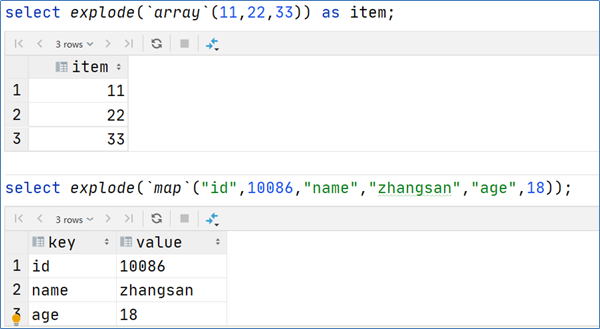

### 3.1.2 案例：NBA总冠军球队名单分析

> 有一份数据The_NBA_Championship.txt，关于部分年份的NBA总冠军球队名单；第一个字段表示球队名称，第二个字段是获取总冠军的年份；字段之间以，分割；总冠军年份之间以|进行分割。

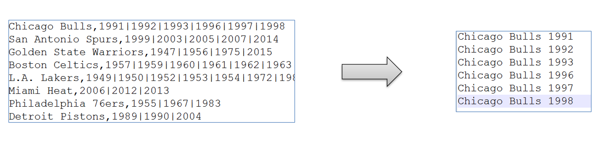

**建表加载数据：**

```sql
-- step1:建表
create table the_nba_championship(
           team_name string,
           champion_year array<string>
) row format delimited
fields terminated by ','
collection items terminated by '|';

-- step2:加载数据文件到表中
load data local inpath '/root/hivedata/The_NBA_Championship.txt' into table the_nba_championship;
```

**错误的演示：**

```sql
select team_name,explode(champion_year) from the_nba_championship;
```

1. explode函数属于UDTF表生成函数，explode执行返回的结果可以理解为一张虚拟的表，其数据来源于源表；
2. 在select中只查询源表数据没有问题，只查询explode生成的虚拟表数据也没问题，但是不能在只查询源表的时候，既想返回源表字段又想返回explode生成的虚拟表字段；通俗点讲，有两张表，不能只查询一张表但是又想返回分别属于两张表的字段；

**解决方法：**

1. 从SQL层面上来说上述问题的解决方案是：对两张表进行join关联查询;
2. Hive专门提供了语法`lateral View`侧视图，专门用于搭配explode这样的UDTF函数，以满足上述需要。

```sql
select a.team_name,b.year
from the_nba_championship a lateral view explode(champion_year) b as year
order by b.year desc;
```


### 3.1.3 **Hive Lateral View** 侧视图

> Lateral View是一种特殊的语法，主要搭配UDTF类型函数一起使用，用于解决UDTF函数的一些查询限制的问题。
>
> 一般只要使用UDTF，就会固定搭配lateral view使用。


针对explode案例中NBA冠军球队年份排名案例，使用explode函数+lateral view侧视图

```sql
-- 根据年份倒序排序
select a.team_name ,b.year
from the_nba_championship a lateral view explode(champion_year) b as year
order by b.year desc;
```

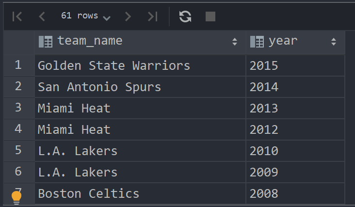

```sql
-- 统计每个球队获取总冠军的次数 并且根据倒序排序
select a.team_name ,count(*) as nums
from the_nba_championship a lateral view explode(champion_year) b as year
group by a.team_name
order by nums desc;
```

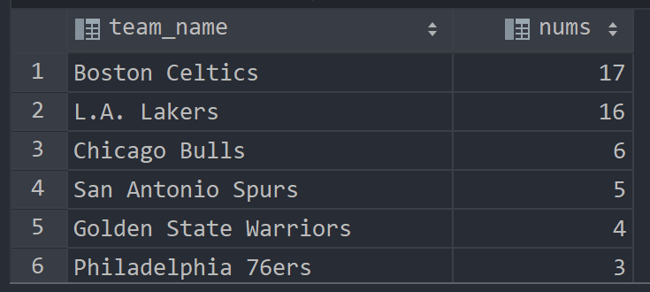

## 3.2 UDAF之聚合函数

### 3.2.1 基础聚合

student

```sql
create table student
(
    num  int,
    name string,
    sex  string,
    age  int,
    dept string
)
    row format delimited
        fields terminated by ',';
-- 加载数据
load data local inpath '/root/hivedata/students.txt' into table student;
```

```sql
-- 场景1：没有group by子句的聚合操作
-- count(*)：所有行进行统计，包括NULL行
-- count(1)：所有行进行统计，包括NULL行
-- count(column)：对column中非Null进行统计
select count(*) as cnt1, count(1) as cnt2 from student;

select count(sex) as cnt3 from student;

-- 场景2：带有group by子句的聚合操作 注意group by语法限制
select sex, count(*) as cnt from student
group by sex;

-- 场景3：select时多个聚合函数一起使用
select count(*) as cnt1, avg(age) as cnt2 from student;

-- 场景4：聚合函数和case when条件转换函数、coalesce函数、if函数使用
select sum(CASE WHEN sex = '男' THEN 1 ELSE 0 END) from student;
select sum(if(sex = '男', 1, 0)) from student;

-- 场景5：聚合参数不支持嵌套聚合函数
select avg(count(*)) from student; -- 报错

-- 场景6：聚合操作时针对null的处理
CREATE TABLE tmp_1(val1 int, val2 int);
INSERT INTO TABLE tmp_1
VALUES (1, 2),(null, 2),(2, 3);

-- 第二行数据(NULL, 2) 在进行sum(val1 + val2)的时候会被忽略
select sum(val1), sum(val1 + val2) from tmp_1;

-- 可以使用coalesce函数解决（返回第一个不为空的值）
select sum(coalesce(val1, 0)),
       sum(coalesce(val1, 0) + val2)
from tmp_1;

-- 场景7：配合distinct关键字去重聚合
-- 此场景下，会编译期间会自动设置只启动一个reduce task处理数据  可能造成数据拥堵
select count(distinct sex) as cnt1 from student;
-- 可以先去重 在聚合 通过子查询完成
-- 因为先执行distinct的时候 可以使用多个reducetask来跑数据
select count(*) as gender_uni_cnt
from (select distinct sex from student) a;

-- 案例需求：找出student中男女学生年龄最大的及其名字
-- 这里使用了struct来构造数据 然后针对struct应用max找出最大元素 然后取值
select case sex when '男' then '男' when '女' then '女' else '其他' end,
       max(struct(age, name)).col1 as age,
       max(struct(age, name)).col2 as name
from student
where sex != '\N'
group by sex
order by age desc;

select struct(age, name) from student; -- {"col1":20,"col2":"李勇"}...
select struct(age, name).col1 from student; -- 所有年龄

select max(struct(age, name)) from student; -- 最大年龄
```

### 3.2.2 增强聚合

* grouping_sets：一种将多个group by逻辑写在一个sql语句中的便利写法。等价于将不同维度的GROUP BY结果集进行UNION ALL。GROUPING__ID表示结果属于哪一个分组集合。
* cube：根据GROUP BY的维度的所有组合进行聚合。比如cube有a,b,c 3个维度，则所有组合情况是： (a,b,c),(a,b),(b,c),(a,c),(a),(b),(c),()，总个数是$2^n$
* rollup：rollup是cube的子集，以最左侧的维度为主，从该维度进行层级聚合。比如ROLLUP有a,b,c3个维度，则所有组合情况是：(a,b,c),(a,b),(a),()

cookie_info

```sql
CREATE TABLE cookie_info
(
    month    STRING, -- 2018-03
    day      STRING, -- 2018-03-30
    cookieid STRING  -- cookie1...
) ROW FORMAT DELIMITED
    FIELDS TERMINATED BY ',';

load data local inpath '/root/hivedata/cookie_info.txt' into table cookie_info;
```
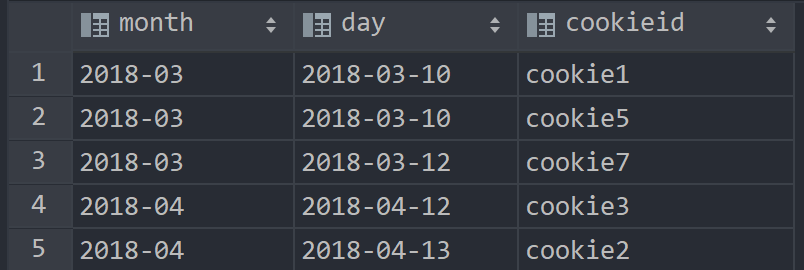

#### grouping_sets

对于grouping__id，原则上是通过将group by中的字段倒序排序，然后通过二进制来表示的

比如说下面的month，day，倒序排序后为（day，month），出现的位置置1

但是我运行出来的grouping__id与理论上有点出入，具体问题还不知道

| 字段         | 二进制表示 | 十进制表示 |
| ------------ | ---------- | ---------- |
| month        | (0, 1)     | 1          |
| day          | (1, 0)     | 2          |
| (month, day) | (1, 1)     | 3          |

```sql
SELECT month,
       day,
       COUNT(DISTINCT cookieid) AS nums,
       GROUPING__ID
FROM cookie_info
GROUP BY month, day
    GROUPING SETS (month, day) -- 这里是关键
ORDER BY GROUPING__ID;

-- 等价于
select month, NULL as day, count(distinct cookieid) as nums, 1 as grouping__id
from cookie_info group by month
union all
select NULL as month, day, count(distinct cookieid) as nums, 2 as grouping__id
from cookie_info group by day;
```

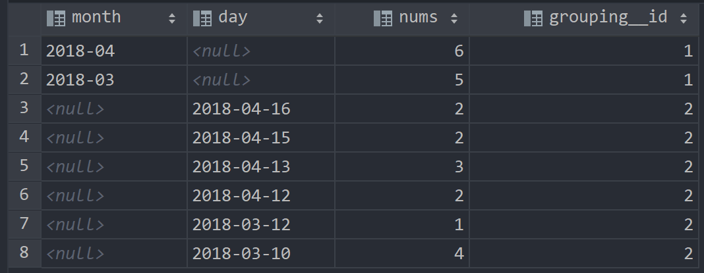

对于有(month, day)的情况，如下，grouping__id与理论情况有点出入

```sql
SELECT month, day,
       COUNT(DISTINCT cookieid) AS nums,
       grouping__id
FROM cookie_info
GROUP BY month, day
    GROUPING SETS ( month, day, ( month, day)) -- 1 month   2 day    3 (month,day)
ORDER BY grouping__id;

-- 等价于
SELECT month, NULL, COUNT(DISTINCT cookieid) AS nums, 1 AS GROUPING__ID
FROM cookie_info GROUP BY month
UNION ALL
SELECT NULL, day, COUNT(DISTINCT cookieid) AS nums, 2 AS GROUPING__ID
FROM cookie_info GROUP BY day
UNION ALL
SELECT month, day, COUNT(DISTINCT cookieid) AS nums, 3 AS GROUPING__ID
FROM cookie_info GROUP BY month, day;
```

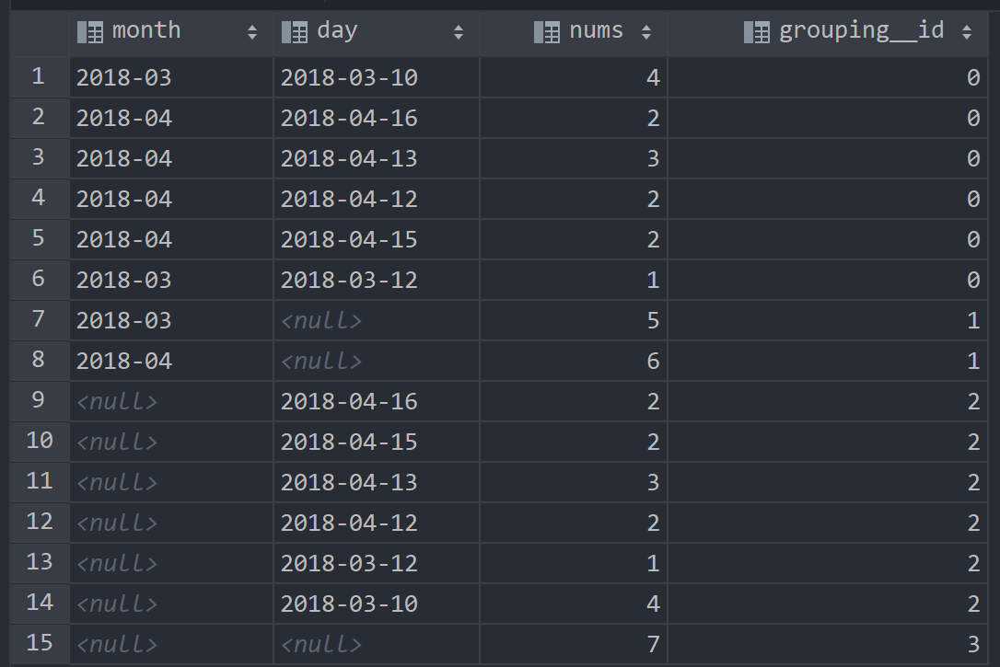

#### cube

cube下，grouping__id依然有出入

```sql
SELECT month,
       day,
       COUNT(DISTINCT cookieid) AS nums,
       GROUPING__ID
FROM cookie_info
GROUP BY month, day
WITH CUBE
ORDER BY GROUPING__ID;

-- 等价于
SELECT NULL, NULL, COUNT(DISTINCT cookieid) AS nums, 0 AS GROUPING__ID
FROM cookie_info
UNION ALL
SELECT month, NULL, COUNT(DISTINCT cookieid) AS nums, 1 AS GROUPING__ID
FROM cookie_info GROUP BY month
UNION ALL
SELECT NULL, day, COUNT(DISTINCT cookieid) AS nums, 2 AS GROUPING__ID
FROM cookie_info GROUP BY day
UNION ALL
SELECT month, day, COUNT(DISTINCT cookieid) AS nums, 3 AS GROUPING__ID
FROM cookie_info GROUP BY month, day;
```

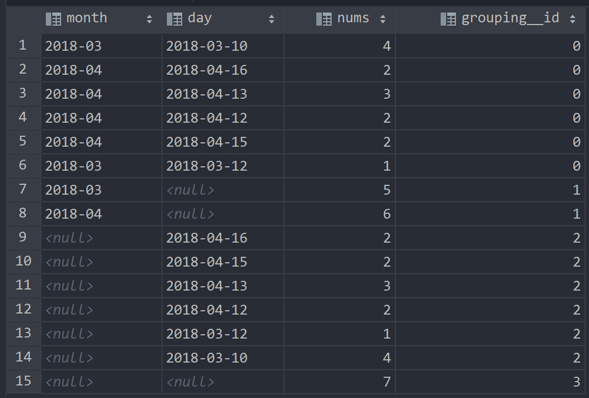

#### rollup

```sql
-- 比如，以month维度进行层级聚合：
SELECT month,
       day,
       COUNT(DISTINCT cookieid) AS nums,
       GROUPING__ID
FROM cookie_info
GROUP BY month, day
WITH ROLLUP
ORDER BY GROUPING__ID;
```

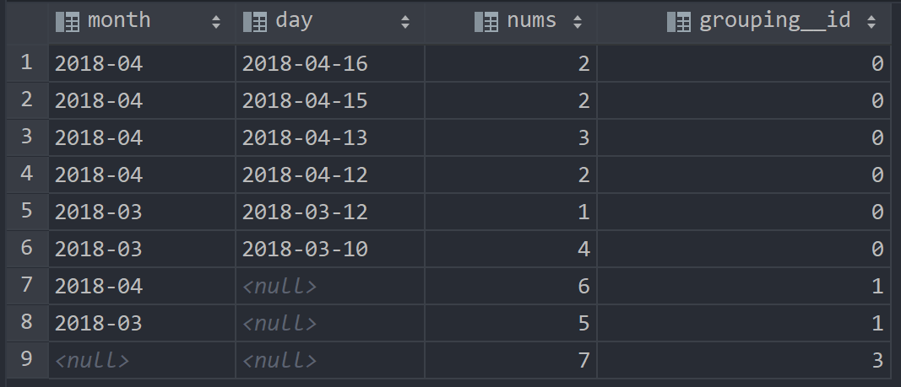

```sql
-- 把month和day调换顺序，则以day维度进行层级聚合：
SELECT day,
       month,
       COUNT(DISTINCT cookieid) AS uv,
       GROUPING__ID
FROM cookie_info
GROUP BY day, month
WITH ROLLUP
ORDER BY GROUPING__ID;
```

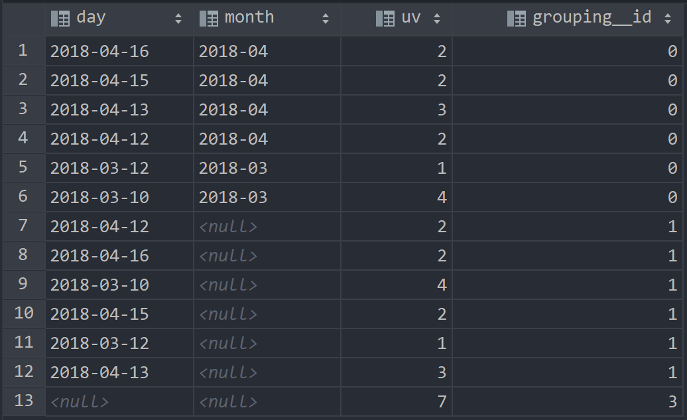

## 3.3 窗口函数

> **窗口函数**（Window functions）也叫做开窗函数、OLAP函数，其最大特点是：输入值是从SELECT语句的结果集中的一行或多行的“窗口”中获取的。
>
> 如果函数具有`OVER`子句，则它是窗口函数。
>
> 窗口函数可以简单地解释为类似于聚合函数的计算函数，但是通过GROUP BY子句组合的常规聚合会隐藏正在聚合的各个行，最终输出一行，窗口函数聚合后还可以访问当中的各个行，并且可以将这些行中的某些属性添加到结果集中。

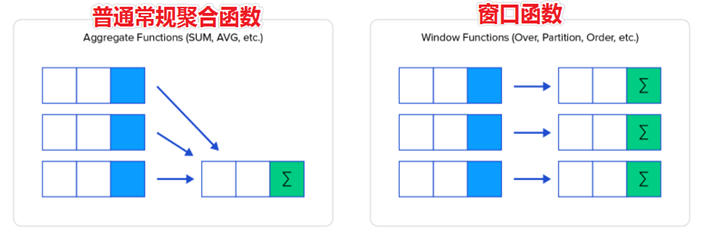

### 3.3.1 示例

**表数据：**

```sql
--建表加载数据
CREATE TABLE employee
(
    id     int,
    name   string,
    deg    string,
    salary int,
    dept   string
) row format delimited
    fields terminated by ',';

load data local inpath '/root/hivedata/employee.txt' into table employee;
```

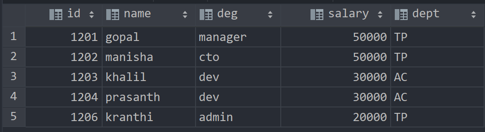

**普通聚合：**

```sql
----sum+group by普通常规聚合操作------------
select dept, sum(salary) as total from employee
group by dept;
```

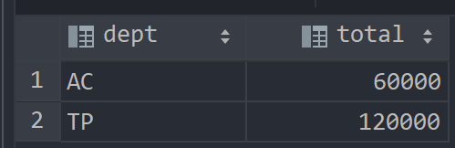

**窗口函数聚合：**

```sql
select id, name, deg, salary, dept, sum(salary) over (partition by dept) as total
from employee;
```

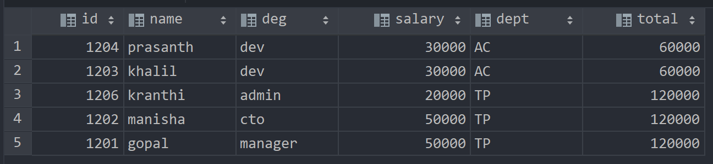

### 3.3.2 语法树

```sql
------- 窗口函数语法树 --------
Function(arg1,..., argn) OVER ([PARTITION BY <...>] [ORDER BY <....>]
                               [<window_expression>])

-- 其中Function(arg1,..., argn) 可以是下面分类中的任意一个
    -- 聚合函数：比如sum max avg等
    -- 排序函数：比如rank row_number等
    -- 分析函数：比如lead lag first_value等

-- OVER [PARTITION BY <...>] 类似于group by 用于指定分组  每个分组你可以把它叫做窗口
-- 如果没有PARTITION BY 那么整张表的所有行就是一组

-- [ORDER BY <....>]  用于指定每个分组内的数据排序规则 支持ASC、DESC

-- [<window_expression>] 窗口表达式，用于指定每个窗口中 操作的数据范围 默认是窗口中所有行
```

### 3.3.3 后续数据准备

```sql
create table website_pv_info
(
    cookieid   string, -- cookie1 / cookie2
    createtime string, -- 2018-04-14 ...
    pv         int -- 2 浏览量
) row format delimited
    fields terminated by ',';

create table website_url_info
(
    cookieid   string, -- cookie1 / cookie2
    createtime string, -- 访问时间 2018-04-10 10:00:02
    url        string  -- 访问页面 url1 / url2 ....
) row format delimited
    fields terminated by ',';


load data local inpath '/root/hivedata/website_pv_info.txt' into table website_pv_info;
load data local inpath '/root/hivedata/website_url_info.txt' into table website_url_info;
```

### 3.3.4 窗口聚合函数

> 所谓窗口聚合函数指的是sum、max、min、avg这样的聚合函数在窗口中的使用

对于sum+窗口函数，总共有四种用法

* sum(...) over( )对表所有行求和
* sum(...) over( order by ... ) 连续累积求和
* sum(...) over( partition by... ) 同组内所行求和
* sum(...) over( partition by... order by ... ) 在每个分组内，连续累积求和

需求：求出每个用户的pv数

```sql
select cookieid, sum(pv) as total_pv from website_pv_info
group by cookieid;
```

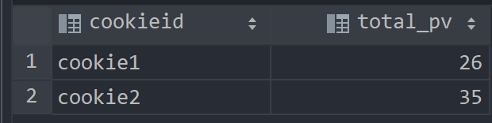

需求：求出网站总的pv数 所有用户所有访问加起来

```sql
select cookieid,
       createtime,
       pv,
       sum(pv) over () as total_pv -- 所有行求和
from website_pv_info;
```

需求：求出每个用户总pv数

```sql
select cookieid,
       createtime,
       pv,
       sum(pv) over (partition by cookieid) as total_pv -- 同一组所有行求和
from website_pv_info;
```

需求：求出每个用户截止到当天，累计的总pv

```sql
select cookieid,
       createtime,
       pv,
       -- 同一组内累计求和
       sum(pv) over (partition by cookieid order by createtime) as current_total_pv
from website_pv_info;
```

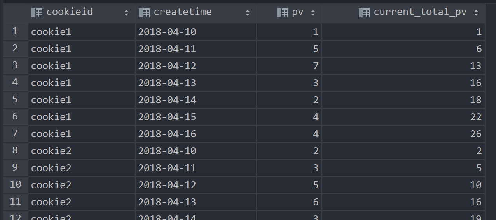

### 3.3.5 窗口表达式

> 在sum(...) over( partition by... order by ... )语法完整的情况下，进行累积聚合操作，默认累积聚合行为是：从第一行聚合到当前行。
>
> Window expression窗口表达式给我们提供了一种**控制行范围的能力**，比如向前2行，向后3行。
>
> **其实就是前缀和**

关键字：`row between`

* preceding：往前
* following：往后
* current row：当前行
* unbounded：边界
* unbounded preceding 表示从前面的起点
* unbounded following：表示到后面的终点

需求：第一行到当前行，写不写都一样

```sql
select cookieid,
       createtime,
       pv,
       sum(pv) over (partition by cookieid order by createtime rows between unbounded preceding and current row) as pv2
from website_pv_info;
```

需求：向前三行至当前行

```sql
select cookieid,
       createtime,
       pv,
       sum(pv) over (partition by cookieid order by createtime rows between 3 preceding and current row) as pv4
from website_pv_info;
```

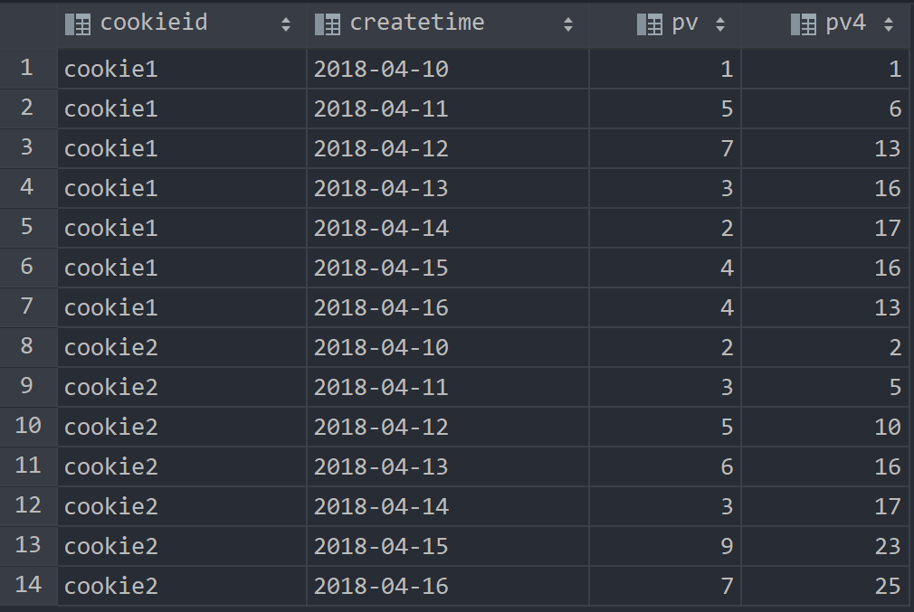

### 3.3.6 窗口排序函数（TOPN / $\frac{n}{m}$）

#### row_number家族(TOPN)

* **row_number**：在每个分组中，为每行分配一个从1开始的唯一序列号，递增，不考虑重复；(1,2,3,4,5,6,7)
* **rank**: 在每个分组中，为每行分配一个从1开始的序列号，考虑重复，挤占后续位置；(1,2,3,3,5,6,7)
* **dense_rank**: 在每个分组中，为每行分配一个从1开始的序列号，考虑重复，不挤占后续位置；(1,2,3,3,4,5,6)

```sql
SELECT cookieid,
       createtime,
       pv,
       RANK() OVER (PARTITION BY cookieid ORDER BY pv desc)       AS rn1,
       DENSE_RANK() OVER (PARTITION BY cookieid ORDER BY pv desc) AS rn2,
       ROW_NUMBER() OVER (PARTITION BY cookieid ORDER BY pv DESC) AS rn3
FROM website_pv_info
WHERE cookieid = 'cookie1';
```

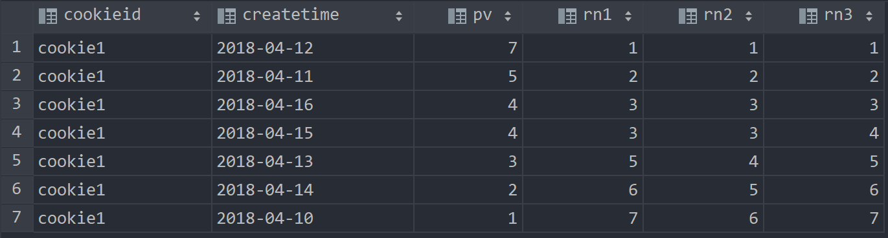

需求：找出每个用户访问pv的最多的Top3，重复并列的不考虑

```sql
SELECT *
from (SELECT cookieid,
             createtime,
             pv,
             ROW_NUMBER() OVER (PARTITION BY cookieid ORDER BY pv DESC) AS seq
      FROM website_pv_info) as tmp
where tmp.seq < 4;
```

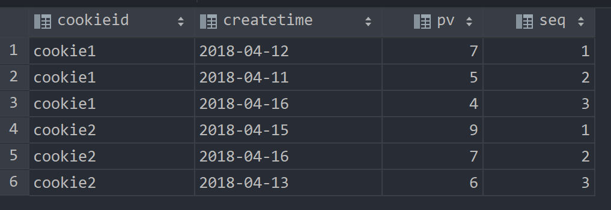

#### ntile($ \frac{n}{m}$)

> **将每个分组内的数据分为指定的若干个桶里**（分为若干个部分），并且为每一个桶分配一个桶编号。
>
> 如果不能平均分配，则优先分配较小编号的桶，并且各个桶中能放的行数最多相差1。
>
> 有时会有这样的需求:如果数据排序后分为三部分，业务人员只关心其中的一部分，如何将这中间的三分之一数据拿出来呢?NTILE函数即可以满足。

```sql
-- 把每个分组内的数据分为3桶
SELECT cookieid,
       createtime,
       pv,
       NTILE(3) OVER (PARTITION BY cookieid ORDER BY createtime) AS rn2
FROM website_pv_info
ORDER BY cookieid, createtime;
```

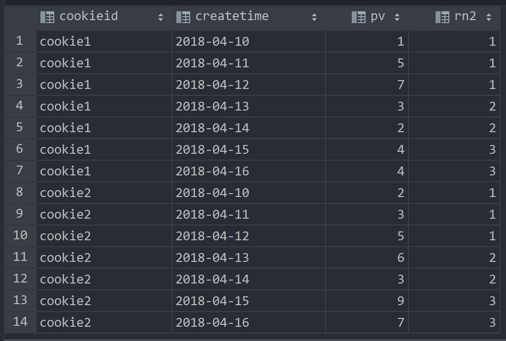

需求：统计每个用户pv最多的前1/3天

```sql
-- 理解：将数据根据cookieid分 根据pv倒序排序 排序之后分为3个部分 取第一部分
SELECT *
from (SELECT cookieid,
             createtime,
             pv,
             NTILE(3) OVER (PARTITION BY cookieid ORDER BY pv DESC) AS rn
      FROM website_pv_info) tmp
where rn = 1;
```

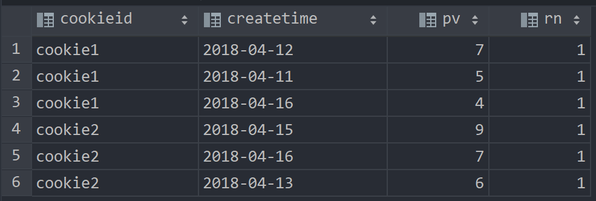

### 3.3.7 窗口分析函数

* **LAG**(col,n,DEFAULT) 用于统计窗口内往上第n行值。第一个参数为列名，第二个参数为往上第n行（可选，默认为1），第三个参数为默认值（当往上第n行为NULL时候，取默认值，如不指定，则为NULL）；
* **LEAD**(col,n,DEFAULT) 用于统计窗口内往下第n行值。第一个参数为列名，第二个参数为往下第n行（可选，默认为1），第三个参数为默认值（当往下第n行为NULL时候，取默认值，如不指定，则为NULL）；
* **FIRST_VALUE** 取分组内排序后，截止到当前行，第一个值
* **LAST_VALUE** 取分组内排序后，截止到当前行，最后一个值

LAG

```sql
-- LAG
SELECT cookieid,
       createtime,
       url,
       ROW_NUMBER() OVER (PARTITION BY cookieid ORDER BY createtime)                              AS rn,
       LAG(createtime, 1, '1970-01-01 00:00:00') OVER (PARTITION BY cookieid ORDER BY createtime) AS last_1_time,
       LAG(createtime, 2) OVER (PARTITION BY cookieid ORDER BY createtime)                        AS last_2_time
FROM website_url_info;
```

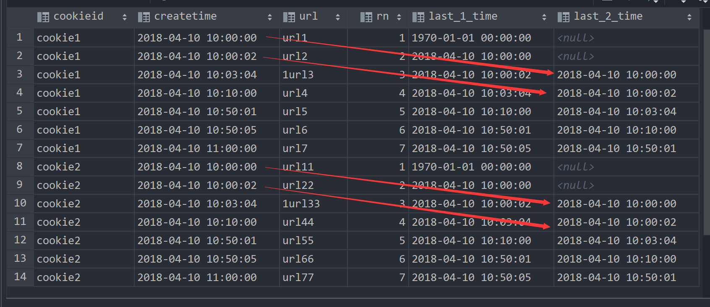

LEAD

```sql
-- LEAD
SELECT cookieid,
       createtime,
       url,
       ROW_NUMBER() OVER (PARTITION BY cookieid ORDER BY createtime)                               AS rn,
       LEAD(createtime, 1, '1970-01-01 00:00:00') OVER (PARTITION BY cookieid ORDER BY createtime) AS next_1_time,
       LEAD(createtime, 2) OVER (PARTITION BY cookieid ORDER BY createtime)                        AS next_2_time
FROM website_url_info;
```

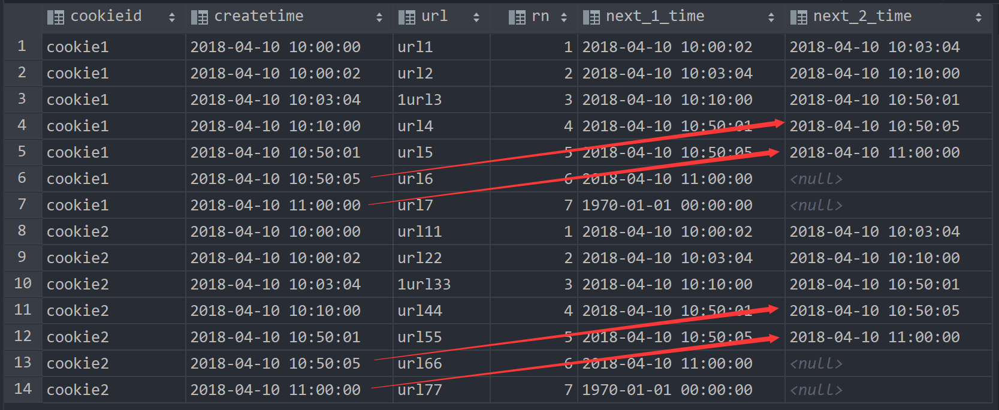

FIRST_VALUE

```sql
-- FIRST_VALUE
SELECT cookieid,
       createtime,
       url,
       ROW_NUMBER() OVER (PARTITION BY cookieid ORDER BY createtime)     AS rn,
       FIRST_VALUE(url) OVER (PARTITION BY cookieid ORDER BY createtime) AS first1
FROM website_url_info;
```

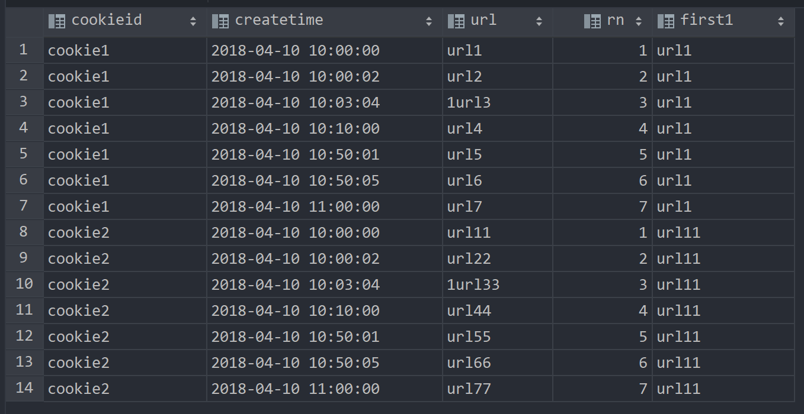

LAST_VALUE，到当前最后一个值其实就是自己

```sql
-- LAST_VALUE
SELECT cookieid,
       createtime,
       url,
       ROW_NUMBER() OVER (PARTITION BY cookieid ORDER BY createtime)    AS rn,
       LAST_VALUE(url) OVER (PARTITION BY cookieid ORDER BY createtime) AS last1
FROM website_url_info;
```

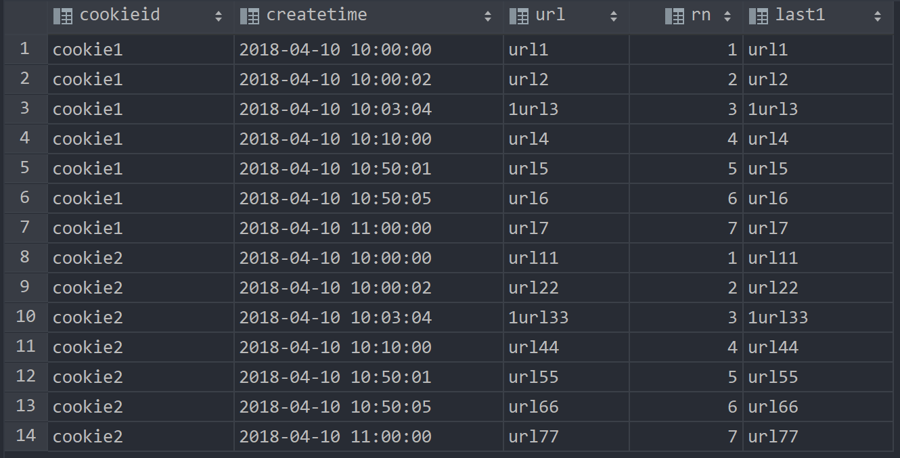

## 3.4 抽样函数

### 3.4.1 随机抽样

需求：随机抽取2个学生的情况进行查看

```sql
SELECT * FROM student
DISTRIBUTE BY rand() SORT BY rand()
LIMIT 2;

-- 使用order by+rand也可以实现同样的效果 但是效率不高
SELECT * FROM student
ORDER BY rand() LIMIT 2;
```

### 3.4.2 基于数据块抽样

> 意思就是随机一个数据块进行抽样，当只有一个数据块时，每次结果都一样

* Block块采样允许随机获取n行数据、百分比数据或指定大小的数据。
* 采样粒度是HDFS块大小
* 优点是速度快，缺点是不随机

```sql
-- 根据行数抽样（获得随机数据块的第一行数据）
SELECT * FROM student TABLESAMPLE (1 ROWS);

-- 根据数据大小百分比抽样（获得随机数据块的前50%数据）
SELECT * FROM student TABLESAMPLE (50 PERCENT);

-- 根据数据大小抽样（获得随机数据块的前1K数据）
-- 支持数据单位 b/B, k/K, m/M, g/G
SELECT * FROM student TABLESAMPLE (1K);
```

### 3.4.3 基于分桶表抽样

> 这是一种特殊的采样方法，针对分桶表进行了优化。优点是既随机速度也很快。

语法如下：

```sql
TABLESAMPLE (BUCKET x OUT OF y [ON colname])

-- 1、y必须是table总bucket数的倍数或者因子。hive根据y的大小，决定抽样的比例。
-- 例如，table总共分了4份（4个bucket），当y=2时，抽取(4/2=)2个bucket的数据，当y=8时，抽取(4/8=)1/2个bucket的数据。
-- 2、x表示从哪个bucket开始抽取。
-- 例如，table总bucket数为4，tablesample(bucket 4 out of 4)，表示总共抽取（4/4=）1个bucket的数据，抽取第4个bucket的数据。
-- 注意：x的值必须小于等于y的值，否则FAILED:Numerator should not be bigger than denominator in sample clause for table stu_buck
-- 3、ON colname表示基于什么抽
-- ON rand()表示随机抽
-- ON 分桶字段 表示基于分桶字段抽样 效率更高 推荐
```

```sql
-- 根据整行数据进行抽样
SELECT *
FROM t_usa_covid19_bucket TABLESAMPLE (BUCKET 1 OUT OF 5 ON rand());
```

```sql
-- 根据分桶字段进行抽样 效率更高（对于该案例就是抽取第一桶的数据）
SELECT *
FROM t_usa_covid19_bucket TABLESAMPLE (BUCKET 1 OUT OF 5 ON state);
```

