# 1. Hive中多字节分隔符处理

> Hive默认序列化类是`LazySimpleSerDe`，其**只支持使用单字节分隔符（char）**来加载文本数据，所以遇到**多字符**或者**数据字段中包含了分隔符**，那么`LazySimpleSerDe`就不再适用了。

## 1.1 问题和需求

比如下面的两种情况：

**多字符分隔符：**

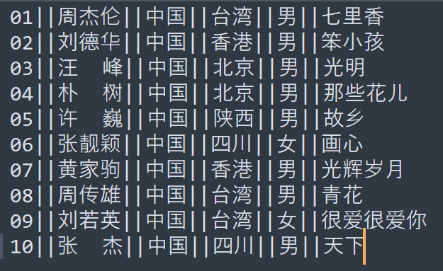

**数据字段中包含了分隔符：**

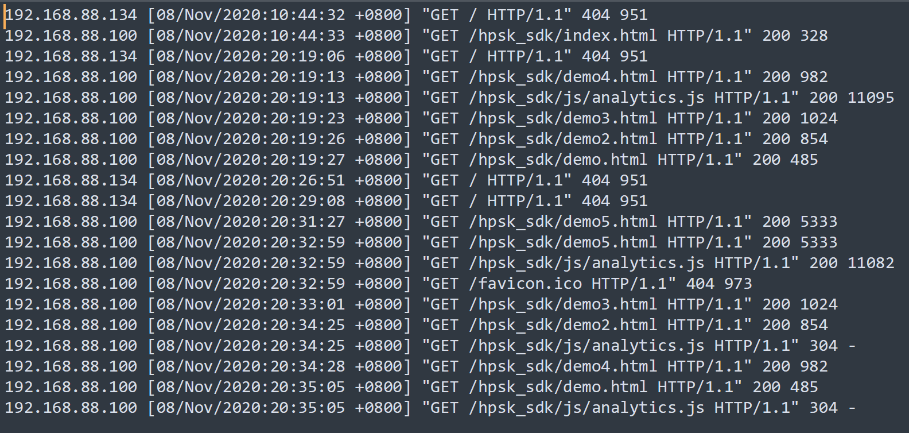

这个时候就需要提出新的解决方案了

## 1.2 解决方案一：替换分隔符

> 当数据量小的时候，可以写个Java程序来清洗数据即可。当数据量大的时候就需要使用MapReduce的Map阶段来进行数据清洗了。

主要Map阶段的代码如下：

```java
public class ChangeSplitMapper extends Mapper<LongWritable,Text,Text,NullWritable>{
    //定义输出的Key
    private Text outputKey = new Text();
    //定义输出的Value
    private NullWritable outputValue = NullWritable.get();

    @Override
    protected void map(LongWritable key, Text value, Context context) throws IOException, InterruptedException {
        //获取每条数据
        String line = value.toString();
        //将里面的||转换为|
        String newLine = line.replaceAll("\\|\\|", "|");
        //替换后的内容作为Key
        this.outputKey.set(newLine);
        //输出结果
        context.write(this.outputKey,this.outputValue);
    }
}
```

## 1.3 解决方案二：RegexSerDe正则加载

> 除了LazySimpleSerDe外，Hive还内置了很多SerDe类，比如ORCSerDe，RegexSerDe，JsonSerDe等。通过RegexSerDe类，就可以解决分隔符问题。

**通过正则表达式匹配每一行数据即可。重点就是能写好正则表达式**

对于上面两个问题的解决方案如下：

```sql
create table singer
(
    id       string,-- 歌手id
    name     string,-- 歌手名称
    country  string,-- 国家
    province string,-- 省份
    gender   string,-- 性别
    works    string-- 作品
) 
-- 指定使用RegexSerde加载数据
    ROW FORMAT SERDE 'org.apache.hadoop.hive.serde2.RegexSerDe'
        WITH SERDEPROPERTIES ("input.regex" = "([0-9]*)\\|\\|(.*)\\|\\|(.*)\\|\\|(.*)\\|\\|(.*)\\|\\|(.*)");
```

```sql
create table apachelog
(
    ip     string, -- IP地址
    stime  string, -- 时间
    mothed string, -- 请求方式
    url    string, -- 请求地址
    policy string, -- 请求协议
    stat   string, -- 请求状态
    body   string  -- 字节大小
)
-- 指定使用RegexSerde加载数据
    ROW FORMAT SERDE 'org.apache.hadoop.hive.serde2.RegexSerDe'
-- 指定正则表达式
        WITH SERDEPROPERTIES (
        "input.regex" = "([^ ]*) ([^}]*) ([^ ]*) ([^ ]*) ([^ ]*) ([0-9]*) ([^ ]*)"
        ) stored as textfile;
```

## 1.4 解决方案三：自定义InputFormat

> 过于繁琐，不推荐使用。

# 2. URL解析函数

> Hive中为了实现对URL的解析，专门提供了解析URL的函数**parse_url**和**parse_url_tuple**。其中parse_url_tuple是一个UDTF，注意要和侧视图Lateral View配套使用。

## 2.1 parse_url

```sql
SELECT parse_url('http://facebook.com/path/p1.php?id=10086', 'PROTOCOL');
-- http
```

```sql
SELECT parse_url('http://facebook.com/path/p1.php?id=10086', 'HOST');
-- facebook.com
```

```sql
SELECT parse_url('http://facebook.com/path/p1.php?id=10086', 'PATH');
-- /path/p1.php
```

```sql
SELECT parse_url('http://facebook.com/path/p1.php?id=10086', 'QUERY');
-- id=10086
```

```sql
SELECT parse_url('http://facebook.com/path/p1.php?id=10086', 'QUERY', 'id');
-- 10086
```

## 2.2 parse_url_tuple

**创建实验用表tb_url**

```sql
create table tb_url
(
    id  int,
    url string
) row format delimited fields terminated by '\t';
```

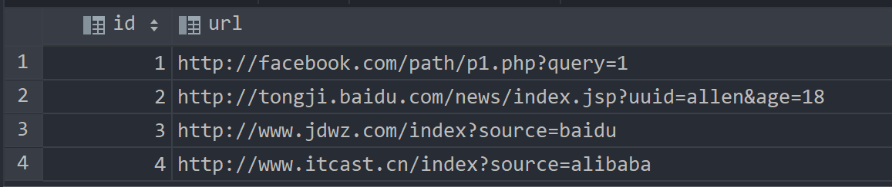

```sql
select parse_url_tuple(url, "PROTOCOL", "HOST", "PATH", "QUERY") 
as (protocol, host, path, query) from tb_url;
```

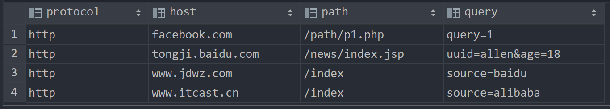

**注意下面写法的错误示范：**

```sql
select id,
       parse_url_tuple(url, "HOST", "PATH", "QUERY") as (host, path, query)
from tb_url;
```

> UDTF函数对于很多场景下有使用限制，例如：select时不能包含其他字段、不能嵌套调用、不能与group by等放在一起调用等等
>
> UDTF函数的调用方式，主要有以下两种方式：
>
> * 直接在select后单独使用
> * 与Lateral View配套使用

使用UDTF时的正确做法：

```sql
select a.id       as id,
       b.host     as host,
       b.path     as path,
       c.protocol as protocol,
       c.query    as query
from tb_url a
         lateral view parse_url_tuple(url, "HOST", "PATH") b as host, path
         lateral view parse_url_tuple(url, "PROTOCOL", "QUERY") c as protocol, query;
```

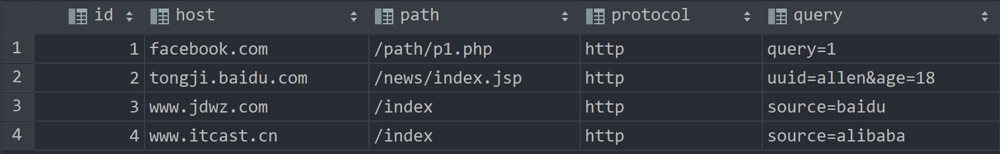

# 3. 行列转换应用与实现

## 3.1 行转列：多行转多列

> 使用case when语句
>
> * `case when 条件1 then value1 ... else 默认值 end`
> * `case 列 when v1 then value1 ... else 默认值 end`

### 3.1.1 需求

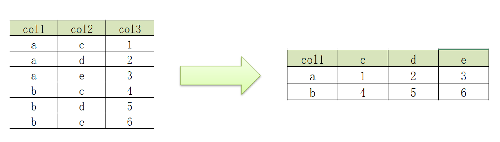

### 3.1.2 实现

```sql
create table row2col1
(
    col1 string,
    col2 string,
    col3 int
) row format delimited fields terminated by '\t';
```

```sql
select col1                                         as col1,
       max(case col2 when 'c' then col3 else 0 end) as c,
       max(case col2 when 'd' then col3 else 0 end) as d,
       max(case col2 when 'e' then col3 else 0 end) as e
from row2col1
group by col1;
```

## 3.2 行转列：多行转单列

> 使用concat,concat_ws,collect_list,collect_set等函数

### 3.2.1 需求

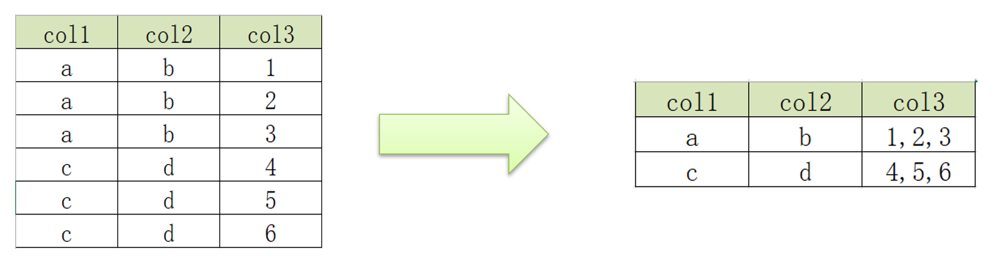

### 3.2.2 实现

```sql
create table row2col2
(
    col1 string,
    col2 string,
    col3 int
) row format delimited fields terminated by '\t';
```

```sql
select col1, col2,
       concat_ws(",", collect_list(cast(col3 as string))) as col3
from row2col2
group by col1, col2;
```

## 3.3 列转行：多列转多行

> 关键使用union关键字，将多个select合并成一个
>
> * union：去重且排序
> * union all：不去重不排序

### 3.3.1 需求

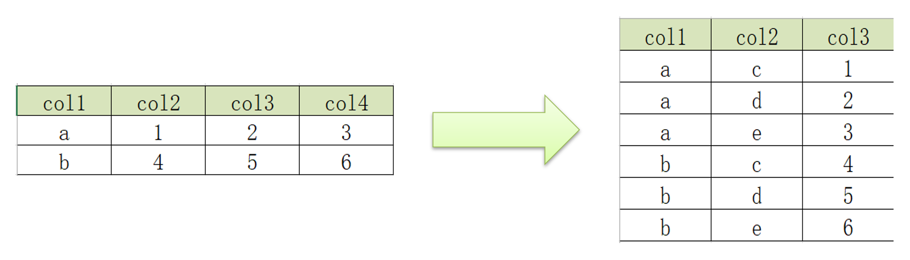

### 3.3.2 实现

```sql
create table col2row1
(
    col1 string,
    col2 int,
    col3 int,
    col4 int
) row format delimited fields terminated by '\t';
```

```sql
select col1, 'c' as col2, col2 as col3
from col2row1
UNION ALL
select col1, 'd' as col2, col3 as col3
from col2row1
UNION ALL
select col1, 'e' as col2, col4 as col3
from col2row1;
```

## 3.4 列转行：单列转多行

> explode函数的使用，注意explode的参数只能是Map或者Array

### 3.4.1 需求

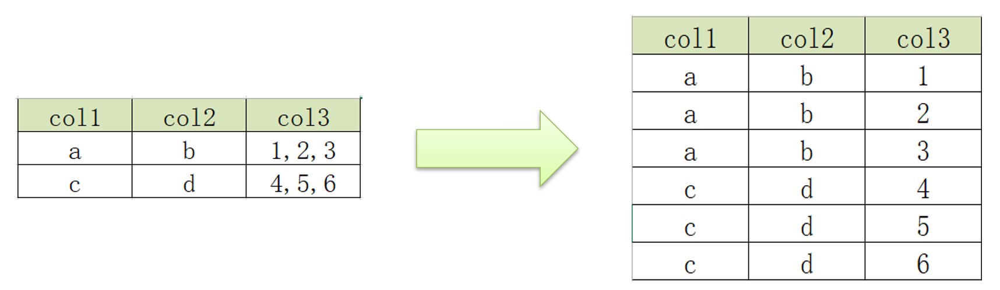

### 3.4.2 实现

```sql
create table col2row2
(
    col1 string,
    col2 string,
    col3 string
) row format delimited fields terminated by '\t';
```

```sql
select col1, col2, lv.col3 as col3
from col2row2
         lateral view explode(split(col3, ',')) lv as col3;
```

# 4. Json数据处理

## 4.1 Hive中的Json处理方式

1. 使用Json函数处理：`get_json_object`,`json_tuple`
2. Json SerDe加载数据

## 4.2 Json函数

### 4.2.1 get_json_object

> 用于解析JSON字符串，可以从JSON字符串中返回指定的某个对象列的值
>
> 特点是每次只能返回Json对象中一列的值

[scode type="green"]

如果数据中每一行只有个别字段是JSON格式字符串，就可以使用JSON函数来实现处理，但是如果数据加载的文件整体就是JSON文件，每一行数据就是一个JSON数据，那么建议直接使用JSONSerde来实现处理最为方便。

[/scode]

参数：

* 第一个参数：指定要解析的JSON字符串
* 第二个参数：指定要返回的字段，通过**$.columnName**的方式来指定path

示例：

```sql
create table tb_json_test1
(
    json string
);
```

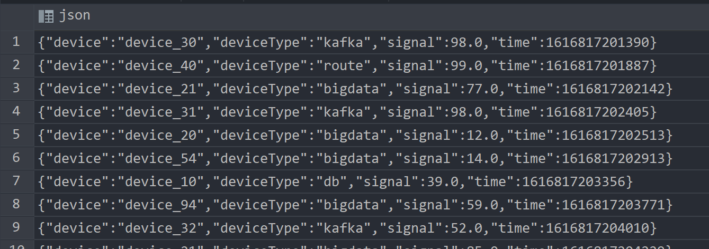

```sql
select
    -- 获取设备名称
    get_json_object(json, "$.device")     as device,
    -- 获取设备类型
    get_json_object(json, "$.deviceType") as deviceType,
    -- 获取设备信号强度
    get_json_object(json, "$.signal")     as signal,
    -- 获取时间
    get_json_object(json, "$.time")       as stime
from tb_json_test1;
```

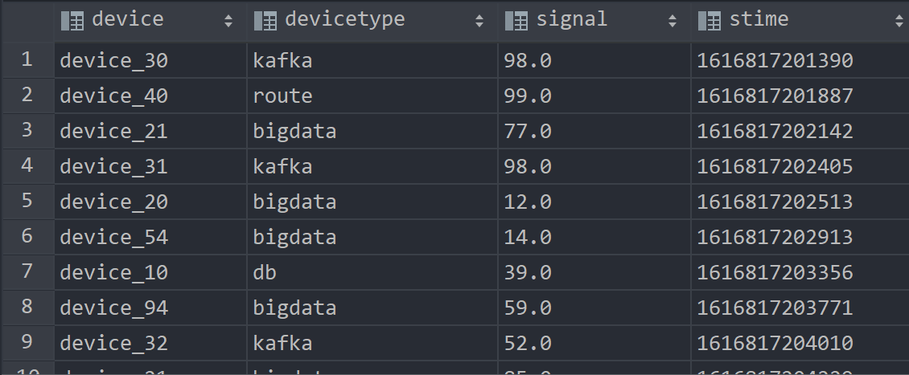

### 4.2.2 json_tuple

> 用于实现JSON字符串的解析，可以通过指定多个参数来解析JSON返回多列的值
>
> 属于UDTF，需要搭配Lateral View来使用

参数：

* 第一个参数：指定解析的Json字符串
* 可变参数：指定返回的字段

示例：

```sql
-- 单独使用
select
    --解析所有字段
    json_tuple(json, "device", "deviceType", "signal", "time") as (device, deviceType, signal, stime)
from tb_json_test1;
```

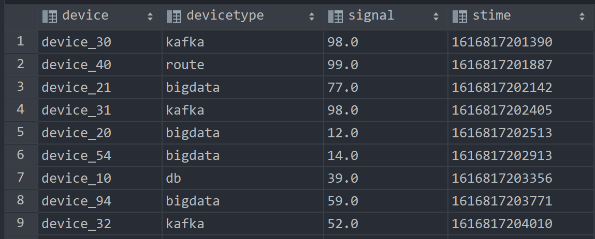

```sql
-- 搭配侧视图使用
select json,
       device,
       deviceType,
       signal,
       stime
from tb_json_test1
         lateral view json_tuple(json, "device", "deviceType", "signal", "time") b
         as device, deviceType, signal, stime;
```

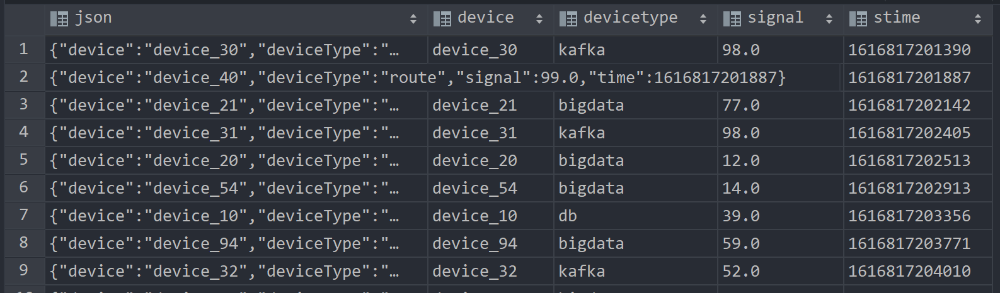

## 4.3 Json SerDe

> Hive中为了简化对于JSON文件的处理，内置了一种专门用于解析JSON文件的Serde解析器，在创建表时，只要指定使用JSONSerde解析表的文件，就会自动将JSON文件中的每一列进行解析

```sql
drop table if exists tb_json_test2;
create table tb_json_test2
(
    device     string,
    deviceType string,
    signal     double,
    `time`     string
)
    ROW FORMAT SERDE 'org.apache.hive.hcatalog.data.JsonSerDe'
    STORED AS TEXTFILE;
```

# 5. 窗口函数应用实例

## 5.1 案例1：连续登录用户

* 窗口函数`lead`

  * 功能：用于从当前数据中基于当前行的数据向后取偏移值
  * 语法：`lead(colName, N, defaultValue)`
    * colName：取哪一列的值
    * N：向后偏移几行
    * defaultValue：如果取不到返回的默认值

* 分析

  * 我们可以基于用户的登陆信息，找到如下规律：
    连续两天登陆 ： 用户下次登陆时间 = 本次登陆以后的第二天
    连续三天登陆 ： 用户下下次登陆时间 = 本次登陆以后的第三天
    ……
    我们可以对用户ID进行分区，按照登陆时间进行排序，通过lead函数计算出用户下次登陆时间
    通过日期函数计算出登陆以后第二天的日期，如果相等即为连续两天登录。

### 5.1.1 实现

```sql
create table tb_login
(
    userid    string,
    logintime string
) row format delimited fields terminated by '\t';
```

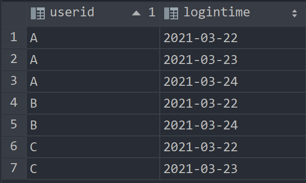

```sql
-- 连续登陆2天
select userid,
       logintime,
       -- 本次登陆日期的第二天
       date_add(logintime, 1)                                              as nextday,
       -- 按照用户id分区，按照登陆日期排序，取下一次登陆时间，取不到就为0
       lead(logintime, 1, 0) over (partition by userid order by logintime) as nextlogin
from tb_login;
```

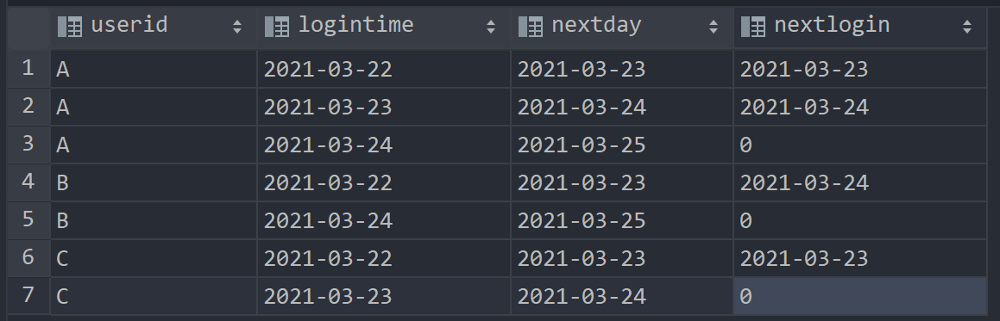

通过判断nextday和nextlogin是否相等就可以判断有没有连续登录2天

```sql
with t1 as (
    select userid,
           logintime,
           -- 本次登陆日期的第二天
           date_add(logintime, 1)                                              as nextday,
           -- 按照用户id分区，按照登陆日期排序，取下一次登陆时间，取不到就为0
           lead(logintime, 1, 0) over (partition by userid order by logintime) as nextlogin
    from tb_login)
select distinct userid
from t1
where nextday = nextlogin;
```

连续登录三天的只需要略作修改即可，实现如下：

```sql
with t1 as (
    select userid,
           logintime,
           -- 本次登陆日期的第三天
           date_add(logintime, 2)                                              as nextday,
           -- 按照用户id分区，按照登陆日期排序，取下下一次登陆时间，取不到就为0
           lead(logintime, 2, 0) over (partition by userid order by logintime) as nextlogin
    from tb_login)
select distinct userid
from t1
where nextday = nextlogin;
```

## 5.2 案例2：级联累加求和

> 需求：统计每个用户每个月的消费总金额以及**当前累计消费总金额**

窗口函数sum默认就是从第一列到当前列求和，也就是满足当前累计消费总金额这个需求

### 5.2.1 实现

```sql
create table tb_money
(
    userid string,
    mth    string,
    money  int
) row format delimited fields terminated by '\t';
```

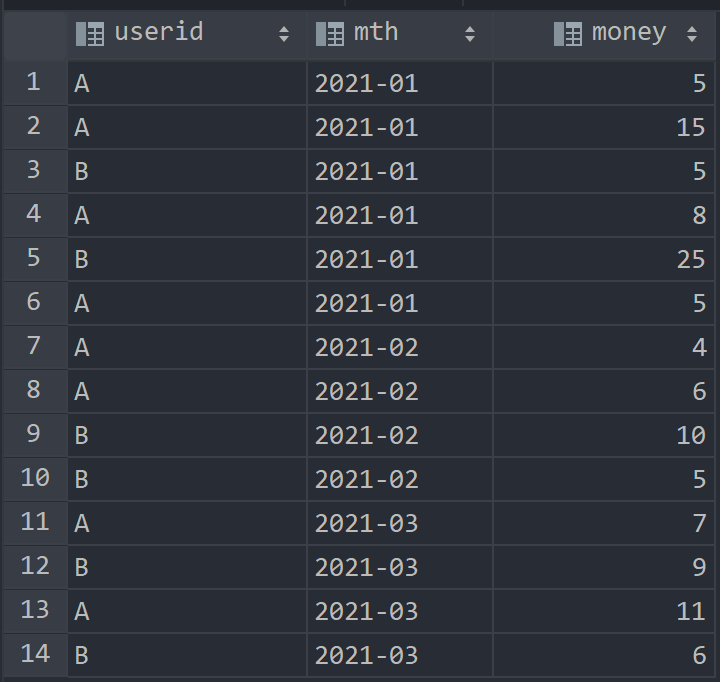

```sql
select userid,
       mth,
       m_money,
       sum(m_money) over (partition by userid order by mth) as t_money
from tb_money_mtn;
```

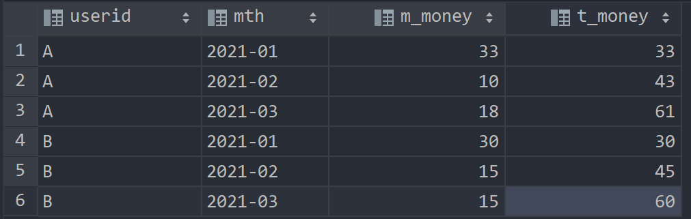

## 5.3 案例3：分组TopN

> 需求：统计每个部门工资最高的前两名

TopN函数：`row_number,rank,dense_rank`

* row_number：对每个分区的数据进行编号，如果值相同，继续编号

* rank：对每个分区的数据进行编号，如果值相同，编号相同，但留下空位

* dense_rank：对每个分区的数据进行编号，如果值相同，编号相同，不留下空位

### 5.3.1 实现

```sql
create table tb_emp
(
    empno     string,
    ename     string,
    job       string,
    managerid string,
    hiredate  string,
    salary    double,
    bonus     double,
    deptno    string
) row format delimited fields terminated by '\t';
```

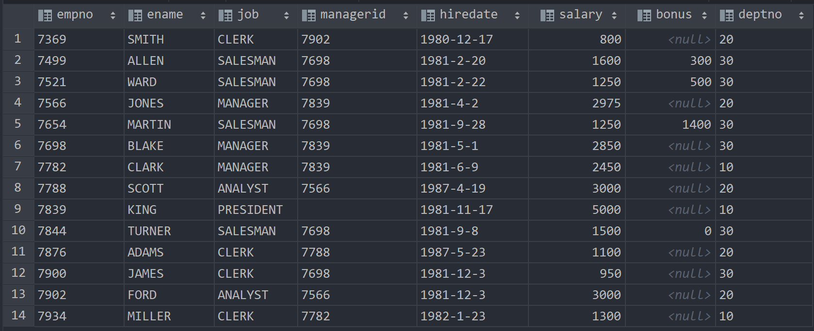

```sql
-- 过滤每个部门的薪资最高的前两名
with t1 as (
    select empno,
           ename,
           salary,
           deptno,
           row_number() over (partition by deptno order by salary desc) as rn
    from tb_emp)
select *
from t1
where rn < 3;
```

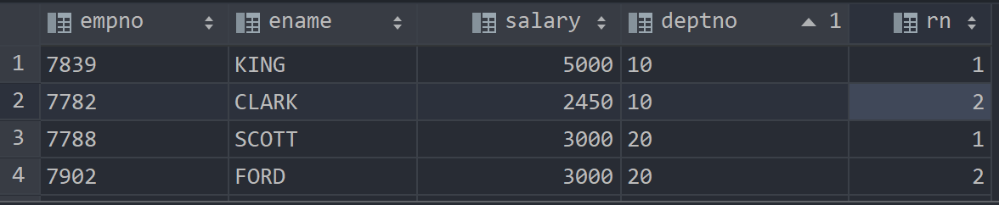

# 6. 拉链表的设计与实现

> 拉链表专门用于解决在数据仓库中数据发生变化如何实现数据存储的问题，**也就是解决Hive数仓中数据如何更新这个问题**。

[scode type="green"]

拉链表的设计是**将更新的数据进行状态记录**，没有发生更新的数据不进行状态存储，用于存储所有数据在不同时间上的所有状态，**通过时间进行标记每个状态的生命周期**，查询时，**根据需求可以获取指定时间范围状态的数据**，**默认用9999-12-31等最大值来表示最新状态**。

[/scode]

## 6.1 实现过程

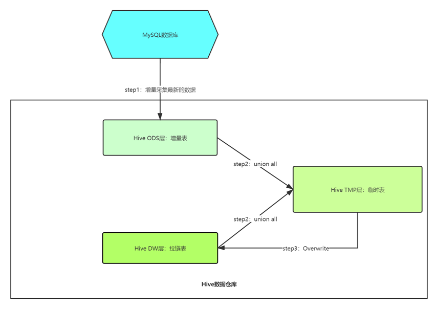

### 6.1.1 创建拉链表

```sql
create table dw_zipper
(
    userid    string,
    phone     string,
    nick      string,
    gender    int,
    addr      string,
    starttime string,
    endtime   string
) row format delimited fields terminated by '\t';
```

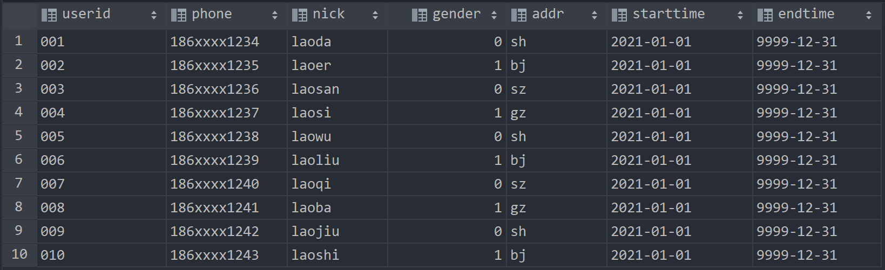

### 6.1.2 创建增量表

```sql
-- 创建ods层增量表 加载数据
create table ods_zipper_update
(
    userid    string,
    phone     string,
    nick      string,
    gender    int,
    addr      string,
    starttime string,
    endtime   string
) row format delimited fields terminated by '\t';
```


### 6.1.3 临时表操作

> 合并拉链表和增量表，并写入临时表
>
> 对于新增的数据，直接通过union all操作合并即可；对于修改的数据，将之前endtime的9999-12-31修改为新数据starttime的starttime-1，然后通过union all合并修改后的数据即可。

创建临时表：

```sql
create table tmp_zipper
(
    userid    string,
    phone     string,
    nick      string,
    gender    int,
    addr      string,
    starttime string,
    endtime   string
) row format delimited fields terminated by '\t';
```

合并数据到临时表中：

> 第一个select是union所有新增数据，第二个select是将修改的数据的endtime修改为新数据starttime的starttime-1

```sql
insert overwrite table tmp_zipper
select userid,
       phone,
       nick,
       gender,
       addr,
       starttime,
       endtime
from ods_zipper_update
union all
-- 查询原来拉链表的所有数据，并将这次需要更新的数据的endTime更改为更新值的startTime
select a.userid,
       a.phone,
       a.nick,
       a.gender,
       a.addr,
       a.starttime,
       -- 如果这条数据没有更新或者这条数据不是要更改的数据，就保留原来的值，否则就改为新数据的开始时间-1
       if(b.userid is null or a.endtime < '9999-12-31', a.endtime, date_sub(b.starttime, 1)) as endtime
from dw_zipper a
         left join ods_zipper_update b
                   on a.userid = b.userid;
```

### 6.1.4 覆盖到拉链表

```sql
-- 覆盖拉链表
insert overwrite table dw_zipper
select * from tmp_zipper;
```

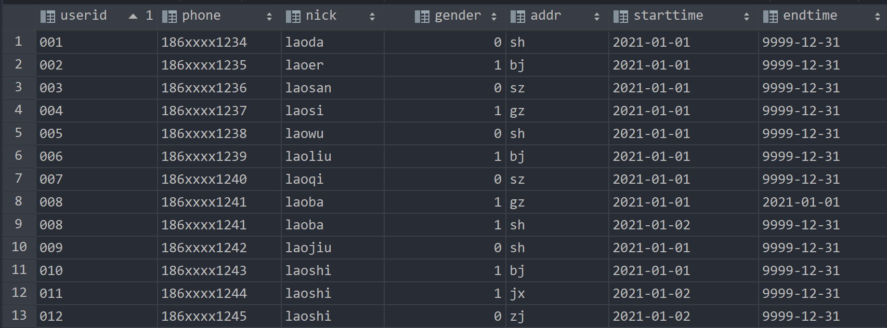

