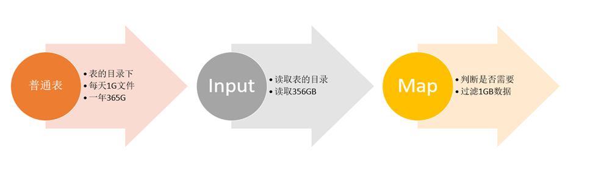
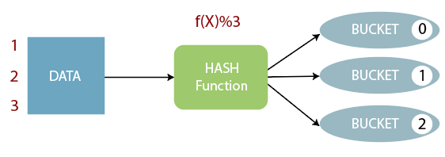
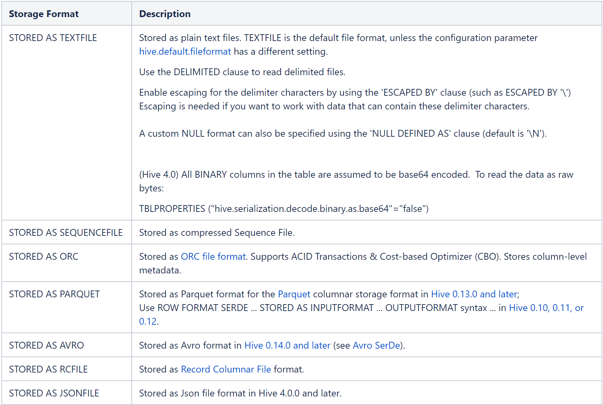
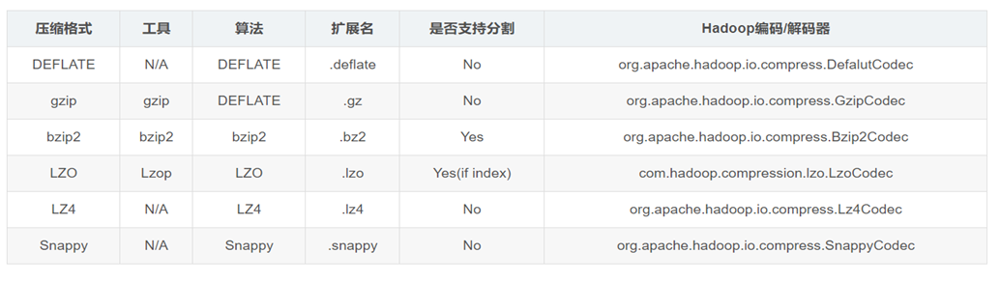
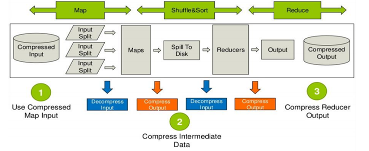
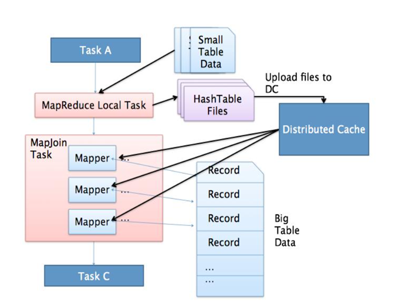
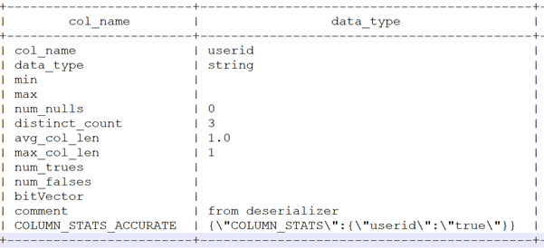
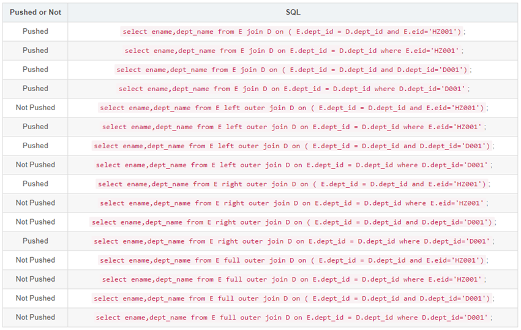
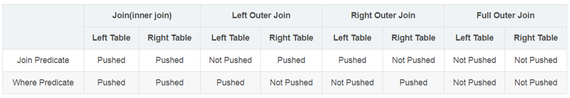
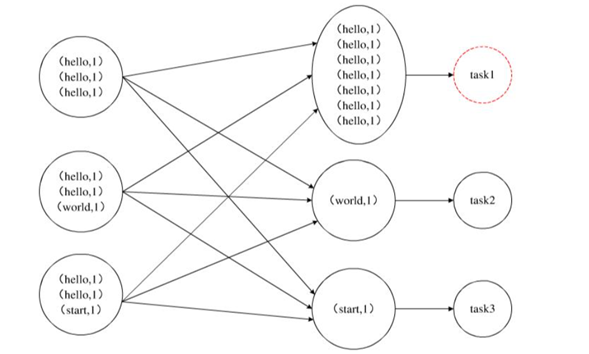

# 1. Hive表设计优化

## 1.1 分区表结构设计

> Hive在执行查询计划时，会**使用表的最后一级目录作为底层处理数据的输入**。如果不使用分区表，那么表目录下的所有文件将都会被加载，会导致大量磁盘和网络的IO损耗。

### 1.1.1 普通表结构问题

* 假设每天有1G的数据增量，一年就是365GB的数据，按照业务需求，每次只需要对其中一天的数据进行处理，也就是处理1GB的数据；
* 程序会先加载365GB的数据，然后将364GB的数据过滤掉，只保留一天的数据再进行计算，**导致了大量的磁盘和网络的IO的损耗**。



### 1.1.2 分区设计思想

根据查询的需求，将数据按照查询的条件【一般以时间】进行划分分区存储，**将不同分区的数据单独使用一个HDFS目录来进行存储**，当底层实现计算时，根据查询的条件，**只读取对应分区的数据作为输入，减少不必要的数据加载，提高程序的性能。**


## 1.2 分桶表结构设计

### 1.2.1 分桶表设计思想

>  分桶表的设计是按照一定的规则【底层通过MapReduce中的多个Reduce来实现】将数据划分到不同的文件中进行存储，构建分桶表。



### 1.2.2 优化Join

**Hive中Join的问题：**

* 默认情况下，Hive底层是通过MapReduce来实现的；
* MapReduce在处理数据之间join的时候有两种方式：MapJoin、ReduceJoin，其中MapJoin效率较高；
* 如果**有两张非常大的表要进行Join**，底层无法使用MapJoin提高Join的性能，**只能走默认的ReduceJoin；**
* 而ReduceJoin必须**经过Shuffle过程，相对性能比较差**，而且**容易产生数据倾斜**。

如果有两张表按照相同的划分规则【比如按照Join的关联字段】将各自的数据进行划分；在Join时，就可以实现Bucket与Bucket的Join，避免不必要的比较，减少笛卡尔积数量。

## 1.3 索引设计

> 实际工作场景中，一般不推荐使用Hive Index，推荐使用ORC文件格式中的索引、物化视图来代替Hive Index提高查询性能。

### 1.3.1 Hive中的索引

* 在传统的关系型数据库例如MySQL、Oracle中，为了提高数据的查询效率，可以为表中的字段单独构建索引，查询时，可以基于字段的索引快速的实现查询、过滤等操作。
* Hive中也同样提供了索引的设计，允许用户为字段构建索引，提高数据的查询效率。但是Hive的索引与关系型数据库中的索引并不相同，比如，Hive不支持主键或者外键索引。
* Hive索引可以建立在表中的某些列上，以提升一些操作的效率。
* 在可以预见到分区数据非常庞大的情况下，分桶和索引常常是优于分区的；
* 而分桶由于SMB Join对关联键（join字段）要求严格，所以并不是总能生效；
* 注意：官方明确表示，索引功能支持是从Hive0.7版本开始，到**Hive3.0不再支持**。

# 1.3.2 索引的原理

当为某张表的某个字段创建索引时，Hive中会自动创建一张索引表，该表记录了该字段的每个值与数据实际物理位置之间的关系，例如数据所在的HDFS文件地址，以及所在文件中偏移量offset等信息。

### 1.3.3 索引的目的

提高Hive表指定列的查询速度。没有索引时，类似WHERE tab1.col1 = 10的查询，Hive会加载整张表或分区，然后处理所有的行，但是如果在字段col1上面存在索引时，那么只会加载和处理文件的一部分。

### 1.3.4 索引的使用

创建索引：

```sql
-- 为表中的userid构建索引
create index idx_user_id_login on table tb_login_part(userid)
-- 索引类型为Compact，Hive支持Compact和Bitmap类型，存储的索引内容不同
as 'COMPACT'
-- 延迟构建索引
with deferred rebuild;
```

构建/更新索引：通过运行一个MapReduce程序来构建索引

```sql
alter index idx_user_id_login ON tb_login_part rebuild;
```

查看索引结构：

```sql
desc default__tb_login_part_idx_user_id_login__;
```

查看索引内容：

```sql
select * from default__tb_login_part_idx_user_id_login__;
```

删除索引：

```sql
DROP INDEX idx_user_id_login ON tb_login_part;
```

### 1.3.5 索引的问题

* Hive构建索引的过程是通过一个MapReduce程序来实现的；
* 每次Hive中原始数据表的数据发生更新时，索引表不会自动更新；
* 必须手动执行一个Alter index命令来实现通过MapReduce更新索引表，导致整体性能较差，维护相对繁琐。

# 2. Hive表数据优化

## 2.1 文件格式

> 通过不同的文件格式，可以降低存储空间，提高查询性能。主要推荐使用ORC格式。具体见Hadoop中的讲解。

主要的存储格式如下，在创建表的时候通过stored as 关键字指定，具体使用见前面DDL。



### 2.1.1 TextFile

* TextFile是Hive中**默认**的文件格式，存储形式为按行存储。
* 工作中最常见的数据文件格式就是TextFile文件，几乎所有的原始数据生成都是TextFile格式，所以Hive设计时考虑到为了避免各种编码及数据错乱的问题，选用了TextFile作为默认的格式。
* **建表时不指定存储格式即为TextFile，导入数据时把数据文件拷贝至HDFS不进行处理。**


### 2.1.2 SequenceFile

* SequenceFile是Hadoop里用来存储序列化的键值对即二进制的一种文件格式。
* SequenceFile文件也可以作为MapReduce作业的输入和输出，hive也支持这种格式。


### 2.1.3 Parquet

* Parquet是一种支持嵌套结构的**列式存储**文件格式，最早是由Twitter和Cloudera合作开发，2015年5月从Apache孵化器里毕业成为Apache顶级项目。
* 是一种支持嵌套数据模型对的列式存储系统，作为大数据系统中OLAP查询的优化方案，它已经被多种查询引擎原生支持，并且部分高性能引擎将其作为默认的文件存储格式。
* 通过数据编码和压缩，以及映射下推和谓词下推功能，Parquet的性能也较之其它文件格式有所提升。


### 2.1.4 ORC

* ORC（OptimizedRC File）文件格式也是一种Hadoop生态圈中的**列式存储**格式；
* 它的产生早在2013年初，最初产生自Apache Hive，用于降低Hadoop数据存储空间和加速Hive查询速度；
* 2015年ORC项目被Apache项目基金会提升为Apache顶级项目


## 2.2 数据压缩

### 2.2.1 概述

* Hive中的压缩就是使用了Hadoop中的压缩实现的，所以Hadoop中支持的压缩在Hive中都可以直接使用。
* Hadoop中支持的压缩算法：



* Hive底层运行MapReduce程序时，磁盘I/O操作、网络数据传输、shuffle和merge要花大量的时间，尤其是数据规模很大和工作负载密集的情况下。
* 鉴于磁盘I/O和网络带宽是Hadoop的宝贵资源，数据压缩对于节省资源、最小化磁盘I/O和网络传输非常有帮助。
* Hive压缩实际上说的就是MapReduce的压缩。

MapReduce的压缩主要可以在下面四个阶段：



### 2.2.2 使用

```sql
-- 开启hive中间传输数据压缩功能
-- 1）开启hive中间传输数据压缩功能
set hive.exec.compress.intermediate=true;
-- 2）开启mapreduce中map输出压缩功能
set mapreduce.map.output.compress=true;
-- 3）设置mapreduce中map输出数据的压缩方式
set mapreduce.map.output.compress.codec= org.apache.hadoop.io.compress.SnappyCodec;


-- 开启Reduce输出阶段压缩
-- 1）开启hive最终输出数据压缩功能
set hive.exec.compress.output=true;
-- 2）开启mapreduce最终输出数据压缩
set mapreduce.output.fileoutputformat.compress=true;
-- 3）设置mapreduce最终数据输出压缩方式
set mapreduce.output.fileoutputformat.compress.codec = org.apache.hadoop.io.compress.SnappyCodec;
-- 4）设置mapreduce最终数据输出压缩为块压缩
set mapreduce.output.fileoutputformat.compress.type=BLOCK;
```

## 2.3 存储优化

### 2.3.1 避免小文件生成

* Hive的存储本质还是HDFS，HDFS是不利于小文件存储的，因为**每个小文件会产生一条元数据信息**，并且不利用MapReduce的处理，**MapReduce中每个小文件会启动一个MapTask计算处理**，**导致资源的浪费**，所以在使用Hive进行处理分析时，要尽量**避免小文件的生成**。
* Hive中提供了一个特殊的机制，可以**自动的判断是否是小文**件，如果是小文件可以**自动将小文件进行合并**。

```sql
-- 如果hive的程序，只有maptask，将MapTask产生的所有小文件进行合并
set hive.merge.mapfiles=true;
-- 如果hive的程序，有Map和ReduceTask,将ReduceTask产生的所有小文件进行合并
set hive.merge.mapredfiles=true;
-- 每一个合并的文件的大小（244M）
set hive.merge.size.per.task=256000000;
-- 平均每个文件的大小，如果小于这个值就会进行合并(15M)
set hive.merge.smallfiles.avgsize=16000000;
```

### 2.3.2 如何读取小文件

> Hive中也提供一种输入类CombineHiveInputFormat，用于**将小文件合并以后，再进行处**理

```sql
-- 设置Hive中底层MapReduce读取数据的输入类：将所有文件合并为一个大文件作为输入
set hive.input.format=org.apache.hadoop.hive.ql.io.CombineHiveInputFormat;
```

### 2.3.3 ORC文件索引

* 在使用ORC文件时，为了加快读取ORC文件中的数据内容，ORC提供了两种索引机制：**Row Group Index** 和 **Bloom Filter Index**可以帮助提高查询ORC文件的性能
* 当用户写入数据时，可以指定构建索引，当用户查询数据时，可以**根据索引提前对数据进行过滤，避免不必要的数据扫描**。

**Row Group Index**

* 一个ORC文件包含一个或多个stripes(groups of row data)，每个stripe中包含了每个column的min/max值的索引数据；
* 当查询中有大于等于小于的操作时，会根据min/max值，跳过扫描不包含的stripes。
* 而其中为每个stripe建立的包含min/max值的索引，就称为Row Group Index行组索引，也叫min-max Index大小对比索引，或者Storage Index。
* 建立ORC格式表时，指定表参数`orc.create.index=true`之后，便会建立Row Group Index；
* 为了使Row Group Index有效利用，向表中加载数据时，**必须对需要使用索引的字段进行排序**

```sql
-- 1、开启索引配置
set hive.optimize.index.filter=true;
-- 2、创建表并制定构建索引
create table tb_sogou_orc_index
stored as orc tblproperties ("orc.create.index"="true")
as select * from tb_sogou_source
distribute by stime
sort by stime;
-- 3、当进行范围或者等值查询（**<,>,=**）时就可以基于构建的索引进行查询
select count(*) from tb_sogou_orc_index where stime > '12:00:00' and stime < '18:00:00';
```

**Bloom Filter Index**

* 建表时候通过表参数”orc.bloom.filter.columns”=”columnName……”来指定为哪些字段建立BloomFilter索引，在生成数据的时候，会在每个stripe中，为该字段建立BloomFilter的数据结构；
* 当**查询条件中包含对该字段的等值过滤时候**，先从BloomFilter中获取以下是否包含该值，如果不包含，则跳过该stripe。

```sql
-- 创建表指定创建布隆索引
create table tb_sogou_orc_bloom
stored as orc tblproperties ("orc.create.index"="true","orc.bloom.filter.columns"="stime,userid")
as select * from tb_sogou_source
distribute by stime sort by stime;
-- stime的范围过滤可以走row group index，userid的过滤可以走bloom filter index
select count(*) from tb_sogou_orc_index
where stime > '12:00:00' and stime < '18:00:00'
and userid = '3933365481995287' ;
```

### 2.3.4 ORC矢量查询

* Hive的默认查询执行引擎一次处理一行，而矢量化查询执行是一种Hive针对ORC文件操作的特性，目的是按照每批1024行读取数据，并且一次性对整个记录整合（而不是对单条记录）应用操作，提升了像过滤, 联合, 聚合等等操作的性能。
* **注意：要使用矢量化查询执行，就必须以ORC格式存储数据。**

```sql
-- 开启矢量化查询
set hive.vectorized.execution.enabled = true;
set hive.vectorized.execution.reduce.enabled = true;
```

# 3. Job作业执行优化

## 3.1 explain查询计划

* explain命令可以帮助用户了解一条HQL语句在底层的实现过程。通俗来说就是Hive打算如何去做这件事。
* explain会解析HQL语句，将整个HQL语句的**实现步骤**、**依赖关系**、**实现过程**都会进行解析返回，可以了解一条HQL语句在底层是如何实现数据的查询及处理的过程，辅助用户对Hive进行优化。

### 3.1.1 语法

```sql
EXPLAIN [FORMATTED|EXTENDED|DEPENDENCY|AUTHORIZATION|] query
```

* FORMATTED：对执行计划进行格式化，返回JSON格式的执行计划
* **EXTENDED**：提供一些额外的信息，比如文件的路径信息
* DEPENDENCY：以JSON格式返回查询所依赖的表和分区的列表 
* AUTHORIZATION：列出需要被授权的条目，包括输入与输出

### 3.1.2 输出组成

* **The Abstract Syntax Tree for the query（抽象语法树AST）**：Hive使用Antlr解析生成器，可以自动地将HQL生成为抽象语法树
* **The dependencies between the different stages of the plan（Stage依赖关系）**：会列出运行查询划分的stage阶段以及之间的依赖关系
* **The description of each of the stages（Stage内容）**：包含了每个stage非常重要的信息，比如运行时的operator和sort orders等具体的信息

## 3.2 MapReduce属性优化

### 3.2.1 本地模式

* 使用Hive的过程中，有一些数据量不大的表也会转换为MapReduce处理，提交到集群时，需要申请资源，等待资源分配，启动JVM进程，再运行Task，一系列的过程比较繁琐，本身数据量并不大，提交到YARN运行返回会导致性能较差的问题。
* Hive为了解决这个问题，延用了MapReduce中的设计，提供本地计算模式，允许程序不提交给YARN，直接在本地运行，以便于**提高小数据量程序的性能。**

**配置**

```sql
-- 开启本地模式
set hive.exec.mode.local.auto = true;
```

**使用条件：**

* 输入文件的总大小小于：`hive.exec.mode.local.auto.inputbytesmax`(128MB by default)
* map-task个数小于：`hive.exec.mode.local.auto.tasks.max`(4 by default)
* reduce task的个数只能为1或者0

### 3.2.2 JVM重用

> Hadoop3不再支持

1. Hadoop默认会为每个Task启动一个JVM来运行，而在JVM启动时内存开销大；
2. Job数据量大的情况，如果单个Task数据量比较小，也会申请JVM，这就导致了资源紧张及浪费的情况；
3. JVM重用可以使得JVM实例在同一个job中重新使用N次，当一个Task运行结束以后，JVM不会进行释放，而是继续供下一个Task运行，直到运行了N个Task以后，就会释放；
4. N的值可以在Hadoop的mapred-site.xml文件中进行配置，通常在10-20之间。

```sql
-- Hadoop3之前的配置，在mapred-site.xml中添加以下参数
-- Hadoop3中已不再支持该选项
mapreduce.job.jvm.numtasks=10 
```

### 3.2.3 并行执行

> 没有依赖的stage并行执行

1. Hive在实现HQL计算运行时，会解析为多个Stage，有时候Stage彼此之间有依赖关系，只能挨个执行，但是在一些别的场景下，很多的Stage之间是没有依赖关系的；
2. 例如Union语句，Join语句等等，这些Stage没有依赖关系，但是Hive依旧默认挨个执行每个Stage，这样会导致性能非常差，我们可以通过修改参数，开启并行执行，当多个Stage之间没有依赖关系时，允许多个Stage并行执行，提高性能。

```sql
-- 开启Stage并行化，默认为false
SET hive.exec.parallel=true;
-- 指定并行化线程数，默认为8
SET hive.exec.parallel.thread.number=16; 
```

## 3.3 Join优化

* Join是数据分析处理过程中必不可少的操作，Hive同样支持Join的语法；
* Hive Join的底层是通过MapReduce来实现的，Hive实现Join时，为了提高MapReduce的性能，提供了多种Join方案来实现；
* 例如适合小表Join大表的Map Join，大表Join大表的Reduce Join，以及大表Join的优化方案Bucket Join等。

### 3.3.1 Map Join

> Map端Join的关键是将小表文件做一个分布式缓存（distributed cache），把他发送到各台机器上，再启动一个或多个MapTask，去读大表的数据，分别与缓存之间进行关联，关联的结果直接输出

* 应用场景：适合于小表join大表或者小表Join小表
* 原理：将小的那份数据给每个MapTask的内存都放一份完整的数据，大的数据每个部分都可以与小数据的完整数据进行join。底层不需要经过shuffle，需要占用内存空间存放小的数据文件



尽量使用Map Join来实现Join过程，Hive中默认自动开启了`MapJoin：hive.auto.convert.join=true`

Hive中小表的大小限制

```sql
-- 2.0版本之前的控制属性
hive.mapjoin.smalltable.filesize=25M
-- 2.0版本开始由以下参数控制
hive.auto.convert.join.noconditionaltask.size=512000000
```

### 3.3.2 Reduce Join

* 应用场景：适合于大表Join大表
* 原理：将两张表的数据在shuffle阶段利用shuffle的分组来将数据按照关联字段进行合并。必须经过shuffle，利用Shuffle过程中的分组来实现关联
* 使用：Hive会自动判断是否满足Map Join，如果不满足Map Join，则自动执行Reduce Join

### 3.3.3 Bucket Join

* 应用场景：适合于大表Join大表

* 原理：将两张表按照相同的规则将数据划分。根据对应的规则的数据进行join。减少了比较次数，提高了性能

* 使用Bucket Join

  * 语法：`clusterd by colName`
  * 参数：`set hive.optimize.bucketmapjoin = **true**;`
  * 要求：分桶字段 = Join字段 ，桶的个数相等或者成倍数

* 使用Sort Merge Bucket Join（SMB）

  * 基于有序数据的Join
  * 语法：distribute by colName sorted by colName
  * 参数：见下面
  * 要求：分桶字段 = Join字段 = 排序字段 ，桶的个数相等或者成倍数

  ```sql
  set hive.optimize.bucketmapjoin = true;
  set hive.auto.convert.sortmerge.join=true;
  set hive.optimize.bucketmapjoin.sortedmerge = true;
  set hive.auto.convert.sortmerge.join.noconditionaltask=true;
  ```

## 3.4 优化器

### 3.4.1 背景

* 出现原因：当一个程序中如果有一些操作彼此之间有关联性，是可以在一个MapReduce中实现的，但是Hive会不智能的选择，Hive会使用两个MapReduce来完成这两个操作。
* 例如：当我们执行 `select …… from table group by id order by id desc`。该SQL语句转换为MapReduce时，我们可以有两种方案来实现：
* 方案一：第一个MapReduce做group by，经过shuffle阶段对id做分组；第二个MapReduce对第一个MapReduce的结果做order by，经过shuffle阶段对id进行排序
* 因为都是对id处理，可以使用一个MapReduce的shuffle既可以做分组也可以排序

### 3.4.2 使用

**在这种场景下，Hive会默认选择用第一种方案来实现，这样会导致性能相对较差**

可以在Hive中开启关联优化，对有关联关系的操作进行解析时，可以尽量放在同一个MapReduce中实现。

配置：

```sql
set hive.optimize.correlation=true;
```

### 3.4.3 优化器介绍

#### 背景

* Hive默认的优化器在解析一些聚合统计类的处理时，底层解析的方案有时候不是最佳的方案。
* 例如当前有一张表【共1000条数据】，id构建了索引，id =100值有900条。需求：查询所有id = 100的数据，SQL语句为：`select * from table where id = 100;`
* 方案一：由于id这一列构建了索引，索引默认的**优化器引擎RBO**，会选择先从索引中查询id = 100的值所在的位置，再根据索引记录位置去读取对应的数据，但是这并不是最佳的执行方案。
* 方案二：有id=100的值有900条，占了总数据的90%，这时候是没有必要检索索引以后再检索数据的，可以直接检索数据返回，这样的效率会更高，更节省资源，这种方式就是**CBO优化器引擎**会选择的方案。

#### RBO

rule basic optimise：基于规则的优化器，根据设定好的规则来对程序进行优化

#### CBO

**cost basic optimise**：基于代价的优化器，根据不同场景所需要付出的代价来合适选择优化的方案

对数据的分布的信息【数值出现的次数，条数，分布】来综合判断用哪种处理的方案是最佳方案

* Hive中支持RBO与CBO这两种引擎，默认使用的是RBO优化器引擎。
* 很明显CBO引擎更加智能，所以在使用Hive时，我们可以配置底层的优化器引擎为CBO引擎。

```sql
set hive.cbo.enable=true;
set hive.compute.query.using.stats=true;
set hive.stats.fetch.column.stats=true;
```

#### Anayze分析器

> CBO计算代价的手段

功能：用于提前运行一个MapReduce程序将表或者分区的信息构建一些元数据【表的信息、分区信息、列的信息】，搭配CBO引擎一起使用

用法：

```sql
-- 分析优化器
use tb_part;
-- 构建表中分区数据的元数据信息
ANALYZE TABLE tb_login_part PARTITION(logindate) COMPUTE STATISTICS;
-- 构建表中列的数据的元数据信息
ANALYZE TABLE tb_login_part  COMPUTE STATISTICS FOR COLUMNS  userid;
-- 查看构建的列的元数据
desc formatted tb_login_part userid;
```



## 3.5 谓词下推（PPD）

> * 谓词：用来描述或判定客体性质、特征或者客体之间关系的词项。比如"3 大于 2"中"大于"是一个谓词。
> * 谓词下推Predicate Pushdown（PPD）基本思想：将过滤表达式尽可能移动至靠近数据源的位置，以使真正执行时能直接跳过无关的数据。简单点说就是在不影响最终结果的情况下，尽量将过滤条件提前执行。
> * Hive中谓词下推后，过滤条件会下推到map端，提前执行过滤，减少map到reduce的传输数据，提升整体性能。
> * 开启参数：`hive.optimize.ppd=**true**;`

### 3.5.1 示例

```sql
-- 使用了谓词下推，先过滤再join
select a.id,a.value1,b.value2 from table1 a
join (select b.* from table2 b where b.ds>='20181201' and b.ds<'20190101') c
on (a.id=c.id)

select a.id,a.value1,b.value2 from table1 a
join table2 b on a.id=b.id
where b.ds>='20181201' and b.ds<'20190101'
```



### 3.5.2 规则

1. 对于Join(Inner Join)、Full outer Join，条件写在on后面，还是where后面，性能上面没有区别；
2. 对于Left outer Join ，右侧的表写在on后面、左侧的表写在where后面，性能上有提高；
3. 对于Right outer Join，左侧的表写在on后面、右侧的表写在where后面，性能上有提高；
4. 当条件分散在两个表时，谓词下推可按上述结论2和3自由组合。



## 3.6 数据倾斜

> 数据倾斜的现象是，当提交运行一个程序时，这个程序的大多数的Task都已经运行结束了，只有某一个Task一直在运行，迟迟不能结束，导致整体的进度卡在99%或者100%，这时候就可以判定程序出现了数据倾斜的问题。



### 3.6.1 group by, count(distinct)时的倾斜

> 当程序中出现group by或者count（distinct）等分组聚合的场景时，如果数据本身是倾斜的，根据MapReduce的Hash分区规则，肯定会出现数据倾斜的现象。
>
> 根本原因是因为分区规则导致的，所以可以通过以下几种方案来解决group by导致的数据倾斜的问题。

#### 方案一：开启Map端聚合

`hive.map.aggr=true;`

通过减少shuffle数据量和Reducer阶段的执行时间，避免每个Task数据差异过大导致数据倾斜

#### 方案二：实现随机分区

`select from table distribute by rand();`

distribute by用于指定底层按照哪个字段作为Key实现分区、分组等

通过rank函数随机值实现随机分区，避免数据倾斜

### 方案三：数据倾斜时自动负载均衡

`hive.groupby.skewindata=true;`

开启该参数以后，当前程序会自动通过两个MapReduce来运行

第一个MapReduce自动进行随机分布到Reducer中，每个Reducer做部分聚合操作，输出结果

第二个MapReduce将上一步聚合的结果再按照业务（group by key）进行处理，保证相同的分布到一起，最终聚合得到结果

### 3.6.2 join时的倾斜

> Join操作时，如果两张表比较大，无法实现Map Join，只能走Reduce Join，那么当关联字段中某一种值过多的时候依旧会导致数据倾斜的问题；

面对Join产生的数据倾斜，核心的思想是尽量避免Reduce Join的产生，优先使用Map Join来实现；

但往往很多的Join场景不满足Map Join的需求，那么可以以下几种方案来解决Join产生的数据倾斜问题

#### 方案一：提前过滤，将大数据变成小数据，实现Map Join

> 也就是谓词下推

#### 方案二：使用Bucket Join

如果使用方案一，过滤后的数据依旧是一张大表，那么最后的Join依旧是一个Reduce Join

这种场景下，可以将两张表的数据构建为桶表，实现Bucket Map Join，避免数据倾斜

#### 方案三：使用Skew Join

Skew Join是Hive中一种专门为了避免数据倾斜而设计的特殊的Join过程

这种Join的原理是将Map Join和Reduce Join进行合并，如果某个值出现了数据倾斜，就会将产生数据倾斜的数据单独使用Map Join来实现

其他没有产生数据倾斜的数据由Reduce Join来实现，这样就避免了Reduce Join中产生数据倾斜的问题

最终将Map Join的结果和Reduce Join的结果进行Union合并

**原理**：


**配置**：

```sql
-- 开启运行过程中skewjoin
set hive.optimize.skewjoin=true;
-- 如果这个key的出现的次数超过这个范围
set hive.skewjoin.key=100000;
-- 在编译时判断是否会产生数据倾斜
set hive.optimize.skewjoin.compiletime=true;
-- 不合并，提升性能
set hive.optimize.union.remove=true;
-- 如果Hive的底层走的是MapReduce，必须开启这个属性，才能实现不合并
set mapreduce.input.fileinputformat.input.dir.recursive=true;
```

# 4. Hive3新特性

## 4.1 Hive on Tez

> 一般都使用Spark了，所以了解就行

## 4.2 Hive LLAP更新

> 只能与Tez配套使用，了解

## 4.3 Metastore独立模式

> 从Hive 3.0开始，Metastore可以在不安装Hive其他部分的情况下单独运行，作为一个单独的发行版提供，用于实现允许其他非Hive的系统，例如Spark、Impala等轻松地与Metastore集成。
>
> 目前来说为了方便起见，依旧建议将Metastore放在Hive中，一起安装部署。
