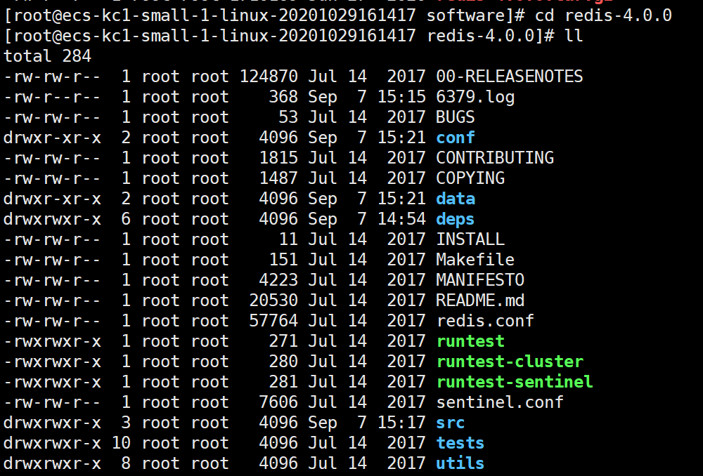

# 1. 概念

Redis（Remote Directory Server）是由C语言开发的一个开源的高性能键值对数据库。

# 2. 特征

1. 数据间没有必然的关联关系
2. 内部采用**单线程**机制进行工作
3. 高性能
4. 多数据类型支持
   * 字符串类型`string`
   * 列表类型`list`
   * 散列类型`hash`
   * 集合类型`set`
   * 有序集合类型`sorted_set`
5. 持久化支持。可以进行数据容灾恢复

# 3. Redis的应用

* 为热点数据加速查询（主要场景），如热点商品、热点新闻、热点资讯、推广类等高访问量信息等
* 任务队列，如秒杀、抢购、购票排队等
* 即时信息查询，如各种排行榜、各类网站访问统计、公交到站信息、在线人数信息、设备信号等
* 时效性信息控制，如验证码控制、投票控制等
* 分布式数据共享，如分布式集群架构中的session分离
* 消息队列
* 分布式锁

# 4. Linux上的安装

> 操作系统环境：CentOS Linux release 7.6.1810 (AltArch)

```shell
wget http://download.redis.io/releases/redis-4.0.0.tar.gz
tar -zxvf redis-4.0.0.tar.gz

cd redis-4.0.0
make install

mkdir conf # 配置目录
mkdir data # 日志目录
cd conf
vim redis-6379.conf

# 根据配置后台启动redis服务，可以根据不同配置启动多个redis
redis-server conf/redis-6379.conf 
redis-cli # 连接redis服务
```

redis-6379.conf

```shell
port 6379
daemonize yes # 后台启动
logfile "6379.log" # 日志名称及日志存放位置
dir /home/vingkin/software/redis-4.0.0/data
```



