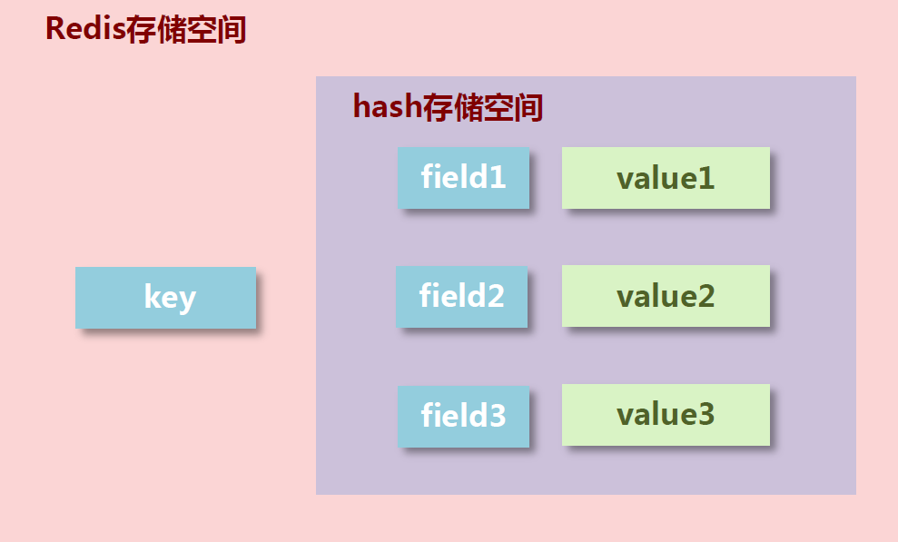
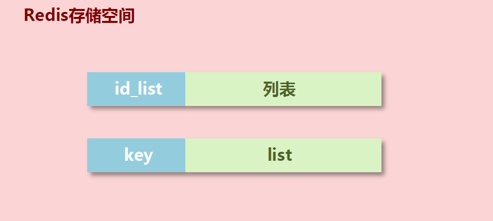
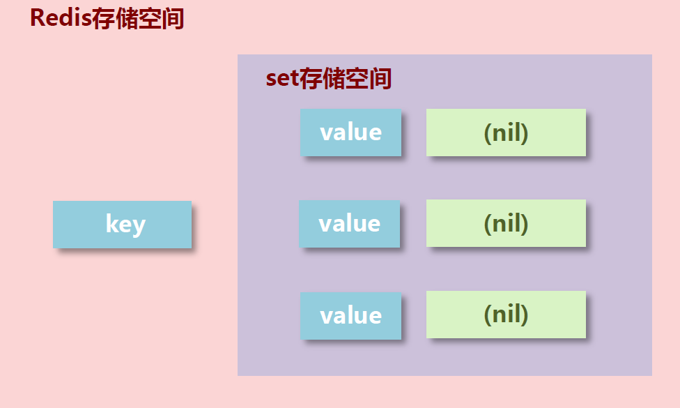
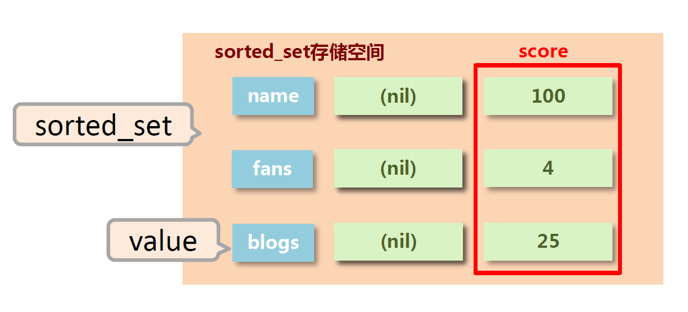

# 1. Redis数据类型简介

> Redis应根据需求选择不同的数据类型。Redis自身是一个Map，其中所有的数据都是采用`key:value`的形式存储。根据value不同的数据类型，Redis一共有5中常见的数据类型。其中key部分永远都是字符串。

Redis数据类型与Java数据类型的对应关系

| Redis数据类型 | Java数据类型 |
| ------------- | ------------ |
| string        | String       |
| hash          | HashMap      |
| list          | LinkedList   |
| set           | HashSet      |
| order_set     | TreeSet      |

# 2. string

> value部分为字符串，当value以数字的形式展示，可以作为数字操作使用

## 2.1 string类型数据操作

| 指令                                  | 操作                        |
| ------------------------------------- | --------------------------- |
| **set** *key value*                   | 添加 / 修改数据             |
| **get** *key*                         | 获取数据                    |
| **del** *key*                         | 删除数据                    |
| **mset** *key value [key value ... ]* | 添加 / 修改多个数据         |
| **mget** *key [key ... ]*             | 获取多个数据                |
| **strlen** *key*                      | 获取key对应的value长度      |
| **append** *key value*                | key存在则追加，不存在则新建 |
| **incr** *key*                        | 自增                        |
| **incrby** *key increment*            | 指定增加整数                |
| **incrbyfloat** *key increment*       | 指定增加小数                |
| **setex** *key second value*          | 指定数据生命周期，秒        |
| **psetex** *key milliseconds value*   | 毫秒                        |

## 2.2 set与mset的选择

> 对于多发送的情况，的确mset会更高效些，但是还是得考虑到redis的单线程特性，当一次发送特别多的时候，比如说100000000条，会出现线程阻塞的情况。

## 2.3 string作为数值操作

* string在redis内部存储默认就是一个字符串，当遇到增减类操作incr，decr时会转成数值型进行计算。
* redis所有的操作都是原子性的，采用单线程处理所有业务，命令是一个一个执行的，因此无需考虑并发带来的数据影响。
* 注意：按数值进行操作的数据，如果原始数据不能转成数值，或超越了redis 数值上限范围，将报错。9223372036854775807（java中long型数据最大值，`Long.MAX_VALUE`）

## 2.4 string类型数据操作的注意事项

* 数据操作不成功的反馈与数据正常操作之间的差异
  1. 表示运行是否成功
     * (integer)0 $\rightarrow$ false 失败
     * (integer)1 $\rightarrow$ true  成功
  2. 表示运行结果值
     * (integer)3 $\rightarrow$ 3  3个
     * (integer)1 $\rightarrow$ 1  1个
* 数据未获取到：(nil)
* 数据最大存储量：512MB
* 数值计算最大范围（Long）

## 2.5 key值命名约定

数据库中的热点数据key命名惯例：`表名:主键名:主键值:字段名`。比如`order:id:29437595:name`

## 2.6 string类型应用场景

### 2.6.1 业务场景1

> 大型企业级应用中，分表操作是基本操作，使用多张表存储同类型数据，但是对应的主键 id 必须保证统一性，不能重复。Oracle 数据库具有 sequence 设定，可以解决该问题，但是 MySQL数据库并不具有类似的机制，那么如何解决？

**解决方案**：通过redis维护公共的id值，使用`incr`，`incrby`等操作对id进行维护

[scode type="green"] 

* redis用于控制数据库表主键id，为数据库表主键提供生成策略，保障数据库表的主键唯一性
* 此方案适用于所有数据库，且支持数据库集群

[/scode]

### 2.6.2 业务场景2

> “最强女生”启动海选投票，只能通过微信投票，每个微信号每 4 小时只能投1票。
>
> 电商商家开启热门商品推荐，热门商品不能一直处于热门期，每种商品热门期维持3天，3天后自动取消热门。
>
> 新闻网站会出现热点新闻，热点新闻最大的特征是时效性，如何自动控制热点新闻的时效性。

**解决方案：**通过`setex`或`psetex`为数据设置生命周期

`setex new_id:HB24234124 7200 xxx`

[scode type="green"] 

* redis 控制数据的生命周期，通过数据是否失效控制业务行为，适用于所有具有时效性限定控制的操作

[/scode]

### 2.6.3 业务场景3

>  主页高频访问信息显示控制，例如新浪微博大V主页显示粉丝数与微博数量

**解决方案：**

* 在redis中为大V用户设定用户信息，以用户主键和属性值作为key，后台设定定时刷新策略即可
  * eg：`set user:id:3506728370:fans 12210947`
  * eg: `set user:id:3506728370:blogs 6164`
  * eg: `set user:id:3506728370:focuss 83`
* 在redis中以json格式存储大V用户信息，定时刷新（也可以使用hash类型）
  * eg: `set user:id:3506728370 {"id":3506728370,"name":"春晚","fans":12210862,"blogs":6164, "focus":83}`

[scode type="green"] 

* redis应用于各种结构型和非结构型高热度数据访问加速

[/scode]

# 3. hash

> * 新的存储需求：对一系列存储的数据进行编组，方便管理，典型应用存储对象信息
> * 需要的存储结构：一个存储空间保存多个键值对数据
> * hash类型：底层使用**哈希表结构**实现数据存储

**hash存储结构优化**

* 如果field数量较少，存储结构优化为**类数组结构**
* 如果field数量较多，存储结构使用**HashMap结构**



## 3.1 hash类型数据操作

| 指令                                     | 操作                                                    |
| ---------------------------------------- | ------------------------------------------------------- |
| hset key field value                     | 添加 / 修改数据                                         |
| hget key field                           | 获取key下某个field数据                                  |
| hgetall key                              | 获取key下所有数据                                       |
| hdel key field [field ... ]              | 删除数据                                                |
| hmset key field value [field value ... ] | 添加 / 修改多个数据                                     |
| hmget key field [field ... ]             | 获取多个数据                                            |
| hlen key                                 | 获取key中field的个数                                    |
| hexists key field                        | key中是否存在某个字段                                   |
| hkeys key                                | 获取所有的field                                         |
| hvals key                                | 获取所有的value                                         |
| hincrby key field increment              | 设置指定字段的数值数据增加指定范围的值                  |
| hincrbyfloat key field increment         | 设置指定字段的数值数据增加指定范围的值                  |
| hsetnx key field value                   | 如果field存在就什么都不做，如果没有field就添加对应field |

## 3.2 hash类型数据操作的注意事项

* hash类型下的value只能存储字符串，不允许存储其他数据类型，不存在嵌套现象。如果数据未获取到，对应的值为（nil）
* 每个 hash 可以存储 $2^{32} - 1$ 个键值对
* hash类型十分贴近对象的数据存储形式，并且可以灵活添加删除对象属性。但hash设计初衷不是为了存储大量对象而设计的，切记不可滥用，更不可以将hash作为对象列表使用
* hgetall 操作可以获取全部属性，如果内部field过多，遍历整体数据效率就很会低，有可能成为数据访问瓶颈

## 3.3 hash类型应用场景

### 3.3.1 业务场景1

> 电商网站购物车设计与实现

[scode type="green"] 

* redis 应用于购物车数据存储设计

[/scode]

### 3.3.2 业务场景2

> 双11活动日，销售手机充值卡的商家对移动、联通、电信的30元、50元、100元商品推出抢购活动，每种商品抢购上限1000张

**解决方案：**

* 以商家id作为key
* 将参与抢购的商品id作为field
* 将参与抢购的商品数量作为对应的value
* 抢购时使用降值的方式控制产品数量

[scode type="green"] 

* redis 应用于抢购，限购类、限量发放优惠卷、激活码等业务的数据存储设计

[/scode]

# 4. list

> * 数据存储需求：存储多个数据，并对数据进入存储空间的**顺序**进行区分
> * 需要的存储结构：一个存储空间保存多个数据，且通过数据可以体现进入**顺序**
> * list类型：保存多个数据，底层使用**双向链表**存储结构实现



## 4.1 list类型数据操作

| 指令                                  | 操作                                             |
| ------------------------------------- | ------------------------------------------------ |
| lpush key value [value ... ]          | 左侧添加 / 修改数据                              |
| rpush key value [value ... ]          | 右侧添加 / 修改数据                              |
| lrange key start stop                 | 获取索引范围数据                                 |
| lindex key index                      | 获取对应索引数据                                 |
| llen key                              | list长度                                         |
| lpop key                              | 左侧获取并移除数据                               |
| rpop key                              | 右侧获取并移除数据                               |
| blpop key [key ... ] timeout          | 规定时间内左侧获取并移除数据                     |
| brpop key [key ... ] timeout          | 规定时间内右侧获取并移除数据                     |
| brpoplpush source destination timeout | 规定时间内获取并移除右侧数据并插入到目标list左侧 |
| lrem key count value                  | 从左边开始一次删除指定个数的value                |

## 4.2 list类型数据操作的注意事项

* list中保存的数据都是string类型的，数据总容量是有限的，最多$2^{32} - 1$个元素
* list具有索引的概念，但是操作数据时通常以队列的形式进行入队出队操作，或以栈的形式进行入栈出栈操作
* 获取全部数据操作结束索引(stop)设置为**-1**
* **list可以对数据进行分页操作，通常第一页的信息来自于list，第2页及更多的信息通过数据库的形式加载**

## 4.3 list类型应用场景

### 4.3.1 业务场景1

> 微信朋友圈点赞，要求按照点赞顺序显示点赞好友信息。如果取消点赞，移除对应好友信息

```redis
rpush 001 a b c d e
lrem 001 1 d
```

[scode type="green"] 

* redis 应用于具有操作先后顺序的数据控制

[/scode]

### 4.3.2 业务场景2

> twitter、新浪微博、腾讯微博中个人用户的关注列表需要按照用户的关注顺序进行展示，粉丝列表需要将最近关注的粉丝列在前面
>
> 新闻、资讯类网站如何将最新的新闻或资讯按照发生的时间顺序展
>
> 企业运营过程中，系统将产生出大量的运营数据，如何保障多台服务器操作日志的统一顺序输出

**解决方案：**

* 依赖list的数据具有顺序的特征对信息进行管理
* 使用队列模型解决多路信息汇总合并的问题
* 使用栈模型解决最新消息的问题

[scode type="green"] 

* redis 应用于最新消息展示

[/scode]

# 5. set

> * 新的存储需求：存储大量的数据，在查询方面提供更高的效率
> * 需要的存储结构：能够保存大量的数据，高效的内部存储机制，便于查询
> * set类型：与hash存储结构完全相同，但是仅存储键，不存储值（nil），并且值是不允许重复的



## 5.1 set类型数据操作

| 指令                            | 操作                                   |
| ------------------------------- | -------------------------------------- |
| sadd key member [member ... ]   | 添加数据                               |
| smembers key                    | 获取全部数据                           |
| srem key member [member ... ]   | 删除数据                               |
| scard key                       | 获取集合数据的总量                     |
| sismember key member            | 判断集合中是否包含指定数据             |
| srandmember key [count]         | 随机获取集合中指定数量的数据           |
| spop key [count]                | 随机获取**并删除**集合中指定数量的数据 |
| sinter key [key ... ]           | 求集合的交集                           |
| sunion key [key ... ]           | 求集合的并集                           |
| sdiff key1 [key2 ... ]          | 求集合的差集(key1-(key1$\cap$key2))    |
| sinterstore dest key [key ... ] | 求集合交集并存储                       |
| sunionstore dest key [key ... ] | ...                                    |
| sdiffstore dest key [key ... ]  | ...                                    |
| smove source dest member        | 集合之间移动元素                       |

## 5.2 set类型数据操作的注意事项

* set 类型不允许数据重复，如果添加的数据在 set 中已经存在，将只保留一份
* set 虽然与hash的存储结构相同，但是**无法启用hash中存储值的空间**

## 5.3 set类型应用场景

### 5.3.1 业务场景1

> 每位用户首次使用今日头条时会设置3项爱好的内容，但是后期为了增加用户的活跃度、兴趣点，必须让用户对其他信息类别逐渐产生兴趣，增加客户留存度，如何实现？

**解决方案：**srand，spop

* 系统分析出各个分类的最新或最热点信息条目并组织成set集合
* 随机挑选其中部分信息
* 配合用户关注信息分类中的热点信息组织成展示的全信息集合

[scode type="green"] 

* redis 应用于随机推荐类信息检索，例如热点歌单推荐，热点新闻推荐，热卖旅游线路，应用APP推荐，大V推荐等

[/scode]

### 5.3.2 业务场景2

> 新浪微博为了增加用户热度，提高用户留存性，需要微博用户在关注更多的人，以此获得更多的信息或热门话题，如何提高用户关注他人的总量？
>
> 美团外卖为了提升成单量，必须帮助用户挖掘美食需求，如何推荐给用户最适合自己的美食？

**解决方案：**sinter,sunion,sdiff...

[scode type="green"] 

* **redis 应用于同类信息的关联搜索，二度关联搜索，深度关联搜索**
* 显示共同关注（一度）
* 显示共同好友（一度）
* 由用户A出发，获取到好友用户B的好友信息列表（一度）
* 由用户A出发，获取到好友用户B的购物清单列表（二度）
* 由用户A出发，获取到好友用户B的游戏充值列表（二度）

[/scode]

### 5.3.3 业务场景3

> 集团公司共具有12000名员工，内部OA系统中具有700多个角色，3000多个业务操作，23000多种数据，每位员工具有一个或多个角色，如何快速进行业务操作的权限校验？

**解决方案：**

* 依赖set集合数据不重复的特征，依赖set集合hash存储结构特征完成数据过滤与快速查询
* 根据用户id获取用户所有角色
* 根据用户所有角色获取用户所有操作权限放入set集合
* 根据用户所有角色获取用户所有数据全选放入set集合

```redis
sadd rid:001 getall getById
sadd rid:002 getCount getall insert

sunionstore uid:007 rid:001 rid:002

// 判断是否含有权限
sismember uid:007 insert
```

[scode type="green"] 

* redis 应用于同类型不重复数据的合并操作

[/scode]

### 5.3.4 业务场景4

> 公司对旗下新的网站做推广，统计网站的PV（访问量）,UV（独立访客）,IP（独立IP）。
>
> * PV：网站被访问次数，可通过刷新页面提高访问量
> * UV：网站被不同用户访问的次数，可通过cookie统计访问量，相同用户切换IP地址，UV不变
> * IP：网站被不同IP地址访问的总次数，可通过IP地址统计访问量，相同IP不同用户访问，IP不变

**解决方案：**

* 利用set集合的数据去重特征，记录各种访问数据
* 建立string类型数据，利用incr统计日访问量（PV）
* 建立set模型，记录不同cookie数量（UV）
* 建立set模型，记录不同IP数量（IP）

```redis
sadd ips 1.2.3.4
sadd ips 2.3.4.5
sadd ips 2.3.4.5

scard ips // 2
```

[scode type="green"] 

* redis 应用于同类型数据的快速去重

[/scode]

### 5.3.5 业务场景5

> 黑白名单控制

[scode type="green"] 

* redis 应用于基于黑名单与白名单设定的服务控制

[/scode]

# 6. sorted_set

> * 新的存储需求：数据排序有利于数据的有效展示，需要提供一种可以根据自身特征进行排序的方式
> * 需要的存储结构：新的存储模型，可以保存可排序的数据
> * sorted_set类型：在set的存储结构基础上添加可排序字段 根据score来进行排序**（只是用来排序的，不能理解为数据）**



## 5.1 sorted_set类型数据操作

**注意：涉及到min和max都是和score有关，涉及到start和stop都是和索引有关**

| 指令                                                         | 操作                                                         |
| ------------------------------------------------------------ | ------------------------------------------------------------ |
| zadd key score member [score member ... ]                    | 添加数据                                                     |
| zrange key start stop [withscores]                           | 根据score从小到大获取数据                                    |
| zrevrange key start stop [withscores]                        | 根据score从大到小获取数据                                    |
| zrem key member [member ... ]                                | 删除数据                                                     |
| zrangebyscore key min max [withscore] [limit]                | 根据socre范围获取数据，包含min和max                          |
| zrevrangebyscore key max min [withscore] [limit]             | ...                                                          |
| zremrangebyrank key start stop                               | 根据索引删除数据                                             |
| zremrangebyscore key min max                                 | 根据score范围删除数据                                        |
| zcard key                                                    | 获取集合元素总数                                             |
| zcount key min max                                           | 根据score获取指定范围的元素个数                              |
| zinterstore dest numkeys key [key ... ] [aggregate sum\|max\|min] | 集合交操作，其中aggregate表示的是dest集合中score如何取值，默认sum |
| zunionstore dest numkeys key [key ... ] [aggregate sum\|max\|min] | ...                                                          |
| zrank key member                                             | 获取数据对应的索引                                           |
| zrevrank key member                                          | ...                                                          |
| zscore key member                                            | 获取score                                                    |
| zincby key increment member                                  | 修改score                                                    |

## 5.2 sorted_set类型数据操纵的注意事项

* score保存的数据存储空间是64位，如果是整数范围是-9007199254740992~9007199254740992
* score保存的数据也可以是一个双精度的double值，基于双精度浮点数的特征，可能会丢失精度，使用时候要慎重
* sorted_set 底层存储还是基于set结构的，因此数据不能重复，如果重复添加相同的数据，**score值将被反复覆盖，保留最后一次修改的结果**

## 5.3 sorted_set类型应用场景

### 5.3.1 业务场景1

> 票选广东十大杰出青年，各类综艺选秀海选投票
>
> 各类资源网站TOP10（电影，歌曲，文档，电商，游戏等）
>
> 聊天室活跃度统计
>
> 游戏好友亲密度

```redis
zadd movies 143 aa 97 bb 201 cc
zrevrank movies bb // 2
```

[scode type="green"] 

* redis 应用于计数器组合排序功能对应的排名

[/scode]

### 5.3.2 业务场景2

> 基础服务+增值服务类网站会设定各位会员的试用，让用户充分体验会员优势。例如观影试用VIP、游戏VIP体验、云盘下载体验VIP、数据查看体验VIP。当VIP体验到期后，如何有效管理此类信息。即便对于正式VIP用户也存在对应的管理方式。

**解决方案：**

* 对于基于时间线限定的任务处理，将处理时间记录为score值，利用排序功能区分处理的先后顺序
* 记录下一个要处理的时间，当到期后处理对应任务，移除redis中的记录，并记录下一个要处理的时间
* 当新任务加入时，判定并更新当前下一个要处理的任务时间
* 为提升sorted_set的性能，通常将任务根据特征存储成若干个sorted_set。例如1小时内，1天内，周内，月内，季内，年度等，操作时逐级提升，将即将操作的若干个任务纳入到1小时内处理的队列中

[scode type="green"] 

* redis 应用于定时任务执行顺序管理或任务过期管理
* time：获取当前系统时间

[/scode]

### 5.3.3 业务场景3

> 任务/消息权重设定应用。当任务或者消息待处理，形成了任务队列或消息队列时，对于高优先级的任务要保障对其优先处理，如何实现任务权重管理。

**解决方案：**

* 对于带有权重的任务，优先处理权重高的任务，采用score记录权重即可
* 多条件任务权重设定。如果权重条件过多时，需要对排序score值进行处理，保障score值能够兼容2条件或者多条件，例如外贸订单优先于国内订单，总裁订单优先于员工订单，经理订单优先于员工订单
* 因score长度受限，需要对数据进行截断处理，尤其是时间设置为小时或分钟级即可（折算后）
* 先设定订单类别，后设定订单发起角色类别，整体score长度必须是统一的，不足位补0。第一排序规则首位不得是0
  * 例如外贸101，国内102，经理004，员工008。
  * 员工下的外贸单score值为101008（优先）
  * 经理下的国内单score值为102004

[scode type="green"] 

* redis 应用于即时任务/消息队列执行管理

[/scode]

# 7. 解决方案总结

* Tips 1：redis用于控制数据库表主键id，为数据库表主键提供生成策略，保障数据库表的主键唯一性
* Tips 2：redis 控制数据的生命周期，通过数据是否失效控制业务行为，适用于所有具有时效性限定控制的操作
* Tips 3：redis应用于各种结构型和非结构型高热度数据访问加速
* Tips 4：redis 应用于购物车数据存储设计
* Tips 5：redis 应用于抢购，限购类、限量发放优惠卷、激活码等业务的数据存储设计
* Tips 6：redis 应用于具有操作先后顺序的数据控制
* Tips 7：redis 应用于最新消息展示
* Tips 8：redis 应用于随机推荐类信息检索，例如热点歌单推荐，热点新闻推荐，热卖旅游线路，应用APP推荐，大V推荐等
* Tips 9：redis 应用于同类信息的关联搜索，二度关联搜索，深度关联搜索
* Tips 10：redis 应用于同类型不重复数据的合并、取交集操作
* Tips 11：redis 应用于同类型数据的快速去重
* Tips 12：redis 应用于基于黑名单与白名单设定的服务控制
* Tips 13：redis 应用于计数器组合排序功能对应的排名
* Tips 14：redis 应用于定时任务执行顺序管理或任务过期管理
* Tips 15：redis 应用于及时任务/消息队列执行管理
* Tips 16：redis 应用于按次结算的服务控制
* Tips 17：redis 应用于基于时间顺序的数据操作，而不关注具体时间