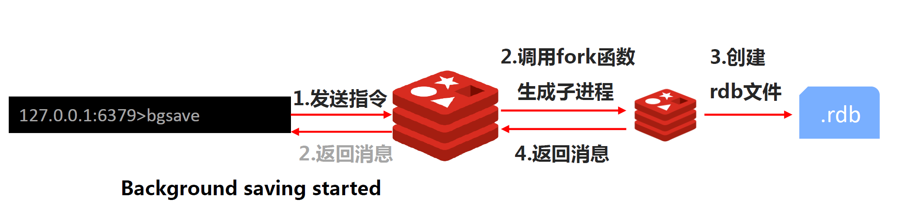
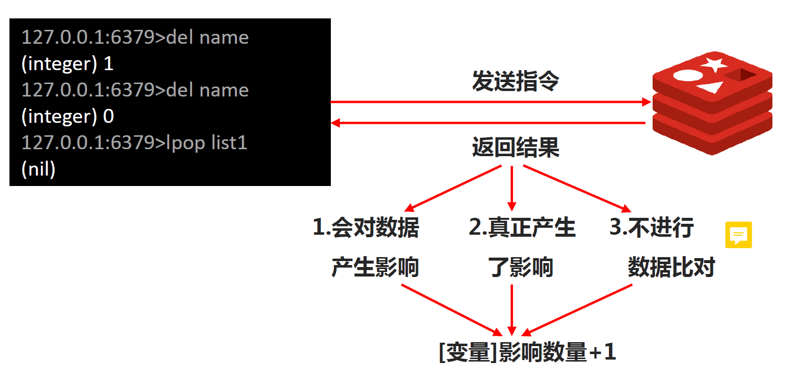
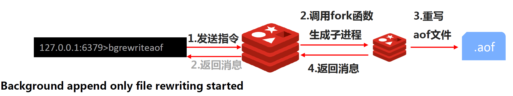
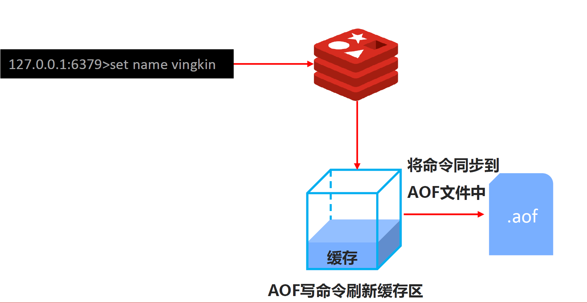
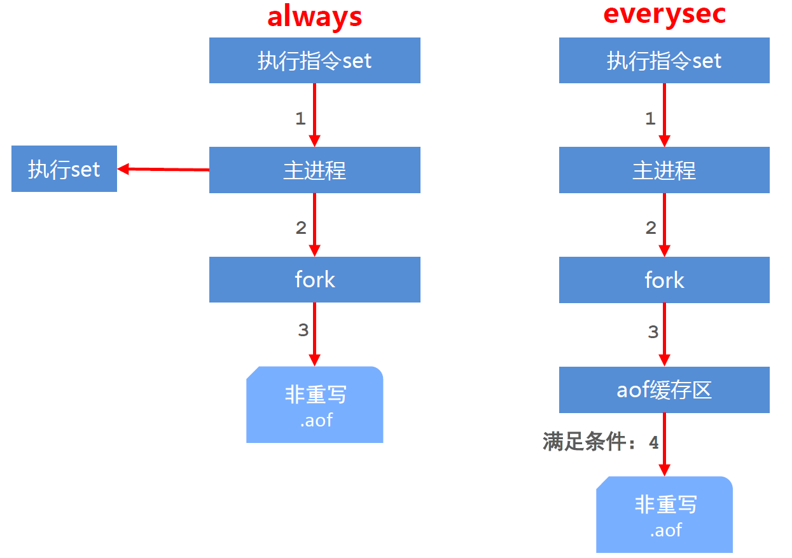
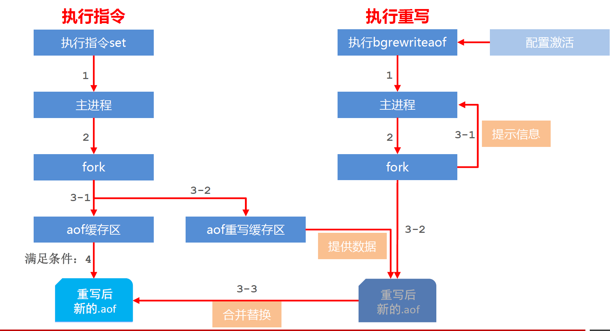

# 1. RDB

## 1.1 RDB三种启动方式

### 1.1.1 save

> 因为redis是单线程执行，而save指令是将RDB操作放到主线程中来执行。save指令的执行会阻塞当前Redis服务器，直到当前RDB过程完成为止，有可能会造成长时间阻塞，线上环境不建议使用

### 1.1.2 bgsave

> bgsave命令是针对save阻塞问题做的优化。Redis内部所有涉及到RDB操作都采用bgsave的方式，save命令可以放弃使用。



### 1.1.3 自动bgsave

配置：`save second changes`，在配置文件中配置

作用：满足限定时间范围内key的变化数量达到指定数量即进行持久化

参数：

* second：监控时间范围
* changes：监控变化量

注意：

* save配置要根据实际业务情况进行设置，频度过高或过低都会出现性能问题，结果可能是灾难性的
* save配置中对于second与changes设置通常具有互补对应关系，尽量不要设置成包含性关系（second大changes就小，second小changes就大）
* save配置启动后执行的是bgsave操作



## 1.2 相关配置

* dbfilename filename.rdb
  * 说明：设置本地数据库文件名，默认值为 dump.rdb
  * 经验：通常设置为dump-端口号.rdb
* dir
  * 说明：设置存储.rdb文件的路径，.aof,.log也会在该目录下
* rdbcompression yes
  * 说明：设置存储至本地数据库时是否压缩数据，默认为 yes，采用 LZF 压缩
  * 经验：通常默认为开启状态，如果设置为no，可以节省 CPU 运行时间，但会使存储的文件变大（巨大）
* rdbchecksum yes
  * 说明：设置是否进行RDB文件格式校验，该校验过程在写文件和读文件过程均进行
  * 经验：通常默认为开启状态，如果设置为no，可以节约读写性过程约10%时间消耗，但是存储一定的数据损坏风险
* stop-writes-on-bgsave-error yes
  * 说明：后台存储过程中如果出现错误现象，是否停止保存操作
  * 经验：通常默认为开启状态
* save second changes

```conf
dir /home/vingkin/software/redis-4.0.0/logs
dbfilename dump-6379.rdb
stop-writes-on-bgsave-error yes
rdbcompression yes
rdbchecksum yes
save 10 2
```

## 1.3 save和bgsave对比

| 方式           | save | bgsave |
| -------------- | ---- | ------ |
| 读写           | 同步 | 异步   |
| 阻塞客户端指令 | 是   | 否     |
| 额外消耗内存   | 否   | 是     |
| 启动新进程     | 否   | 是     |

## 1.4 RDB特殊启动方式

* 全量复制：见主从复制
* 服务器运行过程中重启：debug reload
* 关闭服务器时指定保存数据：shutdown save**（默认情况下执行shutdown命令时，自动执行bgsave(如果没有开启AOF持久化功能)）**

## 1.5 RDB优缺点

### 1.5.1 优点

* RDB是一个紧凑压缩的二进制文件，存储效率较高
* RDB内部存储的是redis在某个时间点的数据快照，非常适合用于数据备份，全量复制等场景
* RDB恢复数据的速度要比AOF快很多
* 应用：服务器中每X小时执行bgsave备份，并将RDB文件拷贝到远程机器中，用于灾难恢复。

### 1.5.2 缺点

* RDB方式无论是执行指令还是利用配置，无法做到实时持久化，具有较大的可能性丢失数据
* bgsave指令每次运行要执行fork操作创建子进程，要牺牲掉一些性能
* Redis的众多版本中未进行RDB文件格式的版本统一，有可能出现各版本服务之间数据格式无法兼容现象

# 2. AOF



## 2.1 AOF概念

* AOF(append only file)持久化：以独立日志的方式记录每次写命令，重启时再重新执行AOF文件中命令达到恢复数据的目的。与RDB相比可以简单描述为改**记录数据为记录数据产生的过程**
* AOF的主要作用是解决了数据持久化的实时性，目前已经是Redis持久化的主流方式

## 2.2 AOF写数据过程

> 客户端发出一条指令给redis服务器，redis服务器将指令放入AOP写命令刷新缓存区，最后通过一些策略，将缓存区中的命令全部同步到aop文件中。这些策略在后面叙述。



## 2.3 AOF写数据三种策略

* always：每次写入操作均同步到AOF文件中，数据零误差，性能较低
* everysec：每秒将缓冲区中的指令同步到AOF文件中，数据准确性较高，性能较高。在系统突然宕机的情况下丢失1秒内的数据。**建议使用，也是默认配置**
* no（系统控制）：由操作系统控制每次同步到AOF文件的周期，整体过程不可控

## 2.4 AOF重写

> 将对同一个数据的若干个条命令执行结果转化成最终结果数据对应的指令进行记录。以此来压缩aop文件大小。**（也就是根据最终的结果来设置写指令）**

### 2.4.1 AOF重写作用

* 降低磁盘占用量，提高磁盘利用率
* 提高持久化效率，降低持久化写时间，提高IO性能
* 降低数据恢复用时，提高数据恢复效率

### 2.4.2 AOF重写规则

* 进程内已超时的数据不再写入文件
* 忽略无效指令，重写时使用进程内数据直接生成，这样新的AOF文件只保留最终数据的写入命令。如del key1、 hdel key2、srem key3、set key4 111、set key4 222等
* 对同一数据的多条写命令合并为一条命令。如lpush list1 a、lpush list1 b、 lpush list1 c 可以转化为：lpush list1 a b c。**为防止数据量过大造成客户端缓冲区溢出，对list、set、hash、zset等类型，每条指令最多写入64个元素**

### 2.4.3 AOF重写方式

#### 手动重写

`bgrewriteaof`

#### 自动重写

自动重写触发条件设置：

`auto-aof-rewrite-min-size size`

`auto-aof-rewrite-percentage percent`

自动重写触发比对参数（ 运行指令info Persistence获取具体信息 ）：

`aof_current_size`

`aof_base_size`

自动重写触发条件：

$aof\_current\_size \gt auto-aof-rewrite-min-size$

$\frac{aof\_current\_size-aof\_base\_size}{aof\_base\_size} \ge auto-aof-rewrite-percentage$

## 2.5 相关配置

* appendonly yes | no
  * 作用：是否开启AOF持久化功能，默认为不开启状态
* appendfsync always | everysec | no
  * 作用：AOF写数据策略
* appendfilename filename
  * 作用：AOF持久化文件名，默认文件名未appendonly.aof，建议配置为appendonly-端口号.aof
* dir
* auto-aof-rewrite-min-size size
* auto-aof-rewrite-percentage percent

代码中未配置自动重写：

```conf
dir /home/vingkin/software/redis-4.0.0/logs
appendonly yes
appendfilename appendonly-6379.aof
appendfsync everysec
```

## 2.6 AOF工作流程



## 2.7 AOF重写流程



# 3. RDB和AOF区别

## 3.1 区别

| 持久化方式   | RDB                | AOF                |
| ------------ | ------------------ | ------------------ |
| 占用存储空间 | 小（数据级：压缩） | 大（指令级：重写） |
| 存储速度     | 慢                 | 快                 |
| 恢复速度     | 快                 | 慢                 |
| 数据安全性   | 会丢失数据         | 依据策略决定       |
| 资源消耗     | 高                 | 低                 |
| 启动优先级   | 低                 | 高                 |

## 3.2 如何选择

* 对数据非常敏感，建议使用默认的AOF持久化方案
  * AOF持久化策略使用everysecond，每秒钟fsync一次。该策略redis仍可以保持很好的处理性能，当出现问题时，最多丢失0-1秒内的数据。
  * 注意：由于AOF文件存储体积较大，且恢复速度较慢
* 数据呈现阶段有效性，建议使用RDB持久化方案
  * 数据可以良好的做到阶段内无丢失（该阶段是开发者或运维人员手工维护的），且恢复速度较快，阶段点数据恢复通常采用RDB方案
  * 注意：利用RDB实现紧凑的数据持久化会使Redis降的很低，慎重使用
* 综合对比
  * RDB与AOF的选择实际上是在做一种权衡，每种都有利有弊
  * 如不能承受数分钟以内的数据丢失，对业务数据非常敏感，选用AOF
  * 如能承受数分钟以内的数据丢失，且追求大数据集的恢复速度，选用RDB
  * 灾难恢复选用RDB
  * 双保险策略，同时开启 RDB 和 AOF，**重启后，Redis优先使用 AOF 来恢复数据**，降低丢失数据的量