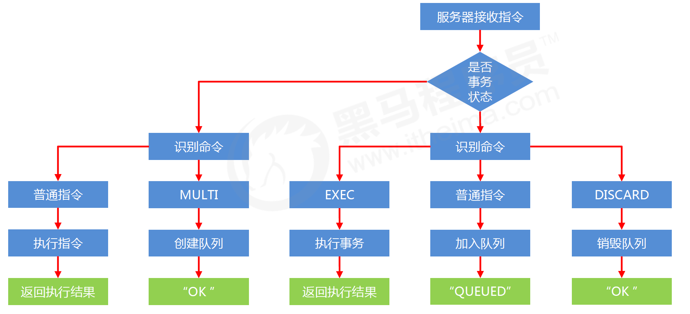
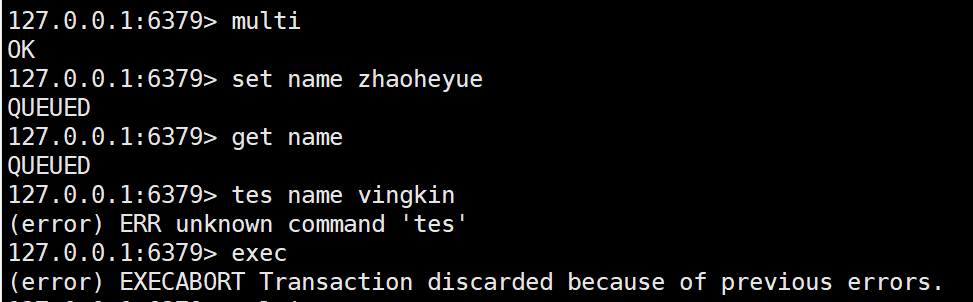
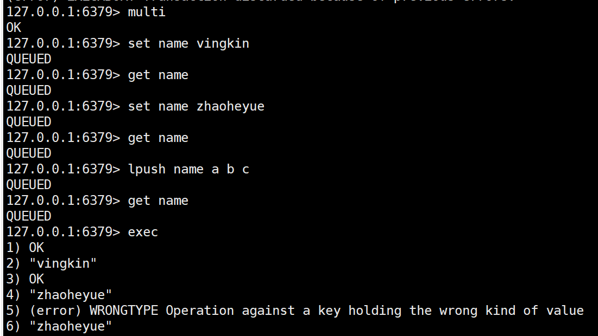

# 1. 事务

## 1.1 事务的基本操作

* multi
  * 开启事务
  * 作用：设定事务的开启位置，此指令执行后，后续的所有指令均加入到事务中
* exec
  * 执行事务
  * 设定事务的结束位置，同时执行事务。与multi成对出现，成对使用
* discard
  * 取消事务
  * 终止当前事务的定义，发生在multi之后，exec之前

[scode type="yellow"]

注意：加入事务的命令暂时进入到任务队列中，并没有立即执行，只有执行exec命令才开始执行

[/scode]

## 1.2 事务的工作流程

> 首先服务器判断是否包含multi指令：
>
> * 不包含
>   * 执行指令
>   * 返回执行结果
> * 包含
>   * 创建队列
>   * 判断是普通指令还是exec或者discard
>     * 普通指令：加入队列
>     * exec：执行事务
>     * discard：销毁队列

## 1.3 事务的注意事项

**定义事务的过程中，命令格式输入错误怎么办？**

* 语法错误：指命令书写格式有误
* 处理结果：如果定义的事务中所包含的命令存在语法错误，**整体事务中所有命令均不会执行。包括那些语法正确的命令。**

**定义事务的过程中，命令执行出现错误怎么办？**

* 运行错误：指命令格式正确，但是无法正确的执行。例如对list进行incr操作
* 处理结果：能够正确运行的命令会执行，运行错误的命令不会被执行

[scode type="yellow"]

注意：已经执行完毕的命令对应的数据不会自动回滚，需要程序员自己在代码中实现回滚。

[/scode]

# 2. 锁

## 2.1 案例1

> 在执行exec前如果key发生了变化，终止事务执行

### 2.1.1 业务场景

天猫双11热卖过程中，对已经售罄的货物追加补货，4个业务员都有权限进行补货。补货的操作可能是一系列的操作，牵扯到多个连续操作，如何保障不会重复操作？

### 2.1.2 业务分析

* 多个客户端有可能同时操作同一组数据，并且该数据一旦被操作修改后，将不适用于继续操作
* 在操作之前锁定要操作的数据，一旦发生变化，终止当前操作

### 2.1.3 解决方案

* 对 key 添加监视锁，在执行exec前如果key发生了变化，终止事务执行，`watch key [key ... ]`
* 取消对所有 key 的监视 `unwatch`

[scode type="grenn"]

redis 应用基于状态控制的批量任务执行

[/scode]

## 2.2 案例2

### 2.2.1 业务场景

天猫双11热卖过程中，对已经售罄的货物追加补货，且补货完成。客户购买热情高涨，3秒内将所有商品购买完毕。本次补货已经将库存全部清空，如何避免最后一件商品不被多人同时购买？【超卖问题】

### 2.2.2 业务分析

* 使用watch监控一个key有没有改变已经不能解决问题，此处要监控的是具体数据
* 虽然redis是单线程的，但是多个客户端对同一数据同时进行操作时，如何避免不被同时修改？

### 2.2.3 解决方案

> **利用setnx命令的返回值特征，有值则返回设置失败，无值则返回设置成功**。只有setnx是有返回值的，对于set和setex只会返回ok。所以只能用setnx

* 使用setnx设置一个公共锁 `setnx lock-key value`
  * 对于返回设置成功的，拥有控制权，进行下一步的具体业务操作
  * 对于返回设置失败的，不具有控制权，排队或等待
* 操作完毕通过del操作释放锁

[scode type="yellow"]

注意：上述解决方案是一种设计概念，依赖规范保障，具有风险性

[/scode]

[scode type="green"]

redis 应用基于分布式锁对应的场景控制

[/scode]

**对于只使用setnx来设置锁会出现用户宕机无法释放锁的情况，这时候需要对公共锁设定有效期**

使用 expire 为锁key添加时间限定，到时不释放，放弃锁

`expire lock-key second `

`pexpire lock-key milliseconds`

由于操作通常都是微秒或毫秒级，因此该锁定时间不宜设置过大。具体时间需要业务测试后确认。

* 例如：持有锁的操作最长执行时间127ms，最短执行时间7ms。
* 测试百万次最长执行时间对应命令的最大耗时，测试百万次网络延迟平均耗时
* 锁时间设定推荐：最大耗时*120%+平均网络延迟*110%
* 如果业务最大耗时<<网络平均延迟，通常为2个数量级，取其中单个耗时较长即可