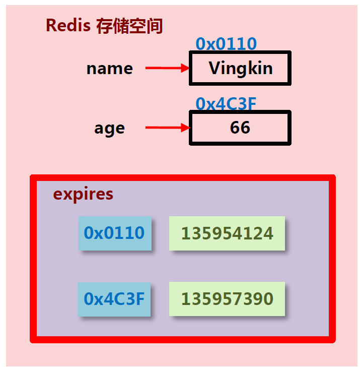
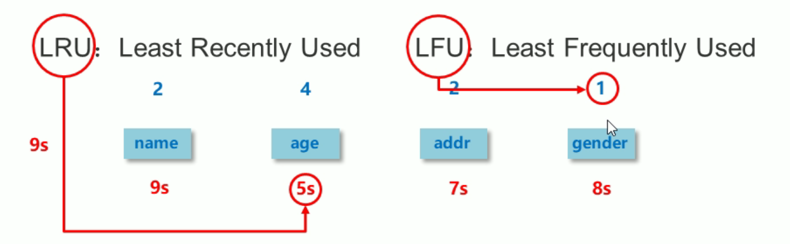

[scode type="green"]

删除策略指的是对那些设定了有效期并且已经过期的数据进行删除所用的策略。

Redis作为单线程应用对于那些set和get操作的优先级应该高于删除操作，set和get不应该因为删除操作而阻塞。所以一个合适的删除策略就很重要，既不占用太多的内存，也不占用太多CPU，上述两点将成为删除策略特别需要考虑的两点。

[/scode]

# 1. Redis数据的时效性

Redis是一种内存级数据库，所有数据均存放在内存中，内存中的数据可以通过TTL指令获取其状态

* xx：具有时效性且没有过期的数据
* -1：永久有效的数据
* -2：**已经过期的数据** 或 被删除的数据 或 未定义的数据

# 2. 数据删除策略

* 定时删除
* 惰性删除
* 定期删除

## 2.1 时效性数据的存储结构

下述五个操作可以为key设定有效期：

* setex
* expire
* expireat
* pexpire
* pexpireat

通过开辟一个expires空间，在该空间内记录key的地址以及有效期来存储一个key的有效期

## 2.2 数据删除策略的目标

在**内存占用与CPU占用之间寻找一种平衡**，顾此失彼都会造成整体redis性能的下降，甚至引发服务器宕机或内存泄露

## 2.3 定时删除

> 立即删除过期的key

* 创建一个定时器，当key设置有过期时间，且过期时间到达时，由定时器任务立即执行对键的删除操作
* **优点：**节约内存，到时就删除，快速释放掉不必要的内存占用
* **缺点：**CPU压力很大，无论CPU此时负载量多高，均占用CPU，会影响redis服务器响应时间和指令吞吐量
* **总结：**用处理器性能换取存储空间（时间换空间）

## 2.4 惰性删除

> 在调取任何获取数据的操作之前，内部都将执行`expireIfNeeded()`函数，检查数据是否过期。

* 数据到达过期时间，不做处理。等下次访问该数据时
  * 如果未过期，返回数据
  * 发现已过期，删除，返回不存在
* **优点：**节约CPU性能，发现必须删除的时候才删除
* **缺点：**内存压力很大，出现长期占用内存的数据
* **总结：**用存储空间换取处理器性能（时间换空间）

## 2.5 定期删除

> 周期性的删除数据，是一种折中方案

* Redis启动服务器初始化时，读取配置`server.hz`的值，默认为10
* 每秒钟对服务器进行`server.hz`次轮询(`serverCron()`)，在serverCron操作中挨个访问所有数据库(`databasesCron()`)，然后对每个库中的key进行轮询访问（`activeExpireCycle()`）。
* `activeExpireCycle()`对每个expires[\*]逐一进行检测，每次执行$250ms/server.hz$
* 对某个expire[\*]检测时，随机挑选W个key检测
  * 如果key超时，删除key
  * 如果一轮中删除的key的数量>W*25%，循环该过程
  * 如果一轮中删除的key的数量$\le$W*25%，检查下一个expires[\*]，0-15循环
  * W取值=`ACTIVE_EXPIRE_CYCLE_LOOKUPS_PER_LOOP`属性值
* 参数`current_db`用于记录`activeExpireCycle()` 进入哪个expires[\*] 执行
* 如果`activeExpireCycle()`执行时间到期，下次从`current_db`继续向下执行

### 2.5.1 定期删除特点

> 周期性轮询redis库中的时效性数据，采用随机抽取的策略，利用过期数据占比的方式控制删除频度

* 特点1：CPU性能占用设置有峰值，检测频度可自定义设置
* 特点2：内存压力不是很大，长期占用内存的冷数据会被持续清理

总结：周期性抽查存储空间**（随机抽查，重点抽查）**

## 2.5 删除策略对比

|          | 内存使用对比     | CPU使用对比                   | 总结               |
| -------- | ---------------- | ----------------------------- | ------------------ |
| 定时删除 | 节约内存，无占用 | 不分时段占用CPU资源，频度高   | 时间换空间         |
| 惰性删除 | 内存占用严重     | 延时执行，CPU利用率高         | 空间换时间         |
| 定期删除 | 内存定期随机清理 | 每秒花费固定的CPU资源维护内存 | 随机抽查，重点抽查 |

# 3. 逐出算法

> 用于解决当新数据进入redis时，如果内存不足怎么办的问题

* Redis使用内存存储数据，在执行每一个命令前，会调用`freeMemoryIfNeeded()`检测内存是否充足。如果内存不满足新加入数据的最低存储要求，redis要临时删除一些数据为当前指令清理存储空间。清理数据的策略称为逐出算法。

* 注意：逐出数据的过程不是100%能够清理出足够的可使用的内存空间，如果不成功则反复执行。当对所有数据尝试完毕后，如果不能达到内存清理的要求，将出现错误信息。
  `(error) OOM command not allowed when used memory >'maxmemory'`

## 3.1 影响数据住处算法的相关配置

* 最大可使用内存`maxmemory`：占用物理内存的比例，默认值为0，表示不限制。生产环境中根据需求设定，通常设置在50%以上。
* 每次选取待删除数据的个数`maxmemory-samples`：选取数据时并不会全库扫描，导致严重的性能消耗，降低读写性能。因此采用随机获取数据的方式作为待检测删除数据
* 删除策略`maxmemory-policy`：达到最大内存后的，对被挑选出来的数据进行删除的策略

## 3.2 删除策略

> 注意LRU就是最长时间没有使用的数据，LFU就是使用次数最少的数据
>
> 可以通过使用INFO命令输出监控信息，查询缓存 hit 和 miss 的次数，根据业务需求调优数据逐出策略配置

* 检测易失数据（就是可能过期的数据`server.db[i].expires`）
  1. `volatile-lru`：挑选最近最少使用的数据淘汰（推荐）
  2. `volatile-lfu`：挑选最近使用次数最少的数据淘汰
  3. `volatile-ttl`：挑选将要过期的数据淘汰
  4. `volatile-random`：任意选择数据淘汰
* 检测所有数据（所有数据集`server.db[i].dict`)
  1. `allkeys-lru`：挑选最近最少使用的数据淘汰
  2. `allkeys-lfu`：挑选最近使用次数最少的数据淘汰
  3. `allkeys-random`：任意选择数据淘汰
* 放弃驱逐数据
  1. `no-enviction`：禁止驱逐数据（redis4.0中默认策略），会引发错误OOM（Out Of Memory）

