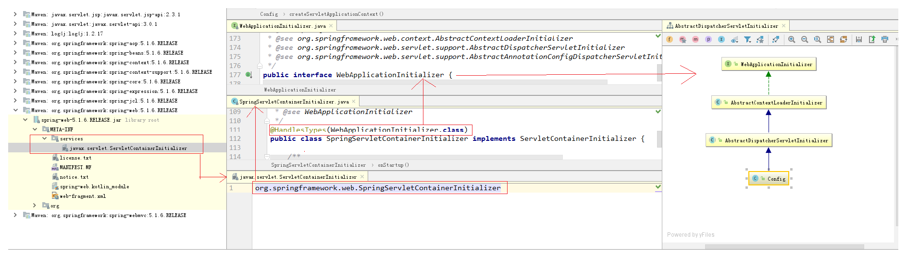
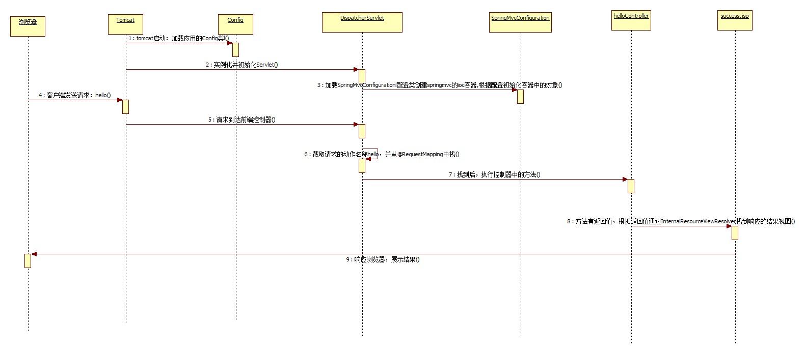
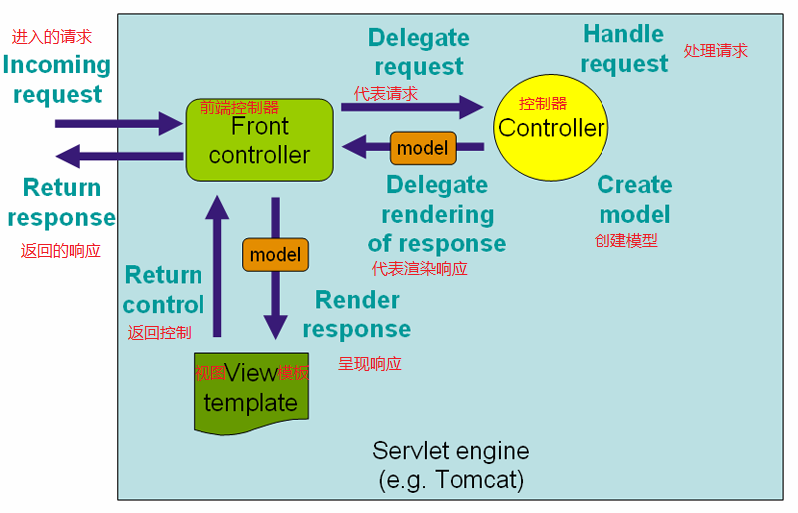
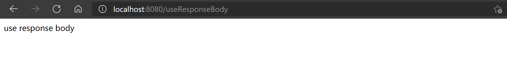
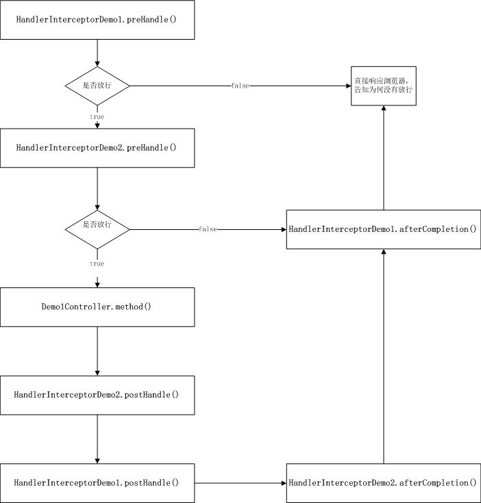

# 1 基于Servlet3.0的环境搭建

## 1.1 导入坐标

pom.xml

```xml
<dependencies>
    <dependency>
        <groupId>org.springframework</groupId>
        <artifactId>spring-context</artifactId>
        <version>5.1.6.RELEASE</version>
    </dependency>
    <dependency>
        <groupId>org.springframework</groupId>
        <artifactId>spring-webmvc</artifactId>
        <version>5.1.6.RELEASE</version>
    </dependency>
    <!-- https://mvnrepository.com/artifact/javax.servlet/javax.servlet-api -->
    <dependency>
        <groupId>javax.servlet</groupId>
        <artifactId>javax.servlet-api</artifactId>
        <version>3.0.1</version>
        <scope>provided</scope>
    </dependency>
    <dependency>
        <groupId>javax.servlet.jsp</groupId>
        <artifactId>javax.servlet.jsp-api</artifactId>
        <version>2.3.3</version>
        <scope>provided</scope>
    </dependency>
    <dependency>
        <groupId>log4j</groupId>
        <artifactId>log4j</artifactId>
        <version>1.2.17</version>
    </dependency>
    <dependency>
        <groupId>org.springframework</groupId>
        <artifactId>spring-context-support</artifactId>
        <version>5.1.6.RELEASE</version>
    </dependency>
</dependencies>
```

## 1.2 编写控制器

HelloController.java

```java
@Controller
public class HelloController {

    @RequestMapping("/hello")
    public String sayHello() {
        System.out.println("控制器方法执行了");
        return "success";
    }

}
```

## 1.3 编写配置类

SpringConfiguration.java

```java
@Configuration
@ComponentScan(value = "com.vingkin", excludeFilters = @ComponentScan.Filter(type = FilterType.ANNOTATION, classes = Controller.class))
public class SpringConfiguration {
}
```

SpringMvcConfiguration.java

```java
@Configuration
@ComponentScan("com.vingkin.web")
@EnableWebMvc
public class SpringMvcConfiguration {

    /**
     * 创建视图解析器，并存入IOC容器
     * @return
     */
    @Bean
    public ViewResolver createViewResolver() {
        InternalResourceViewResolver viewResolver = new InternalResourceViewResolver();
        viewResolver.setPrefix("/WEB-INF/pages/");
        viewResolver.setSuffix(".jsp");
        return viewResolver;
    }
    
}
```

Config.java

```java
public class Config extends AbstractDispatcherServletInitializer {
    /**
     * 注册字符集过滤器
     * @param servletContext
     * @throws ServletException
     */
    @Override
    public void onStartup(ServletContext servletContext) throws ServletException {
        super.onStartup(servletContext);
        CharacterEncodingFilter characterEncodingFilter = new CharacterEncodingFilter();
        characterEncodingFilter.setEncoding("UTF-8");
        servletContext.addFilter("characterEncodingFilter", characterEncodingFilter);
    }

    /**
     * 用于创建SpringMVC的IOC容器
     * @return
     */
    @Override
    protected WebApplicationContext createServletApplicationContext() {
        AnnotationConfigWebApplicationContext acw = new AnnotationConfigWebApplicationContext();
        acw.register(SpringMvcConfiguration.class);
        return acw;
    }

    /**
     * 用于指定DispatcherServlet的请求映射
     * @return
     */
    @Override
    protected String[] getServletMappings() {
        return new String[]{"/"};
    }

    /**
     * 用于创建Spring的IOC容器
     * @return
     */
    @Override
    protected WebApplicationContext createRootApplicationContext() {
        AnnotationConfigWebApplicationContext acw = new AnnotationConfigWebApplicationContext();
        acw.register(SpringConfiguration.class);
        return acw;
    }
}
```

## 1.4 编写页面

index.jsp

```jsp
<%@page contentType="text/html; UTF-8" language="java" pageEncoding="UTF-8" %>
<html>
<body>
<a href="${pageContext.request.contextPath}/hello">SpringMVC基于servlet3.0规范纯注解开发的入门</a>
</body>
</html>
```

success.jsp

```jsp
<%@page contentType="text/html; UTF-8" language="java" pageEncoding="UTF-8" %>
<html>
<body>
<h2>执行成功</h2>
</body>
</html>
```

# 2 入门案例执行过程分析

## 2.1 初始化过程分析

### 2.1.1 Servlet3.0规范加入的内容

ServletContainerInitializer.java

```java
public interface ServletContainerInitializer {
    /**
     * 启动容器是做一些初始化操作，例如注册Servlet,Filter,Listener等等。
     * @see javax.servlet.annotation.HandlesTypes
     * @since Servlet 3.0
     */
    void onStartup(Set<Class<?>> var1, ServletContext var2) throws ServletException;
}
```

HandlesTypes.java

```java
/**
 * 用于指定要加载到ServletContainerInitializer接口实现类中的字节码
 * @see javax.servlet.ServletContainerInitializer
 * @since
 */
@Target({ElementType.TYPE})
@Retention(RetentionPolicy.RUNTIME)
public @interface HandlesTypes {
    /**
     * 指定要加载到ServletContainerInitializer实现类的onStartUp方法中类的字节码。
     * 字节码可以是接口，抽象类或者普通类。
     */
    Class[] value();
}
```

### 2.1.2 SpringMVC框架使用Servlet3.0规范

> 任何要使用Servlet3.0规范且脱离web.xml的配置，在使用时都必须在对应的jar包的`METAINF/services`目录创建一个名`javax.servlet.ServletContainerInitializer`的文件，文件内容指定具体的ServletContainerInitializer实现类，那么，当web容器启动时就会运行这个初始化器做一些组件内的初始化工作。



### 2.1.3 Config类中的onStartUp方法

Config.java

```java
public class Config extends AbstractDispatcherServletInitializer {
    /**
     * 注册字符集过滤器
     *
     * @param servletContext
     * @throws ServletException
     */
    @Override
    public void onStartup(ServletContext servletContext) throws ServletException {
        super.onStartup(servletContext);
        CharacterEncodingFilter characterEncodingFilter = new CharacterEncodingFilter();
        characterEncodingFilter.setEncoding("UTF-8");
        servletContext.addFilter("characterEncodingFilter", characterEncodingFilter);
    }
    
    // ...
}
```

### 2.1.4 AbstractDispatcherServletInitializer中的onStartUp方法

AbstractDispatcherServletInitializer.java

```java
public abstract class AbstractDispatcherServletInitializer extends AbstractContextLoaderInitializer {

	@Override
	public void onStartup(ServletContext servletContext) throws ServletException {
        // 执行父类的onStartUp方法
		super.onStartup(servletContext);
        // 注册DispatcherServlet
		registerDispatcherServlet(servletContext);
	}

	// 注册DispatcherServlet方法
	protected void registerDispatcherServlet(ServletContext servletContext) {
		String servletName = getServletName();
		Assert.hasLength(servletName, "getServletName() must not return null or empty");

        // 创建表现层IOC容器
		WebApplicationContext servletAppContext = createServletApplicationContext();
		Assert.notNull(servletAppContext, "createServletApplicationContext() must not return null");

        // 创建DispatcherServlet对象
		FrameworkServlet dispatcherServlet = createDispatcherServlet(servletAppContext);
		Assert.notNull(dispatcherServlet, "createDispatcherServlet(WebApplicationContext) must not return null");
		dispatcherServlet.setContextInitializers(getServletApplicationContextInitializers());

		ServletRegistration.Dynamic registration = servletContext.addServlet(servletName, dispatcherServlet);
		if (registration == null) {
			throw new IllegalStateException("Failed to register servlet with name '" + servletName + "'. " +
					"Check if there is another servlet registered under the same name.");
		}

		registration.setLoadOnStartup(1);
		registration.addMapping(getServletMappings());
		registration.setAsyncSupported(isAsyncSupported());

		Filter[] filters = getServletFilters();
		if (!ObjectUtils.isEmpty(filters)) {
			for (Filter filter : filters) {
				registerServletFilter(servletContext, filter);
			}
		}

		customizeRegistration(registration);
	}

	// 创建DispatcherServlet方法
	protected FrameworkServlet createDispatcherServlet(WebApplicationContext servletAppContext) {
		return new DispatcherServlet(servletAppContext);
	}

	// 设置Servlet映射
	protected abstract String[] getServletMappings();

	// 其他的省略
}
```

### 2.1.5 注册DispatcherServlet

AbstractContextLoaderInitializer.java

```java
public abstract class AbstractContextLoaderInitializer implements WebApplicationInitializer {

	/** Logger available to subclasses. */
	protected final Log logger = LogFactory.getLog(getClass());

	// onStartUp方法，调用注册ContextLoaderListener方法
	@Override
	public void onStartup(ServletContext servletContext) throws ServletException {
		registerContextLoaderListener(servletContext);
	}

	// 创建根容器，并注册ContextLoaderListener
	protected void registerContextLoaderListener(ServletContext servletContext) {
        // 创建根容器方法
		WebApplicationContext rootAppContext = createRootApplicationContext();
		if (rootAppContext != null) {
            // 创建ContextLoaderListener
			ContextLoaderListener listener = new ContextLoaderListener(rootAppContext);
			listener.setContextInitializers(getRootApplicationContextInitializers());
          	// 注册ContextLoaderListener
			servletContext.addListener(listener);
		}
		else {
			logger.debug("No ContextLoaderListener registered, as " +
					"createRootApplicationContext() did not return an application context");
		}
	}

	// 其余代码省略...

}
```

## 2.2 时序图



## 2.3 官方流程图



# 3 基础注解

## 3.1 @Controller

> 用于修饰表现层控制器的注解

### 3.1.1 源码

Controller.java

```java
@Target({ElementType.TYPE})
@Retention(RetentionPolicy.RUNTIME)
@Documented
@Component
public @interface Controller {
    
    @AliasFor(annotation = Component.class)
    String value() default "";

}
```

### 3.1.2 示例

HelloController.java

```java
@Controller
public class HelloController {

    // hello前面的/可写，可不写
    @RequestMapping("/hello")
    public String sayHello() {
        System.out.println("控制器方法执行了");
        return "success";
    }

}
```

## 3.2 @RequestMapping

> 用于建立请求URL和处理请求方法之间的对应关系（路由）
>
> 可以写在类上和方法上，当类上和方法上都有的时候就像二级路由嵌套

### 3.2.1 源码

RequestMapping.java

```java
@Target({ElementType.METHOD, ElementType.TYPE})
@Retention(RetentionPolicy.RUNTIME)
@Documented
@Mapping
public @interface RequestMapping {

    // 给请求url一个名称
    String name() default "";

    // 用于指定请求路径，同path，请求路径前的/可写可不写
    @AliasFor("path")
    String[] value() default {};
    
    @AliasFor("value")
    String[] path() default {};

    // 用于指定请求方法，具体可见RequestMethod枚举类
    RequestMethod[] method() default {};

    /** 
     * 用于指定请求参数，支持简单的表达式，要求请求参数的key和value必须和配置的一样
     * 例如：
     *	params = {"accountName"}，表示请求参数必须有accountName
     * 	params = {"money!100"}，表示请求参数中的money不能是100
     */
    String[] params() default {};

    /**
     * 用于指定限制请求头的条件
     * 例如：@RequestMapping(headers="content-type=text/*")
     */
    String[] headers() default {};

    /**
     * 用于指定接收的请求正文类型（MIME类型）
     * 例如：
     *		consumes = "text/plain"
     *		consumes = {"text/plain", "application/*"}
     */
    String[] consumes() default {};

    /**
     * 用于指定可以生成的响应正文类型（MIME类型）
     * 例如：
     *		products = "text/plain"
     * 		products = {"text/plain", "application/*"}
     *		products = MediaType.APPLICATION_JSON_UTF8_VALUE
     */
    String[] produces() default {};

}
```

### 3.2.2 示例

RequestMappingController.java

```java
@Controller
public class RequestMappingController {

    @RequestMapping(value = "/useRequestMapping", name = "useRequestMapping",
            method = RequestMethod.GET, headers = {"Accept-Encoding"})
    public String useRequestMapping() {
        System.out.println("使用@RequestMapping注解");
        return "success";
    }
}
```

### 3.2.3 衍生注解

> 需要注意的是：@RequestMapping支持写在类或者接口上，而衍生的只支持写在方法上。所以说@RequestMapping可以实现“路由嵌套”。
>
> 衍生注解在使用上参数少了一个method，因为注解源码已经指定了，一般来说使用@RequestMapping即可。

* @GetMapping
* @PostMapping
* @PutMapping
* @DeleteMapping

就举一个@GetMapping的源码来说明：

GetMapping.java

```java
@Target(ElementType.METHOD)
@Retention(RetentionPolicy.RUNTIME)
@Documented
// 下面注解就说明了衍生注解与@RequestMapping一样，就是不用再指定具体请求方法了
@RequestMapping(method = RequestMethod.GET)
public @interface GetMapping {

   @AliasFor(annotation = RequestMapping.class)
   String name() default "";

   @AliasFor(annotation = RequestMapping.class)
   String[] value() default {};

   @AliasFor(annotation = RequestMapping.class)
   String[] path() default {};

   @AliasFor(annotation = RequestMapping.class)
   String[] params() default {};

   @AliasFor(annotation = RequestMapping.class)
   String[] headers() default {};

   @AliasFor(annotation = RequestMapping.class)
   String[] consumes() default {};

   @AliasFor(annotation = RequestMapping.class)
   String[] produces() default {};

}
```

## 3.3 @RequestParam

> 此注解是从请求正文中获取请求参数，给控制器方法形参赋值的。当请求参数的名称和控制器方法形参变量名称一致时，无须使用此注解。**（就比如说input的name为username，当控制器方法形参也为username时，就不需要该参数来指定请求参数的名称了。当input的name为username，但控制器方法形参为name时，需要该注解指定将username赋值给控制器形参name）**。注意此方法还可以**给形参提供默认值**，而且**只能用在方法的参数上**。

### 3.3.1 源码

RequestParam.java

```java
@Target(ElementType.PARAMETER)
@Retention(RetentionPolicy.RUNTIME)
@Documented
public @interface RequestParam {
	// 指定获取请求参数的名称，比如上面input的username
    @AliasFor("name")
    String value() default "";

    @AliasFor("value")
    String name() default "";

   	// 为true时，参数没有值会报错
    boolean required() default true;

    // 参数在没有值的时候的默认值
    String defaultValue() default ValueConstants.DEFAULT_NONE;

}
```

### 3.3.2 示例

前面两个方法就是可以省略@RequestParam

RequestParamController.java

```java
@Controller
public class RequestParamController {

    /**
     * 基本类型和String类型的封装
     */
    @RequestMapping("/useParam1")
    public String param1(String name, Integer age) {
        System.out.println("name is " + name + ", age is " + age);
        return "success";
    }

    /**
     * 实体类类型的封装
     */
    @RequestMapping(value = "/useParam2", method = RequestMethod.POST)
    public String param2(User user) {
        System.out.println("user is " + user);
        return "success";
    }

    // 在请求参数中找currentPage的值给page赋值
    // 如果在请求参数中没有找到currentPage，就会用默认的1给page赋值
    // 就比如说在分页的使用中，对与用户列表，点击左侧的用户列表右侧显示对应分页用户列表显示，此时如果没有指定
    // 页数，那么服务器将不知道相应哪一页，这时就可以使用defaultValue来指定没有参数时的默认页面
    @RequestMapping("/useParam3")
    public String useRequestParam(@RequestParam(value = "currentPage", defaultValue = "1") int page) {
        System.out.println("CurrentPage: " + page);
        return "success";
    }

}
```

index.jsp
```jsp
<a href="${pageContext.request.contextPath}/useParam1?name=vingkin&age=18">@RequestParam1</a><br/>
<form action="useParam2" method="post">
    <%--表单中的名称应该与实体类中set方法后面的名称一致，因为set都是按规则生成的，所以与成员变量名称一致即可--%>
    用户名：<input type="text" name="username"><br/>
    密码：<input type="text" name="password"><br/>
    年龄：<input type="text" name="age"><br/>
    性别：<input type="text" name="gender"><br/>
    生日：<input type="date" name="birthday"><br/>
    <input type="submit" value="@RequestParam2">
</form>
<a href="useParam3?currentPage=10">@RequestParam3</a>
```

## 3.4 @InitBinder

> 用于初始化表单的请求参数的数据绑定器。比如input日期选择器2021-09-01类型的日期封装到User对象中Date类型的成员变量，使用此注解进行日期解析。

### 3.4.1 源码

InitBinder.java

```java
@Target({ElementType.METHOD})
@Retention(RetentionPolicy.RUNTIME)
@Documented
public @interface InitBinder {
	
    // 指定给那些参数进行绑定操作，不写就是绑定所有
    String[] value() default {};

}
```

### 3.4.2 示例

> 解析出input中date类型的数据封装到User对象中

InitBinderController.java

```java
@Controller
public class InitBinderController {

    @RequestMapping(value = "/userInitBinder")
    public String useInitBinder(User user) {
        System.out.println("user is " + user);
        return "success";
    }
	
    @InitBinder
    public void initBinder(WebDataBinder dataBinder) {
        dataBinder.addCustomFormatter(new DateFormatter("yyyy-MM-dd"));
    }
    
}
```

index.jsp

```jsp
<form action="userInitBinder" method="post">
    <%--表单中的名称应该与实体类中set方法后面的名称一致，因为set都是按规则生成的，所以与成员变量名称一致即可--%>
    用户名：<input type="text" name="username"><br/>
    密码：<input type="text" name="password"><br/>
    年龄：<input type="text" name="age"><br/>
    性别：<input type="text" name="gender"><br/>
    生日：<input type="date" name="birthday"><br/>
    <input type="submit" value="@InitBinder">
</form>
```

### 3.4.3 日期解析扩展注解@DateTimeFormat

> 使用这种方法需要在SpringMvcConfig中配置@EnableWebMvc注解才能实现对@DateTimeFormat的解析。

User.java

```java
public class User implements Serializable {

    private Integer id;
    private String username;
    private String password;
    private Integer age;
    private String gender;
    @DateTimeFormat(pattern = "yyyy-MM-dd")
    private Date birthday;
    
}
```

## 3.5 @ExceptionHandler

> 用于注释方法，表示当前方法是控制器执行产生异常后的处理方法

### 3.5.1 源码

ExceptionHandler.java

```java
@Target(ElementType.METHOD)
@Retention(RetentionPolicy.RUNTIME)
@Documented
public @interface ExceptionHandler {

	// 指定需要捕获的异常类型
    Class<? extends Throwable>[] value() default {};

}
```

### 3.5.2 示例

ExceptionHandlerController.java

```java
@Controller
public class ExceptionHandlerController {

    @RequestMapping("/useExceptionHandler")
    public String useExceptionHandler(Integer age) throws Exception {
        if (age == null) {
            throw new NullPointerException();
        }
        if (age > 100) {
            throw new CustomerException("年龄不合法");
        }
        System.out.println("age is " + age);
        return "success";
    }
}
```

CustomerException.java

```java
public class CustomerException extends Exception {

    private String message;

    public CustomerException(String message) {
        this.message = message;
    }

    @Override
    public String getMessage() {
        return message;
    }
    
}
```

index.jsp

```jsp
<a href="useExceptionHandler?age=110">@ExceptionHandler</a>
```

## 3.6 @ControllerAdvice

> 用于给控制器一个增强的通知。比如结合@InitBinder可以实现全局数据绑定解析，结合@ExceptionHandler可以实现全局异常处理。除此之外，还可以和@ModelAttribute结合使用。

### 3.6.1 源码

ControllerAdvice.java

```java
@Target(ElementType.TYPE)
@Retention(RetentionPolicy.RUNTIME)
@Documented
@Component
public @interface ControllerAdvice {

    // 用于指定对哪些包下的控制器进行增强
    @AliasFor("basePackages")
    String[] value() default {};

    @AliasFor("value")
    String[] basePackages() default {};

    // 通过指定类的字节码的方式来指定增强作用范围
    Class<?>[] basePackageClasses() default {};

    // 用于为特定的类型提供增强
    Class<?>[] assignableTypes() default {};

    // 用于为特定注解提供增强
    Class<? extends Annotation>[] annotations() default {};

}
```

### 3.6.2 示例

InitBinderAdvice.java

```java
@ControllerAdvice
public class InitBinderAdvice {

    @InitBinder
    public void initBinder(WebDataBinder dataBinder) {
        dataBinder.addCustomFormatter(new DateFormatter("yyyy-MM-dd"));
    }
    
}
```

ExceptionHandlerAdvice.java

```java
@ControllerAdvice
public class ExceptionHandlerAdvice {
    @ExceptionHandler(Exception.class)
    public String handleException(Model model, Exception e) {
        String errorMsg = e.getMessage();
        if (e instanceof CustomerException) {
            errorMsg = e.getMessage();
        }
        model.addAttribute("errorMsg", errorMsg);
        return "error";
    }
}
```

## 3.7 @RequestHeader

> 从请求的消息头中获取消息头的值，并把值赋给控制器形参方法。注意他只能出现在方法的参数上。

### 3.7.1 源码

RequestHeader.java

```java
@Target(ElementType.PARAMETER)
@Retention(RetentionPolicy.RUNTIME)
@Documented
public @interface RequestHeader {

    // 用于指定请求消息头的名称
    @AliasFor("name")
    String value() default "";

    @AliasFor("value")
    String name() default "";

    boolean required() default true;

    String defaultValue() default ValueConstants.DEFAULT_NONE;

}
```

### 3.7.2 示例

RequestHeaderController.java

```java
@Controller
public class RequestHeaderController {
    @RequestMapping("/useRequestHeader")
    // @RequestHeader的参数与@RequestParam的参数意思一样
    public String useRequestHeader(@RequestHeader(value = "Accept-Language",
            required = false, defaultValue = "test") String header) {
        System.out.println("Accept-Language: " + header);
        return "success";
    }
}
```

## 3.8 @CookieValue

> 从请求消息头中获取Cookie的值，并把值赋给控制器方法形参。注意：它只能出现在方法的形参上。

### 3.8.1 源码

CookieValue.java

```java
@Target(ElementType.PARAMETER)
@Retention(RetentionPolicy.RUNTIME)
@Documented
public @interface CookieValue {
    
    // 用于指定cookie的名称
    @AliasFor("name")
    String value() default "";

    @AliasFor("value")
    String name() default "";

    boolean required() default true;

    String defaultValue() default ValueConstants.DEFAULT_NONE;

}
```

### 3.8.2 示例

CookieValueController.java

```java
@Controller
public class CookieValueController {
    @RequestMapping("/useCookieValue")
    public String useCookieValue(@CookieValue("JSESSIONID") String jsessionid) {
        System.out.println("jsessionid: " + jsessionid);
        return "success";
    }
}
```

## 3.9 @ModelAttribute

> 该注解可以用来修饰方法或参数。当修饰方法时表示执行控制器之前，被此注解修饰的方法都会先执行。当修饰参数时，用于获取指定的数据给参数赋值。

### 3.9.1 源码

ModelAttribute.java

```java
@Target({ElementType.PARAMETER, ElementType.METHOD})
@Retention(RetentionPolicy.RUNTIME)
@Documented
public @interface ModelAttribute {
    
	/**
	 * 当注解写在方法上，则表示存入是的名称，存入的值是方法的返回值
	 * 当注解写在参数上，可以从ModelMap，Model，Map中获取数据
	 */
    @AliasFor("name")
    String value() default "";

    @AliasFor("value")
    String name() default "";

    // 用于是否支持数据绑定
    boolean binding() default true;

}
```

### 3.9.2 示例

> 该案例就是在执行控制器方法useModelAttribute之前会执行@ModelAttribute修饰的showModel方法。showMedel方法中，从input中获取name的值vingkin的值赋值给name，并最后返回vingkinTest存入@ModelAttribute中，key为username。控制器方法userModelAttribute中，从@ModelAttribute中取出username赋值给形参name。

ModelAttributeController.java

```java
@Controller
public class ModelAttributeController {

    @ModelAttribute("username")
    public String showModel(String name, Model model) {
        System.out.println("showModel method name is " + name);
        name = name + "Test";
        // model.addAttribute("name", name);
        return name;
    }

    @RequestMapping("useModelAttribute")
    public String useModelAttribute(@ModelAttribute("username") String name) {
        System.out.println("controller method name is " + name);
        return "success";
    }
}
```

index.jsp

```jsp
<a href="useModelAttribute?name=vingkin">@ModelAttribute</a><br>
```

## 3.10 @SessionAttributes & @SessionAttribute

* @SessionAttributes：通过此注解可以把数据存入会话域，从而无需再使用HttpSession的setAttribute方法。当我们在控制器方法形参中加入了Model或者ModelMap类型的参数时，默认是存入请求域的。使用了此数据就会往会话域添加数据，但是Spring依然会将数据存入请求域中。
* @SessionAttribute：让开发者无需使用HttpSession的getAttribute方法即可从会话域中获取数据

**请求域和会话域的区别：**

* 请求域的数据范围是当前的请求以及当前请求的转发
* 会话域是多次请求之间的数据共享

### 3.10.1 源码

SessionAttributes.java

```java
@Target({ElementType.TYPE})
@Retention(RetentionPolicy.RUNTIME)
@Inherited
@Documented
public @interface SessionAttributes {

    // 指定可以存入会话域的数据名称
    @AliasFor("names")
    String[] value() default {};

    @AliasFor("value")
    String[] names() default {};

    // 指定可以存入会话域的数据类型
    Class<?>[] types() default {};

}
```

SessionAttribute.java

```java
@Target(ElementType.PARAMETER)
@Retention(RetentionPolicy.RUNTIME)
@Documented
public @interface SessionAttribute {
	// 用于指定取出的数据在会话域中的名称
    @AliasFor("name")
    String value() default "";

    @AliasFor("value")
    String name() default "";

    boolean required() default true;

}
```

### 3.10.2 示例

SessionAttributesController.java

```java
@Controller
@SessionAttributes(value = {"message"})
public class SessionAttributesController {

    // 请求域的数据范围是当前的请求以及当前请求的转发
    // 会话域是多次请求之间的数据共享
    // 如果没有@SessionAttributes，message将会存入请求域中
    @RequestMapping("/useSessionAttributes")
    public String useSessionAttributes(Model model) {
        model.addAttribute("message", "message in session");
        return "success";
    }

    @RequestMapping("/useSessionAttribute")
    public String useSessionAttribute(@SessionAttribute(value = "message", required = false) String message) {
        System.out.println(message);
        return "success";
    }

}
```

# 4 JSON数据交互相关注解

## 4.1 @RequestBody

> 用于获取全部的请求体，所谓的请求的就比如像下面index.jsp中ajax的data节点。

### 4.1.1 源码

RequestBody.java

```java
@Target(ElementType.PARAMETER)
@Retention(RetentionPolicy.RUNTIME)
@Documented
public @interface RequestBody {

   	// 用于指定是否必须有请求体
    boolean required() default true;

}
```

### 4.1.2 示例

RequestBodyController.java

```java
@Controller
public class RequestBodyController {

    @RequestMapping("/useRequestBody")
    @ResponseBody
    // 添加jackson的依赖后，会自动将@RequestBody修饰的json类型的字符串封装到User对象中
    public String useRequestBody(@RequestBody(required = false) User user) { 
        System.out.println("user is " + user);
        return "success";
    }

}
```

index.jsp

```jsp
<script src="${pageContext.request.contextPath}/js/jquery-2.2.3.min.js"></script>
<script type="text/javascript">
    $(function () {
        $("#useRequestBodyAjax").click(function () {
            alert("点击事件绑定成功")
            $.ajax({
                url: "useRequestBody",
                type: "post",
                // json格式，注意里面用双引号，否则jackson会报错
                data: '{"username":"vingkin","age":25,"gender":"male"}', 
                contentType: "application/json",
                dataType: "text",
                success: function (data) {
                    console.log(data)
                }
            })
        })
    })
</script>
<a href="#" id="useRequestBodyAjax">@useRequestBody</a><br>
```

**对于静态资源的jquery-2.2.3.min.js的引入需要在SpringMvcConfiguration中配置，使SpringMvcConfiguration实现WebMvcConfigurer接口并且重写addResourceHandlers方法即可**

SpringMvcConfiguration.java

```java
@Configuration
@ComponentScan("com.vingkin.web")
@EnableWebMvc
public class SpringMvcConfiguration implements WebMvcConfigurer {

    @Override
    public void addResourceHandlers(ResourceHandlerRegistry registry) {
        registry.addResourceHandler("/js/**")
                .addResourceLocations("/js/")
                .resourceChain(true)
                .addResolver(new VersionResourceResolver().addContentVersionStrategy("/**"));
    }
    
}
```

jackson依赖

```xml
<dependency>
    <groupId>com.fasterxml.jackson.core</groupId>
    <artifactId>jackson-core</artifactId>
    <version>2.9.0</version>
</dependency>
<dependency>
    <groupId>com.fasterxml.jackson.core</groupId>
    <artifactId>jackson-databind</artifactId>
    <version>2.9.0</version>
</dependency>
<dependency>
    <groupId>com.fasterxml.jackson.core</groupId>
    <artifactId>jackson-annotations</artifactId>
    <version>2.9.0</version>
</dependency>
```

## 4.2 @ResponseBody

> 用于流式输出相应正文。当开发前后端分离的项目时，需要返回一个json时，就会用到该注解。具体意思见下面示例。

### 4.2.1 源码

ResponseBody.java

```java
@Target({ElementType.TYPE, ElementType.METHOD})
@Retention(RetentionPolicy.RUNTIME)
@Documented
public @interface ResponseBody {

}
```

### 4.2.2 示例

ResponseBodyController.java

```java
@Controller
public class ResponseBodyController {

    @RequestMapping("/useResponseBody")
    // 写在方法上表示当前方法的返回值用流输出，如果写在类上，则所有方法都将返回值用流输出
    @ResponseBody 
    public String useResponseBody() {
        return "use response body";
    }
    
}
```

index.jsp

```jsp
<a href="useResponseBody">@ResponseBody</a>
```

使用流式输出后页面将如下显示：



## 4.3 @RestController

> 功能 = @Controller + @ResponseBody

### 4.3.1 源码

RestController.java

```java
@Target(ElementType.TYPE)
@Retention(RetentionPolicy.RUNTIME)
@Documented
@Controller
@ResponseBody
public @interface RestController {

    // 用于指定存入IOC容器时bean的唯一标识
    @AliasFor(annotation = Controller.class)
    String value() default "";

}
```

## 4.4 @RestControllerAdvice

> 功能 = @ControllerAdvice + @ResponseBody

### 4.4.1 源码

RestControllerAdvice.java

```java
@Target(ElementType.TYPE)
@Retention(RetentionPolicy.RUNTIME)
@Documented
@ControllerAdvice
@ResponseBody
public @interface RestControllerAdvice {

    @AliasFor("basePackages")
    String[] value() default {};

    @AliasFor("value")
    String[] basePackages() default {};

    Class<?>[] basePackageClasses() default {};

    Class<?>[] assignableTypes() default {};

    Class<? extends Annotation>[] annotations() default {};

}
```

# 5 Rest风格URL请求相关注解

## 5.1 Rest风格说明

**用户的增删改查请求URL：**

* 传统方式：
  ```apl
  http://localhost:8080/user/save		    POST
  http://localhost:8080/user/update	    POST
  http://localhost:8080/user/delete?id=1	GET
  http://localhost:8080/user/find?id=1	GET
  ```
* REST:
  ```apl
  http://localhost:8080/user/		    POST		保存
  http://localhost:8080/user/3		PUT		    更新
  http://localhost:8080/user/5		DELETE		删除
  http://localhost:8080/user/1		GET		    查询一个
  ```


## 5.2 @PathVariable

> SpringMVC框架支持REST风格URL的标识。它可以用于获取请求URL映射中占位符对应的值。

### 5.2.1 源码

PathVariable.java

```java
@Target(ElementType.PARAMETER)
@Retention(RetentionPolicy.RUNTIME)
@Documented
public @interface PathVariable {

    // 指定url映射中占位符的名称
    @AliasFor("name")
    String value() default "";

    @AliasFor("value")
    String name() default "";

    boolean required() default true;

}
```

### 5.2.2 示例

PathVariableController.java

```java
@Controller
@ResponseBody
@RequestMapping("/user")
public class PathVariableController {

    @RequestMapping(method = RequestMethod.POST)
    public String save(@RequestBody User user) {
        System.out.println("save user is " + user);
        return "success";
    }

    @RequestMapping(value = "/{id}", method = RequestMethod.PUT)
    public String update(@PathVariable Integer id, User user) {
        user.setId(id);
        System.out.println("update user is " + user);
        return "success";
    }

    @RequestMapping(value = "/{userId}", method = RequestMethod.DELETE)
    // 取上面value中userId的值给id赋值
    public String delete(@PathVariable(value = "userId") Integer id) {
        System.out.println("delete user is " + id);
        return "success";
    }

    @RequestMapping(value = "/{id}", method = RequestMethod.GET)
    public String findById(@PathVariable Integer id) {
        System.out.println("find user is " + id);
        return "success";
    }
}
```

# 6 跨域访问

> 跨域访问即跨站 HTTP 请求(Cross-site HTTP request)，它是指发起请求的资源所在域不同于该请求所指向资源所在的域的 HTTP 请求。
>
> 可以理解为，在html标签中，涉及到src属性的基本不涉及跨域（img/css/js文件），但是如果是ajax请求，在当前域名访问另外一个域名的资源，这个时候就算跨域。**协议，域名主机，端口三个里面任何一个不一样都会产生跨域。**

## 6.1 @CrossOrigin

> 此注解用于指定是否支持跨域访问

### 6.1.1 源码

CrossOrigin.java

```java
@Target({ ElementType.METHOD, ElementType.TYPE })
@Retention(RetentionPolicy.RUNTIME)
@Documented
public @interface CrossOrigin {

    /** @deprecated as of Spring 5.0, in favor of {@link CorsConfiguration#applyPermitDefaultValues} */
    @Deprecated
    String[] DEFAULT_ORIGINS = { "*" };

    /** @deprecated as of Spring 5.0, in favor of {@link CorsConfiguration#applyPermitDefaultValues} */
    @Deprecated
    String[] DEFAULT_ALLOWED_HEADERS = { "*" };

    /** @deprecated as of Spring 5.0, in favor of {@link CorsConfiguration#applyPermitDefaultValues} */
    @Deprecated
    boolean DEFAULT_ALLOW_CREDENTIALS = false;

    /** @deprecated as of Spring 5.0, in favor of {@link CorsConfiguration#applyPermitDefaultValues} */
    @Deprecated
    long DEFAULT_MAX_AGE = 1800;

    /**
     * 表示所有支持域的集合，例如"http://domain1.com"
     * 这些值都会显示在请求头的Access-Control-Allow-Origin中
     * "*"或者不定义都表示所有请求的域都支持
     */
    @AliasFor("origins")
    String[] value() default {};

    @AliasFor("value")
    String[] origins() default {};

    // 允许请求头中的header，默认都支持
    String[] allowedHeaders() default {};

    // 响应头中允许访问的header，默认为空
    String[] exposedHeaders() default {};

    // 用于指定支持的HTTP请求方式列表
    RequestMethod[] methods() default {};

    // 是否允许cookie随请求发送，使用时必须指定具体的域
    String allowCredentials() default "";

    // 预请求的结果的有效期，默认值是1800秒
    long maxAge() default -1;

}
```

### 6.1.2 示例

CrossOriginController.java

```java
@Controller
@CrossOrigin
public class CrossOriginController {

    @RequestMapping("useCrossOrigin")
    @ResponseBody
    public User useCrossOrigin(@RequestBody(required = false) User user) {
        return user;
    }

}
```

# 7 拦截器

## 7.1 编写拦截器步骤

1. 编写一个普通类，实现HandlerInterceptor接口
2. 把拦截器用注解存入IOC容器中
3. 注册到SpringMvcConfiguration的InterceptorRegistry中

## 7.2 示例

MyInterceptorDemo1.java

```java
@Component
public class MyInterceptorDemo1 implements HandlerInterceptor {

    // 控制器方法执行之前执行，可以实现前置增强
    @Override
    public boolean preHandle(HttpServletRequest request, HttpServletResponse response, Object handler) throws Exception {
        System.out.println("preHandle has running11111");
        if (request.getRequestURL().toString().contains("login")) {
            return true;
        }
        Object obj = request.getSession().getAttribute("loginName");
        return obj != null;
    }

    // 执行时机在控制器方法执行之后，结果视图执行方法之前。可以对相应数据进行增强。
    @Override
    public void postHandle(HttpServletRequest request, HttpServletResponse response, Object handler, ModelAndView modelAndView) throws Exception {
        System.out.println("postHandle has running11111");
        String message = (String) modelAndView.getModelMap().get("message");
        if (!StringUtils.isEmpty(message)) {
            message = message.replace("cnm", "**");
            modelAndView.getModelMap().addAttribute("message", message);
        }
    }

    // 执行时机在结果视图执行完成之后，响应之前，此时可以实现一些清理的操作
    @Override
    public void afterCompletion(HttpServletRequest request, HttpServletResponse response, Object handler, Exception ex) throws Exception {
        System.out.println("afterCompletion has running11111");
    }
}
```

MyInterceptorDemo2java

```java
@Component
public class MyInterceptorDemo2 implements HandlerInterceptor {

    // 控制器方法执行之前执行，可以实现前置增强
    @Override
    public boolean preHandle(HttpServletRequest request, HttpServletResponse response, Object handler) throws Exception {
        System.out.println("preHandle has running22222");
        return true;
    }

    // 执行时机在控制器方法执行之后，结果视图执行方法之前。可以对相应数据进行增强。
    @Override
    public void postHandle(HttpServletRequest request, HttpServletResponse response, Object handler, ModelAndView modelAndView) throws Exception {
        System.out.println("postHandle has running22222");
    }

    // 执行时机在结果视图执行完成之后，响应之前，此时可以实现一些清理的操作
    @Override
    public void afterCompletion(HttpServletRequest request, HttpServletResponse response, Object handler, Exception ex) throws Exception {
        System.out.println("afterCompletion has running22222");
    }
}
```

SpringMvcConfiguration.java中添加

```java
@Configuration
@ComponentScan("com.vingkin.web")
@EnableWebMvc
public class SpringMvcConfiguration implements WebMvcConfigurer {

    @Autowired
    private MyInterceptorDemo1 myInterceptorDemo1;

    @Autowired
    private MyInterceptorDemo2 myInterceptorDemo2;

    // 注册拦截器
    @Override
    public void addInterceptors(InterceptorRegistry registry) {
        registry.addInterceptor(myInterceptorDemo1);
        registry.addInterceptor(myInterceptorDemo2);
    }
}
```

HandlerInterceptorController.java

```java
@Controller
public class HandlerInterceptorController {

    @RequestMapping("/sayHello")
    public String sayHello(Model model) {
        model.addAttribute("message", "Vingkin cnm");
        return "success";
    }

    @RequestMapping("/login")
    public String login(HttpServletRequest request) {
        request.getSession().setAttribute("loginName", "vingkin");
        return "forward:/index.jsp";
    }

}
```

success.jsp

```jsp
<%@page contentType="text/html; UTF-8" language="java" pageEncoding="UTF-8" %>
<html>
<body>
<h2>success</h2>
${requestScope.message}
</body>
</html>
```

## 7.3 执行流程图



## 7.4 拦截器的责任链模式

> 责任链模式是一种常见的行为模式。它是使多个对象都有处理请求的机会，从而避免了请求的发送者和接收者之间的耦合关系。将这些对象串成一条链，并沿着这条链一直传递该请求，直到有对象处理它为止。

优势：

* 解耦了请求与处理；
* 请求处理者（节点对象）只需关注自己感兴趣的请求进行处理即可，对于不感兴趣的请求，直接转发给下一级节点对象；
* 具备链式传递处理请求功能，请求发送者无需知晓链路结构，只需等待请求处理结果；
* 链路结构灵活，可以通过改变链路结构动态地新增或删减责任；
* 易于扩展新的请求处理类（节点），符合 开闭原则；

劣势:

* 责任链路过长时，可能对请求传递处理效率有影响；
* 如果节点对象存在循环引用时，会造成死循环，导致系统崩溃；

# 8 自定义类型转换器

## 8.1 示例

StringToDateConverter.java

```java
@Component
public class StringToDateConverter implements Converter<String, Date> {
    @Override
    public Date convert(String source) {
        if (StringUtils.isEmpty(source)) {
            throw new NullPointerException("Source can not be null");
        }
        try {
            DateFormat format = new SimpleDateFormat("yyyy-MM-dd");
            return format.parse(source);
        } catch (Exception e) {
            e.printStackTrace();
        }
        return null;
    }
}
```

InitBinderAdvice.java

```java
@ControllerAdvice
public class InitBinderAdvice {

    @Autowired
    private Converter stringToDateConverter;

    @InitBinder
    public void initBinder(WebDataBinder dataBinder) {
        ConversionService conversionService = dataBinder.getConversionService();
        if (conversionService instanceof GenericConversionService) {
            GenericConversionService genericConversionService = (GenericConversionService) conversionService;
            genericConversionService.addConverter(stringToDateConverter);
        }
        // dataBinder.addCustomFormatter(new DateFormatter("yyyy-MM-dd"));
    }
}
```

# 

