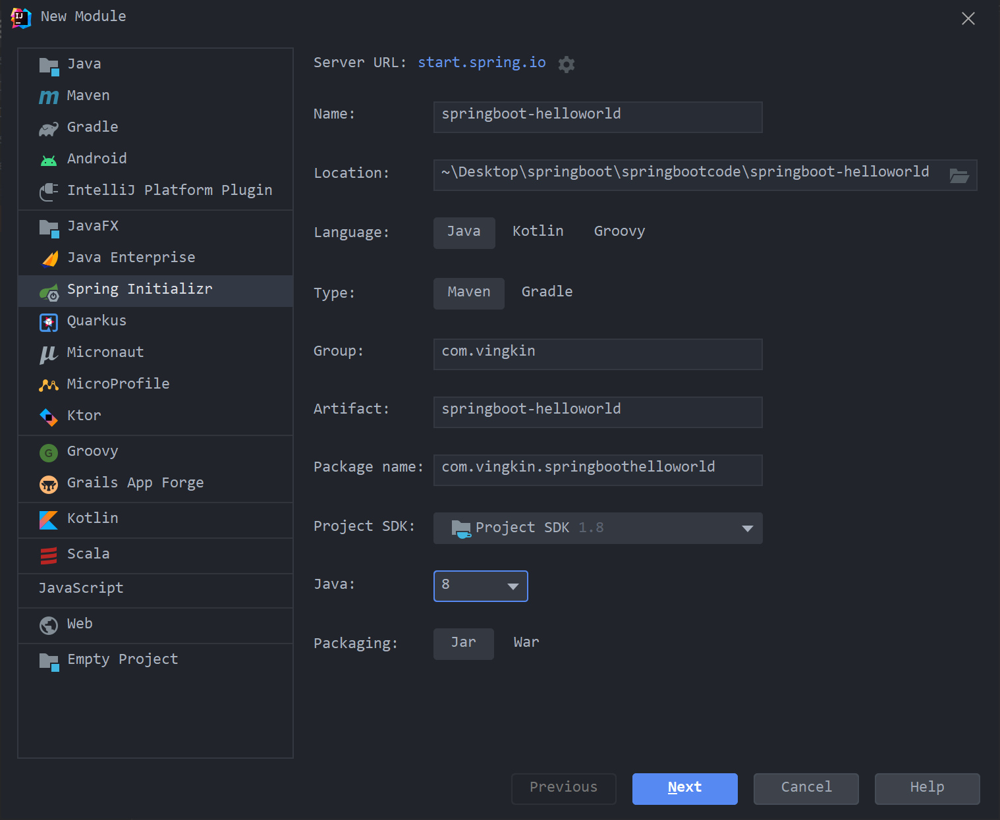
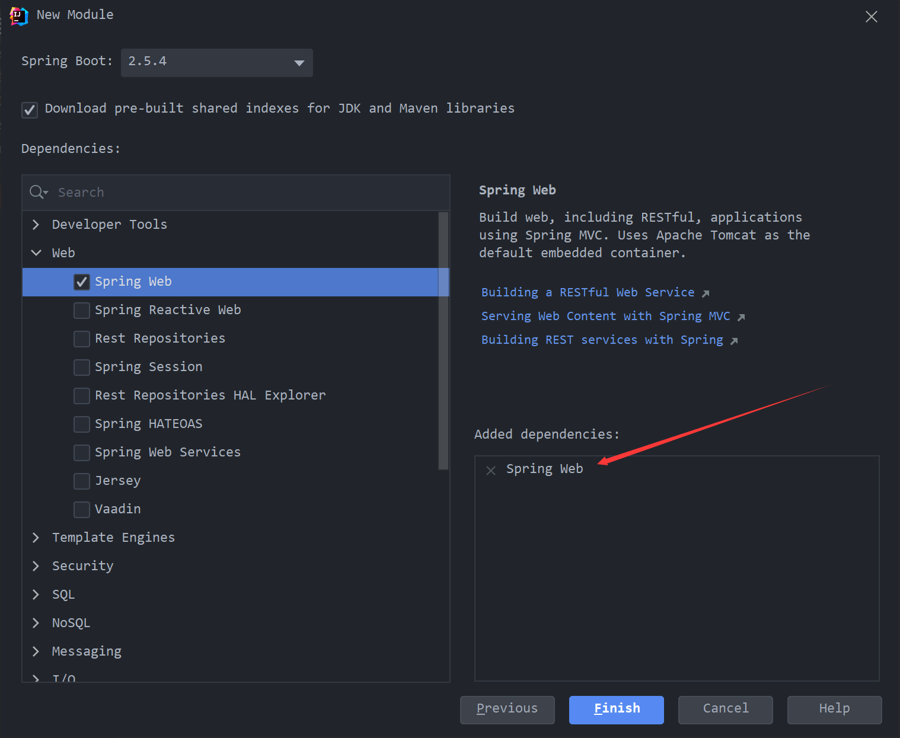
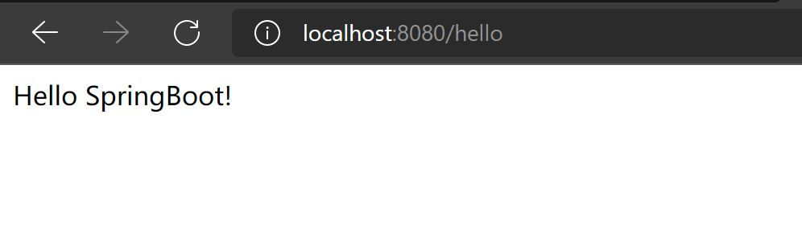
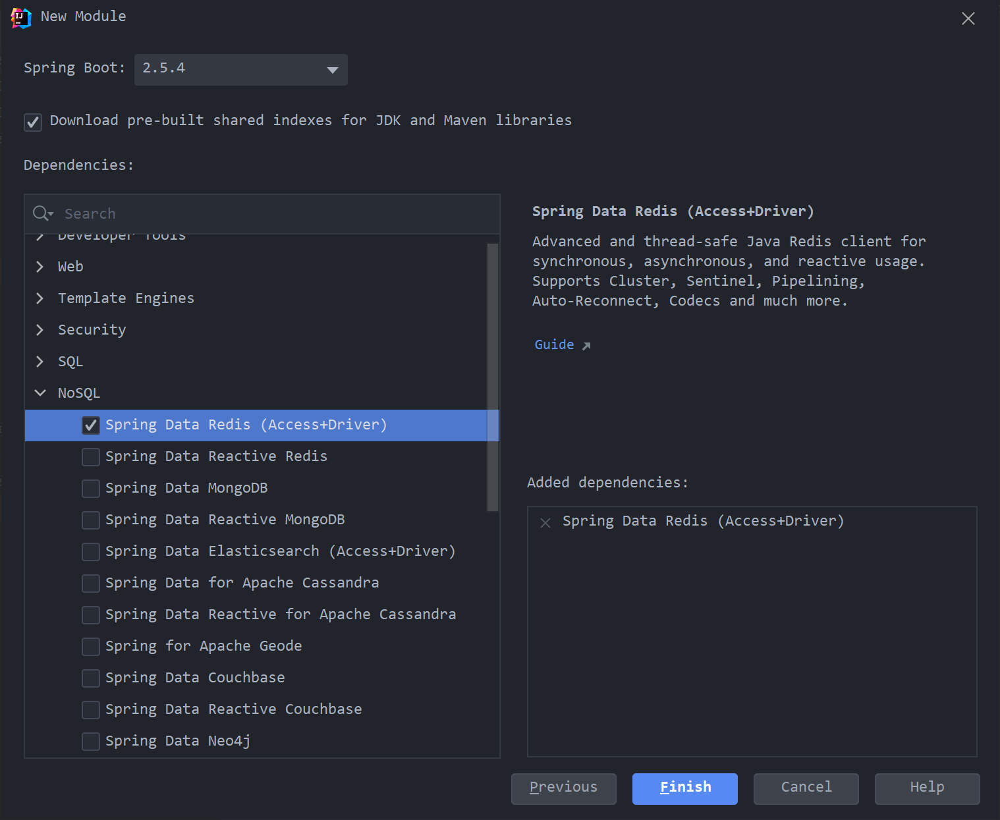
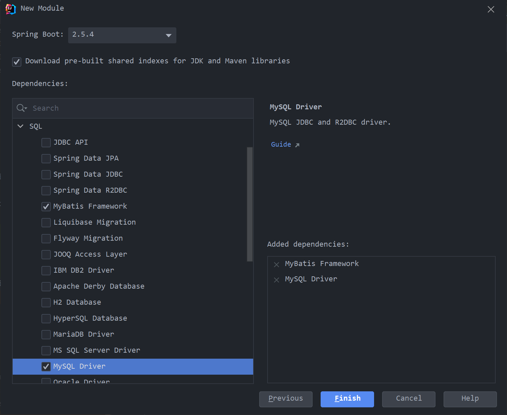

[scode type="green"]

SpringBoot提供了一种快速开发 Spring 项目的方式，而不是对 Spring 功能上的增强。

[/scode]

# 1. 需求

> 搭建 SpringBoot 工程，定义 HelloController.hello 方法，返回 ”Hello SpringBoot 。

# 2. 实现

## 2.1 创建项目

> 通过Spring Initializr进行创建





## 2.3 pom.xml分析

> 通过Spring Initializr创建的项目会自动导入配置的依赖。SpringBoot具有起步依赖的性质。

```xml
<?xml version="1.0" encoding="UTF-8"?>
<project xmlns="http://maven.apache.org/POM/4.0.0" xmlns:xsi="http://www.w3.org/2001/XMLSchema-instance"
         xsi:schemaLocation="http://maven.apache.org/POM/4.0.0 https://maven.apache.org/xsd/maven-4.0.0.xsd">
    <modelVersion>4.0.0</modelVersion>
    <parent>
        <groupId>org.springframework.boot</groupId>
        <artifactId>spring-boot-starter-parent</artifactId>
        <version>2.5.4</version>
        <relativePath/> <!-- lookup parent from repository -->
    </parent>
    <groupId>com.vingkin</groupId>
    <artifactId>springboot-helloworld</artifactId>
    <version>0.0.1-SNAPSHOT</version>
    <name>springboot-helloworld</name>
    <description>springboot-helloworld</description>
    <properties>
        <java.version>1.8</java.version>
    </properties>
    <dependencies>
        <dependency>
            <groupId>org.springframework.boot</groupId>
            <artifactId>spring-boot-starter-web</artifactId>
        </dependency>

        <dependency>
            <groupId>org.springframework.boot</groupId>
            <artifactId>spring-boot-starter-test</artifactId>
            <scope>test</scope>
        </dependency>
    </dependencies>

    <build>
        <plugins>
            <plugin>
                <groupId>org.springframework.boot</groupId>
                <artifactId>spring-boot-maven-plugin</artifactId>
            </plugin>
        </plugins>
    </build>

</project>
```

* `spring boot starter parent`：定义了各种技术的版本信息，组合了一套最优搭配的技术版本 。
* `spring boot starter web`：定义了完成该功能需要的坐标合集，其中大部分版本信息来自于父工程。
* 我们的工程继承 parent ，引入 starter 后，通过依赖传递，就可以简单方便获得需要的 jar 包，并且不会存在版本冲突等问题。

## 2.3 定义controller

```java
@RestController
public class HelloController {

    @RequestMapping("/hello")
    public String hello() {
        return "Hello SpringBoot!";
    }

}
```

## 2.4 编写引导类

> 用Spring Initializr创建项目，引导类会自动生成

```java
@SpringBootApplication
public class SpringbootHelloworldApplication {

    public static void main(String[] args) {
        SpringApplication.run(SpringbootHelloworldApplication.class, args);
    }

}
```

## 2.5 测试

> 测试只需运行引导类即可



# 3. 整合其他框架

## 3.1 整合Junit

> 通过Spring Initalizr创建的项目会自动导入`spring-boot-starter-test`依赖，该依赖中具有Junit，Junit包为`org.junit.jupiter`，如之前的Junit有所区别，并且不需要写@RunWith注解，通过@SpringBootTest+@Test可直接使用

UserService

```java
@Service
public class UserService {
    public void add() {
        System.out.println("add...");
    }
}
```

UserServiceTest

```java
@SpringBootTest(classes = Day01JunitApplication.class)
public class UserServiceTest {

    @Autowired
    private UserService userService;

    @Test
    public void testAdd() {
        userService.add();
    }

}
```

* @SpringBootTest的classes参数可以省略，只需要测试类所在包和引导类的包名一样或者是引导类包名的子包即可，通过Spring Initalizr创建的项目会自动生成测试代码，并且不需要写classes参数。（该参数为引导类字节码）

## 3.2 整合Redis

>  在创建项目时选中NoSQL中的Spring Data Redis即可



> 或者在pom.xml下添加如下依赖

```xml
<dependency>
    <groupId>org.springframework.boot</groupId>
    <artifactId>spring-boot-starter-data-redis</artifactId>
</dependency>
```

Day01RedisApplicationTests

> 通过redisTemplate进行相关Redis操作

```java
@SpringBootTest
class Day01RedisApplicationTests {

    @Autowired
    private RedisTemplate<String, String> redisTemplate;

    @Test
    void testSet() {
        redisTemplate.boundValueOps("name").set("Vingkin");
    }

    @Test
    void testGet() {
        Object name = redisTemplate.boundValueOps("name").get();
        System.out.println(name);
    }
}
```

application.properties

> 在配置文件中配置redis的ip，端口以及密码等。如果不配置，默认ip为127.0.0.1，默认端口为6379，默认没有密码。

```properties
spring.redis.host=127.0.0.1
spring.redis.port=6379
spring.redis.password=password
```

## 3.3 整合Mybatis

> 在创建项目的时候选中SQL的MyBatis Framework和MySQL Driver即可



> 或者在pom.xml下添加如下依赖

```xml
<dependency>
    <groupId>org.mybatis.spring.boot</groupId>
    <artifactId>mybatis-spring-boot-starter</artifactId>
    <version>2.2.0</version>
</dependency>

<dependency>
    <groupId>mysql</groupId>
    <artifactId>mysql-connector-java</artifactId>
    <scope>runtime</scope>
</dependency>
```

> 编写实体类

User

```java
public class User {

    private int id;
    private String username;
    private String password;

	// set / get / toString ...
}
```

> 编写mapper类

UserMapper

```java
@Mapper
public interface UserMapper {

    @Select("select * from t_user")
    public List<User> findAll();

}
```

> 编写jdbc驱动相关配置

application.yml

```yaml
# datasource
spring:
  datasource:
    driver-class-name: com.mysql.jdbc.Driver
    url: jdbc:mysql://47.100.130.127:20014/springboot?serverTimezone=UTC
    username: root
    password: Vingkin.life:81
```

> 编写测试类

Day01MybatisApplicationTests

```java
@SpringBootTest
class Day01MybatisApplicationTests {

    @Autowired
    private UserMapper userMapper;

    @Test
    void contextLoads() {
        List<User> all = userMapper.findAll();
        System.out.println(all);
    }

}
```

