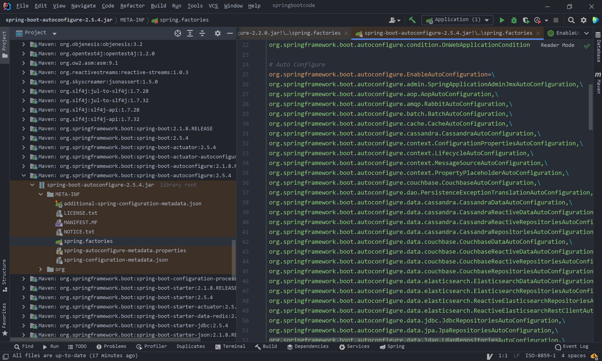

# 1. SpringBoot自动配置

## 1.1 Condition

> Condition是在Spring4.0增加的条件判断功能，通过这个可以功能可以实现选择性的创建Bean
>
> 通过下面的案例来了解Condition

### 1.1.1 需求

在Spring的IOC容器中有一个User的Bean，现要求：

* 导入Jedis坐标后，加载该Bean，否则不加载
* 将类的判断定义为动态的。判断哪个字节码文件存在可以动态指定

Jedis相关坐标：

```xml
<dependency>
    <groupId>org.springframework.boot</groupId>
    <artifactId>spring-boot-starter-data-redis</artifactId>
</dependency>
```

### 1.1.2 实现

#### 方法1

> 编写ClassConditional实现类，实现Condition接口，实现对Jedis坐标的判断，如果IOC容器中有Jedis的Bean则返回true，允许创建User的Bean，反之。这种写法将坐标的判定写死了，并不推荐。在UserConfig配置类中通过`@Conditional`实现判断即可。

ClassConditional

```java
public class ClassConditional implements Condition {
    /**
     * @param conditionContext      上下文对象，用于获取环境，IOC容器，classLoader对象
     * @param annotatedTypeMetadata 注解元对象。可以用于获取注解定义的属性值
     * @return
     */
    @Override
    public boolean matches(ConditionContext conditionContext, AnnotatedTypeMetadata annotatedTypeMetadata) {
        try {
            Class.forName("redis.clients.jedis.Jedis");
            return true;
        } catch (ClassNotFoundException e) {
            e.printStackTrace();
            return false;
        }
    }
}
```

UserConfig

```java
@Configuration
public class UserConfig {

    @Bean
    @Conditional(ClassConditional.class)
    public User user() {
        return new User();
    }

}
```

#### 方法2

> 方法二通过了简略编写`@ConditionalOnClass`的方法，从`@ConditionanOnClass`原理的角度实现对IOC容器中已有Bean的动态判断

ClassConditional

```java
public class ClassConditional implements Condition {
    /**
     * @param conditionContext      上下文对象，用于获取环境，IOC容器，classLoader对象
     * @param annotatedTypeMetadata 注解元对象。可以用于获取注解定义的属性值
     * @return
     */
    @Override
    public boolean matches(ConditionContext conditionContext, AnnotatedTypeMetadata annotatedTypeMetadata) {
        Map<String, Object> map = annotatedTypeMetadata.getAnnotationAttributes(ConditionalOnClass.class.getName());
        if (map != null) {
            String[] value = (String[]) map.get("value");
            try {
                for (String className : value) {
                    Class.forName(className);
                }
                return true;
            } catch (ClassNotFoundException e) {
                return false;
            }
        }
        return true;
    }
}
```

ConditionalOnClass

```java
@Target({ElementType.TYPE, ElementType.METHOD})
@Retention(RetentionPolicy.RUNTIME)
@Documented
@Conditional(ClassConditional.class)
public @interface ConditionalOnClass {
    String[] value();
}
```

UserConfig

```java
@Configuration
public class UserConfig {

    @Bean
   	// 该ConditionalOnClass注解是自定义的
    @ConditionalOnClass({"redis.clients.jedis.Jedis"})
    public User user() {
        return new User();
    }

}
```

### 1.1.3 Condition-小结

* 自定义条件：
  * 定义条件类：自定义类实现Condition接口，重写matches方法，在matches方法中进行逻辑判断，返回boolean值。**（通过反射判断IOC容器中是否有Bean，如果有的话matches就返回true，否则返回false）。**matches方法的两个参数：
    * `conditionContext`：上下文对象，可以获取属性值，获取类加载器，获取 BeanFactory等。
    * `annotatedTypeMetadata`：：元数据对象，用于获取注解属性。
  * 判断条件：在初始化Bean时，使用`@Conditional`(条件类.class)注解
* SpringBoot提供的常用注解类
  * ConditionalOnClass：判断环境中是否有对应字节码文件才初始化 Bean
  * ConditionalOnProperty：判断配置文件中是否有对应属性和值才初始化 Bean
  * ConditionalOnMissingBean：判断环境中没有对应 Bean 才初始化 Bean

## 1.2 @Enable* 和 @Import

[scode type="yellow"]

SpringBoot 工程是否可以直接获取 jar 包中定义的 Bean？

答案是不可以的，SpringBoot主配置类中通过`@SpringBootApplication`实现了包扫描(`@ComponentScan`)以及自动配置(`@EnableAutoConfiguration`)。对于包扫描而言只会扫描配置类所在包及其子包，所以当jar包中的bean不在上述的包中，则不能被扫描到，也就不能被加载。在`@EnableAutoConfiguration`中通过`@Import`加载`ImportSelector`的实现类`AutoConfigurationImportSelector`来实现对`spring.factories`配置文件的扫描，并且通过Condition进行依赖判断，对于有导入的依赖，将该依赖的所有Bean加载到IOC容器中，否则不加载。而自定义的jar包并不会出现在`spring.factories`中，所以也不会被加载。

[/scode]



### 1.2.1 @Enable*

> SpringBoot中提供了很多 Enable 开头的注解，这些注解都是用于动态启用某些功能的。而其底层原理是使用 @Import 注解导入一些配置类，实现 Bean 的动态加载。

### 1.2.2 @Import

> @Enable* 底层依赖于 @Import 注解导入一些类，使用 @Import 导入的类会被 Spring 加载到 IOC 容器中。而 @Import 提供 4 中用法

1. 导入Bean
2. 导入配置类
3. 导入ImportSelector实现类。一般用于加载配置文件中的类
4. 导入ImportBeanDefinitionRegistrar实现类

### 1.2.3 演示代码

> 具体环境：两个Module，Module1和Module2，在Module2中编写导入Bean以及相关供@Import导入的类，在Module1中pom文件中导入Module2的坐标，并在主引导文件中实现对Bean的导入。

#### Module2

UserConfig

```java
@Configuration
public class UserConfig {

    @Bean
    public User user() {
        return new User();
    }

}
```

EnableUser

> 实质还是`@Import`，只是简化了用户的编写

```java
@Target({ElementType.TYPE})
@Retention(RetentionPolicy.RUNTIME)
@Documented
@Import(UserConfig.class)
public @interface EnableUser {
}
```

MyImportSelector

```java
public class MyImportSelector implements ImportSelector {

    @Override
    public String[] selectImports(AnnotationMetadata annotationMetadata) {
        return new String[]{"com.vingkin.domain.User"};
    }
}
```

MyImportBeanDefinitionRegistrar

```java
public class MyImportBeanDefinitionRegistrar implements ImportBeanDefinitionRegistrar {
    @Override
    public void registerBeanDefinitions(AnnotationMetadata importingClassMetadata, BeanDefinitionRegistry registry) {
        AbstractBeanDefinition beanDefinition = BeanDefinitionBuilder.rootBeanDefinition(User.class).getBeanDefinition();
        registry.registerBeanDefinition("user", beanDefinition);
    }
}
```

#### Module1

pom.xml

```xml
<dependency>
    <groupId>com.vingkin</groupId>
    <artifactId>moudle2</artifactId>
    <version>0.0.1-SNAPSHOT</version>
</dependency>
```

Application

通过下列方法加载User

* @ComponentScan("com.vingkin.config") // 方法1
* @Import(UserConfig.class) // 使用Import注解加载类，这些类都会被Spring创建，并放入IOC容器
* @EnableUser // 用来动态开启User的bean的创建，实质还是Import
* @Import(MyImportSelector.class) // 可以通过配置文件加载需要导入的类
* @Import(MyImportBeanDefinitionRegistrar.class)

```java
@SpringBootApplication // 里面的ComponentScan默认扫描配置类所在包及其子包
// @ComponentScan("com.vingkin.config") // 方法1
// @Import(UserConfig.class) // 使用Import注解加载类，这些类都会被Spring创建，并放入IOC容器
// @EnableUser // 用来动态开启User的bean的创建，实质还是Import
// @Import(MyImportSelector.class) // 可以通过配置文件加载需要导入的类
// @Import(MyImportBeanDefinitionRegistrar.class)
public class Application {

    public static void main(String[] args) {
        ConfigurableApplicationContext context = SpringApplication.run(Application.class, args);

        Object user = context.getBean(User.class);
        System.out.println(user);
    }

}
```

### 1.2.4 @EnableAutoConfiguration

* @EnableAutoConfiguration 注解内部使用 `@Import(AutoConfigurationImportSelector.class)` 来加载配置类。
* 配置文件位置： `META INF/spring.factories` ，该配置文件中定义了大量的配置类，当 SpringBoot 应用启动时，会自动加载这些配置类，初始化 Bean
* 并不是所有的 Bean 都会被初始化，在配置类中使用 Condition 来加载满足条件的 Bean

## 1.3 自定义redis-starter

### 1.3.1 需求

> 自定义 redis starter 。要求当导入 redis 坐标时， SpringBoot 自动创建 Jedis 的 Bean 。

### 1.3.2 实现步骤

1. 创建 `redis-spring-boot-autoconfigure` 模块
2. 创建 `redis-spring-boot-starter` 模块，依赖 `redis-spring-boot-autoconfigure` 的模块
3. 在 `redis-spring-boot-autoconfigure` 模块中初始化 Jedis 的Bean 。并定义 `META-INF/ spring.factories` 文件
4. 在测试模块中引入自定义的 redis-starter 依赖，测试获取 Jedis 的 Bean ，操作 redis 。

#### redis-spring-boot-autoconfigure

配置文件中引入jedis依赖

```xml
<dependencies>
    <dependency>
        <groupId>org.springframework.boot</groupId>
        <artifactId>spring-boot-starter</artifactId>
    </dependency>
    <!--引入Jedis依赖-->
    <dependency>
        <groupId>redis.clients</groupId>
        <artifactId>jedis</artifactId>
    </dependency>
</dependencies>
```

编写redis属性文件

```java
@ConfigurationProperties(prefix = "redis")
public class RedisProperties {
    private String host = "localhost";
    private int port = 6379;
    private String password = "";

	// set / get ...
    
}
```

编写redis自动配置文件，通过`@EnableConfigurationProperties`导入redis属性文件，其本质就是@Import，所以可以`@Import`直接导入，通过`@ConditionOnClas`s来进行判断有Jedis.class的时候才执行该配置类，通过`@ConditionalOnMissingBean`来判断当用户手动将Jedis加入容器后就不在自动加入IOC容器。

```java
@Configuration
@EnableConfigurationProperties(RedisProperties.class) // 本质还是Import，可以Import直接导入
@ConditionalOnClass(Jedis.class)
public class RedisAutoConfiguration {

    @Bean
    @ConditionalOnMissingBean(Jedis.class)
    public Jedis jedis(RedisProperties redisProperties) {
        Jedis jedis = new Jedis(redisProperties.getHost(), redisProperties.getPort());
        jedis.auth(redisProperties.getPassword());
        return jedis;
    }

}
```

在resources目录下创建`META-INF / spring.factories`文件，将自动配置类加入SpringBoot会自动扫描的key中。

```properties
org.springframework.boot.autoconfigure.EnableAutoConfiguration=\
  com.vingkin.redis.config.RedisAutoConfiguration
```

#### reids-spring-boot-starter

在该module的pom文件下加入`redis-sprig-boot-autoconfigure`坐标

```xml
<!-- 引入configure -->
<dependency>
    <groupId>com.vingkin</groupId>
    <artifactId>redis-spring-boot-autoconfigure</artifactId>
    <version>0.0.1-SNAPSHOT</version>
</dependency>
```

#### customerredisstarter

> 通过该模块测试自定义的redis-starter

在pom文件中导入redis-starter坐标

```xml
<dependency>
    <groupId>com.vingkin</groupId>
    <artifactId>redis-spring-boot-starter</artifactId>
    <version>0.0.1-SNAPSHOT</version>
</dependency>
```

在配置文件中对reids进行相关配置

```properties
redis.host=localhost
redis.port=6379
redis.password=password
```

在主引导类中进行相关测试，当使用注释文件创建Jedis的Bean时，将自动配置将不会再生效，因为使用了`@ConditionalOnMissingBean`注解

```java
@SpringBootApplication
public class CustomeredisstarterApplication {

    public static void main(String[] args) {
        ConfigurableApplicationContext context = SpringApplication.run(CustomeredisstarterApplication.class, args);
        Jedis bean = context.getBean(Jedis.class);
        System.out.println(bean.keys("*"));
    }

    // @Bean
    // public Jedis jedis(){
    //     Jedis jedis = new Jedis("114.116.239.56", 6379);
    //     jedis.auth("vingkin.life:81");
    //     return jedis;
    // }

}
```

# 2. SpringBoot监听机制

## 2.1 Java监听机制

> SpringBoot 的监听机制，其实是对 Java 提供的事件监听机制的封装。
>
> 就是观察者模式的使用

Java 中的事件监听机制定义了以下几个角色：

* 事件： Event ，继承 `java.util.EventObject` 类的对象
* 事件源： Source ，任意对象 Object
* 监听器： Listener ，实现 `java.util.EventListener` 接口 的对象

## 2.2 SpringBoot监听机制

> SpringBoot在项目启动时，会对几个监听器进行回调，我们可以实现这些监听器接口，在项目启动时完成一些操作。

[scode type="green"]

CommandLineRunner和ApplicationRunne都是在项目启动时自动调用run方法，功能一样，一般只使用一个。可以用于redis的预热。

[/scode]

### 2.2.1 CommandLineRunner

```java
@Component
public class MyCommandLineRunner implements CommandLineRunner {
    @Override
    public void run(String... args) throws Exception {
        System.out.println("CommandLineRunner...");
        System.out.println(Arrays.asList(args));
    }
}
```

### 2.2.2 ApplicationRunner

```java
@Component
public class MyApplicationRunner implements ApplicationRunner {
    @Override
    public void run(ApplicationArguments args) throws Exception {
        System.out.println("ApplicationRunner...");
        System.out.println(Arrays.asList(args.getSourceArgs()));
    }
}
```

### 2.2.3 ApplicationContextInitializer

```java
@Component
public class MyApplicationContextInitializer implements ApplicationContextInitializer {
    @Override
    public void initialize(ConfigurableApplicationContext configurableApplicationContext) {
        System.out.println("ApplicationContextInitializer...");
    }
}
```

META-INF / spring.factories

```properties
org.springframework.context.ApplicationContextInitializer=\
  com.vingkin._03springbootlistener.listener.MyApplicationContextInitializer
```

### 2.2.4 SpringApplicationRunListener

> 类似于Vue的生命周期，比较推荐使用，需要写构造函数，否则会报错，SpringApplication是SpringBoot的主事件源，会被自动注入。当该类使用@Component时，SpringApplication将会自动注入失败，暂时还不知道什么原因。

```java
public class MySpringApplicationRunListener implements SpringApplicationRunListener {
    public MySpringApplicationRunListener(SpringApplication application, String[] args) {

    }

    @Override
    public void starting(ConfigurableBootstrapContext bootstrapContext) {
        System.out.println("starting...");
    }

    @Override
    public void environmentPrepared(ConfigurableBootstrapContext bootstrapContext, ConfigurableEnvironment environment) {
        System.out.println("environmentPrepared...");
    }

    @Override
    public void contextPrepared(ConfigurableApplicationContext context) {
        System.out.println("contextPrepared...");
    }

    @Override
    public void contextLoaded(ConfigurableApplicationContext context) {
        System.out.println("contextLoaded...");
    }

    @Override
    public void started(ConfigurableApplicationContext context) {
        System.out.println("started...");
    }

    @Override
    public void running(ConfigurableApplicationContext context) {
        System.out.println("running...");
    }

    @Override
    public void failed(ConfigurableApplicationContext context, Throwable exception) {
        System.out.println("failed...");
    }
}
```

META-INF / spring.factories

```properties
org.springframework.boot.SpringApplicationRunListener=\
  com.vingkin._03springbootlistener.listener.MySpringApplicationRunListener
```

# 3 SpringBoot启动流程


